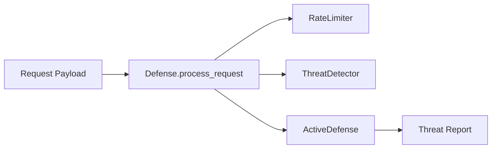

# Defense Module - Technical Overview

**Version**: v1.3.0 | **Status**: Active | **Last Updated**: July 2026

## Architecture

The module is intentionally local and deterministic:

- `active.py` contains prompt-exploit detection, honeytokens, and rabbit-hole
  containment primitives.
- `defense.py` contains request-level orchestration, rate limiting, blocklists,
  and detection rules.
- `mcp_tools.py` wraps the safe defense operations for MCP discovery.
- `rabbithole.py` preserves compatibility imports for `RabbitHole`.

## Data Flow

