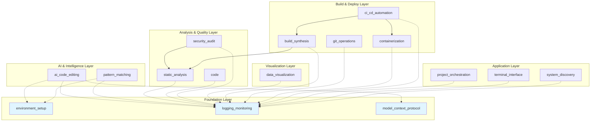

# Codomyrmex Module Dependency Graph

*This document is automatically generated by `src/codomyrmex/tools/dependency_analyzer.py`*

## Dependency Visualization

## Dependency Rules

### Foundation Layer
- **No dependencies**: These modules form the base of the system
- Modules: `environment_setup`, `logging_monitoring`, `model_context_protocol`

### AI & Intelligence Layer
- **Can depend on**: Foundation layer only
- Modules: `ai_code_editing`, `pattern_matching`

### Analysis & Quality Layer
- **Can depend on**: Foundation layer, and other analysis modules
- Modules: `static_analysis`, `code`, `security_audit`

### Visualization Layer
- **Can depend on**: Foundation layer
- Modules: `data_visualization`

### Build & Deploy Layer
- **Can depend on**: Foundation layer, analysis layer
- Modules: `build_synthesis`, `git_operations`, `containerization`, `ci_cd_automation`

### Application Layer
- **Can depend on**: All layers (orchestration modules)
- Modules: `project_orchestration`, `terminal_interface`, `system_discovery`

## Violations

Run `python -m codomyrmex.tools.dependency_analyzer` to check for violations.

## How to Fix Violations

1. Review the violation in the dependency analysis report
2. Check if the dependency is necessary
3. If necessary, update `docs/modules/relationships.md` and `src/codomyrmex/tools/dependency_analyzer.py`
4. If not necessary, remove the import and refactor code

---

*Last updated: Run `python -m codomyrmex.tools.dependency_analyzer` to regenerate*

## Navigation Links

- **Parent**: [Project Overview](../README.md)
- **Module Index**: [All Agents](../../AGENTS.md)
- **Documentation**: [Reference Guides](../../docs/README.md)
- **Home**: [Root README](../../../README.md)
