# Codomyrmex Module Dependency Graph

*This document is automatically generated by `src/codomyrmex/tools/dependency_analyzer.py`*

## Dependency Visualization

```mermaid
graph TD
    subgraph "Foundation Layer"
        ENV[environment_setup]
        LOG[logging_monitoring]
        MCP[model_context_protocol]
        TEL["telemetry (metrics, dashboard)"]
        EVT["events (streaming, notifications)"]
        VAL["validation (schemas)"]
        DB["database_management (migration, lineage)"]
        SER[serialization]
        CACHE[cache]
        CONC[concurrency]
        ENC[encryption]
    end

    subgraph "AI & Intelligence Layer"
        AI[agents]
        LLM["llm (multimodal, safety)"]
        MO["model_ops (eval, registry, optimization, features)"]
        PE["prompt_engineering (testing)"]
        MEM[agentic_memory]
        GRAG[graph_rag]
    end

    subgraph "Analysis & Quality Layer"
        CODE["coding (static_analysis, pattern_matching)"]
        SECURITY["security (governance)"]
    end

    subgraph "Visualization Layer"
        VIZ[data_visualization]
    end

    subgraph "Build & Deploy Layer"
        CICD["ci_cd_automation (build)"]
        GIT[git_operations]
        CONTAINER[containerization]
    end

    subgraph "Application Layer"
        ORCH["orchestrator (scheduler)"]
        TERM[terminal_interface]
        DISCO[system_discovery]
        TEST["testing (workflow, chaos)"]
        API["api (rate_limiting)"]
        NET["networking (service_mesh)"]
    end

    %% Foundation dependencies
    AI -.-> LOG
    AI -.-> ENV
    AI -.-> MCP
    LLM -.-> LOG
    MO -.-> LOG

    %% Analysis dependencies
    CODE -.-> LOG
    SECURITY -.-> LOG
    SECURITY --> CODE

    %% Visualization
    VIZ -.-> LOG

    %% Build dependencies
    GIT -.-> LOG
    CONTAINER -.-> LOG
    CICD -.-> LOG
    CICD --> CONTAINER

    %% Application dependencies
    ORCH -.-> LOG
    TERM -.-> LOG
    DISCO -.-> LOG
    TEST -.-> LOG
    API -.-> LOG

    style ENV fill:#e1f5ff
    style LOG fill:#e1f5ff
    style MCP fill:#e1f5ff
    style TEL fill:#e1f5ff
```

## Dependency Rules

### Foundation Layer

- **No dependencies**: These modules form the base of the system
- Modules: `environment_setup`, `logging_monitoring`, `model_context_protocol`, `telemetry`, `events`, `validation`, `database_management`, `serialization`, `cache`, `concurrency`, `encryption`

### AI & Intelligence Layer

- **Can depend on**: Foundation layer only
- Modules: `agents`, `llm`, `model_ops`, `prompt_engineering`, `agentic_memory`, `graph_rag`

### Analysis & Quality Layer

- **Can depend on**: Foundation layer, and other analysis modules
- Modules: `coding` (includes static_analysis + pattern_matching), `security` (includes governance)

### Visualization Layer

- **Can depend on**: Foundation layer
- Modules: `data_visualization`

### Build & Deploy Layer

- **Can depend on**: Foundation layer, analysis layer
- Modules: `ci_cd_automation` (includes build), `git_operations`, `containerization`

### Application Layer

- **Can depend on**: All layers (orchestration modules)
- Modules: `orchestrator` (includes scheduler), `terminal_interface`, `system_discovery`, `testing` (includes workflow + chaos), `api` (includes rate_limiting), `networking` (includes service_mesh)

## Violations

Run `python -m codomyrmex.tools.dependency_analyzer` to check for violations.

## How to Fix Violations

1. Review the violation in the dependency analysis report
2. Check if the dependency is necessary
3. If necessary, update `docs/modules/relationships.md` and `src/codomyrmex/tools/dependency_analyzer.py`
4. If not necessary, remove the import and refactor code

---

*Last updated: February 2026*

## Navigation Links

- **Parent**: [docs](../README.md)
- **Module Index**: [AGENTS.md](../AGENTS.md)
- **Home**: [Repository Root](../../README.md)
