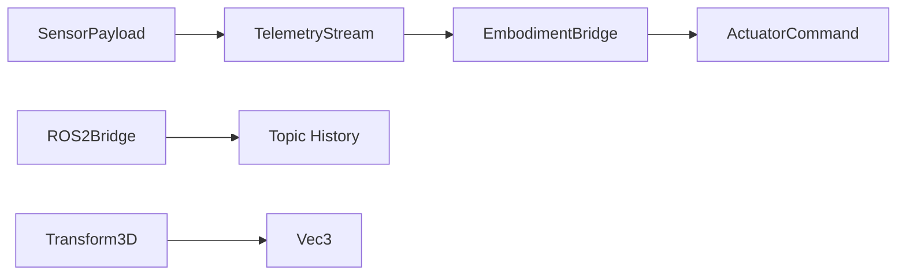

# Embodiment Module - Technical Overview

**Version**: v1.3.0 | **Status**: Active | **Last Updated**: July 2026

## Architecture

The module is split into deterministic local surfaces:

- `telemetry.py` parses sensor payloads and stores latest readings.
- `bridge.py` provides a local WebSocket bridge for telemetry and commands.
- `sensors/base.py` and `actuators/base.py` provide simulation primitives.
- `ros/ros_bridge.py` provides in-process topic publication and subscription.
- `transformation/transformation.py` provides vector and transform math.

## Data Flow

