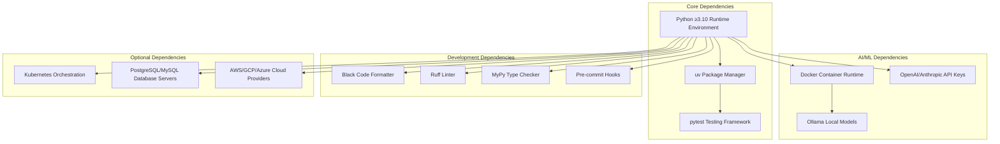
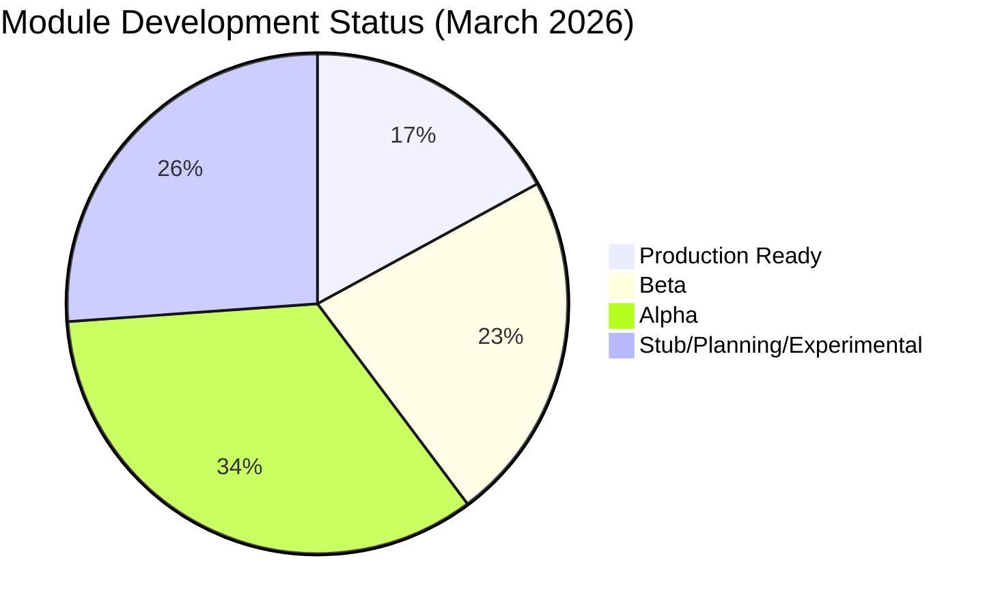

# Module Reference

Complete module listing, quick reference, and use cases. For architecture diagrams, see [Architecture Overview](../project/architecture-overview.md).

## Core Modules

Codomyrmex modules are organized in a layered architecture where higher layers depend on lower layers, preventing circular dependencies:

```mermaid
graph TD
    subgraph applicationLayer ["Application Layer"]
        InteractiveShell["Interactive Shell"]
        SystemDiscovery["System Discovery & Orchestration"]
        CLI["Command Line Interface"]
    end

    subgraph serviceLayer ["Service Layer"]
        AICodeEditing["AI Code Editing"]
        Documentation["Documentation Generation"]
        StaticAnalysis["Static Analysis & Quality"]
        Orchestrator["Orchestrator"]
        CICDAutomation["CI/CD Automation"]
        APIDocumentation["API Documentation"]
        Containerization["Container Management"]
        DatabaseManagement["Database Management"]
        ConfigManagement["Config Management"]
    end

    subgraph coreLayer ["Core Layer"]
        CodeExecution["Code Execution Sandbox"]
        DataVisualization["Data Visualization & Plotting"]
        PatternMatching["Pattern Matching"]
        GitOperations["Git Operations & Version Control"]
        CodeReview["Code Review"]
        OllamaIntegration["Ollama Integration"]
        LanguageModels["Language Models"]
        SecurityAudit["Security Audit"]
        Performance["Performance Monitoring"]
        Spatial["Spatial (3D/4D)"]
        PhysicalManagement["Physical Management"]
    end

    subgraph foundationLayer ["Foundation Layer"]
        LoggingMonitoring["Logging & Monitoring"]
        EnvironmentSetup["Environment Setup"]
        ModelContextProtocol["Model Context Protocol"]
        TerminalInterface["Terminal Interface"]
    end

    %% Dependencies flow upward (dotted lines show "depends on")
    InteractiveShell -.-> SystemDiscovery
    CLI -.-> SystemDiscovery
    SystemDiscovery -.-> LoggingMonitoring
    SystemDiscovery -.-> EnvironmentSetup
    SystemDiscovery -.-> TerminalInterface

    AICodeEditing -.-> LoggingMonitoring
    AICodeEditing -.-> EnvironmentSetup
    AICodeEditing -.-> ModelContextProtocol
    AICodeEditing -.-> TerminalInterface
    AICodeEditing -.-> CodeExecution
    AICodeEditing -.-> PatternMatching

    Documentation -.-> LoggingMonitoring
    Documentation -.-> CICDAutomation
    Documentation -.-> StaticAnalysis

    StaticAnalysis -.-> LoggingMonitoring
    StaticAnalysis -.-> PatternMatching
    StaticAnalysis -.-> CodeReview

    Orchestrator -.-> LoggingMonitoring
    Orchestrator -.-> CICDAutomation
    Orchestrator -.-> Documentation

    CICDAutomation -.-> GitOperations
    CICDAutomation -.-> SecurityAudit
    CICDAutomation -.-> LoggingMonitoring

    APIDocumentation -.-> LoggingMonitoring
    APIDocumentation -.-> Documentation

    Containerization -.-> PhysicalManagement
    Containerization -.-> LoggingMonitoring

    DatabaseManagement -.-> LoggingMonitoring
    DatabaseManagement -.-> CICDAutomation

    ConfigManagement -.-> EnvironmentSetup
    ConfigManagement -.-> LoggingMonitoring

    CodeExecution -.-> LoggingMonitoring
    DataVisualization -.-> LoggingMonitoring
    PatternMatching -.-> LoggingMonitoring
    PatternMatching -.-> EnvironmentSetup
    GitOperations -.-> LoggingMonitoring
    CodeReview -.-> LoggingMonitoring
    CodeReview -.-> StaticAnalysis
    OllamaIntegration -.-> LoggingMonitoring
    OllamaIntegration -.-> EnvironmentSetup
    LanguageModels -.-> LoggingMonitoring
    LanguageModels -.-> EnvironmentSetup
    SecurityAudit -.-> LoggingMonitoring
    Performance -.-> LoggingMonitoring
    Spatial -.-> LoggingMonitoring
    PhysicalManagement -.-> LoggingMonitoring
```

### Foundation Layer

Essential infrastructure used by all other modules:

| Module | Purpose | Key Features |
| :--- | :--- | :--- |
| [**logging_monitoring**](../../src/codomyrmex/logging_monitoring/) | Centralized logging system | Structured logging, multiple formats, aggregation |
| [**environment_setup**](../../src/codomyrmex/environment_setup/) | Environment validation | Dependency checking, API key management, setup automation |
| [**model_context_protocol**](../../src/codomyrmex/model_context_protocol/) | AI communication standard | Standardized LLM interfaces, tool specifications |
| [**terminal_interface**](../../src/codomyrmex/terminal_interface/) | Rich terminal interactions | Colored output, progress bars, interactive prompts |

### Core Functional Modules

Primary capabilities for development workflows:

| Module | Purpose | Key Features |
| :--- | :--- | :--- |
| [**agents**](../../src/codomyrmex/agents/) | Agentic framework integrations | AI code editing, task management, various providers |
| [**static_analysis**](../../src/codomyrmex/coding/static_analysis/) | Code quality analysis | Linting, security scanning, complexity metrics |
| [**coding**](../../src/codomyrmex/coding/) | Code execution & review | Safe sandbox execution, automated code review |
| [**data_visualization**](../../src/codomyrmex/data_visualization/) | Charts and plots | Static/interactive plots, multiple formats |
| [**pattern_matching**](../../src/codomyrmex/coding/pattern_matching/) | Code pattern analysis | Pattern recognition, dependency analysis |
| [**git_operations**](../../src/codomyrmex/git_operations/) | Version control automation | Git workflows, branch management, commit automation |
| [**security**](../../src/codomyrmex/security/) | Security scanning | Vulnerability detection, compliance checking, threat assessment |
| [**llm**](../../src/codomyrmex/llm/) | LLM infrastructure | Model management, local/remote providers (Ollama), benchmarking |
| [**performance**](../../src/codomyrmex/performance/) | Performance monitoring | Profiling, optimization, benchmarking |

### Service Modules

Higher-level services that orchestrate core modules:

| Module | Purpose | Key Features |
| :--- | :--- | :--- |
| [**documentation**](../../src/codomyrmex/documentation/) | Documentation generation | Website generation, API docs, tutorial creation |
| [**api**](../../src/codomyrmex/api/) | API infrastructure | OpenAPI/Swagger specs, standardization, documentation |
| [**ci_cd_automation**](../../src/codomyrmex/ci_cd_automation/) | CI/CD pipeline management | Pipeline orchestration, deployment automation |
| [**containerization**](../../src/codomyrmex/containerization/) | Container management | Docker lifecycle, Kubernetes orchestration |
| [**database_management**](../../src/codomyrmex/database_management/) | Database operations | Schema management, migrations, backups |
| [**config_management**](../../src/codomyrmex/config_management/) | Configuration management | Environment setup, secret management, validation |
| [**logistics**](../../src/codomyrmex/logistics/) | Logistics and orchestration | Workflow orchestration, task management, scheduling |

### Specialized Modules

Advanced capabilities for specific domains:

| Module | Purpose | Key Features |
| :--- | :--- | :--- |
| [**spatial**](../../src/codomyrmex/spatial/) | Spatial modeling (3D/4D) | Scene creation, rendering, geometric operations, world models |
| [**physical_management**](../../src/codomyrmex/physical_management/) | Physical system simulation | Hardware monitoring, resource management |
| [**system_discovery**](../../src/codomyrmex/system_discovery/) | System exploration | Module discovery, capability detection, health monitoring |
| [**module_template**](../../src/codomyrmex/module_template/) | Module creation templates | Scaffold generation, template management |
| [**events**](../../src/codomyrmex/events/) | Event system | Message passing, pub/sub patterns, event logging |
| [**plugin_system**](../../src/codomyrmex/plugin_system/) | Plugin architecture | Extension loading, plugin management, interfaces |
| [**tool_use**](../../src/codomyrmex/tool_use/) | Tool use | Tool invocation, management, and orchestration |

## Explore Modules

Codomyrmex includes **88 modules** organized in a layered architecture. Each module is self-contained with comprehensive documentation, API specifications, usage examples, and security considerations.

Browse all available modules organized by layer and category:

### Foundation Layer

Essential infrastructure used by all other modules:

- **[logging_monitoring](../../src/codomyrmex/logging_monitoring/)** - Centralized logging system with structured logging, multiple formats, and aggregation
- **[environment_setup](../../src/codomyrmex/environment_setup/)** - Environment validation, dependency checking, API key management, and setup automation
- **[model_context_protocol](../../src/codomyrmex/model_context_protocol/)** - AI communication standard with standardized LLM interfaces and tool specifications
- **[terminal_interface](../../src/codomyrmex/terminal_interface/)** - Rich terminal interactions with colored output, progress bars, and interactive prompts

### Core Layer

Primary capabilities for development workflows:

- **[agents](../../src/codomyrmex/agents/)** - Agentic framework integrations with AI code editing, task management, and various providers
- **[static_analysis](../../src/codomyrmex/coding/static_analysis/)** - Code quality analysis with linting, security scanning, and complexity metrics
- **[coding](../../src/codomyrmex/coding/)** - Code execution and review with safe sandbox execution and automated code review
- **[data_visualization](../../src/codomyrmex/data_visualization/)** - Charts and plots with static/interactive plots and multiple formats
- **[pattern_matching](../../src/codomyrmex/coding/pattern_matching/)** - Code pattern analysis with pattern recognition and dependency analysis
- **[git_operations](../../src/codomyrmex/git_operations/)** - Version control automation with Git workflows, branch management, and commit automation
- **[security](../../src/codomyrmex/security/)** - Security scanning with vulnerability detection, compliance checking, and threat assessment
- **[llm](../../src/codomyrmex/llm/)** - LLM infrastructure with model management, local/remote providers (Ollama), and benchmarking
- **[performance](../../src/codomyrmex/performance/)** - Performance monitoring with profiling, optimization, and benchmarking
- **[cache](../../src/codomyrmex/cache/)** - Multi-level caching with pluggable backends
- **[validation](../../src/codomyrmex/validation/)** - Input validation and schema enforcement
- **[serialization](../../src/codomyrmex/serialization/)** - Data serialization formats
- **[utils](../../src/codomyrmex/utils/)** - Common utility functions
- **[auth](../../src/codomyrmex/auth/)** - Authentication and authorization
- **[templating](../../src/codomyrmex/templating/)** - Template rendering engine
- **[prompt_engineering](../../src/codomyrmex/prompt_engineering/)** - Prompt engineering and optimization

### Service Layer

Higher-level services that orchestrate core modules:

- **[documentation](../../src/codomyrmex/documentation/)** - Documentation generation with website generation, API docs, and tutorial creation
- **[api](../../src/codomyrmex/api/)** - API infrastructure with OpenAPI/Swagger specs, standardization, and documentation
- **[ci_cd_automation](../../src/codomyrmex/ci_cd_automation/)** - CI/CD pipeline management with pipeline orchestration and deployment automation
- **[containerization](../../src/codomyrmex/containerization/)** - Container management with Docker lifecycle and Kubernetes orchestration
- **[database_management](../../src/codomyrmex/database_management/)** - Database operations with schema management, migrations, and backups
- **[config_management](../../src/codomyrmex/config_management/)** - Configuration management with environment setup, secret management, and validation
- **[logistics](../../src/codomyrmex/logistics/)** - Logistics module with orchestration, task management, and scheduling
- **[orchestrator](../../src/codomyrmex/orchestrator/)** - Workflow execution and task orchestration
- **[testing](../../src/codomyrmex/testing/)** - Test framework and automation
- **[deployment](../../src/codomyrmex/deployment/)** - Deployment automation and strategies
- **[collaboration](../../src/codomyrmex/collaboration/)** - Team collaboration tools
- **[concurrency](../../src/codomyrmex/concurrency/)** - Concurrent execution and threading

### Specialized Layer

Advanced capabilities for specific domains:

- **[spatial](../../src/codomyrmex/spatial/)** - Spatial modeling (3D/4D) with scene creation, rendering, geometric operations, and world models
- **[physical_management](../../src/codomyrmex/physical_management/)** - Physical system simulation with hardware monitoring and resource management
- **[system_discovery](../../src/codomyrmex/system_discovery/)** - System exploration with module discovery, capability detection, and health monitoring
- **[module_template](../../src/codomyrmex/module_template/)** - Module creation templates with scaffold generation and template management
- **[events](../../src/codomyrmex/events/)** - Event system with message passing, pub/sub patterns, and event logging
- **[plugin_system](../../src/codomyrmex/plugin_system/)** - Plugin architecture with extension loading, plugin management, and interfaces
- **[tool_use](../../src/codomyrmex/tool_use/)** - Tool invocation, management, and orchestration
- **[cerebrum](../../src/codomyrmex/cerebrum/)** - Advanced reasoning and inference engine
- **[fpf](../../src/codomyrmex/fpf/)** - Functional Programming Framework *(Experimental — not yet MCP-exposed)*
- **[ide](../../src/codomyrmex/ide/)** - IDE integration and protocol support *(Experimental — not yet MCP-exposed)*
- **[cloud](../../src/codomyrmex/cloud/)** - Cloud provider integrations (AWS, GCP)
- **[networking](../../src/codomyrmex/networking/)** - Networking utilities
- **[scrape](../../src/codomyrmex/scrape/)** - Web scraping capabilities
- **[encryption](../../src/codomyrmex/encryption/)** - Data encryption utilities
- **[compression](../../src/codomyrmex/compression/)** - Data compression utilities

### AI & Intelligence Layer

Advanced AI/ML capabilities and intelligent systems:

- **[agentic_memory](../../src/codomyrmex/agentic_memory/)** - Long-term agent memory and recall
- **[graph_rag](../../src/codomyrmex/graph_rag/)** - Graph-based retrieval augmented generation
- **[model_ops](../../src/codomyrmex/model_ops/)** - ML model lifecycle management
- **[evolutionary_ai](../../src/codomyrmex/evolutionary_ai/)** - Evolutionary algorithms and genetic programming
- **[prompt_engineering](../../src/codomyrmex/prompt_engineering/)** - Prompt engineering and optimization

### Security & Cognitive Layer

Identity, privacy, and cognitive defense systems. *(These modules exist in the codebase but are not yet exposed via the PAI MCP bridge. They are under active development.)*

- **[identity](../../src/codomyrmex/identity/)** - Multi-persona management and bio-cognitive verification *(Experimental)*
- **[wallet](../../src/codomyrmex/wallet/)** - Self-custody key management and natural ritual recovery *(Experimental)*
- **[defense](../../src/codomyrmex/defense/)** - Active defense against cognitive exploits *(Experimental)*
- **[market](../../src/codomyrmex/market/)** - Anonymous economic coordination and reverse auctions *(Experimental)*
- **[privacy](../../src/codomyrmex/privacy/)** - Data minimization and mixnet routing *(Experimental)*
- **[finance](../../src/codomyrmex/finance/)** - Financial operations and tracking

### Media & Content Layer

Media processing and content management:

- **[audio](../../src/codomyrmex/audio/)** - Audio processing and transcription *(Stub — exceptions only, not yet implemented)*
- **[video](../../src/codomyrmex/video/)** - Video processing and analysis *(Stub — exceptions only, not yet implemented)*
- **[documents](../../src/codomyrmex/documents/)** - Document processing and extraction
- **[dark](../../src/codomyrmex/dark/)** - Dark mode utilities for PDFs and interfaces
- **[website](../../src/codomyrmex/website/)** - Website generation and management
- **[skills](../../src/codomyrmex/skills/)** - Skill management and registration
- **[examples](../../src/codomyrmex/examples/)** - Example code and demonstrations
- **[tests](../../src/codomyrmex/tests/)** - Centralized test suites

### Observability & Operations Layer

Monitoring, telemetry, and operational tooling:

- **[telemetry](../../src/codomyrmex/telemetry/)** - Telemetry data collection
- **[feature_flags](../../src/codomyrmex/feature_flags/)** - Feature flag management
- **[cli](../../src/codomyrmex/cli/)** - Command-line interface (entry point)
- **[embodiment](../../src/codomyrmex/embodiment/)** - Physical/robotic embodiment interfaces

**See [Source Code Index](src/README.md) for complete module listing and [Module System Overview](docs/modules/overview.md) for detailed architecture.**

## Module Quick Reference

| Category | Modules |
| :--- | :--- |
| **Foundation** | [logging_monitoring](../../src/codomyrmex/logging_monitoring/) • [environment_setup](../../src/codomyrmex/environment_setup/) • [model_context_protocol](../../src/codomyrmex/model_context_protocol/) • [terminal_interface](../../src/codomyrmex/terminal_interface/) |
| **Core** | [agents](../../src/codomyrmex/agents/) • [llm](../../src/codomyrmex/llm/) • [static_analysis](../../src/codomyrmex/coding/static_analysis/) • [coding](../../src/codomyrmex/coding/) • [pattern_matching](../../src/codomyrmex/coding/pattern_matching/) • [security](../../src/codomyrmex/security/) • [data_visualization](../../src/codomyrmex/data_visualization/) • [git_operations](../../src/codomyrmex/git_operations/) • [performance](../../src/codomyrmex/performance/) • [cache](../../src/codomyrmex/cache/) • [validation](../../src/codomyrmex/validation/) • [serialization](../../src/codomyrmex/serialization/) • [utils](../../src/codomyrmex/utils/) • [auth](../../src/codomyrmex/auth/) • [templating](../../src/codomyrmex/templating/) • [prompt_engineering](../../src/codomyrmex/prompt_engineering/) |
| **Service** | [documentation](../../src/codomyrmex/documentation/) • [api](../../src/codomyrmex/api/) • [ci_cd_automation](../../src/codomyrmex/ci_cd_automation/) • [containerization](../../src/codomyrmex/containerization/) • [database_management](../../src/codomyrmex/database_management/) • [config_management](../../src/codomyrmex/config_management/) • [logistics](../../src/codomyrmex/logistics/) • [orchestrator](../../src/codomyrmex/orchestrator/) • [testing](../../src/codomyrmex/testing/) • [deployment](../../src/codomyrmex/deployment/) • [collaboration](../../src/codomyrmex/collaboration/) • [concurrency](../../src/codomyrmex/concurrency/) |
| **Specialized** | [spatial](../../src/codomyrmex/spatial/) • [physical_management](../../src/codomyrmex/physical_management/) • [system_discovery](../../src/codomyrmex/system_discovery/) • [module_template](../../src/codomyrmex/module_template/) • [events](../../src/codomyrmex/events/) • [plugin_system](../../src/codomyrmex/plugin_system/) • [tool_use](../../src/codomyrmex/tool_use/) • [cerebrum](../../src/codomyrmex/cerebrum/) • [fpf](../../src/codomyrmex/fpf/) • [ide](../../src/codomyrmex/ide/) • [cloud](../../src/codomyrmex/cloud/) • [networking](../../src/codomyrmex/networking/) • [networks](../../src/codomyrmex/networks/) • [simulation](../../src/codomyrmex/simulation/) • [scrape](../../src/codomyrmex/scrape/) • [encryption](../../src/codomyrmex/encryption/) • [compression](../../src/codomyrmex/compression/) |
| **AI & Intelligence** | [agentic_memory](../../src/codomyrmex/agentic_memory/) • [graph_rag](../../src/codomyrmex/graph_rag/) • [model_ops](../../src/codomyrmex/model_ops/) • [evolutionary_ai](../../src/codomyrmex/evolutionary_ai/) • [prompt_engineering](../../src/codomyrmex/prompt_engineering/) |
| **Security & Cognitive** | [identity](../../src/codomyrmex/identity/) *(exp)* • [wallet](../../src/codomyrmex/wallet/) *(exp)* • [defense](../../src/codomyrmex/defense/) *(exp)* • [market](../../src/codomyrmex/market/) *(exp)* • [privacy](../../src/codomyrmex/privacy/) *(exp)* • [finance](../../src/codomyrmex/finance/) |
| **Media & Content** | [audio](../../src/codomyrmex/audio/) • [video](../../src/codomyrmex/video/) • [documents](../../src/codomyrmex/documents/) • [dark](../../src/codomyrmex/dark/) • [website](../../src/codomyrmex/website/) • [skills](../../src/codomyrmex/skills/) • [examples](../../src/codomyrmex/examples/) • [tests](../../src/codomyrmex/tests/) |
| **Observability & Operations** | [telemetry](../../src/codomyrmex/telemetry/) • [feature_flags](../../src/codomyrmex/feature_flags/) • [cli](../../src/codomyrmex/cli/) • [embodiment](../../src/codomyrmex/embodiment/) |

## Common Use Cases

### Development Workflows

- **Code Analysis Pipeline**: [Static analysis](../../src/codomyrmex/coding/static_analysis/) → [Code review](../../src/codomyrmex/coding/) → [Security scan](../../src/codomyrmex/security/)
- **AI-Assisted Development**: [AI code editing](../../src/codomyrmex/agents/ai_code_editing/) with [pattern matching](../../src/codomyrmex/coding/pattern_matching/) for code refactoring
- **Build & Deploy**: [CI/CD automation](../../src/codomyrmex/ci_cd_automation/) → [Container management](../../src/codomyrmex/containerization/)

### Research & Analysis

- **Data Science Workflow**: [Coding](../../src/codomyrmex/coding/sandbox/) → [Data visualization](../../src/codomyrmex/data_visualization/) → [Performance monitoring](../../src/codomyrmex/performance/)
- **System Exploration**: [System discovery](../../src/codomyrmex/system_discovery/) → [Pattern analysis](../../src/codomyrmex/coding/pattern_matching/) → [Documentation generation](../../src/codomyrmex/documentation/)

### Production Operations

- **Infrastructure Management**: [Database operations](../../src/codomyrmex/database_management/) → [Configuration management](../../src/codomyrmex/config_management/) → [Physical monitoring](../../src/codomyrmex/physical_management/)
- **Quality Assurance**: [Security scanning](../../src/codomyrmex/security/) → [Performance benchmarking](../../src/codomyrmex/performance/) → [Automated testing](../../src/codomyrmex/tests/)

See **[executable examples](../../src/codomyrmex/examples/)** for working demonstrations of these workflows.

## Dependencies Overview

## Module Maturity Levels

| Level | Description | Example Modules |
| :--- | :--- | :--- |
| **Production Ready** | Fully tested, documented, stable APIs | logging_monitoring, environment_setup, terminal_interface |
| **Beta** | Core functionality complete, API stabilization | agents, static_analysis, coding |
| **Alpha** | Basic functionality, APIs may change | spatial, physical_management, system_discovery |
| **Planning** | Requirements gathering, initial design | Future specialized modules |

## Navigation Links

- **Setup Guide**: [full-setup.md](../getting-started/full-setup.md)
- **Architecture Overview**: [architecture-overview.md](../project/architecture-overview.md)
