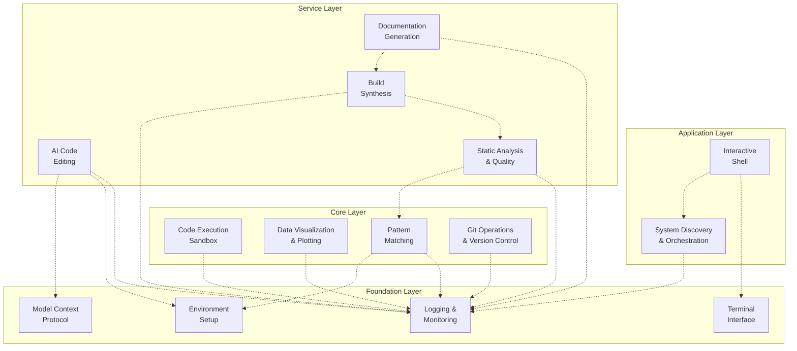

# Codomyrmex Module System Overview

Codomyrmex is built on a **modular architecture** where each module provides specific functionality while maintaining clear interfaces and minimal coupling. This design allows for flexible composition, independent development, and easy extensibility.

## 🏗️ Module Architecture Principles

### **1. Self-Contained Modules**
Each module is a complete unit with:
- Its own dependencies (`requirements.txt`)
- Comprehensive tests (`tests/`)
- API documentation (`API_SPECIFICATION.md`)
- Usage examples (`USAGE_EXAMPLES.md`)
- Security considerations (`SECURITY.md`)

### **2. Standardized Interfaces**
All modules follow consistent patterns:
- **MCP Tools**: Model Context Protocol specifications for AI integration
- **Public APIs**: Well-defined functions and classes for programmatic access
- **CLI Integration**: Commands accessible through the main Codomyrmex CLI
- **Configuration**: Environment variables and config file support

### **3. Layered Dependencies**
Modules are organized in dependency layers to prevent circular dependencies:



**Key Principles**:
- **Upward Dependencies Only**: Higher layers depend on lower layers, never the reverse
- **Foundation Services**: Used by all modules for consistency
- **Clear Layer Boundaries**: Each layer has distinct responsibilities

**Related Documentation**:
- **[Module Relationships](./relationships.md)**: Detailed inter-module dependencies
- **[Architecture Overview](../project/architecture.md)**: System architecture principles
- **[Contributing Guide](../project/contributing.md)**: Adding new modules to the system

## 📦 Module Categories

### **🏗️ Foundation Modules**
*Essential infrastructure used by all other modules*

| Module | Purpose | Key Features |
|--------|---------|-------------|
| **`logging_monitoring`** | Centralized logging system | Structured logging, multiple formats, log aggregation |
| **`environment_setup`** | Environment validation | Dependency checking, API key management, setup automation |
| **`model_context_protocol`** | AI communication standard | Standardized LLM interfaces, tool specifications |
| **`terminal_interface`** | Rich terminal interactions | Colored output, progress bars, interactive prompts |
| **`config_management`** | Configuration management | Centralized config loading, deployment, monitoring, secret management |
| **`database_management`** | Data persistence | Database operations, migrations, backups, performance monitoring |
| **`language_models`** | LLM infrastructure | Language model integration, provider abstraction, model management |
| **`performance`** | Performance monitoring | Metrics collection, benchmarking, optimization guidance |

### **⚙️ Core Functional Modules**
*Primary capabilities that users directly interact with*

| Module | Purpose | Key Features |
|--------|---------|-------------|
| **`ai_code_editing`** | AI-powered code assistance | Code generation, refactoring, explanation, multi-LLM support |
| **`static_analysis`** | Code quality analysis | Linting, security scanning, complexity metrics, quality gates |
| **`code`** | Safe code execution | Multi-language support, resource limits, security isolation |
| **`data_visualization`** | Charts and plots | Static/interactive plots, multiple formats, customizable styling |
| **`pattern_matching`** | Code pattern analysis | Pattern recognition, dependency analysis, code understanding |
| **`git_operations`** | Version control automation | Git workflows, branch management, commit automation |
| **`code_review`** | Automated code review | AI-powered review, quality analysis, improvement suggestions |
| **`security_audit`** | Security scanning | Vulnerability detection, compliance checking, security monitoring |
| **`llm/ollama`** | Local LLM integration | Ollama model management, execution, configuration, benchmarking |

### **🔧 Service Modules**
*Higher-level services that orchestrate core modules*

| Module | Purpose | Key Features |
|--------|---------|-------------|
| **`build_synthesis`** | Build automation | Multi-language builds, artifact generation, deployment pipelines |
| **`documentation`** | Documentation generation | Website generation, API docs, tutorial creation |
| **`api_documentation`** | API documentation generation | OpenAPI/Swagger specs, code analysis, structured documentation |
| **`ci_cd_automation`** | CI/CD pipeline management | Pipeline orchestration, deployment automation, monitoring |
| **`containerization`** | Container management | Docker lifecycle, image building, Kubernetes orchestration |
| **`database_management`** | Database operations | Schema management, migrations, backups, performance monitoring |

### **🎮 Application Modules**
*User-facing applications and interfaces*

| Module | Purpose | Key Features |
|--------|---------|-------------|
| **`system_discovery`** | System exploration | Module scanning, capability discovery, health monitoring |
| **`terminal_interface`** | Interactive exploration | Command shell, foraging interface, guided discovery |
| **`project_orchestration`** | Workflow orchestration | Workflow management, task coordination, resource allocation |
| **`cli`** | Command-line interface | CLI commands, scripting support, interactive shell |

### **🔗 Integration Modules**
*Standards and protocols for system integration*

| Module | Purpose | Key Features |
|--------|---------|-------------|
| **`model_context_protocol`** | AI communication standard | Standardized LLM interfaces, tool specifications |
| **`module_template`** | Module creation template | Template for creating new modules with standard structure |

### **🚀 Advanced Modules**
*Specialized capabilities for advanced use cases*

| Module | Purpose | Key Features |
|--------|---------|-------------|
| **`modeling_3d`** | 3D modeling and visualization | 3D model creation, manipulation, rendering |
| **`physical_management`** | Physical system simulation | Physical system modeling, simulation management |

## 🔄 Module Communication Patterns

### **1. Direct API Calls**
Modules expose public functions and classes:
```python
from codomyrmex.data_visualization import create_line_plot
from codomyrmex.agents.ai_code_editing import generate_code_snippet

# Direct function calls
plot_result = create_line_plot(x_data, y_data, title="Sample Plot")
code_result = generate_code_snippet("Create a factorial function", "python")
```

### **2. Event-Driven Integration**
Modules can publish and subscribe to events:
```python
# Publishing events
from codomyrmex.logging_monitoring import get_logger
logger = get_logger(__name__)
logger.info("Code generation completed", extra={"event_type": "code_generated"})

# Subscribing to events
def on_code_generated(event_data):
    # Automatically run static analysis on generated code
    pass
```

### **3. Pipeline Composition**
Modules can be chained together in processing pipelines:
```python
# Analysis → AI Enhancement → Validation Pipeline
def enhance_code_pipeline(source_code):
    # 1. Analyze existing code
    analysis = pattern_matching.analyze_code(source_code)

    # 2. Generate improvements with AI
    improvements = ai_code_editing.suggest_improvements(source_code, analysis)

    # 3. Validate generated code
    validation = code.validate_code(improvements)

    return validation
```

## 📋 Module Development Guidelines

### **Creating a New Module**

1. **Use the Template**:
   ```bash
   cp -r src/codomyrmex/module_template src/codomyrmex/my_new_module
   ```

2. **Follow the Structure**:
   ```
   my_new_module/
   ├── __init__.py                 # Module initialization
   ├── README.md                   # Module overview and usage
   ├── API_SPECIFICATION.md        # API documentation
   ├── MCP_TOOL_SPECIFICATION.md   # AI integration specs
   ├── CHANGELOG.md               # Version history
   ├── SECURITY.md                # Security considerations
   ├── requirements.txt           # Module dependencies
   ├── my_module_code.py          # Implementation
   ├── docs/                      # Extended documentation
   │   ├── technical_overview.md  # Architecture details
   │   └── tutorials/             # Usage tutorials
   └── tests/                     # Comprehensive tests
       ├── README.md              # Testing instructions
       └── test_my_module.py      # Test implementation
   ```

3. **Implement Standard Interfaces**:
   - Public API functions with clear signatures
   - MCP tools for AI integration
   - Configuration via environment variables
   - Comprehensive error handling and logging

4. **Document Everything**:
   - API specifications with examples
   - Usage tutorials for common scenarios
   - Integration patterns with other modules
   - Security considerations and best practices

### **Module Integration Best Practices**

1. **Dependency Management**:
   - Minimize dependencies on other modules
   - Use foundation modules (logging, environment) as needed
   - Pin exact versions in `requirements.txt`

2. **Error Handling**:
   ```python
   from codomyrmex.logging_monitoring.logger_config import get_logger

   logger = get_logger(__name__)

   try:
       result = risky_operation()
       logger.info("Operation completed successfully")
       return result
   except ValueError as e:
       logger.error(f"Validation error: {e}")
       raise
   except Exception as e:
       logger.error(f"Unexpected error: {e}", exc_info=True)
       raise
   ```

3. **Configuration** {#module-specific-configuration}:
   ```python
   import os
   from codomyrmex.environment_setup import check_and_setup_env_vars

   # Ensure environment is configured
   check_and_setup_env_vars(project_root)

   # Use environment variables for configuration
   API_KEY = os.getenv("MY_MODULE_API_KEY")
   DEBUG_MODE = os.getenv("MY_MODULE_DEBUG", "false").lower() == "true"
   ```

## 🎯 Module Discovery and Usage

### **Discovering Available Modules**
```python
from codomyrmex.system_discovery import SystemDiscovery

discovery = SystemDiscovery()
modules = discovery.discover_modules()

for module_name, module_info in modules.items():
    print(f"Module: {module_name}")
    print(f"Capabilities: {len(module_info.capabilities)}")
    print(f"Status: {'✅' if module_info.is_importable else '❌'}")
```

### **Using Modules Programmatically**
```python
# Import specific functionality
from codomyrmex.data_visualization import create_bar_chart
from codomyrmex.agents.ai_code_editing import generate_code_snippet

# Use modules in combination
def create_code_with_visualization():
    # Generate code
    code_result = generate_code_snippet(
        "Create a function that calculates prime numbers up to n",
        "python"
    )

    if code_result["status"] == "success":
        # Create visualization of the process
        create_bar_chart(
            categories=["Generated", "Validated", "Ready"],
            values=[1, 1, 1],
            title="Code Generation Pipeline Status",
            output_path="generation_status.png"
        )
```

### **Interactive Module Exploration** {#interactive-module-exploration}
```bash
# Launch the interactive shell
python -c "
from codomyrmex.terminal_interface import InteractiveShell
InteractiveShell().run()
"

# Or use the orchestrator
./start_here.sh
# Choose option 7: Interactive Shell
```

## 🔍 Module Health and Monitoring

### **Module Status Checking**
```python
from codomyrmex.system_discovery import SystemDiscovery

discovery = SystemDiscovery()
status = discovery.check_module_health()

print(f"Modules working: {status['working_count']}/{status['total_count']}")
print(f"Dependencies satisfied: {status['dependencies_ok']}")
print(f"Tests passing: {status['tests_passing']}")
```

### **Performance Monitoring**
```python
from codomyrmex.logging_monitoring import get_logger
import time

logger = get_logger(__name__)

def timed_operation():
    start_time = time.time()
    try:
        result = expensive_operation()
        duration = time.time() - start_time
        logger.info(f"Operation completed in {duration:.2f}s")
        return result
    except Exception as e:
        duration = time.time() - start_time
        logger.error(f"Operation failed after {duration:.2f}s: {e}")
        raise
```

---

This modular architecture enables Codomyrmex to be both powerful and flexible, allowing users to leverage individual capabilities or compose complex workflows across multiple modules. The standardized interfaces and clear dependency relationships make it easy to extend, maintain, and integrate with external systems.

## Navigation Links

- **Parent**: [Project Overview](../README.md)
- **Module Index**: [All Agents](../../AGENTS.md)
- **Documentation**: [Reference Guides](../../docs/README.md)
- **Home**: [Root README](../../../README.md)
