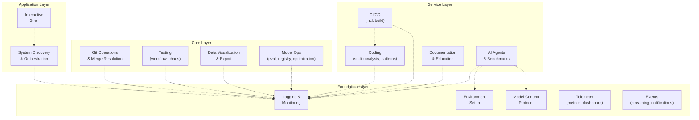

# Codomyrmex Module System Overview

**Version**: v0.1.7 | **Status**: Active | **Last Updated**: February 2026

Codomyrmex is built on a **modular architecture** where each module provides specific functionality while maintaining clear interfaces and minimal coupling. This design allows for flexible composition, independent development, and easy extensibility.

## 🏗️ Module Architecture Principles

### **1. Self-Contained Modules**

Each module is a complete unit with:

- Its own dependencies (managed via `pyproject.toml` extras)
- Comprehensive tests (`tests/`)
- API documentation (`API_SPECIFICATION.md`)
- Usage examples (`USAGE_EXAMPLES.md`)
- Security considerations (`SECURITY.md`)

### **2. Standardized Interfaces**

All modules follow consistent patterns:

- **MCP Tools**: Model Context Protocol specifications for AI integration
- **Public APIs**: Well-defined functions and classes for programmatic access
- **CLI Integration**: Commands accessible through the main Codomyrmex CLI
- **Configuration**: Environment variables and config file support

### **3. Layered Dependencies**

Modules are organized in dependency layers to prevent circular dependencies:



**Key Principles**:

- **Upward Dependencies Only**: Higher layers depend on lower layers, never the reverse
- **Foundation Services**: Used by all modules for consistency
- **Clear Layer Boundaries**: Each layer has distinct responsibilities

**Related Documentation**:

- **[Module Relationships](./relationships.md)**: Detailed inter-module dependencies
- **[Architecture Overview](../project/architecture.md)**: System architecture principles
- **[Contributing Guide](../project/contributing.md)**: Adding new modules to the system

## 📦 Module Categories

### **🏗️ Foundation Modules**

*Essential infrastructure used by all other modules*

| Module | Purpose | Key Features |
|--------|---------|-------------|
| **`logging_monitoring`** | Centralized logging system | Structured logging, multiple formats, log aggregation |
| **`environment_setup`** | Environment validation | Dependency checking, API key management, setup automation, dependency resolution |
| **`model_context_protocol`** | AI communication standard | Standardized LLM interfaces, tool specifications, auto-discovery |
| **`terminal_interface`** | Rich terminal interactions | Colored output, progress bars, interactive prompts |
| **`config_management`** | Configuration management | Centralized config loading, deployment, monitoring, secret management |
| **`database_management`** | Data persistence | Database operations, **migrations**, **backups**, performance monitoring, **data lineage** |
| **`concurrency`** | Distributed synchronization | Locks, semaphores, thread-safe primitives, **channels**, **rate limiting** |
| **`dependency_injection`** | IoC container | Service registration, constructor injection, lifecycle scoping |
| **`serialization`** | Data serialization | JSON, YAML, binary formats, schema validation, **streaming I/O** |
| **`telemetry`** | Observability | OpenTelemetry traces, spans, context propagation, **metrics collection**, **dashboards** |
| **`events`** | Event system | Event bus, pub/sub, event handlers, **replay**, **dead letter**, **streaming**, **notifications** |
| **`validation`** | Data validation | Schema validation, input sanitization, constraint checking, **shared schema registry** |

### **⚙️ Core Functional Modules**

*Primary capabilities that users directly interact with*

| Module | Purpose | Key Features |
|--------|---------|-------------|
| **`coding`** | Code execution and review | Multi-language sandboxing, code review, **static analysis**, **pattern matching** |
| **`data_visualization`** | Charts and plots | Static/interactive plots, multiple formats, customizable styling, **multi-format export** |
| **`git_operations`** | Version control automation | Git workflows, branch management, commit automation, **merge conflict resolution** |
| **`security`** | Security scanning and audit | Vulnerability detection, compliance checking, threat modeling, **vulnerability scanner**, **governance** |
| **`scrape`** | Web scraping | Content extraction, crawling, data collection |
| **`documents`** | Document processing | Document parsing, metadata extraction, search indexing, **RAG chunking** |
| **`cache`** | Caching infrastructure | In-memory caching, distributed cache, **multi-strategy invalidation** |
| **`compression`** | Data compression | Multiple algorithms, streaming compression, file archiving |
| **`encryption`** | Encryption utilities | Symmetric/asymmetric encryption, key management, secure storage, **digital signing** |
| **`networking`** | Network utilities | HTTP clients, WebSocket support, network diagnostics, **service mesh** |
| **`search`** | Full-text search | TF-IDF indexing, fuzzy matching, relevance ranking, **hybrid BM25+semantic search** |
| **`crypto`** | Cryptography | Cryptography utilities, currency, encoding, protocols, steganography |
| **`tree_sitter`** | AST parsing | Language-agnostic parsing, syntax trees, code navigation (sub-package of `coding/parsers`) |

### **🔧 Service Modules**

*Higher-level services that orchestrate core modules*

| Module | Purpose | Key Features |
|--------|---------|-------------|
| **`documentation`** | Documentation generation | Website generation, API docs, tutorial creation, **education & tutoring** |
| **`api`** | API infrastructure | OpenAPI/Swagger specs, REST API building, versioning, **rate limiting** |
| **`ci_cd_automation`** | CI/CD pipeline management | Pipeline orchestration, deployment automation, monitoring, **build synthesis** |
| **`containerization`** | Container management | Docker lifecycle, image building, Kubernetes orchestration |
| **`logistics`** | Orchestration and scheduling | Task orchestration, workflow scheduling, resource allocation |
| **`cloud`** | Cloud integrations | Cloud provider APIs, resource management, deployment, **cost management** |
| **`auth`** | Authentication | OAuth, API keys, token management, access control |
| **`deployment`** | Deployment strategies | Blue/green, canary, rolling deployments |
| **`edge_computing`** | Edge deployment | IoT gateways, edge inference, offline-first patterns |
| **`model_ops`** | ML operations | Model lifecycle, experiment tracking, serving, **evaluation**, **registry**, **optimization**, **feature store** |
| **`orchestrator`** | Workflow execution | DAG execution, step composition, retry policies, **scheduling** |
| **`testing`** | Test infrastructure | Fixtures, data generators, **workflow validation**, **chaos engineering** |
| **`performance`** | Performance monitoring | Metrics collection, benchmarking, optimization guidance |

### **🎮 Application Modules**

*User-facing applications and interfaces*

| Module | Purpose | Key Features |
|--------|---------|-------------|
| **`system_discovery`** | System exploration | Module scanning, capability discovery, health monitoring |
| **`terminal_interface`** | Interactive exploration | Command shell, foraging interface, guided discovery |
| **`cli`** | Command-line interface | CLI commands, scripting support, interactive shell, **shell completion** |
| **`website`** | Website generation | Static site generation, templating, local server, **accessibility** |
| **`audio`** | Audio processing | Transcription, synthesis, audio analysis |
| **`video`** | Video processing | Video analysis, frame extraction, transcription |

### **🛡️ Secure Cognitive Modules**

*Autonomous security and economic capabilities*

| Module | Purpose | Key Features |
|--------|---------|-------------|
| **`identity`** | Identity & Verification | 3-Tier personas, bio-cognitive verification, revocation |
| **`wallet`** | Self-Custody | Secure key management, Natural Ritual recovery, key rotation, **smart contracts** |
| **`defense`** | Active Defense | Exploit detection, context poisoning, rabbit hole containment |
| **`market`** | Anonymous Markets | Reverse auctions, demand aggregation, anonymous bidding |
| **`privacy`** | Privacy & Anonymity | Crumb scrubbing, mixnet simulation, dynamic blacklists |
| **`dark`** | Dark mode & PDF ops | Dark mode utilities, PDF processing, steganography |

### **🧠 Intelligence Modules**

*AI reasoning and agent capabilities*

| Module | Purpose | Key Features |
|--------|---------|-------------|
| **`agents`** | Agentic framework integrations | Jules, Claude, Codex integration, agent orchestration, **benchmarks** |
| **`cerebrum`** | Case-based reasoning | Bayesian inference, active inference, reasoning engine |
| **`fpf`** | Functional Programming Framework | Combinator engine, transformation pipelines, composition |
| **`skills`** | Skills framework | Skill definitions, execution, chaining |
| **`agentic_memory`** | Long-term agent memory | Retrieval, persistence, contextual recall, **memory compression** |
| **`graph_rag`** | Knowledge graph RAG | Graph-enhanced retrieval, knowledge extraction |
| **`llm`** | LLM infrastructure | Language model integration, provider abstraction, Ollama support, **multimodal**, **safety filtering** |
| **`prompt_engineering`** | Prompt management | Template versioning, optimization, evaluation, **A/B testing** |
| **`vector_store`** | Embeddings storage | Similarity search, HNSW indexing, retrieval |
| **`tool_use`** | Tool registry & composition | Tool validation, chain abstraction, workflow tools |

### **🔗 Integration Modules**

*Standards, protocols, and IDE integrations*

| Module | Purpose | Key Features |
|--------|---------|-------------|
| **`model_context_protocol`** | AI communication standard | Standardized LLM interfaces, tool specifications |
| **`module_template`** | Module creation template | Template for creating new modules with standard structure |
| **`ide`** | IDE integrations | Antigravity, Cursor, VS Code automation and control |
| **`plugin_system`** | Plugin architecture | Plugin loading, registration, lifecycle management |
| **`collaboration`** | Multi-agent collaboration | Swarm coordination, shared context, team workflows |
| **`feature_flags`** | Feature toggles | Feature gates, rollout strategies, A/B routing |

### **🚀 Advanced Modules**

*Specialized capabilities for advanced use cases*

| Module | Purpose | Key Features |
|--------|---------|-------------|
| **`spatial`** | 3D/4D modeling and visualization | 3D model creation, manipulation, rendering, world models |
| **`physical_management`** | Physical system simulation | System monitoring, resource management, performance tracking |
| **`bio_simulation`** | Ant colony simulation | Pheromone foraging, genetic algorithms, colony dynamics |
| **`embodiment`** | Physical/robotic integration | Hardware interfaces, sensor fusion, motor control |
| **`evolutionary_ai`** | Genetic algorithms | Evolutionary optimization, population dynamics, fitness |
| **`quantum`** | Quantum computing | Algorithm primitives, circuit simulation, qubit operations |

### **🛠️ Utility Modules**

*Common utilities and development tools*

| Module | Purpose | Key Features |
|--------|---------|-------------|
| **`exceptions`** | Exception hierarchy | Centralized exception classes, error handling, error codes |
| **`utils`** | Common utilities | Helper functions, CLI helpers, shared utilities, **hashing**, **retry**, **i18n** |
| **`templating`** | Template engine | Jinja2-style templating, code generation, scaffolding |
| **`tests`** | Test infrastructure | Unit tests, integration tests, test utilities |
| **`examples`** | Code examples | Usage examples, tutorials, demo applications |
| **`meme`** | Information dynamics | Memetic warfare, meme propagation, evolution modeling |
| **`finance`** | Financial operations | Double-entry bookkeeping, tax compliance, forecasting |
| **`relations`** | CRM & social graphs | Contact management, social network analysis, graph metrics |
| **`maintenance`** | System health | Health checks, cleanup routines, diagnostics |

## 🔄 Module Communication Patterns

### **1. Direct API Calls**

Modules expose public functions and classes:

```python
from codomyrmex.data_visualization import create_line_plot
from codomyrmex.agents import generate_code_snippet

# Direct function calls
plot_result = create_line_plot(x_data, y_data, title="Sample Plot")
code_result = generate_code_snippet("Create a factorial function", "python")
```

### **2. Event-Driven Integration**

Modules can publish and subscribe to events:

```python
from codomyrmex.logging_monitoring import get_logger
logger = get_logger(__name__)
logger.info("Code generation completed", extra={"event_type": "code_generated"})
```

### **3. Pipeline Composition**

Modules can be chained together in processing pipelines:

```python
def enhance_code_pipeline(source_code):
    # 1. Analyze existing code (static_analysis is now in coding)
    analysis = coding.static_analysis.analyze_code(source_code)

    # 2. Generate improvements with AI
    improvements = agents.suggest_improvements(source_code, analysis)

    # 3. Validate generated code
    validation = coding.validate_code(improvements)
    return validation
```

## 📋 Module Development Guidelines

### **Creating a New Module**

1. **Use the Template**:

   ```bash
   cp -r src/codomyrmex/module_template src/codomyrmex/my_new_module
   ```

2. **Follow the Structure**:

   ```
   my_new_module/
   ├── __init__.py                 # Module initialization
   ├── README.md                   # Module overview and usage
   ├── API_SPECIFICATION.md        # API documentation
   ├── MCP_TOOL_SPECIFICATION.md   # AI integration specs
   ├── CHANGELOG.md               # Version history
   ├── SECURITY.md                # Security considerations
   ├── pyproject.toml              # Project dependencies
   ├── my_module_code.py          # Implementation
   ├── docs/                      # Extended documentation
   │   ├── technical_overview.md  # Architecture details
   │   └── tutorials/             # Usage tutorials
   └── tests/                     # Comprehensive tests
       ├── README.md              # Testing instructions
       └── test_my_module.py      # Test implementation
   ```

3. **Implement Standard Interfaces**:
   - Public API functions with clear signatures
   - MCP tools for AI integration
   - Configuration via environment variables
   - Comprehensive error handling and logging

4. **Document Everything**:
   - API specifications with examples
   - Usage tutorials for common scenarios
   - Integration patterns with other modules
   - Security considerations and best practices

## 🔍 Module Health and Monitoring

### **Module Status Checking**

```python
from codomyrmex.system_discovery import SystemDiscovery

discovery = SystemDiscovery()
status = discovery.check_module_health()

print(f"Modules working: {status['working_count']}/{status['total_count']}")
print(f"Dependencies satisfied: {status['dependencies_ok']}")
print(f"Tests passing: {status['tests_passing']}")
```

---

This modular architecture enables Codomyrmex to be both powerful and flexible, allowing users to leverage individual capabilities or compose complex workflows across multiple modules. The standardized interfaces and clear dependency relationships make it easy to extend, maintain, and integrate with external systems.

## Navigation Links

- **Parent**: [docs](../README.md)
- **Module Index**: [AGENTS.md](../AGENTS.md)
- **Home**: [Repository Root](../../README.md)
