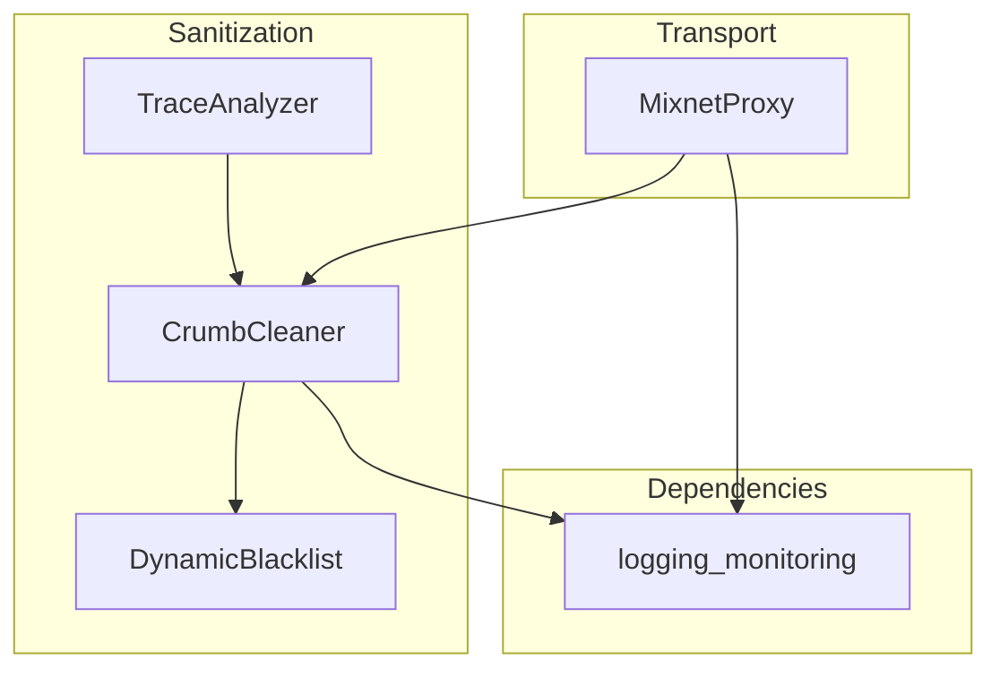

# privacy - Functional Specification

**Version**: v1.0.0 | **Status**: Active | **Last Updated**: February 2026

## Purpose

The `privacy` module enforces data minimization and network anonymity for Secure Cognitive Agents. It systematically removes metadata ("crumbs") from all agent communications and provides simulated onion routing transport via a mixnet proxy.

## Design Principles

### Modularity

- Scrubbing engine decoupled from routing layer
- Pluggable blacklist patterns for metadata removal
- Clean separation between data sanitization and transport

### Internal Coherence

- Consistent scrubbing rules across all data types
- Unified blacklist management with dynamic runtime updates
- Integration with identity and defense modules

### Parsimony

- Recursive metadata removal — scrub deeply nested structures
- Minimal configuration for common use cases
- Zero-knowledge default: remove everything not explicitly whitelisted

### Functionality

- Crumb scrubbing: recursive removal of timestamps, location data, device IDs, headers
- Mixnet proxy: simulated multi-hop encrypted routing
- Dynamic blacklist: runtime update of metadata patterns to scrub
- Trace analysis: audit data for remaining digital footprint

### Testing

- Unit tests for scrubbing completeness
- Integration tests with realistic data payloads
- Metadata leakage detection tests

### Documentation

- Complete API specifications
- Blacklist pattern reference
- Data flow documentation

## Architecture



## Functional Requirements

### Core Capabilities

1. **Crumb Scrubbing**: Recursively remove metadata from data structures via `CrumbCleaner.scrub()`
2. **Mixnet Routing**: Route payloads through simulated multi-hop network via `MixnetProxy.route_payload()`
3. **Dynamic Blacklist**: Add/remove scrubbing patterns at runtime via `DynamicBlacklist`
4. **Trace Analysis**: Audit data for remaining digital footprint via `TraceAnalyzer`
5. **Configuration**: Runtime update of blacklisted metadata keys

### Integration Points

- `identity/` - Scrub persona metadata from outgoing data
- `defense/` - Scrub defense event metadata
- `wallet/` - Scrub transaction metadata
- `logging_monitoring/` - Privacy-aware logging

## Quality Standards

### Code Quality

- Type hints for all functions
- PEP 8 compliance
- Deep recursion handling for nested structures

### Testing Standards

- ≥80% coverage
- Metadata leakage tests
- Nested structure scrubbing tests

### Documentation Standards

- README.md, AGENTS.md, SPEC.md
- Blacklist pattern reference
- Data flow audit guide

## Interface Contracts

### CrumbCleaner API

```python
class CrumbCleaner:
    def scrub(data: dict) -> dict
    def scrub_headers(headers: dict) -> dict
    def add_pattern(pattern: str) -> None
    def remove_pattern(pattern: str) -> None
```

### MixnetProxy API

```python
class MixnetProxy:
    def route_payload(data: bytes, hops: int = 3) -> bytes
    def get_route_info() -> dict
```

### DynamicBlacklist API

```python
class DynamicBlacklist:
    def add_pattern(pattern: str) -> None
    def remove_pattern(pattern: str) -> None
    def list_patterns() -> List[str]
    def matches(key: str) -> bool
```

### Dependencies

- **Internal**: `codomyrmex.logging_monitoring`.

## Implementation Guidelines

### Scrubbing

1. Recursively traverse all nested dictionaries and lists
2. Match keys against blacklist patterns (exact and regex)
3. Remove matched entries entirely — do not redact or mask
4. Default blacklist covers: timestamps, location, device IDs, IP addresses, user agents

### Routing

1. Simulate multi-hop routing with configurable hop count
2. Each hop applies encryption layer (simulated)
3. Log routing events without revealing payload content

## Navigation

- **Human Documentation**: [README.md](README.md)
- **Technical Documentation**: [AGENTS.md](AGENTS.md)
- **Package SPEC**: [../SPEC.md](../SPEC.md)
