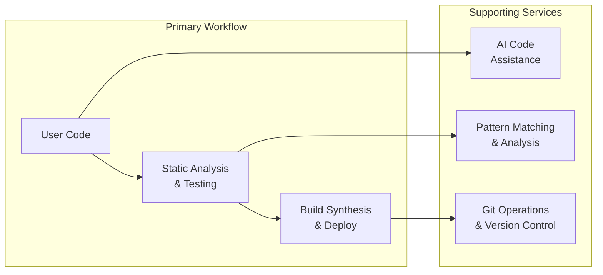
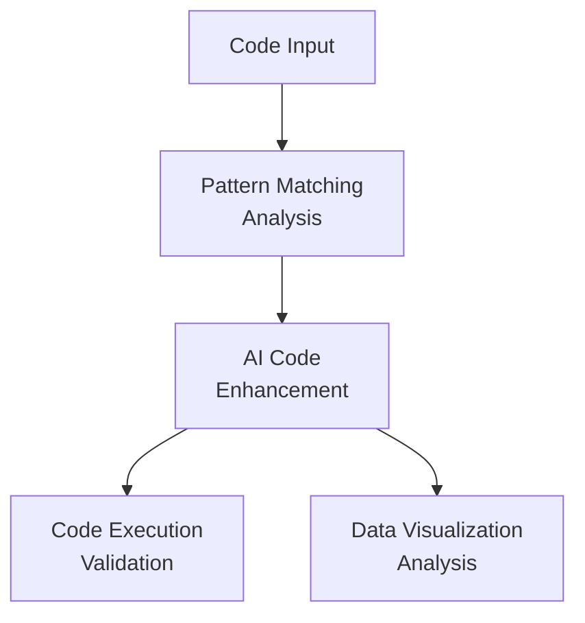
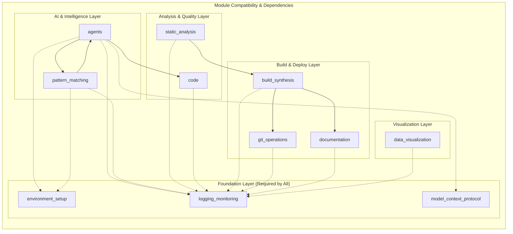

# 🔗 Codomyrmex Module Relationships & Interdependencies

This document provides a comprehensive overview of how Codomyrmex modules interact with each other, their dependencies, and data flow patterns.

## 📋 Module Overview

| Module | Primary Role | Key Dependencies | Consumes From | Provides To |
|--------|-------------|------------------|---------------|-------------|
| **`environment_setup`** | Environment validation & dependency management | System packages | None | All modules |
| **`logging_monitoring`** | Centralized logging framework | None | All modules | All modules |
| **`model_context_protocol`** | AI agent communication standard | JSON Schema | AI modules | AI modules |
| **`terminal_interface`** | Rich terminal interactions | Rich, prompt-toolkit | None | Application modules |
| **`config_management`** | Configuration management | PyYAML, configparser | logging_monitoring | All modules |
| **`database_management`** | Data persistence | SQLAlchemy, asyncpg | logging_monitoring | All modules |
| **`llm`** | LLM infrastructure | OpenAI, Anthropic, Ollama | logging_monitoring, model_context_protocol | AI modules |
| **`performance`** | Performance monitoring | psutil, cProfile | logging_monitoring | All modules |
| **`metrics`** | Metrics collection and reporting | prometheus_client | logging_monitoring | All modules |
| **`coding`** | Code execution & review | subprocess, security | logging_monitoring | All modules |
| **`data_visualization`** | Charting and plotting utilities | matplotlib, seaborn | logging_monitoring | All modules |
| **`static_analysis`** | Code quality and security analysis | pylint, flake8, bandit | logging_monitoring | build_synthesis, security |
| **`pattern_matching`** | Code analysis and pattern recognition | cased/kit | logging_monitoring, environment_setup | All modules |
| **`security`** | Security scanning and threat modeling | bandit, semgrep, cryptography | logging_monitoring, static_analysis | All modules |
| **`scrape`** | Web scraping and content extraction | BeautifulSoup, requests | logging_monitoring | All modules |
| **`documents`** | Document processing and management | parsers, extractors | logging_monitoring | All modules |
| **`cache`** | Caching infrastructure | redis, memory | logging_monitoring | All modules |
| **`compression`** | Data compression | zlib, gzip, lz4 | None | All modules |
| **`encryption`** | Encryption utilities | cryptography | logging_monitoring | All modules |
| **`networking`** | Network utilities | aiohttp, requests | logging_monitoring | All modules |
| **`serialization`** | Data serialization | json, yaml, msgpack | None | All modules |
| **`validation`** | Data validation | pydantic, jsonschema | logging_monitoring | All modules |
| **`build_synthesis`** | Build automation and scaffolding | build tools | static_analysis, logging_monitoring | All modules |
| **`git_operations`** | Git workflow automation | GitPython | logging_monitoring | All modules |
| **`documentation`** | Documentation generation | Docusaurus | All modules | All modules |
| **`api`** | API infrastructure | OpenAPI, FastAPI | logging_monitoring, static_analysis | All modules |
| **`ci_cd_automation`** | CI/CD pipeline management | Docker, Kubernetes | logging_monitoring, build_synthesis, containerization | All modules |
| **`containerization`** | Container management | Docker, Kubernetes | logging_monitoring | ci_cd_automation, build_synthesis |
| **`logistics`** | Orchestration and scheduling | schedulers | logging_monitoring, all modules | Application modules |
| **`cloud`** | Cloud integrations | cloud SDKs | logging_monitoring, config_management | All modules |
| **`auth`** | Authentication | OAuth, JWT | logging_monitoring | All modules |
| **`system_discovery`** | System exploration | introspection | logging_monitoring | Application modules |
| **`cli`** | Command-line interface | click, argparse | logging_monitoring, all modules | Users |
| **`website`** | Website generation | Jinja2, Flask | logging_monitoring | Users |
| **`module_template`** | Module creation template | None | None | Developers |
| **`events`** | Event system and pub/sub | asyncio | logging_monitoring | All modules |
| **`plugin_system`** | Plugin architecture | importlib | logging_monitoring | All modules |
| **`agents`** | Agentic framework integrations | AI providers | logging_monitoring, llm | All modules |
| **`ide`** | IDE integrations | IDE APIs | logging_monitoring, agents | Developers |
| **`cerebrum`** | Case-based reasoning | numpy, scipy | logging_monitoring | AI modules |
| **`fpf`** | Functional Programming Framework | None | logging_monitoring | All modules |
| **`skills`** | Skills framework | None | logging_monitoring, agents | All modules |
| **`spatial`** | 3D/4D modeling and visualization | Open3D, Trimesh | logging_monitoring | Specialized use cases |
| **`physical_management`** | Physical system simulation | Physics engines | logging_monitoring | Specialized use cases |
| **`utils`** | Common utilities | None | None | All modules |
| **`tools`** | Utility tools | None | logging_monitoring | All modules |
| **`templating`** | Template engine | Jinja2 | None | All modules |
| **`tests`** | Test infrastructure | pytest | All modules | Developers |
| **`accessibility`** | WCAG compliance auditing | axe-core, color-contrast | logging_monitoring | All modules |
| **`agentic_memory`** | Long-term agent memory | vector stores | logging_monitoring, llm | agents, cerebrum |
| **`audio`** | Audio processing & transcription | whisper, pydub | logging_monitoring | multimodal, llm |
| **`bio_simulation`** | Ant colony simulation | numpy | logging_monitoring | visualization, examples |
| **`chaos_engineering`** | Fault injection & resilience | failure injectors | logging_monitoring, metrics | testing, performance |
| **`collaboration`** | Multi-agent collaboration | events, agents | logging_monitoring, agents, events | agents, orchestrator |
| **`concurrency`** | Distributed synchronization | threading, asyncio | logging_monitoring | All modules |
| **`cost_management`** | Infrastructure & LLM cost tracking | metrics, billing APIs | logging_monitoring, metrics, llm | observability_dashboard |
| **`dark`** | Dark mode & PDF processing | PyMuPDF, Pillow | logging_monitoring | documents, visualization |
| **`data_lineage`** | Data provenance tracking | graph stores | logging_monitoring, database_management | observability_dashboard |
| **`defense`** | Active defense systems | security, encryption | logging_monitoring, security, encryption | identity, privacy |
| **`dependency_injection`** | IoC container & lifecycle | None | None | All modules |
| **`deployment`** | Deployment strategies | cloud SDKs | logging_monitoring, containerization, cloud | ci_cd_automation |
| **`edge_computing`** | Edge deployment & IoT | MQTT, gRPC | logging_monitoring, networking | deployment, cloud |
| **`education`** | Curriculum & tutoring | llm, templating | logging_monitoring, llm, templating | examples |
| **`embodiment`** | Physical/robotic integration | hardware drivers | logging_monitoring, spatial | physical_management |
| **`evolutionary_ai`** | Genetic algorithms | numpy, scipy | logging_monitoring | bio_simulation, model_ops |
| **`examples`** | Code examples & templates | All modules | All modules | Developers |
| **`exceptions`** | Centralized exception hierarchy | None | None | All modules |
| **`feature_flags`** | Feature toggle management | config_management | logging_monitoring, config_management | All modules |
| **`feature_store`** | ML feature management | database_management | logging_monitoring, database_management | model_ops, inference_optimization |
| **`finance`** | Financial operations | decimal, pandas | logging_monitoring, database_management | visualization, examples |
| **`governance`** | Policy enforcement | smart_contracts | logging_monitoring, security | identity, wallet |
| **`graph_rag`** | Knowledge graph RAG | networkx, llm | logging_monitoring, llm, vector_store | agents, cerebrum |
| **`i18n`** | Internationalization | babel, gettext | logging_monitoring | All modules |
| **`identity`** | 3-Tier personas & verification | encryption, auth | logging_monitoring, encryption, auth | defense, wallet, privacy |
| **`inference_optimization`** | Model optimization | onnxruntime, quantizers | logging_monitoring, llm | llm, model_ops |
| **`market`** | Anonymous markets | smart_contracts, privacy | logging_monitoring, smart_contracts, privacy | wallet |
| **`meme`** | Information dynamics | networkx, llm | logging_monitoring, llm | visualization, examples |
| **`migration`** | Cross-provider migration | database_management | logging_monitoring, database_management | deployment, cloud |
| **`model_evaluation`** | LLM output scoring | llm, metrics | logging_monitoring, llm, metrics | model_ops, prompt_testing |
| **`model_ops`** | ML model operations | mlflow, experiment tracking | logging_monitoring, model_registry | inference_optimization |
| **`model_registry`** | Model versioning | database_management | logging_monitoring, database_management | model_ops, inference_optimization |
| **`multimodal`** | Vision & audio AI | Pillow, whisper | logging_monitoring, llm, audio | agents, llm |
| **`notification`** | Multi-channel dispatch | SMTP, webhooks | logging_monitoring, config_management | All modules |
| **`observability_dashboard`** | Unified monitoring | metrics, telemetry | logging_monitoring, metrics, telemetry | visualization |
| **`orchestrator`** | Workflow execution | events, concurrency | logging_monitoring, events, concurrency | All modules |
| **`privacy`** | Crumb scrubbing & mixnets | encryption | logging_monitoring, encryption | identity, defense |
| **`prompt_engineering`** | Prompt template management | llm, templating | logging_monitoring, llm, templating | prompt_testing, agents |
| **`prompt_testing`** | Prompt evaluation & A/B testing | model_evaluation | logging_monitoring, model_evaluation | prompt_engineering |
| **`quantum`** | Quantum algorithm primitives | numpy, cirq | logging_monitoring | examples, evolutionary_ai |
| **`rate_limiting`** | API rate limiting | asyncio, redis | logging_monitoring, cache | api, networking |
| **`relations`** | CRM & social graphs | networkx | logging_monitoring, database_management | visualization, examples |
| **`scheduler`** | Task scheduling | cron triggers | logging_monitoring, concurrency | orchestrator, logistics |
| **`schemas`** | Shared type registry | pydantic | None | All modules |
| **`search`** | Full-text search | TF-IDF, fuzzy | logging_monitoring | documents, database_management |
| **`service_mesh`** | Circuit breakers & load balancing | retry, circuit breakers | logging_monitoring, networking | api, cloud |
| **`smart_contracts`** | Web3 & blockchain | web3.py | logging_monitoring, encryption | market, governance |
| **`streaming`** | Real-time data streaming | SSE, WebSocket | logging_monitoring, events | api, notification |
| **`telemetry`** | OpenTelemetry tracing | opentelemetry | logging_monitoring | observability_dashboard, performance |
| **`testing`** | Test fixtures & generators | pytest, factory | logging_monitoring | tests, Developers |
| **`tool_use`** | Tool registry & composition | schemas | logging_monitoring, schemas | agents, orchestrator |
| **`tree_sitter`** | AST parsing & analysis | tree-sitter | logging_monitoring | pattern_matching, static_analysis |
| **`vector_store`** | Embeddings storage | faiss, chromadb | logging_monitoring, llm | graph_rag, agentic_memory |
| **`video`** | Video processing | ffmpeg, opencv | logging_monitoring | multimodal, documents |
| **`visualization`** | Unified visualization | matplotlib, plotly | logging_monitoring, data_visualization | All modules |
| **`wallet`** | Self-custody & recovery | encryption | logging_monitoring, encryption | identity, market |
| **`workflow_testing`** | Workflow validation | orchestrator, testing | logging_monitoring, orchestrator, testing | ci_cd_automation |

## 🔄 Core Data Flow Patterns

### **1. Development Workflow Integration**



### **2. AI-Powered Development Cycle**



**Related Documentation**:

- **[System Architecture](../project/architecture.md)**: Overall system design
- **[Module Overview](./overview.md)**: Module architecture principles
- **[API Reference](../reference/api.md)**: Module APIs and integration patterns

## 🔗 Detailed Module Relationships

### **🔧 Foundation Modules (Used by All)**

#### **`environment_setup` → All Modules**

- **Provides**: Dependency validation, environment variables, API key management
- **Integration Points**:

  ```python
  # Every module imports this for setup validation
  from codomyrmex.environment_setup.env_checker import ensure_dependencies_installed

  # Called at module initialization
  ensure_dependencies_installed()
  ```

#### **`logging_monitoring` → All Modules**

- **Provides**: Standardized logging interface, structured logging
- **Integration Points**:

  ```python
  # Universal logging interface across all modules
  from codomyrmex.logging_monitoring.logger_config import get_logger
  logger = get_logger(__name__)

  # Consistent log format across entire project
  logger.info("Module operation completed")
  ```

#### **`model_context_protocol` → AI Modules**

- **Provides**: Standardized communication with AI agents
- **Integration Points**:

  ```python
  # AI modules implement MCP tools
  from codomyrmex.model_context_protocol.mcp_schemas import MCPToolCall, MCPToolResult

  # Standardized request/response format
  tool_call = MCPToolCall(tool_name="agents.generate_code", arguments={...})
  ```

### **🤖 AI & Intelligence Modules**

#### **`agents` Integration Points**

- **Consumes**: `logging_monitoring`, `environment_setup`, `model_context_protocol`
- **Provides**: Code generation, refactoring, summarization
- **Cross-Module Usage**:

  ```python
  # Used by pattern_matching for code understanding
  from codomyrmex.agents.ai_code_helpers import generate_code

  # Used by documentation for example generation
  result = generate_code("Create a hello world function", "python")
  ```

#### **`pattern_matching` Integration Points**

- **Consumes**: `logging_monitoring`, `environment_setup`, `agents`
- **Provides**: Code analysis, pattern recognition, dependency mapping
- **Cross-Module Usage**:

  ```python
  # Used by static_analysis for comprehensive analysis
  from codomyrmex.pattern_matching.run_codomyrmex_analysis import analyze_repository_path

  # Comprehensive analysis workflow
  analysis_results = analyze_repository_path(repo_path="./src", output_dir="./analysis")
  ```

### **🔍 Analysis & Quality Modules**

#### **`static_analysis` Integration Points**

- **Consumes**: `logging_monitoring`
- **Provides**: Code quality metrics, security scanning, linting
- **Cross-Module Usage**:

  ```python
  # Used by build_synthesis for quality gates
  from codomyrmex.static_analysis.pyrefly_runner import run_pyrefly_analysis

  # Quality check before build
  issues = run_pyrefly_analysis(target_paths=["src/"], project_root=".")
  ```

#### **`code` Integration Points**

- **Consumes**: `logging_monitoring`
- **Provides**: Code execution, sandboxing, review, and monitoring
- **Submodules**: `execution`, `sandbox`, `review`, `monitoring`
- **Cross-Module Usage**:

  ```python
  # Used by agents for code validation
  from codomyrmex.coding import execute_code

  # Test generated code before applying
  result = execute_code(language="python", code="print('test')")
  
  # Code review integration
  from codomyrmex.coding.review import CodeReviewer, analyze_file
  reviewer = CodeReviewer()
  results = analyze_file("path/to/file.py")
  ```

### **🏗️ Build & Deployment Modules**

#### **`build_synthesis` Integration Points**

- **Consumes**: `static_analysis`, `logging_monitoring`, `git_operations`
- **Provides**: Automated building, code scaffolding, deployment
- **Cross-Module Usage**:

  ```python
  # Orchestrates multiple modules for complete build pipeline
  from codomyrmex.build_synthesis.build_orchestrator import orchestrate_build_pipeline
  from codomyrmex.static_analysis.pyrefly_runner import run_pyrefly_analysis

  # Complete build workflow
  build_config = {"target": "python_wheel", "clean": True}
  result = orchestrate_build_pipeline(build_config)

  # Quality-gated build process
  analysis = run_pyrefly_analysis(paths, root)
  if not analysis["issues"]:
      build_result = trigger_build("production")
  ```

#### **`git_operations` Integration Points**

- **Consumes**: `logging_monitoring`
- **Provides**: Git workflow automation, repository management
- **Cross-Module Usage**:

  ```python
  # Used by build_synthesis for version control integration
  from codomyrmex.git_operations.git_wrapper import create_branch, commit_changes

  # Automated release workflow
  create_branch("release/v1.0.0")
  commit_changes("Release version 1.0.0")
  ```

### **📊 Visualization & Reporting Modules**

#### **`data_visualization` Integration Points**

- **Consumes**: `logging_monitoring`
- **Provides**: Charts, plots, data visualization
- **Cross-Module Usage**:

  ```python
  # Used by pattern_matching for analysis visualization
  from codomyrmex.data_visualization.plotter import create_heatmap
  from codomyrmex.pattern_matching.run_codomyrmex_analysis import analyze_repository_path

  # Visualize analysis results
  analysis = analyze_repository_path(path, config)
  create_heatmap(analysis["dependency_matrix"], title="Code Dependencies")
  ```

#### **`documentation` Integration Points**

- **Consumes**: All modules (meta-module)
- **Provides**: Comprehensive documentation website, API references
- **Cross-Module Usage**:

  ```python
  # Generates documentation from all modules
  from codomyrmex.documentation.documentation_website import build_static_site

  # Auto-generate docs from module APIs
  build_static_site()
  ```

### **🧠 Advanced AI & ML Modules**

#### **`cerebrum` Integration Points**

- **Consumes**: `logging_monitoring`, `llm`
- **Provides**: Case-based reasoning, cognitive architecture
- **Cross-Module Usage**:

  ```python
  from codomyrmex.cerebrum import CaseLibrary, CBREngine

  # Build reasoning engine from prior cases
  library = CaseLibrary()
  engine = CBREngine(library)
  solution = engine.retrieve_and_adapt(problem_description)
  ```

#### **`graph_rag` Integration Points**

- **Consumes**: `logging_monitoring`, `llm`, `vector_store`
- **Provides**: Knowledge graph construction, graph-based RAG retrieval
- **Cross-Module Usage**:

  ```python
  from codomyrmex.graph_rag import KnowledgeGraph, GraphRAGRetriever
  from codomyrmex.vector_store import VectorStore

  # Build knowledge graph from documents, then query with RAG
  kg = KnowledgeGraph()
  retriever = GraphRAGRetriever(kg, vector_store=VectorStore())
  context = retriever.query("How do modules interact?")
  ```

#### **`agentic_memory` Integration Points**

- **Consumes**: `logging_monitoring`, `llm`, `vector_store`
- **Provides**: Long-term agent memory, episodic recall
- **Cross-Module Usage**:

  ```python
  from codomyrmex.agentic_memory import MemoryStore, EpisodicMemory

  # Agents persist and recall information across sessions
  memory = MemoryStore()
  memory.store(episode="Resolved merge conflict in auth module")
  relevant = memory.recall("authentication issues")
  ```

#### **`prompt_engineering` Integration Points**

- **Consumes**: `logging_monitoring`, `llm`, `templating`
- **Provides**: Prompt templates, chain-of-thought patterns, few-shot construction
- **Cross-Module Usage**:

  ```python
  from codomyrmex.prompt_engineering import PromptTemplate, PromptChain

  # Build reusable prompt templates for agents
  template = PromptTemplate("Analyze {code} for {language} best practices")
  result = template.render(code=source, language="python")
  ```

#### **`model_evaluation` Integration Points**

- **Consumes**: `logging_monitoring`, `llm`, `metrics`
- **Provides**: LLM output scoring, benchmark suites, A/B comparison
- **Cross-Module Usage**:

  ```python
  from codomyrmex.model_evaluation import Evaluator, BenchmarkSuite

  # Score LLM outputs against reference answers
  evaluator = Evaluator(metrics=["bleu", "rouge", "semantic_similarity"])
  scores = evaluator.evaluate(predictions, references)
  ```

#### **`inference_optimization` Integration Points**

- **Consumes**: `logging_monitoring`, `llm`
- **Provides**: Model quantization, ONNX export, inference acceleration
- **Cross-Module Usage**:

  ```python
  from codomyrmex.inference_optimization import optimize_model, quantize

  # Optimize model for production inference
  optimized = optimize_model(model_path, target="onnx")
  quantized = quantize(optimized, precision="int8")
  ```

### **⚙️ Infrastructure & Runtime Modules**

#### **`concurrency` Integration Points**

- **Consumes**: `logging_monitoring`
- **Provides**: Thread pools, async coordination, distributed locks
- **Cross-Module Usage**:

  ```python
  from codomyrmex.concurrency import TaskPool, DistributedLock

  # Parallel execution with coordination
  pool = TaskPool(max_workers=8)
  results = pool.map(process_item, items)
  ```

#### **`cache` Integration Points**

- **Consumes**: `logging_monitoring`
- **Provides**: In-memory and distributed caching, TTL policies
- **Cross-Module Usage**:

  ```python
  from codomyrmex.cache import CacheManager, cache_result

  # Cache expensive computations
  @cache_result(ttl=3600)
  def expensive_analysis(repo_path):
      return analyze_repository(repo_path)
  ```

#### **`events` Integration Points**

- **Consumes**: `logging_monitoring`
- **Provides**: Event bus, pub/sub, async event handling
- **Cross-Module Usage**:

  ```python
  from codomyrmex.events import EventBus, subscribe

  # Cross-module event communication
  bus = EventBus()
  bus.subscribe("build.completed", on_build_complete)
  bus.publish("build.completed", {"status": "success"})
  ```

#### **`scheduler` Integration Points**

- **Consumes**: `logging_monitoring`, `concurrency`
- **Provides**: Cron-like scheduling, one-off timers, recurring tasks
- **Cross-Module Usage**:

  ```python
  from codomyrmex.scheduler import Scheduler, CronTrigger

  # Schedule recurring analysis
  scheduler = Scheduler()
  scheduler.add_job(run_analysis, CronTrigger(hour=2))
  scheduler.start()
  ```

#### **`orchestrator` Integration Points**

- **Consumes**: `logging_monitoring`, `events`, `concurrency`
- **Provides**: Workflow definition, step sequencing, error recovery
- **Cross-Module Usage**:

  ```python
  from codomyrmex.orchestrator import Workflow, Step

  # Define multi-step workflows
  workflow = Workflow("deploy_pipeline")
  workflow.add_step(Step("test", run_tests))
  workflow.add_step(Step("build", build_artifacts, depends_on="test"))
  workflow.add_step(Step("deploy", deploy, depends_on="build"))
  workflow.execute()
  ```

#### **`service_mesh` Integration Points**

- **Consumes**: `logging_monitoring`, `networking`
- **Provides**: Circuit breakers, retries, load balancing, health checks
- **Cross-Module Usage**:

  ```python
  from codomyrmex.service_mesh import CircuitBreaker, RetryPolicy

  # Resilient external service calls
  breaker = CircuitBreaker(failure_threshold=5, reset_timeout=30)
  result = breaker.call(external_api, request_data)
  ```

### **🔐 Security & Identity Modules**

#### **`security` Integration Points**

- **Consumes**: `logging_monitoring`, `static_analysis`
- **Provides**: Vulnerability scanning, threat modeling, secrets detection
- **Cross-Module Usage**:

  ```python
  from codomyrmex.security import scan_for_vulnerabilities, ThreatModel

  # Security scanning in CI/CD
  vulnerabilities = scan_for_vulnerabilities(repo_path=".")
  model = ThreatModel(application="web_api")
  threats = model.analyze()
  ```

#### **`identity` / `privacy` / `defense` Integration Points**

- **identity** → `encryption`, `auth` → provides persona management, verification
- **privacy** → `encryption` → provides data scrubbing, anonymization
- **defense** → `security`, `encryption` → provides active defense, intrusion detection
- **Cross-Module Usage**:

  ```python
  from codomyrmex.identity import PersonaManager
  from codomyrmex.privacy import DataScrubber
  from codomyrmex.defense import IntrusionDetector

  # Layered security architecture
  persona = PersonaManager().get_active_persona()
  scrubbed = DataScrubber().scrub(sensitive_data)
  detector = IntrusionDetector(alert_callback=notify_admin)
  ```

#### **`encryption` Integration Points**

- **Consumes**: `logging_monitoring`
- **Provides**: Symmetric/asymmetric encryption, key management, hashing
- **Cross-Module Usage**:

  ```python
  from codomyrmex.encryption import encrypt, decrypt, KeyManager

  # Used by identity, privacy, defense, wallet modules
  key_mgr = KeyManager()
  encrypted = encrypt(data, key_mgr.get_key("primary"))
  ```

### **☁️ Cloud & Deployment Modules**

#### **`cloud` Integration Points**

- **Consumes**: `logging_monitoring`, `config_management`
- **Provides**: Multi-cloud abstractions, storage, compute
- **Cross-Module Usage**:

  ```python
  from codomyrmex.cloud import CloudProvider, StorageClient

  # Cloud-agnostic resource management
  provider = CloudProvider.from_config()
  storage = StorageClient(provider)
  storage.upload("artifacts/build.tar.gz", bucket="releases")
  ```

#### **`containerization` Integration Points**

- **Consumes**: `logging_monitoring`
- **Provides**: Docker/K8s management, image building
- **Cross-Module Usage**:

  ```python
  from codomyrmex.containerization import DockerManager, K8sClient

  # Build and deploy containers
  docker = DockerManager()
  image = docker.build(".", tag="codomyrmex:latest")
  K8sClient().deploy(image, namespace="production")
  ```

#### **`deployment` Integration Points**

- **Consumes**: `logging_monitoring`, `containerization`, `cloud`
- **Provides**: Blue-green, canary, rolling deployment strategies
- **Cross-Module Usage**:

  ```python
  from codomyrmex.deployment import DeploymentStrategy, CanaryDeploy

  # Canary deployment with automatic rollback
  strategy = CanaryDeploy(initial_percent=5, step_percent=10)
  strategy.execute(image="codomyrmex:latest", health_check=check_health)
  ```

## 🔄 Common Integration Patterns

### **1. Initialization Sequence**

```python
# Standard module initialization pattern used across all modules
from codomyrmex.environment_setup.env_checker import ensure_dependencies_installed
from codomyrmex.logging_monitoring import get_logger

# 1. Validate environment
ensure_dependencies_installed()

# 2. Setup logging
logger = get_logger(__name__)

# 3. Module-specific initialization
# ... module specific setup ...
```

### **2. Error Handling Chain**

```python
# Consistent error handling across modules
try:
    result = perform_operation()
    logger.info(f"Operation completed: {result}")
except ModuleSpecificError as e:
    logger.error(f"Module error: {e}")
    raise
except Exception as e:
    logger.error(f"Unexpected error: {e}", exc_info=True)
    raise
```

### **3. Configuration Sharing**

```python
# Environment variables shared across modules
import os
from codomyrmex.environment_setup.env_checker import check_and_setup_env_vars

# Ensure .env is loaded
check_and_setup_env_vars("/path/to/project")

# Shared configuration
OPENAI_API_KEY = os.getenv("OPENAI_API_KEY")
LOG_LEVEL = os.getenv("LOG_LEVEL", "INFO")
```

## 📋 Module Compatibility Matrix



### **Dependency Matrix Table**

**Key Modules Dependency Matrix** (showing core module dependencies):

| Consumer Module | environment_setup | logging_monitoring | model_context_protocol | agents | data_visualization | static_analysis | pattern_matching | coding | build_synthesis | git_operations | documentation |
|-----------------|-------------------|-------------------|-------------------------|----------------|-------------------|-----------------|------------------|------------------------|-----------------|---------------|---------------|
| **environment_setup** | ✅ Self | ❌ | ❌ | ❌ | ❌ | ❌ | ❌ | ❌ | ❌ | ❌ | ❌ |
| **logging_monitoring** | ❌ | ✅ Self | ❌ | ❌ | ❌ | ❌ | ❌ | ❌ | ❌ | ❌ | ❌ |
| **model_context_protocol** | ❌ | ❌ | ✅ Self | ❌ | ❌ | ❌ | ❌ | ❌ | ❌ | ❌ | ❌ |
| **terminal_interface** | ❌ | ❌ | ❌ | ❌ | ❌ | ❌ | ❌ | ❌ | ❌ | ❌ | ❌ |
| **config_management** | ❌ | ✅ | ❌ | ❌ | ❌ | ❌ | ❌ | ❌ | ❌ | ❌ | ❌ |
| **database_management** | ❌ | ✅ | ❌ | ❌ | ❌ | ❌ | ❌ | ❌ | ❌ | ❌ | ❌ |
| **llm** | ❌ | ✅ | ✅ | ❌ | ❌ | ❌ | ❌ | ❌ | ❌ | ❌ | ❌ |
| **performance** | ❌ | ✅ | ❌ | ❌ | ❌ | ❌ | ❌ | ❌ | ❌ | ❌ | ❌ |
| **agents** | ✅ | ✅ | ✅ | ✅ Self | ❌ | ❌ | ✅ | ✅ | ❌ | ❌ | ✅ |
| **data_visualization** | ❌ | ✅ | ❌ | ❌ | ✅ Self | ❌ | ✅ | ❌ | ❌ | ❌ | ✅ |
| **static_analysis** | ❌ | ✅ | ❌ | ❌ | ❌ | ✅ Self | ✅ | ❌ | ✅ | ❌ | ✅ |
| **pattern_matching** | ✅ | ✅ | ❌ | ✅ | ❌ | ❌ | ✅ Self | ❌ | ❌ | ❌ | ✅ |
| **coding** | ❌ | ✅ | ❌ | ✅ | ❌ | ❌ | ❌ | ✅ Self | ✅ | ❌ | ✅ |
| **security** | ❌ | ✅ | ❌ | ❌ | ❌ | ✅ | ❌ | ❌ | ❌ | ❌ | ✅ |
| **llm/ollama** | ❌ | ✅ | ✅ | ❌ | ❌ | ❌ | ❌ | ❌ | ❌ | ❌ | ❌ |
| **build_synthesis** | ✅ | ✅ | ❌ | ✅ | ✅ | ✅ | ✅ | ✅ | ✅ Self | ✅ | ✅ |
| **git_operations** | ❌ | ✅ | ❌ | ❌ | ❌ | ❌ | ❌ | ❌ | ✅ | ✅ Self | ✅ |
| **documentation** | ✅ | ✅ | ✅ | ✅ | ✅ | ✅ | ✅ | ✅ | ✅ | ✅ | ✅ Self |
| **ci_cd_automation** | ❌ | ✅ | ❌ | ❌ | ❌ | ❌ | ❌ | ❌ | ✅ | ❌ | ✅ |
| **containerization** | ❌ | ✅ | ❌ | ❌ | ❌ | ❌ | ❌ | ❌ | ❌ | ❌ | ❌ |
| **orchestrator** | ✅ | ✅ | ❌ | ✅ | ✅ | ✅ | ✅ | ✅ | ✅ | ✅ | ✅ |
| **system_discovery** | ❌ | ✅ | ❌ | ❌ | ❌ | ❌ | ❌ | ❌ | ❌ | ❌ | ❌ |
| **cli** | ✅ | ✅ | ❌ | ✅ | ✅ | ✅ | ✅ | ✅ | ✅ | ✅ | ✅ |
| **module_template** | ❌ | ❌ | ❌ | ❌ | ❌ | ❌ | ❌ | ❌ | ❌ | ❌ | ❌ |
| **spatial** | ❌ | ✅ | ❌ | ❌ | ❌ | ❌ | ❌ | ❌ | ❌ | ❌ | ❌ |
| **physical_management** | ❌ | ✅ | ❌ | ❌ | ❌ | ❌ | ❌ | ❌ | ❌ | ❌ | ❌ |

**Legend:**

- ✅ **Required**: Module cannot function without this dependency
- 🔄 **Optional**: Module can use this for enhanced functionality
- ❌ **None**: No direct dependency

**Related Documentation:**

- **[System Architecture](../project/architecture.md)**: Overall system design and principles
- **[Module Overview](./overview.md)**: Module architecture and organization
- **[API Reference](../reference/api.md)**: Module APIs and programmatic interfaces
- **[Contributing Guide](../project/contributing.md)**: Adding new modules and maintaining dependencies

## 🚀 Quick Integration Examples

### **Adding AI Enhancement to Any Module**

```python
from codomyrmex.agents.ai_code_helpers import generate_code_snippet
from codomyrmex.model_context_protocol.mcp_schemas import MCPToolCall

def enhance_code_with_ai(code_snippet, enhancement_request):
    """Add AI enhancement capability to any module"""
    result = generate_code_snippet(
        prompt=f"Enhance this code: {enhancement_request}",
        language="python",
        context_code=code_snippet
    )
    return result
```

### **Adding Visualization to Analysis Results**

```python
from codomyrmex.data_visualization.plotter import create_bar_chart
from codomyrmex.static_analysis.pyrefly_runner import run_pyrefly_analysis

def visualize_analysis_results(target_paths, project_root):
    """Create visual representation of analysis results"""
    analysis = run_pyrefly_analysis(target_paths, project_root)

    # Extract issue counts by severity
    severity_counts = {}
    for issue in analysis["issues"]:
        severity = issue.get("severity", "unknown")
        severity_counts[severity] = severity_counts.get(severity, 0) + 1

    # Create visualization
    create_bar_chart(
        categories=list(severity_counts.keys()),
        values=list(severity_counts.values()),
        title="Code Analysis Issues by Severity",
        x_label="Severity Level",
        y_label="Issue Count",
        output_path="analysis_report.png"
    )
```

### **Creating a Complete Workflow**

```python
from codomyrmex.environment_setup.env_checker import ensure_dependencies_installed
from codomyrmex.logging_monitoring import get_logger
from codomyrmex.agents.ai_code_helpers import generate_code_snippet
from codomyrmex.coding.code_executor import execute_code
from codomyrmex.data_visualization.plotter import create_line_plot

def complete_development_workflow():
    """Complete workflow using multiple modules"""
    # 1. Setup
    ensure_dependencies_installed()
    logger = get_logger(__name__)

    # 2. Generate code with AI
    code_result = generate_code_snippet(
        "Create a function to calculate fibonacci numbers",
        "python"
    )

    # 3. Test the generated code
    if code_result["status"] == "success":
        exec_result = execute_code(
            "python",
            code_result["generated_code"],
            stdin="10"
        )

        # 4. Visualize results
        create_line_plot(
            x_data=list(range(10)),
            y_data=[int(x) for x in exec_result["output"].split()],
            title="Fibonacci Sequence",
            output_path="fibonacci_plot.png"
        )

        logger.info("Complete workflow executed successfully")
    else:
        logger.error("Code generation failed")
```

This comprehensive integration guide shows how Codomyrmex modules work together to create powerful, interconnected development workflows.

## Navigation Links

- **Parent**: [docs](../README.md)
- **Module Index**: [AGENTS.md](../AGENTS.md)
- **Home**: [Repository Root](../../README.md)
