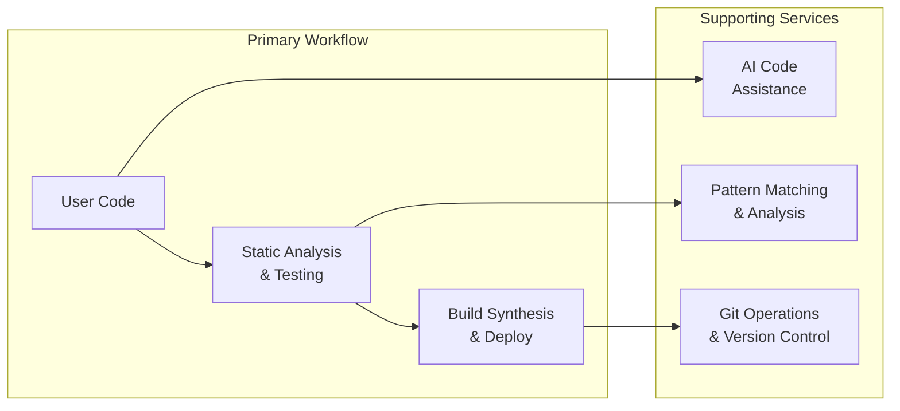
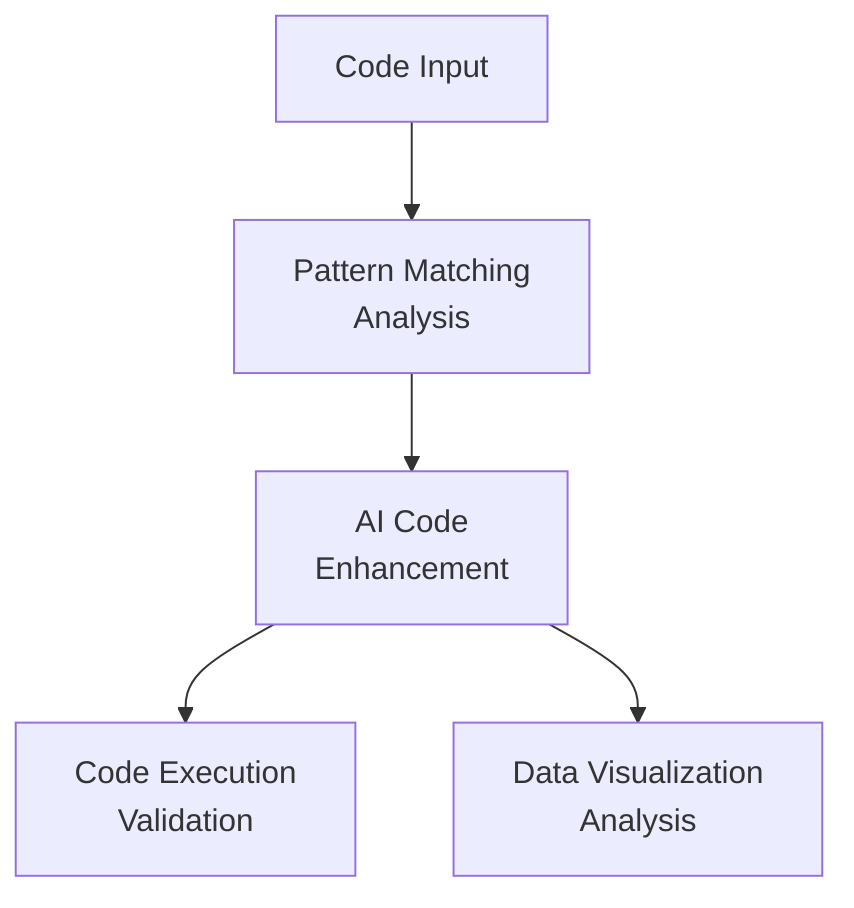
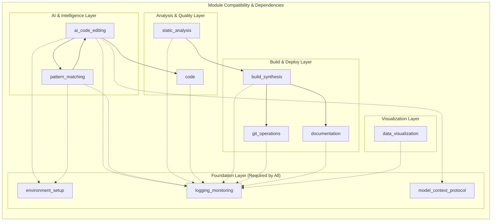

# 🔗 Codomyrmex Module Relationships & Interdependencies

This document provides a comprehensive overview of how Codomyrmex modules interact with each other, their dependencies, and data flow patterns.

## 📋 Module Overview

| Module | Primary Role | Key Dependencies | Consumes From | Provides To |
|--------|-------------|------------------|---------------|-------------|
| **`environment_setup`** | Environment validation & dependency management | System packages | None | All modules |
| **`logging_monitoring`** | Centralized logging framework | None | All modules | All modules |
| **`model_context_protocol`** | AI agent communication standard | JSON Schema | AI modules | AI modules |
| **`terminal_interface`** | Rich terminal interactions | Rich, prompt-toolkit | None | Application modules |
| **`config_management`** | Configuration management | PyYAML, configparser | logging_monitoring | All modules |
| **`database_management`** | Data persistence | SQLAlchemy, asyncpg | logging_monitoring | All modules |
| **`llm`** | LLM infrastructure | OpenAI, Anthropic, Ollama | logging_monitoring, model_context_protocol | AI modules |
| **`performance`** | Performance monitoring | psutil, cProfile | logging_monitoring | All modules |
| **`metrics`** | Metrics collection and reporting | prometheus_client | logging_monitoring | All modules |
| **`coding`** | Code execution & review | subprocess, security | logging_monitoring | All modules |
| **`data_visualization`** | Charting and plotting utilities | matplotlib, seaborn | logging_monitoring | All modules |
| **`static_analysis`** | Code quality and security analysis | pylint, flake8, bandit | logging_monitoring | build_synthesis, security |
| **`pattern_matching`** | Code analysis and pattern recognition | cased/kit | logging_monitoring, environment_setup | All modules |
| **`security`** | Security scanning and threat modeling | bandit, semgrep, cryptography | logging_monitoring, static_analysis | All modules |
| **`scrape`** | Web scraping and content extraction | BeautifulSoup, requests | logging_monitoring | All modules |
| **`documents`** | Document processing and management | parsers, extractors | logging_monitoring | All modules |
| **`cache`** | Caching infrastructure | redis, memory | logging_monitoring | All modules |
| **`compression`** | Data compression | zlib, gzip, lz4 | None | All modules |
| **`encryption`** | Encryption utilities | cryptography | logging_monitoring | All modules |
| **`networking`** | Network utilities | aiohttp, requests | logging_monitoring | All modules |
| **`serialization`** | Data serialization | json, yaml, msgpack | None | All modules |
| **`validation`** | Data validation | pydantic, jsonschema | logging_monitoring | All modules |
| **`build_synthesis`** | Build automation and scaffolding | build tools | static_analysis, logging_monitoring | All modules |
| **`git_operations`** | Git workflow automation | GitPython | logging_monitoring | All modules |
| **`documentation`** | Documentation generation | Docusaurus | All modules | All modules |
| **`api`** | API infrastructure | OpenAPI, FastAPI | logging_monitoring, static_analysis | All modules |
| **`ci_cd_automation`** | CI/CD pipeline management | Docker, Kubernetes | logging_monitoring, build_synthesis, containerization | All modules |
| **`containerization`** | Container management | Docker, Kubernetes | logging_monitoring | ci_cd_automation, build_synthesis |
| **`logistics`** | Orchestration and scheduling | schedulers | logging_monitoring, all modules | Application modules |
| **`cloud`** | Cloud integrations | cloud SDKs | logging_monitoring, config_management | All modules |
| **`auth`** | Authentication | OAuth, JWT | logging_monitoring | All modules |
| **`system_discovery`** | System exploration | introspection | logging_monitoring | Application modules |
| **`cli`** | Command-line interface | click, argparse | logging_monitoring, all modules | Users |
| **`website`** | Website generation | Jinja2, Flask | logging_monitoring | Users |
| **`module_template`** | Module creation template | None | None | Developers |
| **`events`** | Event system and pub/sub | asyncio | logging_monitoring | All modules |
| **`plugin_system`** | Plugin architecture | importlib | logging_monitoring | All modules |
| **`agents`** | Agentic framework integrations | AI providers | logging_monitoring, llm | All modules |
| **`ide`** | IDE integrations | IDE APIs | logging_monitoring, agents | Developers |
| **`cerebrum`** | Case-based reasoning | numpy, scipy | logging_monitoring | AI modules |
| **`fpf`** | Functional Programming Framework | None | logging_monitoring | All modules |
| **`skills`** | Skills framework | None | logging_monitoring, agents | All modules |
| **`spatial`** | 3D/4D modeling and visualization | Open3D, Trimesh | logging_monitoring | Specialized use cases |
| **`physical_management`** | Physical system simulation | Physics engines | logging_monitoring | Specialized use cases |
| **`utils`** | Common utilities | None | None | All modules |
| **`tools`** | Utility tools | None | logging_monitoring | All modules |
| **`templating`** | Template engine | Jinja2 | None | All modules |
| **`tests`** | Test infrastructure | pytest | All modules | Developers |

## 🔄 Core Data Flow Patterns

### **1. Development Workflow Integration**



### **2. AI-Powered Development Cycle**



**Related Documentation**:
- **[System Architecture](../project/architecture.md)**: Overall system design
- **[Module Overview](./overview.md)**: Module architecture principles
- **[API Reference](../reference/api.md)**: Module APIs and integration patterns

## 🔗 Detailed Module Relationships

### **🔧 Foundation Modules (Used by All)**

#### **`environment_setup` → All Modules**
- **Provides**: Dependency validation, environment variables, API key management
- **Integration Points**:
  ```python
  # Every module imports this for setup validation
  from codomyrmex.environment_setup.env_checker import ensure_dependencies_installed

  # Called at module initialization
  ensure_dependencies_installed()
  ```

#### **`logging_monitoring` → All Modules**
- **Provides**: Standardized logging interface, structured logging
- **Integration Points**:
  ```python
  # Universal logging interface across all modules
  from codomyrmex.logging_monitoring.logger_config import get_logger
  logger = get_logger(__name__)

  # Consistent log format across entire project
  logger.info("Module operation completed")
  ```

#### **`model_context_protocol` → AI Modules**
- **Provides**: Standardized communication with AI agents
- **Integration Points**:
  ```python
  # AI modules implement MCP tools
  from codomyrmex.model_context_protocol.mcp_schemas import MCPToolCall, MCPToolResult

  # Standardized request/response format
  tool_call = MCPToolCall(tool_name="ai_code_editing.generate_code", arguments={...})
  ```

### **🤖 AI & Intelligence Modules**

#### **`ai_code_editing` Integration Points**
- **Consumes**: `logging_monitoring`, `environment_setup`, `model_context_protocol`
- **Provides**: Code generation, refactoring, summarization
- **Cross-Module Usage**:
  ```python
  # Used by pattern_matching for code understanding
  from codomyrmex.agents.ai_code_editing.ai_code_helpers import generate_code

  # Used by documentation for example generation
  result = generate_code("Create a hello world function", "python")
  ```

#### **`pattern_matching` Integration Points**
- **Consumes**: `logging_monitoring`, `environment_setup`, `ai_code_editing`
- **Provides**: Code analysis, pattern recognition, dependency mapping
- **Cross-Module Usage**:
  ```python
  # Used by static_analysis for comprehensive analysis
  from codomyrmex.pattern_matching.run_codomyrmex_analysis import analyze_repository_path

  # Comprehensive analysis workflow
  analysis_results = analyze_repository_path(repo_path="./src", output_dir="./analysis")
  ```

### **🔍 Analysis & Quality Modules**

#### **`static_analysis` Integration Points**
- **Consumes**: `logging_monitoring`
- **Provides**: Code quality metrics, security scanning, linting
- **Cross-Module Usage**:
  ```python
  # Used by build_synthesis for quality gates
  from codomyrmex.static_analysis.pyrefly_runner import run_pyrefly_analysis

  # Quality check before build
  issues = run_pyrefly_analysis(target_paths=["src/"], project_root=".")
  ```

#### **`code` Integration Points**
- **Consumes**: `logging_monitoring`
- **Provides**: Code execution, sandboxing, review, and monitoring
- **Submodules**: `execution`, `sandbox`, `review`, `monitoring`
- **Cross-Module Usage**:
  ```python
  # Used by ai_code_editing for code validation
  from codomyrmex.coding import execute_code

  # Test generated code before applying
  result = execute_code(language="python", code="print('test')")
  
  # Code review integration
  from codomyrmex.coding.review import CodeReviewer, analyze_file
  reviewer = CodeReviewer()
  results = analyze_file("path/to/file.py")
  ```

### **🏗️ Build & Deployment Modules**

#### **`build_synthesis` Integration Points**
- **Consumes**: `static_analysis`, `logging_monitoring`, `git_operations`
- **Provides**: Automated building, code scaffolding, deployment
- **Cross-Module Usage**:
  ```python
  # Orchestrates multiple modules for complete build pipeline
  from codomyrmex.build_synthesis.build_orchestrator import orchestrate_build_pipeline
  from codomyrmex.static_analysis.pyrefly_runner import run_pyrefly_analysis

  # Complete build workflow
  build_config = {"target": "python_wheel", "clean": True}
  result = orchestrate_build_pipeline(build_config)

  # Quality-gated build process
  analysis = run_pyrefly_analysis(paths, root)
  if not analysis["issues"]:
      build_result = trigger_build("production")
  ```

#### **`git_operations` Integration Points**
- **Consumes**: `logging_monitoring`
- **Provides**: Git workflow automation, repository management
- **Cross-Module Usage**:
  ```python
  # Used by build_synthesis for version control integration
  from git_operations.git_wrapper import create_branch, commit_changes

  # Automated release workflow
  create_branch("release/v1.0.0")
  commit_changes("Release version 1.0.0")
  ```

### **📊 Visualization & Reporting Modules**

#### **`data_visualization` Integration Points**
- **Consumes**: `logging_monitoring`
- **Provides**: Charts, plots, data visualization
- **Cross-Module Usage**:
  ```python
  # Used by pattern_matching for analysis visualization
  from data_visualization.plotter import create_heatmap
  from pattern_matching.run_codomyrmex_analysis import analyze_repository_path

  # Visualize analysis results
  analysis = analyze_repository_path(path, config)
  create_heatmap(analysis["dependency_matrix"], title="Code Dependencies")
  ```

#### **`documentation` Integration Points**
- **Consumes**: All modules (meta-module)
- **Provides**: Comprehensive documentation website, API references
- **Cross-Module Usage**:
  ```python
  # Generates documentation from all modules
  from documentation.documentation_website import build_static_site

  # Auto-generate docs from module APIs
  build_static_site()
  ```

## 🔄 Common Integration Patterns

### **1. Initialization Sequence**
```python
# Standard module initialization pattern used across all modules
from environment_setup.env_checker import ensure_dependencies_installed
from logging_monitoring import get_logger

# 1. Validate environment
ensure_dependencies_installed()

# 2. Setup logging
logger = get_logger(__name__)

# 3. Module-specific initialization
# ... module specific setup ...
```

### **2. Error Handling Chain**
```python
# Consistent error handling across modules
try:
    result = perform_operation()
    logger.info(f"Operation completed: {result}")
except ModuleSpecificError as e:
    logger.error(f"Module error: {e}")
    raise
except Exception as e:
    logger.error(f"Unexpected error: {e}", exc_info=True)
    raise
```

### **3. Configuration Sharing**
```python
# Environment variables shared across modules
import os
from environment_setup.env_checker import check_and_setup_env_vars

# Ensure .env is loaded
check_and_setup_env_vars("/path/to/project")

# Shared configuration
OPENAI_API_KEY = os.getenv("OPENAI_API_KEY")
LOG_LEVEL = os.getenv("LOG_LEVEL", "INFO")
```

## 📋 Module Compatibility Matrix



### **Dependency Matrix Table**

**Key Modules Dependency Matrix** (showing core module dependencies):

| Consumer Module | environment_setup | logging_monitoring | model_context_protocol | ai_code_editing | data_visualization | static_analysis | pattern_matching | code | build_synthesis | git_operations | documentation |
|-----------------|-------------------|-------------------|-------------------------|----------------|-------------------|-----------------|------------------|------------------------|-----------------|---------------|---------------|
| **environment_setup** | ✅ Self | ❌ | ❌ | ❌ | ❌ | ❌ | ❌ | ❌ | ❌ | ❌ | ❌ |
| **logging_monitoring** | ❌ | ✅ Self | ❌ | ❌ | ❌ | ❌ | ❌ | ❌ | ❌ | ❌ | ❌ |
| **model_context_protocol** | ❌ | ❌ | ✅ Self | ❌ | ❌ | ❌ | ❌ | ❌ | ❌ | ❌ | ❌ |
| **terminal_interface** | ❌ | ❌ | ❌ | ❌ | ❌ | ❌ | ❌ | ❌ | ❌ | ❌ | ❌ |
| **config_management** | ❌ | ✅ | ❌ | ❌ | ❌ | ❌ | ❌ | ❌ | ❌ | ❌ | ❌ |
| **database_management** | ❌ | ✅ | ❌ | ❌ | ❌ | ❌ | ❌ | ❌ | ❌ | ❌ | ❌ |
| **language_models** | ❌ | ✅ | ✅ | ❌ | ❌ | ❌ | ❌ | ❌ | ❌ | ❌ | ❌ |
| **performance** | ❌ | ✅ | ❌ | ❌ | ❌ | ❌ | ❌ | ❌ | ❌ | ❌ | ❌ |
| **ai_code_editing** | ✅ | ✅ | ✅ | ✅ Self | ❌ | ❌ | ✅ | ✅ | ❌ | ❌ | ✅ |
| **data_visualization** | ❌ | ✅ | ❌ | ❌ | ✅ Self | ❌ | ✅ | ❌ | ❌ | ❌ | ✅ |
| **static_analysis** | ❌ | ✅ | ❌ | ❌ | ❌ | ✅ Self | ✅ | ❌ | ✅ | ❌ | ✅ |
| **pattern_matching** | ✅ | ✅ | ❌ | ✅ | ❌ | ❌ | ✅ Self | ❌ | ❌ | ❌ | ✅ |
| **code** | ❌ | ✅ | ❌ | ✅ | ❌ | ❌ | ❌ | ✅ Self | ✅ | ❌ | ✅ |
| **code_review** | ❌ | ✅ | ❌ | ✅ | ❌ | ✅ | ❌ | ❌ | ❌ | ❌ | ✅ |
| **security_audit** | ❌ | ✅ | ❌ | ❌ | ❌ | ✅ | ❌ | ❌ | ❌ | ❌ | ✅ |
| **llm/ollama** | ❌ | ✅ | ✅ | ❌ | ❌ | ❌ | ❌ | ❌ | ❌ | ❌ | ❌ |
| **build_synthesis** | ✅ | ✅ | ❌ | ✅ | ✅ | ✅ | ✅ | ✅ | ✅ Self | ✅ | ✅ |
| **git_operations** | ❌ | ✅ | ❌ | ❌ | ❌ | ❌ | ❌ | ❌ | ✅ | ✅ Self | ✅ |
| **documentation** | ✅ | ✅ | ✅ | ✅ | ✅ | ✅ | ✅ | ✅ | ✅ | ✅ | ✅ Self |
| **api_documentation** | ❌ | ✅ | ❌ | ❌ | ❌ | ✅ | ❌ | ❌ | ❌ | ❌ | ✅ |
| **ci_cd_automation** | ❌ | ✅ | ❌ | ❌ | ❌ | ❌ | ❌ | ❌ | ✅ | ❌ | ✅ |
| **containerization** | ❌ | ✅ | ❌ | ❌ | ❌ | ❌ | ❌ | ❌ | ❌ | ❌ | ❌ |
| **project_orchestration** | ✅ | ✅ | ❌ | ✅ | ✅ | ✅ | ✅ | ✅ | ✅ | ✅ | ✅ |
| **system_discovery** | ❌ | ✅ | ❌ | ❌ | ❌ | ❌ | ❌ | ❌ | ❌ | ❌ | ❌ |
| **cli** | ✅ | ✅ | ❌ | ✅ | ✅ | ✅ | ✅ | ✅ | ✅ | ✅ | ✅ |
| **module_template** | ❌ | ❌ | ❌ | ❌ | ❌ | ❌ | ❌ | ❌ | ❌ | ❌ | ❌ |
| **spatial** | ❌ | ✅ | ❌ | ❌ | ❌ | ❌ | ❌ | ❌ | ❌ | ❌ | ❌ |
| **physical_management** | ❌ | ✅ | ❌ | ❌ | ❌ | ❌ | ❌ | ❌ | ❌ | ❌ | ❌ |

**Legend:**
- ✅ **Required**: Module cannot function without this dependency
- 🔄 **Optional**: Module can use this for enhanced functionality
- ❌ **None**: No direct dependency

**Related Documentation:**
- **[System Architecture](../project/architecture.md)**: Overall system design and principles
- **[Module Overview](./overview.md)**: Module architecture and organization
- **[API Reference](../reference/api.md)**: Module APIs and programmatic interfaces
- **[Contributing Guide](../project/contributing.md)**: Adding new modules and maintaining dependencies

## 🚀 Quick Integration Examples

### **Adding AI Enhancement to Any Module**
```python
from ai_code_editing.ai_code_helpers import generate_code_snippet
from model_context_protocol.mcp_schemas import MCPToolCall

def enhance_code_with_ai(code_snippet, enhancement_request):
    """Add AI enhancement capability to any module"""
    result = generate_code_snippet(
        prompt=f"Enhance this code: {enhancement_request}",
        language="python",
        context_code=code_snippet
    )
    return result
```

### **Adding Visualization to Analysis Results**
```python
from data_visualization.plotter import create_bar_chart
from static_analysis.pyrefly_runner import run_pyrefly_analysis

def visualize_analysis_results(target_paths, project_root):
    """Create visual representation of analysis results"""
    analysis = run_pyrefly_analysis(target_paths, project_root)

    # Extract issue counts by severity
    severity_counts = {}
    for issue in analysis["issues"]:
        severity = issue.get("severity", "unknown")
        severity_counts[severity] = severity_counts.get(severity, 0) + 1

    # Create visualization
    create_bar_chart(
        categories=list(severity_counts.keys()),
        values=list(severity_counts.values()),
        title="Code Analysis Issues by Severity",
        x_label="Severity Level",
        y_label="Issue Count",
        output_path="analysis_report.png"
    )
```

### **Creating a Complete Workflow**
```python
from environment_setup.env_checker import ensure_dependencies_installed
from logging_monitoring import get_logger
from ai_code_editing.ai_code_helpers import generate_code_snippet
from code.code_executor import execute_code
from data_visualization.plotter import create_line_plot

def complete_development_workflow():
    """Complete workflow using multiple modules"""
    # 1. Setup
    ensure_dependencies_installed()
    logger = get_logger(__name__)

    # 2. Generate code with AI
    code_result = generate_code_snippet(
        "Create a function to calculate fibonacci numbers",
        "python"
    )

    # 3. Test the generated code
    if code_result["status"] == "success":
        exec_result = execute_code(
            "python",
            code_result["generated_code"],
            stdin="10"
        )

        # 4. Visualize results
        create_line_plot(
            x_data=list(range(10)),
            y_data=[int(x) for x in exec_result["output"].split()],
            title="Fibonacci Sequence",
            output_path="fibonacci_plot.png"
        )

        logger.info("Complete workflow executed successfully")
    else:
        logger.error("Code generation failed")
```

This comprehensive integration guide shows how Codomyrmex modules work together to create powerful, interconnected development workflows.


## Navigation Links

- **Parent**: [docs](../README.md)
- **Module Index**: [AGENTS.md](../AGENTS.md)
- **Home**: [Repository Root](../../README.md)
