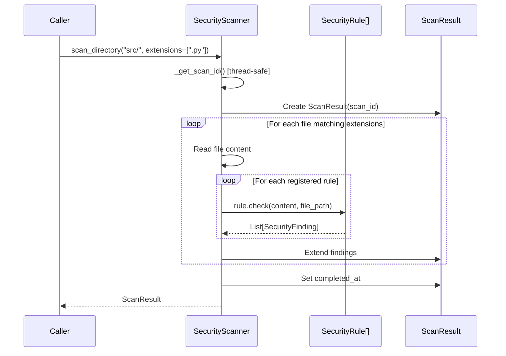

# Security Module - Technical Overview

**Version**: v0.1.0 | **Status**: Active | **Last Updated**: February 2026

## Architecture

The Security module is organized into 10 submodules with a central `__init__.py` that re-exports all public APIs:

```mermaid
graph TB
    INIT["security/__init__.py<br/>Master Exports"]

    SCAN["scanning/<br/>SecurityScanner<br/>PatternRule, ScanResult"]
    SEC["secrets/<br/>SecretScanner<br/>SecretVault, SecretPatterns"]
    AUD["audit/<br/>AuditLogger<br/>AuditStore (ABC)"]
    COMP["compliance/<br/>ComplianceChecker<br/>ControlChecker (ABC)"]

    DIG["digital/<br/>8 component files<br/>VulnerabilityScanner, EncryptionManager, etc."]
    PHY["physical/<br/>5 component files<br/>AccessControlSystem, AssetInventory, etc."]
    COG["cognitive/<br/>5 component files<br/>SocialEngineeringDetector, PhishingAnalyzer, etc."]
    THY["theory/<br/>6 component files<br/>SecurityPrinciple, ThreatModel, RiskAssessor, etc."]
    AIS["ai_safety/<br/>AISafetyMonitor<br/>ActiveDefense, RabbitHole"]
    GOV["governance/<br/>4 component files<br/>Contract, PolicyEngine, DisputeResolver"]

    INIT --> SCAN
    INIT --> SEC
    INIT --> AUD
    INIT --> COMP
    INIT -->|"try/except"| DIG
    INIT -->|"try/except"| PHY
    INIT -->|"try/except"| COG
    INIT -->|"try/except"| THY
    INIT -->|"try/except"| AIS
    INIT --> GOV
```



## Conditional Import Pattern

The top-level `__init__.py` uses a consistent pattern for importing from each submodule:

```python
# Direct imports (always available - no external dependencies)
from . import scanning
from . import secrets
from . import compliance
from . import audit

# Conditional imports (may have external dependencies)
try:
    from .digital import (
        VulnerabilityScanner,
        scan_vulnerabilities,
        # ... 30+ exports
    )
    DIGITAL_AVAILABLE = True
except ImportError:
    DIGITAL_AVAILABLE = False

# __all__ is built dynamically
__all__ = ['audit', 'compliance', 'secrets', 'scanning']
if DIGITAL_AVAILABLE:
    __all__.extend([...])
```

The 4 core submodules (scanning, secrets, audit, compliance) are always imported directly. The 4 domain submodules (digital, physical, cognitive, theory) use conditional imports because their internal component files may depend on optional packages.

## Data Flow: SecurityScanner Scan Lifecycle



## Enum Catalogs

### scanning.Severity (5 values)
`CRITICAL` | `HIGH` | `MEDIUM` | `LOW` | `INFO`

### scanning.FindingType (10 values)
`SQL_INJECTION` | `XSS` | `PATH_TRAVERSAL` | `COMMAND_INJECTION` | `HARDCODED_SECRET` | `INSECURE_RANDOM` | `WEAK_CRYPTO` | `EXPOSED_DEBUG` | `INSECURE_DESERIALIZATION` | `OPEN_REDIRECT`

### secrets.SecretType (8 values)
`API_KEY` | `AWS_KEY` | `GITHUB_TOKEN` | `PRIVATE_KEY` | `PASSWORD` | `JWT` | `DATABASE_URL` | `GENERIC`

### secrets.SecretSeverity (4 values)
`LOW` | `MEDIUM` | `HIGH` | `CRITICAL`

### audit.AuditEventType (11 values)
`AUTH_LOGIN` | `AUTH_LOGOUT` | `AUTH_FAILED` | `DATA_ACCESS` | `DATA_CREATE` | `DATA_UPDATE` | `DATA_DELETE` | `PERMISSION_CHANGE` | `CONFIG_CHANGE` | `SYSTEM_ERROR` | `ADMIN_ACTION`

### audit.AuditSeverity (5 values)
`DEBUG` | `INFO` | `WARNING` | `ERROR` | `CRITICAL`

### compliance.ComplianceFramework (6 values)
`SOC2` | `HIPAA` | `GDPR` | `PCI_DSS` | `ISO27001` | `CUSTOM`

### compliance.ControlStatus (5 values)
`PASSED` | `FAILED` | `PARTIAL` | `NOT_APPLICABLE` | `UNKNOWN`

## Key Data Models

### scanning.SecurityFinding
```python
@dataclass
class SecurityFinding:
    id: str
    finding_type: FindingType
    severity: Severity
    title: str
    description: str
    file_path: str = ""
    line_number: int = 0
    code_snippet: str = ""        # Max 100 chars from matched line
    remediation: str = ""
    confidence: float = 1.0
    metadata: Dict[str, Any] = field(default_factory=dict)
```

### scanning.ScanResult
```python
@dataclass
class ScanResult:
    scan_id: str
    started_at: datetime
    completed_at: Optional[datetime]
    findings: List[SecurityFinding]
    files_scanned: int = 0
    errors: List[str]
    # Properties: is_complete, finding_count, critical_count, high_count
    # Methods: findings_by_severity(severity), to_dict()
```

### secrets.DetectedSecret
```python
@dataclass
class DetectedSecret:
    secret_type: SecretType
    severity: SecretSeverity
    location: Tuple[int, int]      # (start, end) positions
    redacted_value: str
    line_number: Optional[int]
    file_path: Optional[str]
    context: str = ""
    confidence: float = 1.0
    # Property: is_high_severity -> bool
```

### secrets.ScanResult
```python
@dataclass
class ScanResult:
    secrets_found: List[DetectedSecret]
    files_scanned: int = 0
    scan_time_ms: float = 0.0
    # Properties: has_secrets, high_severity_count
```

### audit.AuditEvent
```python
@dataclass
class AuditEvent:
    id: str
    event_type: AuditEventType
    action: str
    actor: str = "system"
    resource: str = ""
    resource_id: str = ""
    severity: AuditSeverity = AuditSeverity.INFO
    ip_address: str = ""
    user_agent: str = ""
    details: Dict[str, Any]
    timestamp: datetime
    # Property: signature -> str (SHA-256 first 16 chars)
    # Methods: to_dict(), to_json()
```

### compliance.Control
```python
@dataclass
class Control:
    id: str
    title: str
    description: str
    framework: ComplianceFramework
    category: str = ""
    requirements: List[str]
    metadata: Dict[str, Any]
```

### compliance.ComplianceReport
```python
@dataclass
class ComplianceReport:
    report_id: str
    framework: ComplianceFramework
    results: List[ControlResult]
    created_at: datetime
    metadata: Dict[str, Any]
    # Properties: total_controls, passed_controls, failed_controls, compliance_score (0-100)
```

## Design Decisions

### Why 10 Submodules?
The security domain naturally decomposes into:
- **4 core capabilities** (scanning, secrets, audit, compliance) that have no external dependencies and are self-contained
- **4 domain areas** (digital, physical, cognitive, theory) that may require external packages and contain multiple component files
- **2 specialized submodules** (ai_safety for AI-specific security, governance for policy and contracts)

This separation ensures the core capabilities are always available while domain-specific features gracefully degrade.

### Singleton Pattern for Physical Security
The physical security submodule components (e.g., `AccessControlSystem`) may use a global singleton pattern to maintain consistent state across the application (shared access control lists, asset inventories).

### ABC for Extensibility
Three abstract base classes enable custom implementations:
- `SecurityRule` - allows teams to add project-specific vulnerability detection rules
- `AuditStore` - allows teams to implement database-backed or cloud audit storage
- `ControlChecker` - allows teams to implement custom compliance verification logic

### XOR Vault Encryption
The `SecretVault` uses XOR encryption with SHA-256 key derivation. This is explicitly **not production-grade** (noted in source comments) and exists for development/testing scenarios. Production deployments should use proper encryption (e.g., `cryptography.fernet`).

### Shannon Entropy
The secrets module uses high-entropy string detection (pattern: 40+ base64 chars) as a heuristic for generic secret detection, with a low confidence score (0.4) to minimize false positives.

## Test Coverage Map

| Submodule | Test File | Status |
|-----------|-----------|--------|
| scanning | `tests/unit/security/scanning/test_scanning.py` | Covered |
| secrets | `tests/unit/security/secrets/test_secrets.py` | Covered |
| audit | `tests/unit/security/audit/test_audit.py` | Covered |
| compliance | `tests/unit/security/compliance/test_compliance.py` | Covered |
| digital | `tests/unit/security/test_security_digital.py` | Covered |
| physical | `tests/unit/security/test_security_physical.py` | Covered |
| cognitive | `tests/unit/security/test_security_cognitive.py` | Covered |
| theory | `tests/unit/security/test_security_theory.py` | Covered |
| ai_safety | (no dedicated test file) | Planned |
| governance | (no dedicated test file) | Planned |

## Navigation

- **Parent**: [README.md](README.md)
- **SPEC**: [SPEC.md](SPEC.md)
- **Index**: [index.md](index.md)
- **Source**: [`src/codomyrmex/security/`](../../../src/codomyrmex/security/)
- **Root**: [../../../README.md](../../../README.md)
