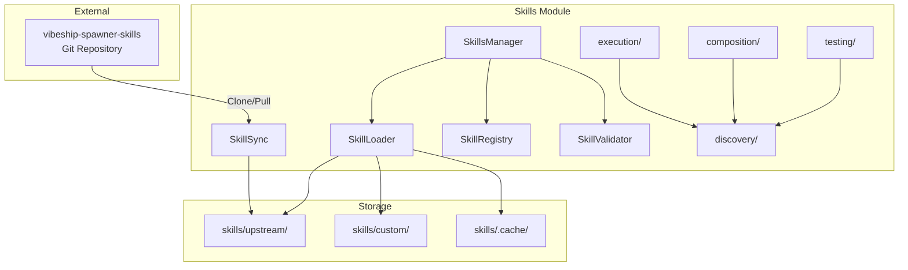

# Skills Module Documentation

**Version**: v1.0.0 | **Status**: Active | **Last Updated**: February 2026

## Overview

The skills module provides integration with the [vibeship-spawner-skills](https://github.com/vibeforge1111/vibeship-spawner-skills) repository and a programmatic skill discovery framework. It manages 462+ YAML-based skills across 35 categories with upstream synchronization, custom overrides, and caching, alongside a Python framework for defining, composing, and executing skills programmatically.

## Features

- **Upstream Sync** -- Clone and pull the vibeship-spawner-skills git repository
- **YAML Skill Management** -- Load, merge, validate, and cache skill definitions from YAML files
- **Custom Override System** -- Custom skills in `skills/custom/` override upstream skills with the same path
- **Indexing and Search** -- Full-text and regex search across skill names, categories, descriptions, and patterns
- **Programmatic Discovery** -- Define skills as Python classes/functions with ABC, decorators, and auto-registration
- **Execution Engine** -- Execute skills with error handling, timeouts, and sequential chaining
- **Composition Patterns** -- Chain, parallelize, and conditionally branch skill execution
- **Testing Framework** -- Run test cases, validate metadata, and benchmark skill performance
- **Marketplace** -- Discover and install skills from configurable remote sources
- **Versioning** -- Track versions and check semver compatibility
- **Permissions** -- Grant/revoke action-level access control for skills

## Architecture



## Quick Start

```python
from codomyrmex.skills import get_skills_manager

manager = get_skills_manager(auto_sync=True)
manager.initialize()

# Search and retrieve skills
results = manager.search_skills("authentication")
skill = manager.get_skill("backend", "api-design")

# Add a custom override
manager.add_custom_skill("backend", "api-design", {
    "description": "Custom patterns",
    "patterns": [{"name": "GraphQL", "description": "GraphQL-first"}],
})
```

### Programmatic Skills

```python
from codomyrmex.skills.discovery import skill, SkillCategory, SkillRegistry

registry = SkillRegistry()

@skill(name="summarize", category=SkillCategory.REASONING, registry=registry)
def summarize(text: str, max_length: int = 100) -> str:
    """Summarize text."""
    return text[:max_length]

result = registry.execute(summarize.metadata.id, text="Hello world", max_length=5)
```

## Core Components

| Component | Description |
|---|---|
| **SkillsManager** | Main interface for all skill operations |
| **SkillLoader** | YAML loading with upstream/custom merge logic |
| **SkillSync** | Git-based synchronization with upstream repository |
| **SkillRegistry** | Indexing, categorization, and search |
| **SkillValidator** | Schema validation for skill YAML files |

## Submodules

| Submodule | Description |
|---|---|
| **discovery/** | ABC-based skill framework with `@skill` decorator, `FunctionSkill`, metadata, and runtime registry |
| **execution/** | `SkillExecutor` with error handling, timeouts, chaining, and execution logging |
| **composition/** | `SkillComposer` for chain, parallel, and conditional skill composition |
| **testing/** | `SkillTestRunner` for test cases, metadata validation, and benchmarking |
| **marketplace/** | `SkillMarketplace` for remote source discovery and installation |
| **versioning/** | `SkillVersionManager` for version tracking and compatibility |
| **permissions/** | `SkillPermissionManager` for action-level access control |

## Configuration

| Option | Default | Description |
|---|---|---|
| `skills_dir` | Module `skills/` dir | Base directory for skill storage |
| `upstream_repo` | vibeship-spawner-skills URL | Upstream repository URL |
| `upstream_branch` | `main` | Branch to track |
| `auto_sync` | `false` | Auto-sync on initialization |
| `cache_enabled` | `true` | Enable merged skill caching |

## Directory Structure

```
skills/
├── upstream/          # Cloned upstream content (35 categories)
├── custom/            # User custom skills (override upstream)
└── .cache/            # Merged/cached skills
```

## Navigation

- **Source**: [src/codomyrmex/skills/](../../../src/codomyrmex/skills/)
- **API Specification**: [src/codomyrmex/skills/API_SPECIFICATION.md](../../../src/codomyrmex/skills/API_SPECIFICATION.md)
- **MCP Tools**: [src/codomyrmex/skills/MCP_TOOL_SPECIFICATION.md](../../../src/codomyrmex/skills/MCP_TOOL_SPECIFICATION.md)
- **Functional Spec**: [SPEC.md](SPEC.md)
- **Agent Guide**: [AGENTS.md](AGENTS.md)
- **Parent Directory**: [modules](../README.md)
- **Project Root**: ../../../README.md
