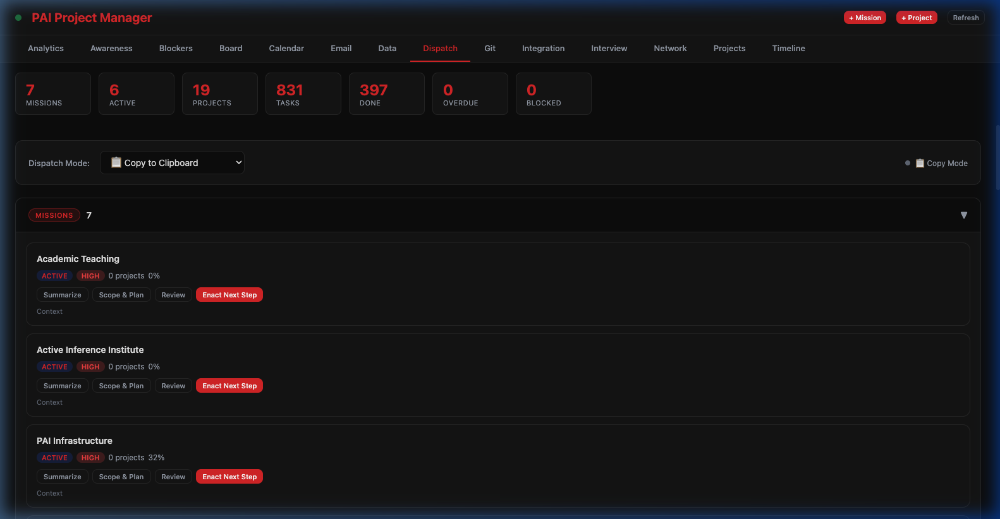
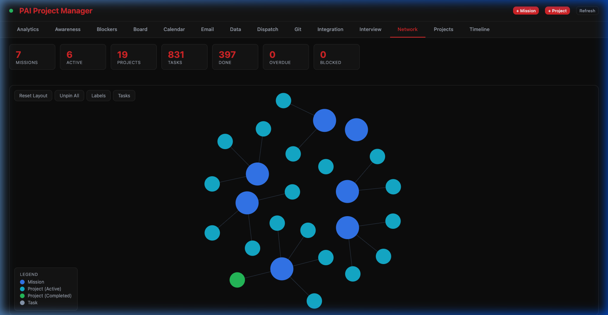

# Codomyrmex Agents — docs/pai

**Version**: v1.0.8 | **Status**: Active | **Last Updated**: March 2026

## Purpose

Documentation module for the PAI-Codomyrmex integration. Provides architecture references, tool inventories, API documentation, and workflow guides. The PAI Dashboard (port 8889) is a Codomyrmex-integrated fork of [danielmiessler/Personal_AI_Infrastructure](https://github.com/danielmiessler/Personal_AI_Infrastructure).

## Active Components

| File | Description | Screenshot |
|------|-------------|------------|
| `README.md` | Index page with full screenshot gallery | All 8 tabs |
| `architecture.md` | MCP bridge architecture and trust model | Analytics, Network, Integration |
| `tools-reference.md` | Complete tool inventory (22 static + dynamic) | Git, Email |
| `api-reference.md` | Python API reference (PAIBridge, TrustRegistry) | Analytics |
| `workflows.md` | Workflow documentation and Algorithm mapping | Dispatch, Board, Calendar |
| `screenshots/` | PAI Dashboard interface screenshots (8 tabs) | — |

## Visual Reference

The PAI Dispatch tab demonstrates Algorithm phase execution with per-mission action buttons:

The Network tab shows the agent's awareness of mission→project→task relationships:

## Agent Coordination Rules

When PAI sub-agents (Engineer, Architect, QATester, etc.) use codomyrmex tools from this docs folder:

### Which Agent Uses What

| PAI Agent Type | Primary Docs | Primary Tools |
|----------------|-------------|---------------|
| **Engineer** | `tools-reference.md`, `api-reference.md` | `write_file`, `run_command`, `run_tests`, `call_module_function` |
| **Architect** | `architecture.md`, `tools-reference.md` | `list_modules`, `module_info`, `list_module_functions`, `pai_status` |
| **QATester** | `workflows.md`, `api-reference.md` | `run_tests`, `scan_vulnerabilities`, `validate_schema` |
| **Researcher** | `README.md`, `architecture.md` | `read_file`, `search_documents`, `get_module_readme` |
| **General-purpose** | All docs | All safe tools (post-`/codomyrmexVerify`) |

### Trust Protocol for Agents

1. All agents start UNTRUSTED — read-only tools work immediately
2. Before any write/execute operation: run `/codomyrmexVerify` (promotes ~403 safe tools to VERIFIED)
3. For destructive tools: run `/codomyrmexTrust` per tool name explicitly
4. Trust persists to `~/.codomyrmex/trust_ledger.json` across the session
5. If unsure of trust level: call `GET /api/trust/status` or `codomyrmex.pai_status`

### Boundary Rules

- **docs/pai/**: Read-only documentation — never write to these files from agent code
- **src/codomyrmex/agents/pai/**: Implementation — modify only via explicit user request
- **~/.claude/**: PAI private config — codomyrmex tools read but never write here
- **~/.codomyrmex/**: Trust ledger — only trust_gateway.py writes here

### Inter-Agent Communication

Agents do not communicate directly. PAI orchestrates via:
- Filesystem: `MEMORY/WORK/<task>/` for handoffs
- MCP protocol: Codomyrmex tools shared across all agents in a session
- Trust ledger: Shared trust state persists across agent calls in same session

## Operating Contracts

1. **Reference only**: This folder contains documentation, not executable code
2. **No duplication**: Expands on the root PAI.md bridge doc, does not duplicate it
3. **Synchronized**: Counts and versions match the implementation in `src/codomyrmex/agents/pai/`
4. **Visual-first**: Every doc embeds relevant interface screenshots for context
5. **Trust-aware**: Agents respect the 3-tier trust model before any destructive operation

## Navigation Links

- **README**: [README.md](README.md)
- **SPEC**: [SPEC.md](SPEC.md)
- **PAI**: [PAI.md](PAI.md)
- **Parent**: [docs/](../)
- **Root PAI Bridge**: [../../PAI.md](../../PAI.md)
