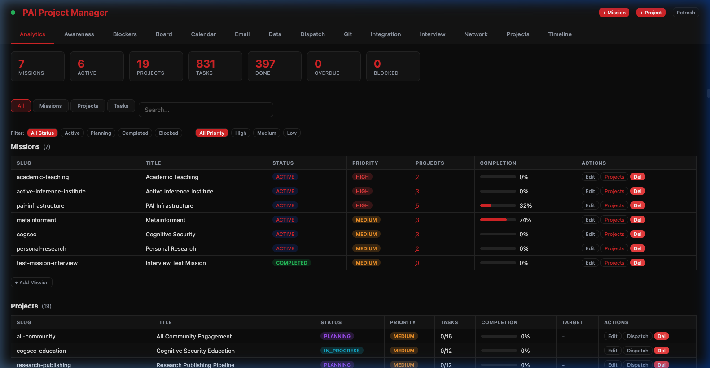
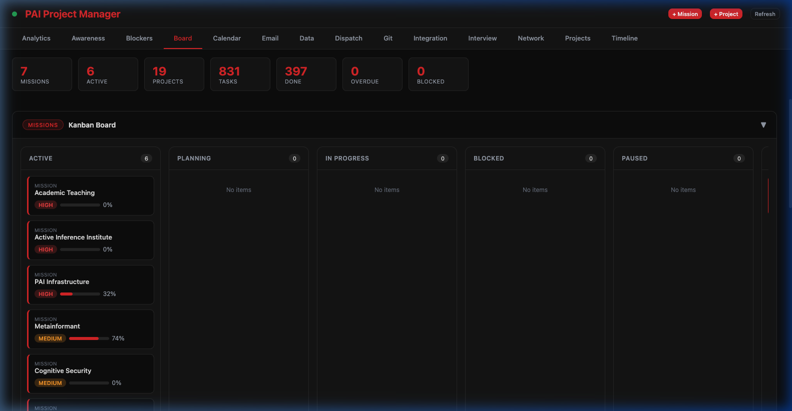
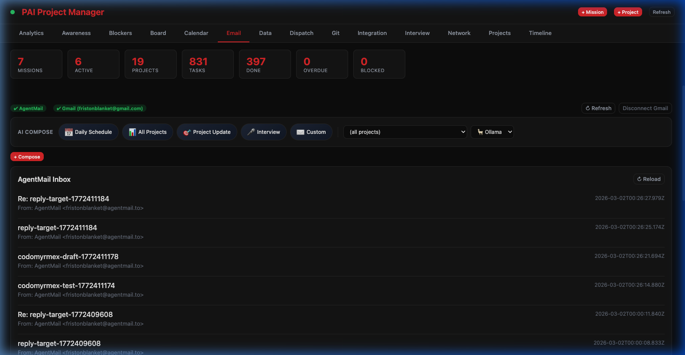
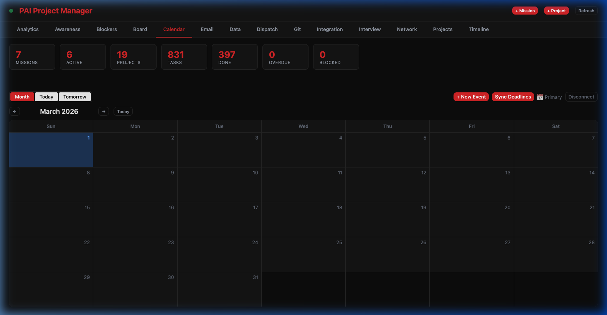

# Personal AI Infrastructure — docs/pai Documentation Module

**Module**: docs/pai
**Version**: v1.1.0
**Status**: Active
**Upstream**: [danielmiessler/Personal_AI_Infrastructure](https://github.com/danielmiessler/Personal_AI_Infrastructure)

## Context

This module provides the detailed reference layer in the PAI-Codomyrmex documentation hierarchy. It sits between the root bridge document (`/PAI.md`) and the implementation docs (`src/codomyrmex/agents/pai/`). The PAI Dashboard (port 8889) is documented with 8 interface screenshots.

## Dashboard Interface

## Algorithm Phase → MCP Tool Mapping

When the PAI Algorithm runs its 7 phases, it consumes codomyrmex tools in a predictable pattern. Use this table to know which tool to call at each phase:

| Phase | Primary MCP Tools | Codomyrmex Modules |
|-------|------------------|-------------------|
| **OBSERVE (1/7)** | `codomyrmex.list_modules`, `codomyrmex.read_file`, `codomyrmex.git_status`, `codomyrmex.git_diff`, `search_documents` | `system_discovery`, `search`, `git_operations`, `config_management` |
| **THINK (2/7)** | `query_knowledge_base`, `think`, `get_thinking_depth`, `relations_score_strength` | `cerebrum`, `agents/core` (ThinkingAgent), `relations` |
| **PLAN (3/7)** | `get_scheduler_metrics`, `analyze_workflow_dependencies`, `plugin_resolve_dependencies` | `orchestrator`, `logistics`, `plugin_system` |
| **BUILD (4/7)** | `codomyrmex.write_file`, `code_execute`, `aider_edit`, `aider_architect`, `generate_module_docs` | `coding`, `aider`, `documentation`, `ci_cd_automation` |
| **EXECUTE (5/7)** | `codomyrmex.run_command`, `codomyrmex.run_tests`, `git_commit`, `git_push`, `container_build` | `git_operations`, `containerization`, `cloud`, `events` |
| **VERIFY (6/7)** | `scan_vulnerabilities`, `scan_secrets`, `audit_code_security`, `performance_compare_benchmarks`, `validate_schema` | `security`, `performance`, `formal_verification`, `validation` |
| **LEARN (7/7)** | `memory_put`, `memory_search`, `logging_format_structured` | `agentic_memory`, `logging_monitoring`, `scrape` |

### Trust Requirements by Phase

- **OBSERVE / THINK / PLAN / VERIFY**: All tools are safe → auto-promoted by `/codomyrmexVerify`
- **BUILD**: Requires `TRUSTED` for `write_file` and `call_module_function`
- **EXECUTE**: Requires `TRUSTED` for `run_command`, `run_tests`

Run `/codomyrmexTrust` before BUILD or EXECUTE phases.

## Algorithm Phase Mapping (Dashboard Context)

| Phase | Role | Screenshot |
|-------|------|------------|
| **OBSERVE** | Read these docs to understand PAI-Codomyrmex integration | Analytics |
| **THINK** | Use architecture.md to reason about system design | Network |
| **PLAN** | Reference tools-reference.md and api-reference.md for implementation planning | Dispatch |
| **BUILD** | Use workflows.md for integration patterns | Git |
| **VERIFY** | Cross-check counts against implementation | Integration |

## Communication Channels

## AI Strategy

1. **Start with README.md**: Index page with full 8-screenshot gallery
2. **Architecture first**: Understand the component model with Network graph context
3. **Reference, not tutorial**: These docs explain what exists, not how to build it
4. **Visual verification**: Use screenshots to confirm expected Dashboard state

## Signposting

### Navigation

- **Self**: [PAI.md](PAI.md)
- **Parent**: [docs/PAI.md](../PAI.md) — Documentation-level PAI index
- **Root Bridge**: [../../PAI.md](../../PAI.md) — Authoritative PAI system bridge

### Related Documentation

- [README.md](README.md) — Documentation index with full screenshot gallery
- [AGENTS.md](AGENTS.md) — Agent coordination
- [SPEC.md](SPEC.md) — Functional specification with tab→screenshot mapping
- [docs/modules/PAI.md](../modules/PAI.md) — Module-level AI agent context
- [architecture.md](architecture.md) — Architecture deep-dive (Analytics, Network, Integration screenshots)
- [tools-reference.md](tools-reference.md) — Tool inventory (Git, Email screenshots)
- [api-reference.md](api-reference.md) — Python API reference (Analytics screenshot)
- [workflows.md](workflows.md) — Workflow documentation (Dispatch, Board, Calendar screenshots)
- [screenshots/](screenshots/) — All 8 PAI Dashboard interface screenshots
