# PAI-Codomyrmex Integration

**Version**: v1.0.3 | **Status**: Active | **Last Updated**: March 2026 | **Upstream**: [danielmiessler/Personal_AI_Infrastructure](https://github.com/danielmiessler/Personal_AI_Infrastructure)

> **PAI** (Personal AI Infrastructure) is a TypeScript/Bun system that runs [The Algorithm](https://github.com/danielmiessler/Personal_AI_Infrastructure) on every Claude Code prompt. **Codomyrmex** is the 88-module Python toolbox it consumes via MCP. This folder documents the bridge between them.

## 🎬 Interface Tour

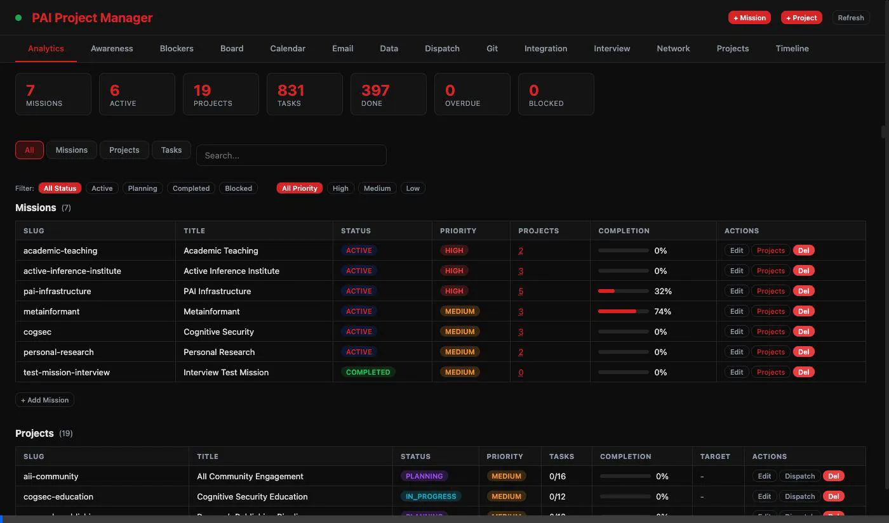

---

## System Architecture

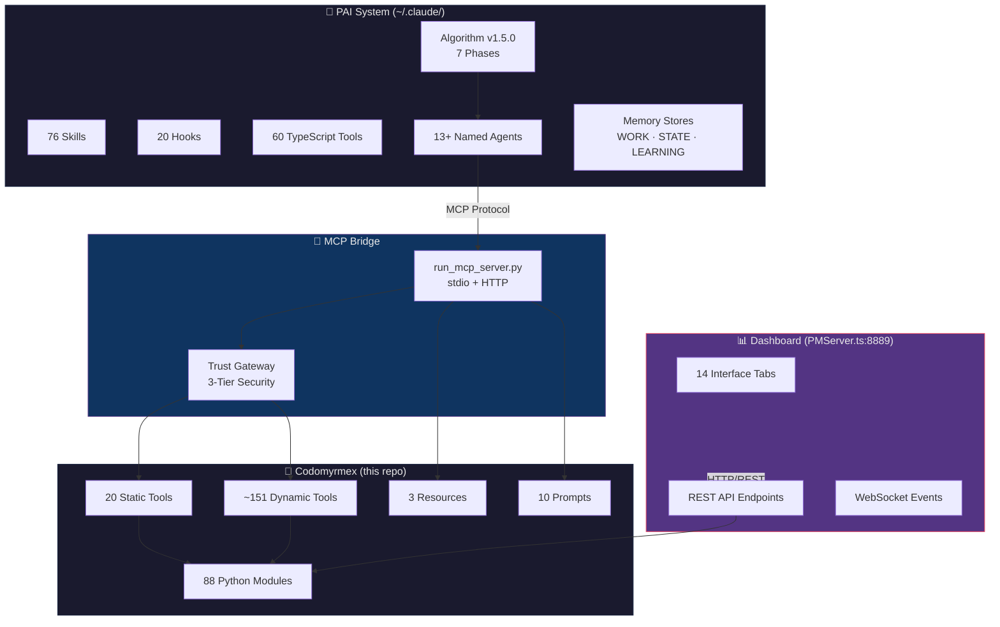

---

## The Algorithm — 7-Phase Pipeline

PAI executes a 7-phase pipeline on every prompt. Each phase maps to specific Codomyrmex modules:

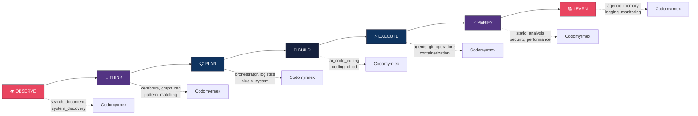

---

## Trust Gateway

The 3-tier trust model gates destructive operations behind explicit approval:

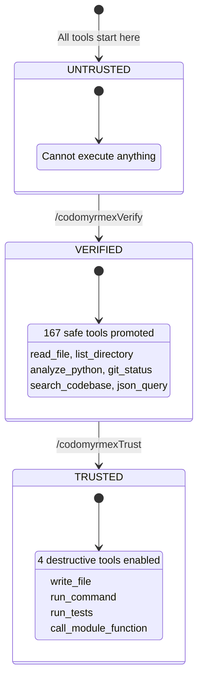

---

## 📊 Dashboard Tabs

The PAI Dashboard serves 14 interface tabs at `http://localhost:8889/`. It is a Codomyrmex-integrated fork of [danielmiessler/Personal\_AI\_Infrastructure](https://github.com/danielmiessler/Personal_AI_Infrastructure), extended with email, calendar, git sync, and network visualization.

### Analytics — Mission & Project Overview

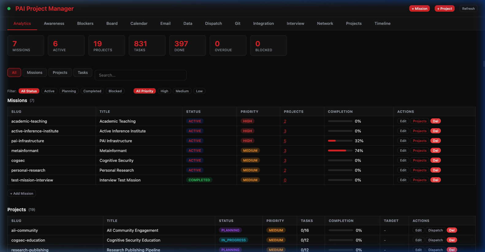

### Board — Kanban Mission Tracker

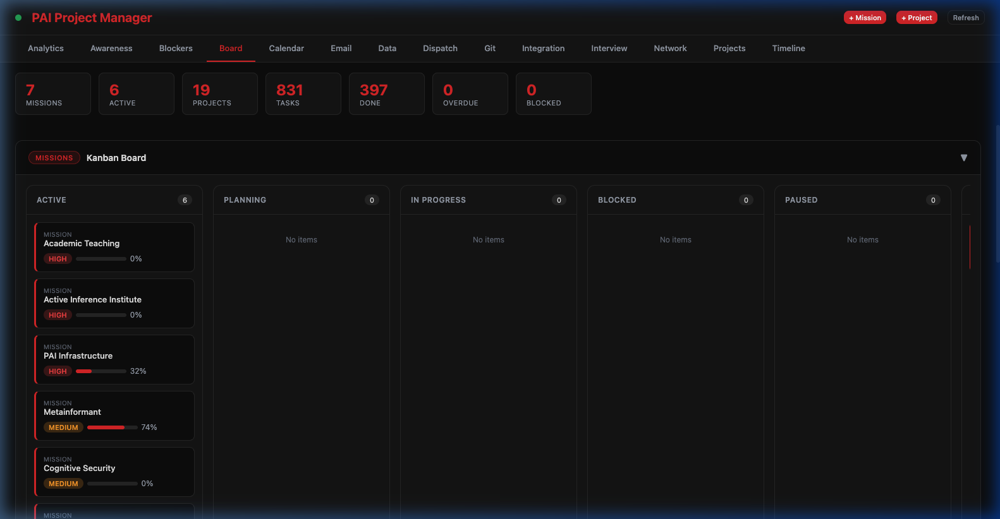

### Calendar — Google Calendar Integration

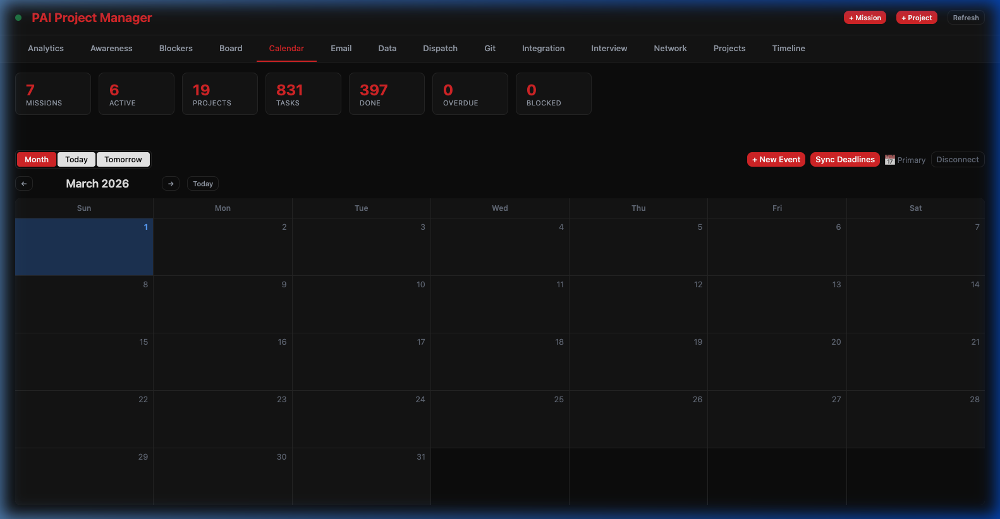

### Email — Dual-Provider Communication

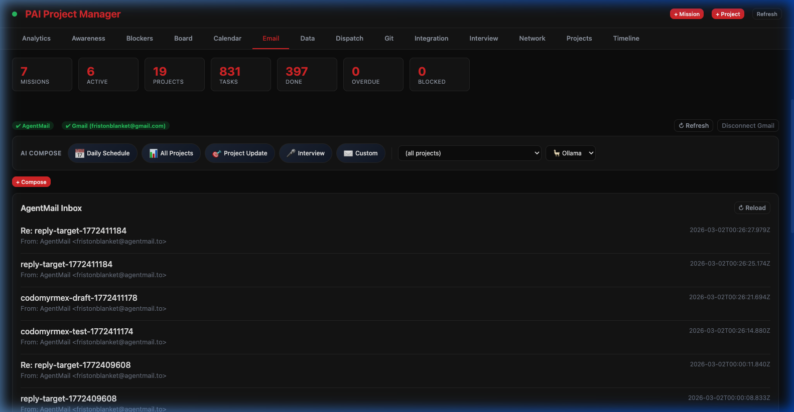

### Network — Force-Directed Graph

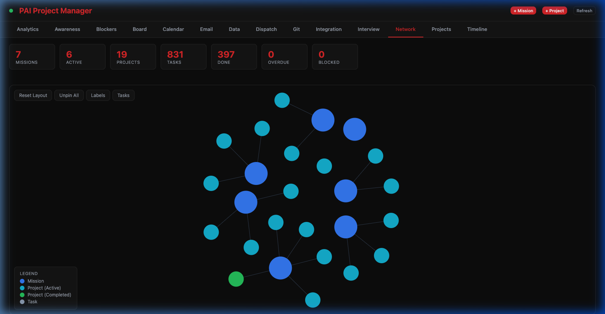

### Git — Repository Sync Manager

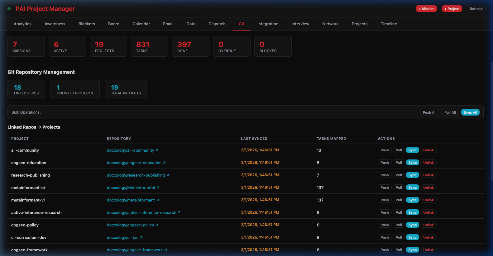

### Dispatch — Algorithm Action Center

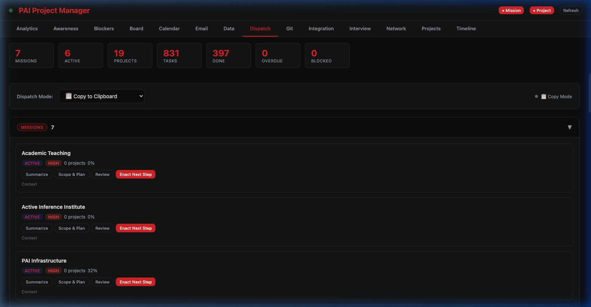

### Integration — GitHub Bridge & Export


---

## Data Model

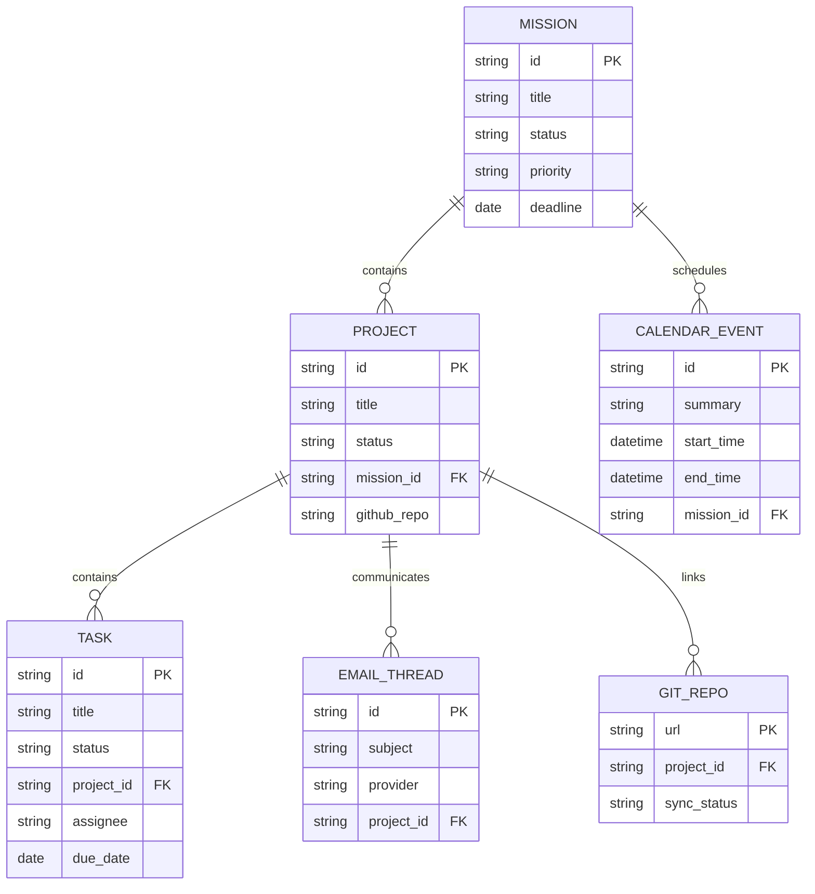

---

## MCP Tool Categories

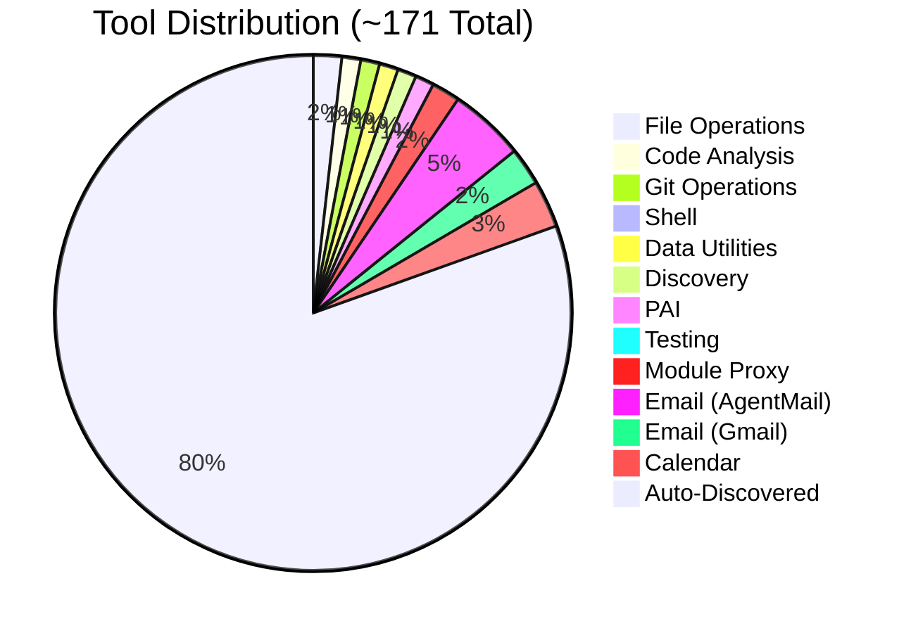

---

## Communication Channels

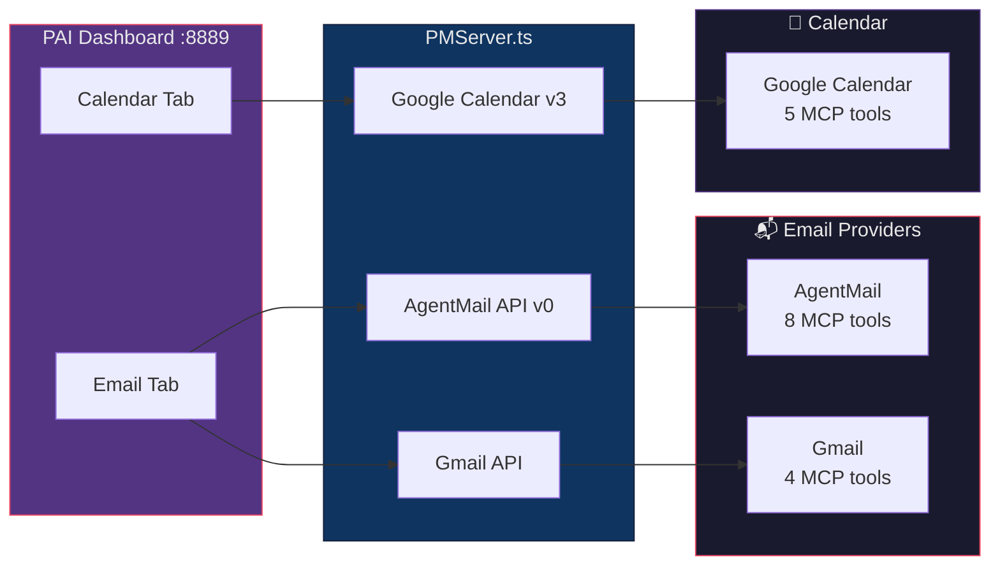

---

## Documentation Hierarchy

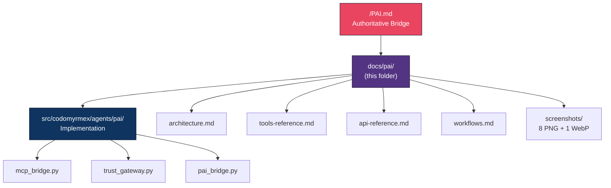

---

## Contents

| Document | Lines | Scope |
|----------|------:|-------|
| [architecture.md](architecture.md) | 175 | MCP bridge, trust model, data flow, network visualization |
| [tools-reference.md](tools-reference.md) | 227 | 20 static + dynamic tools, email/calendar tool tables |
| [api-reference.md](api-reference.md) | 217 | PAIBridge (24 methods), TrustRegistry, dataclasses |
| [workflows.md](workflows.md) | 163 | `/codomyrmexVerify`, `/codomyrmexTrust`, Algorithm phase mapping |
| [screenshots/](screenshots/) | — | 8 PNG screenshots + 1 WebP tour recording |

### RASP Documentation

| Document | Scope |
|----------|-------|
| [AGENTS.md](AGENTS.md) | Agent coordination, visual reference, operating contracts |
| [SPEC.md](SPEC.md) | Functional spec, tab→screenshot mapping |
| [PAI.md](PAI.md) | Algorithm phase mapping, communication channels |

---

## Deployment Sequence

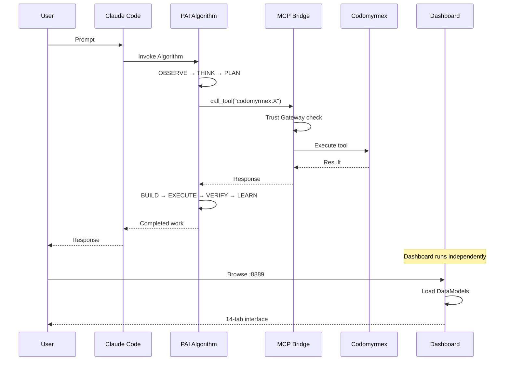

---

## Quick Start

```bash
# 1. Clone and install
git clone https://github.com/docxology/codomyrmex.git
cd codomyrmex && uv sync

# 2. Start MCP server (for Claude Code integration)
uv run python scripts/model_context_protocol/run_mcp_server.py --transport stdio

# 3. Start Dashboard (for browser interface)
set -a && source .env && set +a
uv run python scripts/pai/dashboard.py --reload
# → http://localhost:8889/

# 4. In Claude Code: /codomyrmexVerify then /codomyrmexTrust
```

---

## Quick Links

| Resource | Path |
|----------|------|
| Root bridge doc | [/PAI.md](../../PAI.md) |
| Implementation | [src/codomyrmex/agents/pai/](../../src/codomyrmex/agents/pai/) |
| MCP bridge | [mcp_bridge.py](../../src/codomyrmex/agents/pai/mcp_bridge.py) |
| Trust gateway | [trust_gateway.py](../../src/codomyrmex/agents/pai/trust_gateway.py) |
| PAI bridge | [pai_bridge.py](../../src/codomyrmex/agents/pai/pai_bridge.py) |
| PAI upstream | [danielmiessler/Personal_AI_Infrastructure](https://github.com/danielmiessler/Personal_AI_Infrastructure) |

---

<p align="center">
  <strong>PAI</strong> orchestrates · <strong>Codomyrmex</strong> executes · <strong>MCP</strong> connects
</p>
