# PAI-Codomyrmex Integration

**Version**: v1.1.0 | **Status**: Active | **Last Updated**: March 2026 | **Upstream**: [danielmiessler/Personal_AI_Infrastructure](https://github.com/danielmiessler/Personal_AI_Infrastructure)

> **PAI** (Personal AI Infrastructure) is a TypeScript/Bun system that runs [The Algorithm](https://github.com/danielmiessler/Personal_AI_Infrastructure) on every Claude Code prompt. **Codomyrmex** is a 126-module Python toolbox (121 auto-discovered via MCP) it consumes via MCP. This folder documents the bridge between them.

## 🎬 Interface Tour

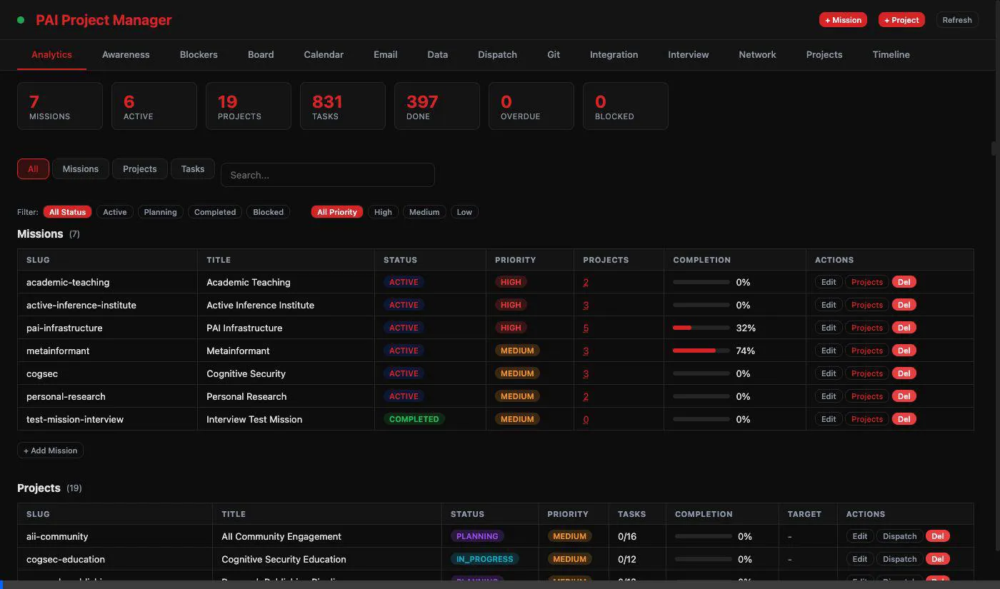

---

## System Architecture

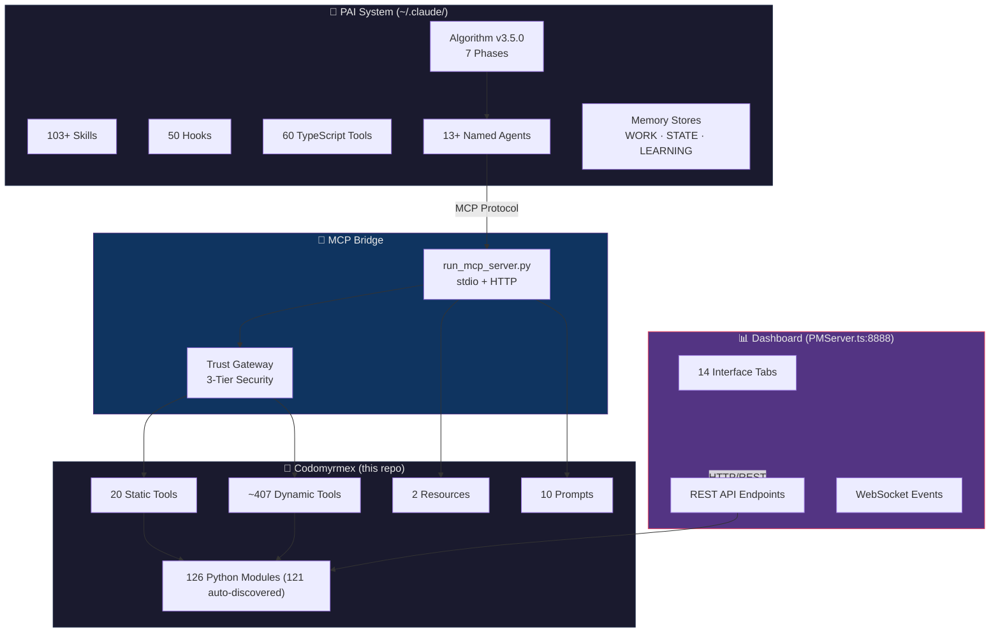
```mermaid
graph TB
    subgraph PAI["🧠 PAI System (~/.claude/)"]
        direction TB
        ALGO["Algorithm v3.5.0<br/>7 Phases"]
        SKILLS["103+ Skills"]
        HOOKS["50 Hooks"]
        TOOLS_TS["60 TypeScript Tools"]
        AGENTS_PAI["13+ Named Agents"]
        MEMORY["Memory Stores<br/>WORK · STATE · LEARNING"]
    end

    subgraph BRIDGE["🌉 MCP Bridge"]
        direction TB
        MCP_SERVER["run_mcp_server.py<br/>stdio + HTTP"]
        TRUST["Trust Gateway<br/>3-Tier Security"]
    end

    subgraph CDM["🐜 Codomyrmex (this repo)"]
        direction TB
        MODULES["126 Python Modules (121 auto-discovered)"]
        STATIC["20 Static Tools"]
        DYNAMIC["~407 Dynamic Tools"]
        RESOURCES["2 Resources"]
        PROMPTS["10 Prompts"]
    end

    subgraph DASH["📊 Dashboard (PMServer.ts:8888)"]
        direction TB
        TABS["14 Interface Tabs"]
        REST["REST API Endpoints"]
        WS["WebSocket Events"]
    end

    ALGO --> AGENTS_PAI
    AGENTS_PAI -->|"MCP Protocol"| MCP_SERVER
    MCP_SERVER --> TRUST
    TRUST --> STATIC
    TRUST --> DYNAMIC
    MCP_SERVER --> RESOURCES
    MCP_SERVER --> PROMPTS
    STATIC --> MODULES
    DYNAMIC --> MODULES
    DASH -->|"HTTP/REST"| REST
    REST --> MODULES

    style PAI fill:#1a1a2e,stroke:#16213e,color:#e8e8e8
    style BRIDGE fill:#0f3460,stroke:#533483,color:#e8e8e8
    style CDM fill:#1a1a2e,stroke:#16213e,color:#e8e8e8
    style DASH fill:#533483,stroke:#e94560,color:#e8e8e8
```

---

## The Algorithm — 7-Phase Pipeline

PAI executes a 7-phase pipeline on every prompt. Each phase maps to specific Codomyrmex modules:

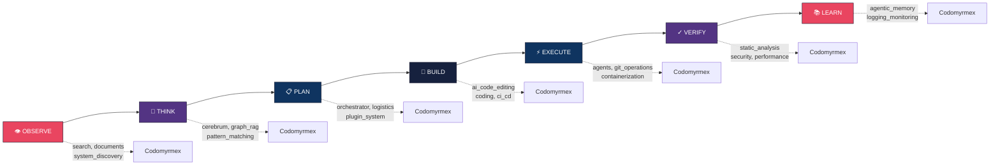
```mermaid
flowchart LR
    O["👁 OBSERVE"] --> T["🧠 THINK"]
    T --> P["📋 PLAN"]
    P --> B["🔨 BUILD"]
    B --> E["⚡ EXECUTE"]
    E --> V["✓ VERIFY"]
    V --> L["📚 LEARN"]

    O -.->|"search, documents<br/>system_discovery"| CDM1["Codomyrmex"]
    T -.->|"cerebrum, graph_rag<br/>pattern_matching"| CDM2["Codomyrmex"]
    P -.->|"orchestrator, logistics<br/>plugin_system"| CDM3["Codomyrmex"]
    B -.->|"ai_code_editing<br/>coding, ci_cd"| CDM4["Codomyrmex"]
    E -.->|"agents, git_operations<br/>containerization"| CDM5["Codomyrmex"]
    V -.->|"static_analysis<br/>security, performance"| CDM6["Codomyrmex"]
    L -.->|"agentic_memory<br/>logging_monitoring"| CDM7["Codomyrmex"]

    style O fill:#e94560,stroke:#1a1a2e,color:#fff
    style T fill:#533483,stroke:#1a1a2e,color:#fff
    style P fill:#0f3460,stroke:#1a1a2e,color:#fff
    style B fill:#16213e,stroke:#1a1a2e,color:#fff
    style E fill:#0f3460,stroke:#1a1a2e,color:#fff
    style V fill:#533483,stroke:#1a1a2e,color:#fff
    style L fill:#e94560,stroke:#1a1a2e,color:#fff
```

---

## Trust Gateway

The 3-tier trust model gates destructive operations behind explicit approval:

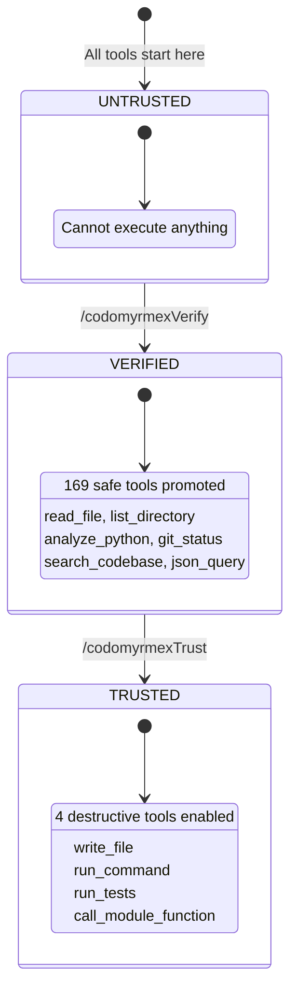
```mermaid
stateDiagram-v2
    [*] --> UNTRUSTED: All tools start here
    UNTRUSTED --> VERIFIED: /codomyrmexVerify
    VERIFIED --> TRUSTED: /codomyrmexTrust

    state UNTRUSTED {
        [*] --> Blocked
        Blocked: Cannot execute anything
    }

    state VERIFIED {
        [*] --> SafeOps
        SafeOps: 169 safe tools promoted
        SafeOps: read_file, list_directory
        SafeOps: analyze_python, git_status
        SafeOps: search_codebase, json_query
    }

    state TRUSTED {
        [*] --> FullAccess
        FullAccess: 4 destructive tools enabled
        FullAccess: write_file
        FullAccess: run_command
        FullAccess: run_tests
        FullAccess: call_module_function
    }
```

---

## External Skills

Beyond the MCP-based Python modules, PAI includes **external Claude Code skills** — markdown-prompt-based capabilities that extend what Claude Code can do in a session without any Python dependencies.

Full documentation: **[skills-and-commands.md](skills-and-commands.md)**

### visual-explainer (installed)

**Source**: [nicobailon/visual-explainer](https://github.com/nicobailon/visual-explainer) v0.4.4 · 5.2k stars · MIT
**Location**: `~/.claude/skills/visual-explainer/` · **Output**: `~/.agent/diagrams/`

Converts terminal output and structured data into styled, self-contained HTML pages using Mermaid, Chart.js, and CSS Grid. Generates diagrams instead of ASCII art.

| Slash Command | Purpose |
|---------------|---------|
| `/generate-web-diagram` | HTML diagram — flowchart, architecture, ER, state machine |
| `/generate-visual-plan` | Implementation plan with state machines and code snippets |
| `/generate-slides` | Magazine-quality slide deck (100dvh per slide) |
| `/diff-review` | Before/after architecture comparison |
| `/plan-review` | Current codebase vs. proposed plan audit |
| `/project-recap` | Project mental model snapshot |
| `/fact-check` | Validate document accuracy against source code |

---

## 📊 Dashboard Tabs

The PAI Dashboard serves 14 interface tabs at `http://localhost:8888/`. It is a Codomyrmex-integrated fork of [danielmiessler/Personal\_AI\_Infrastructure](https://github.com/danielmiessler/Personal_AI_Infrastructure), extended with email, calendar, git sync, and network visualization.

### Analytics — Mission & Project Overview


### Board — Kanban Mission Tracker


### Calendar — Google Calendar Integration


### Email — Dual-Provider Communication


### Network — Force-Directed Graph


### Git — Repository Sync Manager

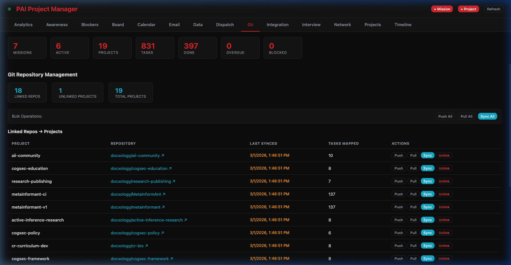

### Dispatch — Algorithm Action Center


### Integration — GitHub Bridge & Export

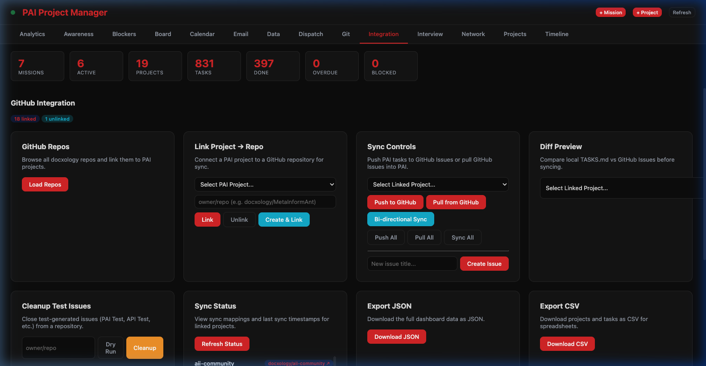

---

## Data Model

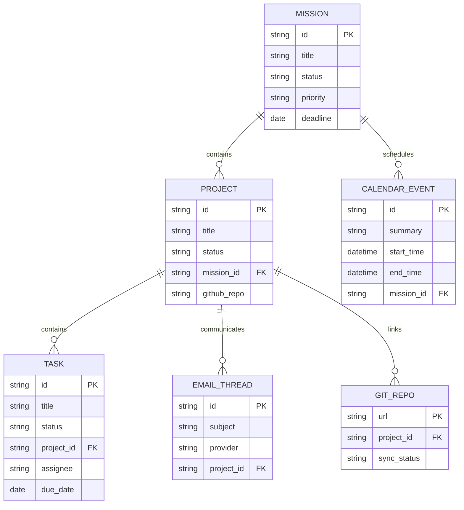
```mermaid
erDiagram
    MISSION ||--o{ PROJECT : contains
    PROJECT ||--o{ TASK : contains
    MISSION {
        string id PK
        string title
        string status
        string priority
        date deadline
    }
    PROJECT {
        string id PK
        string title
        string status
        string mission_id FK
        string github_repo
    }
    TASK {
        string id PK
        string title
        string status
        string project_id FK
        string assignee
        date due_date
    }
    MISSION ||--o{ CALENDAR_EVENT : schedules
    CALENDAR_EVENT {
        string id PK
        string summary
        datetime start_time
        datetime end_time
        string mission_id FK
    }
    PROJECT ||--o{ EMAIL_THREAD : communicates
    EMAIL_THREAD {
        string id PK
        string subject
        string provider
        string project_id FK
    }
    PROJECT ||--o{ GIT_REPO : links
    GIT_REPO {
        string url PK
        string project_id FK
        string sync_status
    }
```

---

## MCP Tool Categories

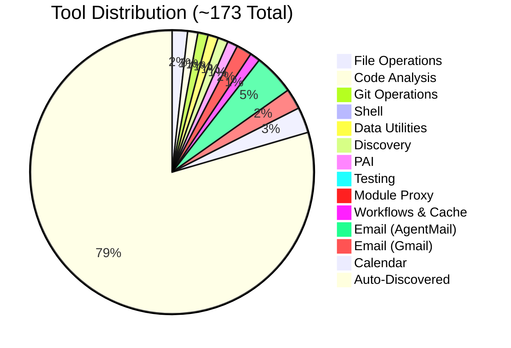
```mermaid
pie title Tool Distribution (~173 Total)
    "File Operations" : 3
    "Code Analysis" : 2
    "Git Operations" : 2
    "Shell" : 1
    "Data Utilities" : 2
    "Discovery" : 2
    "PAI" : 2
    "Testing" : 1
    "Module Proxy" : 3
    "Workflows & Cache" : 2
    "Email (AgentMail)" : 8
    "Email (Gmail)" : 4
    "Calendar" : 5
    "Auto-Discovered" : 136
```

---

## Communication Channels

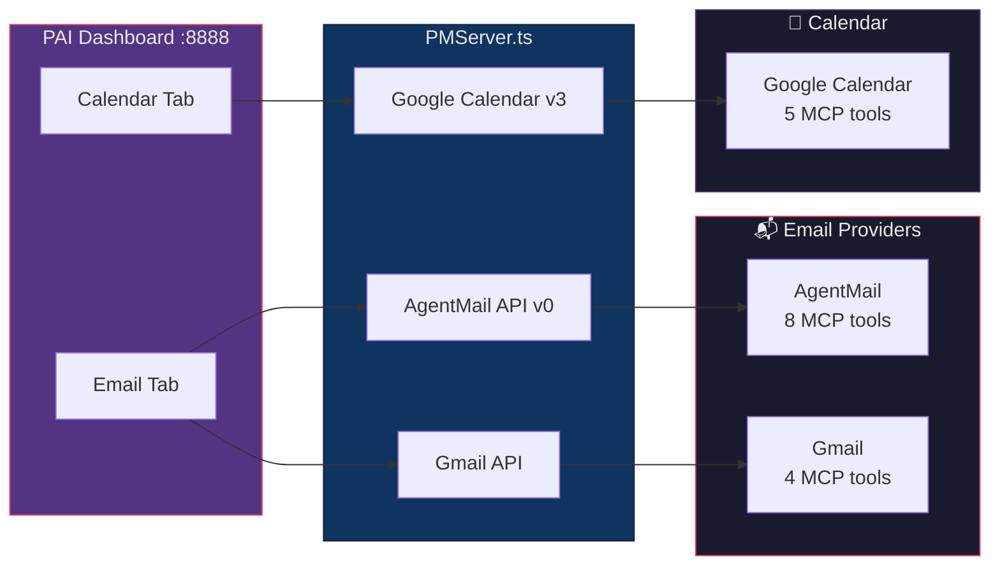
```mermaid
graph LR
    subgraph Providers["📬 Email Providers"]
        AM["AgentMail<br/>8 MCP tools"]
        GM["Gmail<br/>4 MCP tools"]
    end

    subgraph Calendar["📅 Calendar"]
        GC["Google Calendar<br/>5 MCP tools"]
    end

    subgraph Dashboard["PAI Dashboard :8888"]
        EMAIL_TAB["Email Tab"]
        CAL_TAB["Calendar Tab"]
    end

    subgraph Backend["PMServer.ts"]
        AM_API["AgentMail API v0"]
        GM_API["Gmail API"]
        GCAL_API["Google Calendar v3"]
    end

    EMAIL_TAB --> AM_API
    EMAIL_TAB --> GM_API
    CAL_TAB --> GCAL_API
    AM_API --> AM
    GM_API --> GM
    GCAL_API --> GC

    style Providers fill:#1a1a2e,stroke:#e94560,color:#e8e8e8
    style Calendar fill:#1a1a2e,stroke:#533483,color:#e8e8e8
    style Dashboard fill:#533483,stroke:#e94560,color:#e8e8e8
    style Backend fill:#0f3460,stroke:#16213e,color:#e8e8e8
```

---

## Documentation Hierarchy

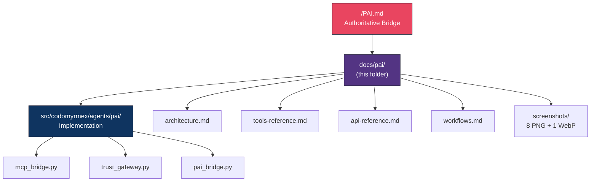
```mermaid
graph TD
    ROOT["/PAI.md<br/>Authoritative Bridge"]
    DOCS["docs/pai/<br/>(this folder)"]
    SRC["src/codomyrmex/agents/pai/<br/>Implementation"]

    ROOT --> DOCS
    DOCS --> SRC

    DOCS --> ARCH["architecture.md"]
    DOCS --> TOOLS["tools-reference.md"]
    DOCS --> API["api-reference.md"]
    DOCS --> WF["workflows.md"]
    DOCS --> SCREENSHOTS["screenshots/<br/>8 PNG + 1 WebP"]

    SRC --> BRIDGE["mcp_bridge.py"]
    SRC --> TRUST_GW["trust_gateway.py"]
    SRC --> PAI_BR["pai_bridge.py"]

    style ROOT fill:#e94560,stroke:#1a1a2e,color:#fff
    style DOCS fill:#533483,stroke:#1a1a2e,color:#fff
    style SRC fill:#0f3460,stroke:#1a1a2e,color:#fff
```

---

## Contents

| Document | Lines | Scope |
|----------|------:|-------|
| [architecture.md](architecture.md) | 182 | MCP bridge, trust model, data flow, network visualization |
| [tools-reference.md](tools-reference.md) | 248 | 22 static + dynamic tools, email/calendar tool tables |
| [api-reference.md](api-reference.md) | 217 | PAIBridge (24 methods), TrustRegistry, dataclasses |
| [workflows.md](workflows.md) | 172 | `/codomyrmexVerify`, `/codomyrmexTrust`, Algorithm phase mapping |
| [screenshots/](screenshots/) | — | 8 PNG screenshots + 1 WebP tour recording |

### RASP Documentation

| Document | Scope |
|----------|-------|
| [AGENTS.md](AGENTS.md) | Agent coordination, visual reference, operating contracts |
| [SPEC.md](SPEC.md) | Functional spec, tab→screenshot mapping |
| [PAI.md](PAI.md) | Algorithm phase mapping, communication channels |

---

## Deployment Sequence

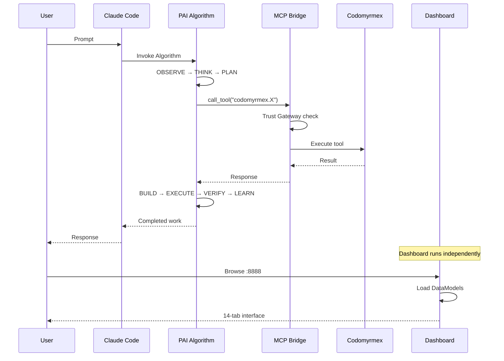
```mermaid
sequenceDiagram
    participant U as User
    participant CC as Claude Code
    participant PAI as PAI Algorithm
    participant MCP as MCP Bridge
    participant CDM as Codomyrmex
    participant DB as Dashboard

    U->>CC: Prompt
    CC->>PAI: Invoke Algorithm
    PAI->>PAI: OBSERVE → THINK → PLAN
    PAI->>MCP: call_tool("codomyrmex.X")
    MCP->>MCP: Trust Gateway check
    MCP->>CDM: Execute tool
    CDM-->>MCP: Result
    MCP-->>PAI: Response
    PAI->>PAI: BUILD → EXECUTE → VERIFY → LEARN
    PAI-->>CC: Completed work
    CC-->>U: Response

    Note over DB: Dashboard runs independently
    U->>DB: Browse :8888
    DB->>DB: Load DataModels
    DB-->>U: 14-tab interface
```

---

## Quick Start

```bash
# 1. Clone and install
git clone https://github.com/docxology/codomyrmex.git
cd codomyrmex && uv sync

# 2. Start MCP server (for Claude Code integration)
uv run python scripts/model_context_protocol/run_mcp_server.py --transport stdio

# 3. Start Dashboard (for browser interface)
set -a && source .env && set +a
uv run python scripts/pai/dashboard.py
# → http://localhost:8787/ (Codomyrmex Admin) + http://localhost:8888/ (PAI PM)

# 4. In Claude Code: /codomyrmexVerify then /codomyrmexTrust
```

---

## Quick Links

| Resource | Path |
|----------|------|
| Root bridge doc | [/PAI.md](../../PAI.md) |
| Implementation | [src/codomyrmex/agents/pai/](../../src/codomyrmex/agents/pai/) |
| MCP bridge | [mcp_bridge.py](../../src/codomyrmex/agents/pai/mcp_bridge.py) |
| Trust gateway | [trust_gateway.py](../../src/codomyrmex/agents/pai/trust_gateway.py) |
| PAI bridge | [pai_bridge.py](../../src/codomyrmex/agents/pai/pai_bridge.py) |
| External skills | [skills-and-commands.md](skills-and-commands.md) |
| PAI upstream | [danielmiessler/Personal_AI_Infrastructure](https://github.com/danielmiessler/Personal_AI_Infrastructure) |

---

<p align="center">
  <strong>PAI</strong> orchestrates · <strong>Codomyrmex</strong> executes · <strong>MCP</strong> connects
</p>
