# PAI-Codomyrmex Integration

**Version**: v1.0.3 | **Status**: Active | **Last Updated**: March 2026 | **Upstream**: [danielmiessler/Personal_AI_Infrastructure](https://github.com/danielmiessler/Personal_AI_Infrastructure)

> **PAI** (Personal AI Infrastructure) is a TypeScript/Bun system that runs [The Algorithm](https://github.com/danielmiessler/Personal_AI_Infrastructure) on every Claude Code prompt. **Codomyrmex** is the 88-module Python toolbox it consumes via MCP. This folder documents the bridge between them.

## 🎬 Interface Tour


---

## System Architecture


---

## The Algorithm — 7-Phase Pipeline

PAI executes a 7-phase pipeline on every prompt. Each phase maps to specific Codomyrmex modules:

```mermaid
flowchart LR
    O["👁 OBSERVE"] --> T["🧠 THINK"]
    T --> P["📋 PLAN"]
    P --> B["🔨 BUILD"]
    B --> E["⚡ EXECUTE"]
    E --> V["✓ VERIFY"]
    V --> L["📚 LEARN"]

    O -.->|"search, documents<br/>system_discovery"| CDM1["Codomyrmex"]
    T -.->|"cerebrum, graph_rag<br/>pattern_matching"| CDM2["Codomyrmex"]
    P -.->|"orchestrator, logistics<br/>plugin_system"| CDM3["Codomyrmex"]
    B -.->|"ai_code_editing<br/>coding, ci_cd"| CDM4["Codomyrmex"]
    E -.->|"agents, git_operations<br/>containerization"| CDM5["Codomyrmex"]
    V -.->|"static_analysis<br/>security, performance"| CDM6["Codomyrmex"]
    L -.->|"agentic_memory<br/>logging_monitoring"| CDM7["Codomyrmex"]

    style O fill:#e94560,stroke:#1a1a2e,color:#fff
    style T fill:#533483,stroke:#1a1a2e,color:#fff
    style P fill:#0f3460,stroke:#1a1a2e,color:#fff
    style B fill:#16213e,stroke:#1a1a2e,color:#fff
    style E fill:#0f3460,stroke:#1a1a2e,color:#fff
    style V fill:#533483,stroke:#1a1a2e,color:#fff
    style L fill:#e94560,stroke:#1a1a2e,color:#fff
```



---

## Trust Gateway

The 3-tier trust model gates destructive operations behind explicit approval:


---

## 📊 Dashboard Tabs

The PAI Dashboard serves 14 interface tabs at `http://localhost:8889/`. It is a Codomyrmex-integrated fork of [danielmiessler/Personal\_AI\_Infrastructure](https://github.com/danielmiessler/Personal_AI_Infrastructure), extended with email, calendar, git sync, and network visualization.

### Analytics — Mission & Project Overview


### Board — Kanban Mission Tracker


### Calendar — Google Calendar Integration


### Email — Dual-Provider Communication


### Network — Force-Directed Graph


### Git — Repository Sync Manager


### Dispatch — Algorithm Action Center


### Integration — GitHub Bridge & Export


---

## Data Model


---

## MCP Tool Categories


---

## Communication Channels


---

## Documentation Hierarchy


---

## Contents

| Document | Lines | Scope |
|----------|------:|-------|
| [architecture.md](architecture.md) | 175 | MCP bridge, trust model, data flow, network visualization |
| [tools-reference.md](tools-reference.md) | 227 | 20 static + dynamic tools, email/calendar tool tables |
| [api-reference.md](api-reference.md) | 217 | PAIBridge (24 methods), TrustRegistry, dataclasses |
| [workflows.md](workflows.md) | 163 | `/codomyrmexVerify`, `/codomyrmexTrust`, Algorithm phase mapping |
| [screenshots/](screenshots/) | — | 8 PNG screenshots + 1 WebP tour recording |

### RASP Documentation

| Document | Scope |
|----------|-------|
| [AGENTS.md](AGENTS.md) | Agent coordination, visual reference, operating contracts |
| [SPEC.md](SPEC.md) | Functional spec, tab→screenshot mapping |
| [PAI.md](PAI.md) | Algorithm phase mapping, communication channels |

---

## Deployment Sequence

```mermaid
sequenceDiagram
    participant U as User
    participant CC as Claude Code
    participant PAI as PAI Algorithm
    participant MCP as MCP Bridge
    participant CDM as Codomyrmex
    participant DB as Dashboard

    U->>CC: Prompt
    CC->>PAI: Invoke Algorithm
    PAI->>PAI: OBSERVE → THINK → PLAN
    PAI->>MCP: call_tool("codomyrmex.X")
    MCP->>MCP: Trust Gateway check
    MCP->>CDM: Execute tool
    CDM-->>MCP: Result
    MCP-->>PAI: Response
    PAI->>PAI: BUILD → EXECUTE → VERIFY → LEARN
    PAI-->>CC: Completed work
    CC-->>U: Response

    Note over DB: Dashboard runs independently
    U->>DB: Browse :8889
    DB->>DB: Load DataModels
    DB-->>U: 14-tab interface
```



---

## Quick Start

```bash
# 1. Clone and install
git clone https://github.com/docxology/codomyrmex.git
cd codomyrmex && uv sync

# 2. Start MCP server (for Claude Code integration)
uv run python scripts/model_context_protocol/run_mcp_server.py --transport stdio

# 3. Start Dashboard (for browser interface)
set -a && source .env && set +a
uv run python scripts/pai/dashboard.py --reload
# → http://localhost:8889/

# 4. In Claude Code: /codomyrmexVerify then /codomyrmexTrust
```

---

## Quick Links

| Resource | Path |
|----------|------|
| Root bridge doc | [/PAI.md](../../PAI.md) |
| Implementation | [src/codomyrmex/agents/pai/](../../src/codomyrmex/agents/pai/) |
| MCP bridge | [mcp_bridge.py](../../src/codomyrmex/agents/pai/mcp_bridge.py) |
| Trust gateway | [trust_gateway.py](../../src/codomyrmex/agents/pai/trust_gateway.py) |
| PAI bridge | [pai_bridge.py](../../src/codomyrmex/agents/pai/pai_bridge.py) |
| PAI upstream | [danielmiessler/Personal_AI_Infrastructure](https://github.com/danielmiessler/Personal_AI_Infrastructure) |

---

<p align="center">
  <strong>PAI</strong> orchestrates · <strong>Codomyrmex</strong> executes · <strong>MCP</strong> connects
</p>
