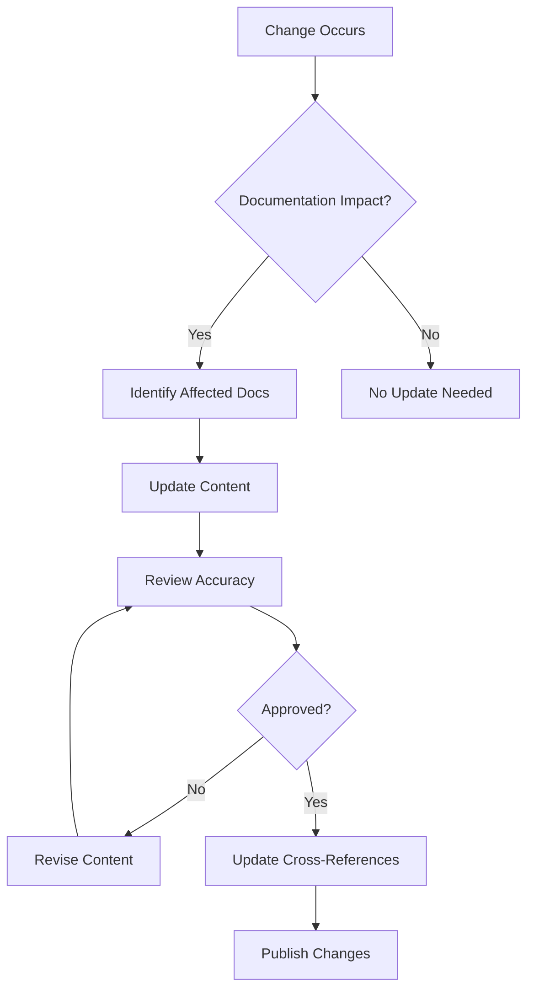

# Codomyrmex Agents — docs/project

## Signposting
- **Parent**: [Documentation](../AGENTS.md)
- **Self**: [Agents](AGENTS.md)
- **Children**:
    - None
- **Key Artifacts**:
    - [Functional Spec](SPEC.md)
    - [Human Readme](README.md)

**Version**: v0.1.0 | **Status**: Active | **Last Updated**: December 2025

## Purpose

Project documentation and process guides for the Codomyrmex repository. This directory contains architecture specifications, contribution guidelines, implementation status, and project management documentation that defines how the Codomyrmex platform is designed, built, and maintained.

The docs/project directory serves as the central hub for understanding Codomyrmex's architecture, development processes, and project governance.

## Project Documentation Structure

### Core Documentation Areas

The project documentation is organized by stakeholder and purpose:

| Area | Purpose | Key Content | Primary Audience |
|------|---------|-------------|------------------|
| **Architecture** | System design and principles | Design patterns, component relationships, technical decisions | Architects, senior developers |
| **Contributing** | Development processes | Contribution guidelines, code standards, review processes | Contributors, maintainers |
| **Implementation** | Current status and progress | Feature status, roadmaps, blockers | Project managers, stakeholders |
| **Audits & Reports** | Quality assurance | Documentation audits, coverage reports, improvement summaries | Quality assurance, maintainers |

### Documentation Types

**Architecture Documentation**
- System architecture and design principles
- Component relationships and data flows
- Technical decision records and rationale
- Scalability and performance considerations

**Process Documentation**
- Contribution guidelines and workflows
- Code review processes and standards
- Release management and versioning
- Quality assurance procedures

**Status Documentation**
- Implementation status and progress tracking
- Feature completion and testing status
- Known issues and workarounds
- Roadmap and milestone planning

**Audit Documentation**
- Documentation quality assessments
- Coverage analysis and gap identification
- Improvement recommendations and tracking
- Standardization reports and summaries

## Active Components

### Architecture Documentation
- `architecture.md` – System architecture, design principles, and component relationships
- `README.md` – Project documentation overview and navigation

### Process Documentation
- `contributing.md` – Contribution guidelines, code standards, and development workflow

### Status Documentation
- `implementation-status.md` – Current feature implementation status and progress
- `todo.md` – Active tasks, priorities, and project backlog

### Audit & Quality Documentation
- `documentation-audit-report.md` – Comprehensive documentation quality assessment
- `documentation-audit-summary.md` – Executive summary of documentation audits
- `module-documentation-audit.md` – Module-specific documentation evaluation
- `documentation-improvements-summary.md` – Documentation enhancement tracking
- `documentation-reorganization-summary.md` – Documentation structure improvements
- `module-documentation-standardization-summary.md` – Documentation standardization efforts
- `comprehensive-improvements-complete.md` – Major improvement completion status

### Metrics & Reporting
- `coverage-report.md` – Test coverage and quality metrics


### Additional Files
- `SPEC.md` – Spec Md

## Operating Contracts

### Universal Project Documentation Protocols

All project documentation must:

1. **Reflect Current Reality** - Documentation must accurately represent current architecture and processes
2. **Support Decision Making** - Provide information needed for technical and project decisions
3. **Enable New Contributors** - Help newcomers understand the project and contribution processes
4. **Track Evolution** - Document architectural changes and design rationale
5. **Maintain Quality Standards** - Follow established documentation standards and practices

### Content-Specific Guidelines

#### Architecture Documentation
- Document design decisions and trade-offs
- Include diagrams and visual representations
- Explain component relationships and data flows
- Provide scalability and performance considerations

#### Process Documentation
- Define clear workflows and procedures
- Include examples and templates
- Document escalation paths and decision processes
- Provide troubleshooting guidance

#### Status Documentation
- Track progress against milestones
- Identify blockers and dependencies
- Provide realistic timelines and estimates
- Include risk assessments and mitigation plans

#### Audit Documentation
- Provide objective quality assessments
- Include actionable improvement recommendations
- Track progress on quality initiatives
- Document standards and compliance requirements

## Documentation Maintenance

### Update Triggers

Project documentation must be updated when:
- Architecture or design decisions change
- New processes or workflows are introduced
- Major features are completed or planned
- Quality standards or processes evolve
- Team composition or responsibilities change

### Quality Assurance

- **Architecture Reviews** - Regular review of architectural documentation accuracy
- **Process Validation** - Verification that documented processes work in practice
- **Status Accuracy** - Regular updates to implementation status and progress
- **Audit Freshness** - Periodic reassessment of documentation quality

## Content Development Workflow



## Navigation
- **Human Documentation**: [README.md](README.md)
- **Functional Specification**: [SPEC.md](SPEC.md)

### For Architects & Technical Leads
- **System Architecture**: [architecture.md](architecture.md) - Technical design and principles
- **Implementation Status**: [implementation-status.md](implementation-status.md) - Current progress and plans

### For Contributors
- **Contributing Guide**: [contributing.md](contributing.md) - How to contribute effectively
- **TODO List**: [todo.md](todo.md) - Current priorities and tasks

### For Project Managers
- **Status Reports**: [implementation-status.md](implementation-status.md) - Progress tracking
- **Quality Reports**: [documentation-audit-summary.md](documentation-audit-summary.md) - Quality metrics

### For Quality Assurance
- **Audit Reports**: [documentation-audit-report.md](documentation-audit-report.md) - Detailed quality assessment
- **Coverage Reports**: [coverage-report.md](coverage-report.md) - Test and documentation coverage

## Agent Coordination

### Project Documentation Synchronization

When project changes affect documentation:

1. **Architecture Updates** - Modify architecture docs to reflect new designs
2. **Process Updates** - Update contribution and workflow documentation
3. **Status Updates** - Keep implementation status current and accurate
4. **Audit Updates** - Refresh quality assessments and recommendations

### Quality Gates

Before publishing project documentation changes:

1. **Technical Accuracy** - All technical details verified against codebase
2. **Completeness** - All relevant aspects of changes documented
3. **Consistency** - Documentation consistent with established patterns
4. **Cross-References** - All links and references are functional
5. **Stakeholder Review** - Appropriate stakeholders have reviewed changes

## Project Documentation Metrics

### Quality Metrics
- **Accuracy Rate** - Percentage of documentation that correctly reflects reality
- **Completeness Score** - Coverage of important architectural and process decisions
- **Freshness** - How current documentation remains relative to code changes
- **Usability** - Effectiveness in helping users understand and contribute

### Process Metrics
- **Update Frequency** - How often documentation is updated
- **Review Coverage** - Percentage of changes that include documentation updates
- **Usage Analytics** - Which documentation is most accessed and valued
- **Feedback Integration** - Incorporation of user and contributor feedback

## Decision Documentation Framework

### Architecture Decision Records (ADRs)

All significant architectural decisions should be documented using this template:

```markdown
# ADR: [Decision Title]

## Status
[Proposed | Accepted | Deprecated | Superseded]

## Context
[What problem are we solving? What constraints exist?]

## Decision
[What decision was made and why?]

## Consequences
[What are the positive and negative impacts?]

## Alternatives Considered
[What other options were evaluated?]

## Implementation Notes
[How was this decision implemented?]
```

### Process Decision Records

Similar template for process and workflow decisions:

```markdown
# PDR: [Process Title]

## Status
[Active | Retired | Under Review]

## Problem Statement
[What process issue needs to be addressed?]

## Solution
[What process was implemented?]

## Expected Outcomes
[What improvements are anticipated?]

## Monitoring
[How will process effectiveness be measured?]
```

## Version History

- **v0.1.0** (December 2025) - Initial project documentation system with architecture, contributing, and status tracking documentation

## Related Documentation

- **[Architecture Overview](../modules/overview.md)** - Module system and relationships
- **[Development Guide](../development/README.md)** - Development environment and processes
- **[Testing Strategy](../development/testing-strategy.md)** - Quality assurance approach
- **[Contributing Standards](../project/contributing.md)** - Detailed contribution guidelines
<!-- Navigation Links keyword for score -->
