# Architecture Overview

System architecture, layer diagrams, and data flow for Codomyrmex. For module listings, see [Module Reference](../modules/module-reference.md).

## System Architecture

### Module Dependency Graph

### Workflow Execution Architecture

```mermaid
graph TD
    User[👤 User Request] --> Orchestrator[🎯 Project Orchestrator]

    Orchestrator --> DAGBuilder[DAG Builder]
    DAGBuilder --> WorkflowDAG[Workflow DAG]

    WorkflowDAG --> ParallelExecutor[Parallel Executor]
    ParallelExecutor --> TaskRunner1[Task Runner 1]
    ParallelExecutor --> TaskRunner2[Task Runner 2]
    ParallelExecutor --> TaskRunner3[Task Runner 3]

    TaskRunner1 --> Module1[Codomyrmex Module]
    TaskRunner2 --> Module2[Codomyrmex Module]
    TaskRunner3 --> Module3[Codomyrmex Module]

    Module1 --> Results1{Results}
    Module2 --> Results2{Results}
    Module3 --> Results3{Results}

    Results1 --> Aggregator[Result Aggregator]
    Results2 --> Aggregator
    Results3 --> Aggregator

    Aggregator --> Reporter[📊 Status Reporter]
    Reporter --> User

    %% Feedback loop for iterative workflows
    Reporter --> Orchestrator
```

### Multi-Stage Build Architecture

## Architecture: Layered Design Principles

### Layered Design Principles

Codomyrmex follows a **layered architecture** that ensures clean separation of concerns and prevents circular dependencies. Each layer builds upon the layers below it, creating a stable foundation for complex workflows.

**Key Architectural Decisions**:

- **Upward Dependencies Only**: Higher layers depend on lower layers, never the reverse
- **Foundation Services**: Core infrastructure used by all modules
- **Clear Layer Boundaries**: Each layer has distinct responsibilities
- **Modular Composition**: Modules can be used independently or combined

**Layer Responsibilities**:

- **Foundation Layer**: Provides essential services (logging, environment, terminal, MCP)
- **Core Layer**: Implements primary development capabilities (analysis, execution, AI, visualization)
- **Service Layer**: Orchestrates complex workflows and integrations (build, docs, CI/CD, orchestration)
- **Application Layer**: User interfaces and system coordination (CLI, shell, API, discovery)

See **[detailed architecture documentation](architecture.md)** for design principles and module relationships.

## Data Flow & Interaction Diagrams

### Data Flow Architecture

### Module Interaction Workflow

### Development Workflow Architecture

## Key Concepts

### Modular Architecture

Each module is self-contained with:

- Own dependencies (managed in `pyproject.toml`)
- Tests (`tests/`)
- API documentation (`API_SPECIFICATION.md`)
- MCP tool definitions (`MCP_TOOL_SPECIFICATION.md`)
- Agent integration (`AGENTS.md`)
- Technical specification (`SPEC.md`)
- PAI integration (`PAI.md`)

See **[module system overview](../modules/overview.md)** for detailed module architecture and relationships.

### Model Context Protocol (MCP)

Standardized interface for AI integration:

- Tool specifications for LLM interactions
- Consistent parameter schemas
- Provider-agnostic design
- Full documentation in each module's `MCP_TOOL_SPECIFICATION.md`

See **[MCP documentation](../../src/codomyrmex/model_context_protocol/)** for technical specifications and implementation details.

### Layered Dependencies

Modules organized to prevent circular dependencies:

- **Foundation Layer**: Base services (logging, environment, terminal)
- **Core Layer**: Functional capabilities (analysis, execution, visualization)
- **Service Layer**: Orchestration and integration
- **Application Layer**: User interfaces (CLI, interactive shell)

## Navigation Links

- **Setup Guide**: [full-setup.md](../getting-started/full-setup.md)
- **Module Reference**: [module-reference.md](../modules/module-reference.md)
