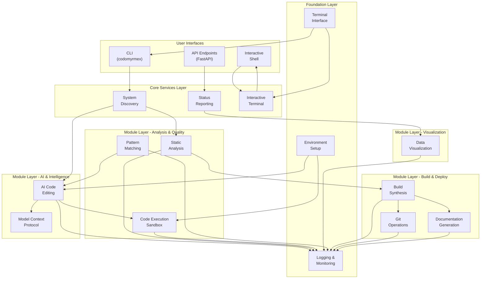

# Codomyrmex Architecture

## Overview

Codomyrmex is designed as a modular, extensible coding workspace that integrates various tools for building, documenting, analyzing, executing, and visualizing code. The architecture follows a layered, modular approach with clear separation of concerns.

## Core Architectural Principles

### 1. Modularity First
- Each module is self-contained with its own dependencies, tests, and documentation
- Modules can be used independently or in combination
- Clear interfaces between modules using defined APIs

### 2. Separation of Tool vs. Content
- **Tools** (like documentation generation) are separate from **content** (like project documentation)
- Codomyrmex tools don't "leave a mark" on the projects they analyze
- Clear boundaries between what Codomyrmex provides vs. what it generates

### 3. Polyglot Support
- Support for multiple programming languages and frameworks
- Language-agnostic interfaces where possible
- Pluggable language-specific implementations

### 4. AI Integration
- Designed for seamless integration with Large Language Models (LLMs)
- Model Context Protocol (MCP) for standardized AI communication
- AI-enhanced workflows without vendor lock-in

## System Architecture



### **System Layer Interactions**

The Codomyrmex architecture follows a **layered approach** with clear separation between:
- **User Interfaces**: How users interact with the system
- **Core Services**: System-level services and orchestration
- **Module Layer**: Functional modules organized by domain
- **Foundation Layer**: Infrastructure services used by all modules

**Related Documentation**:
- **[Module Overview](../modules/overview.md)**: Detailed module architecture
- **[Module Relationships](../modules/relationships.md)**: Inter-module dependencies
- **[API Reference](../reference/api.md)**: Complete API documentation

## Module Categories

### Foundation Modules
**Purpose**: Core infrastructure used by all other modules

- **`logging_monitoring`**: Centralized logging system
- **`environment_setup`**: Environment validation and configuration
- **`terminal_interface`**: Rich terminal interactions and formatting
- **`config_management`**: Centralized configuration management
- **`database_management`**: Data persistence and database operations
- **`language_models`**: LLM infrastructure and provider abstraction
- **`performance`**: Performance monitoring and optimization

### Core Functional Modules
**Purpose**: Primary capabilities that users directly interact with

- **`ai_code_editing`**: AI-powered code generation and modification
- **`static_analysis`**: Code quality analysis and security scanning
- **`code_execution_sandbox`**: Safe code execution environment
- **`data_visualization`**: Chart and plot generation
- **`pattern_matching`**: Code pattern analysis and recognition
- **`git_operations`**: Git workflow automation
- **`code_review`**: Automated code review with AI assistance
- **`security_audit`**: Security vulnerability scanning and compliance
- **`ollama_integration`**: Local LLM integration via Ollama

### Service Modules
**Purpose**: Higher-level services that orchestrate core modules

- **`documentation`**: Documentation website generation
- **`build_synthesis`**: Build automation and code scaffolding
- **`api_documentation`**: API documentation generation (OpenAPI/Swagger)
- **`ci_cd_automation`**: CI/CD pipeline management and deployment
- **`containerization`**: Docker and Kubernetes container management

### Integration Modules
**Purpose**: Standards and protocols for system integration

- **`model_context_protocol`**: Standardized AI/LLM communication
- **`module_template`**: Template for creating new modules

### Application Modules
**Purpose**: User-facing applications and interfaces

- **`system_discovery`**: Module and capability discovery
- **`project_orchestration`**: Workflow orchestration and task management
- **`cli`**: Command-line interface for all modules

### Advanced Modules
**Purpose**: Specialized capabilities for advanced use cases

- **`modeling_3d`**: 3D modeling and visualization
- **`physical_management`**: Physical system simulation and management

## Data Flow Patterns

### 1. Discovery and Analysis Flow
```
User Request → System Discovery → Module Analysis → Capability Mapping → Results
```

### 2. AI-Enhanced Development Flow
```
Code Input → Pattern Analysis → AI Processing → Code Generation → Validation → Output
```

### 3. Quality Assurance Flow
```
Source Code → Static Analysis → Testing → Build Validation → Deployment
```

## Key Design Decisions

### Documentation Architecture
- **Top-level `docs/`**: Documentation about Codomyrmex itself
- **`src/codomyrmex/documentation/`**: Tool for generating documentation for other projects
- **Module `docs/`**: Documentation specific to each module

### Dependency Management
- **Root `requirements.txt`**: Core dependencies used across modules
- **Module `requirements.txt`**: Module-specific dependencies
- **Version pinning**: All dependencies use exact versions for reproducibility

### Configuration Strategy
- **Environment variables**: For runtime configuration and API keys
- **`.env` files**: For local development configuration
- **Module configs**: For module-specific settings

### Testing Strategy
- **Unit tests**: In `testing/unit/` for individual module testing
- **Integration tests**: In `testing/integration/` for cross-module workflows
- **Comprehensive coverage**: Target >80% coverage across all modules

## Extension Points

### Adding New Modules
1. Use the `module_template` as a starting point
2. Follow the established directory structure
3. Implement standard interfaces (`API_SPECIFICATION.md`, `MCP_TOOL_SPECIFICATION.md`)
4. Add comprehensive tests and documentation

### AI Integration
- Implement MCP protocol for LLM communication
- Use standard prompt templates and response formats
- Support multiple AI providers (OpenAI, Anthropic, Google, etc.)

### Language Support
- Extend existing modules to support new languages
- Add language-specific analysis tools
- Implement language-specific code execution environments

## Security Considerations

### Code Execution
- All code execution happens in sandboxed environments
- Network access restrictions for untrusted code
- Resource limits (CPU, memory, time) for all executions

### API Keys and Secrets
- Never commit secrets to version control
- Use environment variables for sensitive configuration
- Validate and sanitize all external inputs

### Static Analysis
- Security-focused linting with `bandit` and other tools
- Regular dependency vulnerability scanning
- Input validation for all user-provided data

## Performance Considerations

### Module Loading
- Lazy loading of modules to reduce startup time
- Cached module discovery to avoid repeated filesystem scans
- Optional dependencies that don't block core functionality

### Concurrent Operations
- Parallel module analysis where possible
- Asynchronous I/O for external service calls
- Progress reporting for long-running operations

### Resource Management
- Memory-efficient processing of large codebases
- Streaming data processing where applicable
- Cleanup of temporary files and resources

## 🔗 Related Documentation

### **Deep Dive Topics**
- **[Module System Overview](../modules/overview.md)**: Detailed module architecture and principles
- **[Module Relationships](../modules/relationships.md)**: Inter-module dependencies and data flow
- **[API Reference](../reference/api.md)**: Complete API documentation for all modules
- **[CLI Reference](../reference/cli.md)**: Command-line interface documentation

### **Development Resources**
- **[Contributing Guide](./contributing.md)**: How to contribute to the architecture
- **[Development Setup](../development/environment-setup.md)**: Setting up development environment
- **[Documentation Guidelines](../development/documentation.md)**: Maintaining architectural documentation
- **[Module Creation Tutorial](../getting-started/tutorials/creating-a-module.md)**: Building new modules

### **User Guides**
- **[Installation Guide](../getting-started/installation.md)**: System requirements and setup
- **[Quick Start Guide](../getting-started/quickstart.md)**: Getting started with the architecture
- **[Troubleshooting Guide](../reference/troubleshooting.md)**: Common architecture-related issues

### **Source Code Navigation**
- **[Source Overview](../../src/README.md)**: Source code organization
- **[Package Overview](../../src/codomyrmex/README.md)**: Main package structure
- **[Module Template](../../src/template/README.md)**: Template for new modules

---

This architecture provides a solid foundation for extensible, maintainable code analysis and development workflow automation while maintaining clear separation of concerns and supporting diverse use cases.

**Next Steps:**
1. **Explore Modules**: Review the [Module System Overview](../modules/overview.md)
2. **Try It Out**: Follow the [Quick Start Guide](../getting-started/quickstart.md)
3. **Get Involved**: Read the [Contributing Guide](./contributing.md)

