# Version Migration Guide

This guide covers upgrading between Codomyrmex versions, handling breaking changes, and maintaining compatibility across different releases.

## 🎯 Migration Overview

### **Semantic Versioning**
Codomyrmex follows [Semantic Versioning](https://semver.org/) principles:

```mermaid
graph LR
    subgraph "Version Format"
        Major["MAJOR.MINOR.PATCH"]
        Major --> MajorEx["1.0.0 → 2.0.0<br/>Breaking Changes"]
        Major --> MinorEx["1.0.0 → 1.1.0<br/>New Features"]
        Major --> PatchEx["1.0.0 → 1.0.1<br/>Bug Fixes"]
    end

    subgraph "Migration Complexity"
        Patch["Patch Updates<br/>🟢 Drop-in replacement"]
        Minor["Minor Updates<br/>🟡 Backward compatible"]
        MajorUp["Major Updates<br/>🔴 Breaking changes"]
    end

    PatchEx --> Patch
    MinorEx --> Minor
    MajorEx --> MajorUp
```



### **Compatibility Matrix**
| From Version | To Version | Migration Type | Effort | Automated Tools |
|-------------|------------|----------------|---------|-----------------|
| 0.1.x | 0.1.y | Patch | Minimal | ✅ Auto-update |
| 0.1.x | 0.2.x | Minor | Low | ✅ Migration script |
| 0.x.x | 1.x.x | Major | Medium | ⚠️ Manual steps required |
| 1.x.x | 2.x.x | Major | High | ⚠️ Extensive changes |

## 🚀 Current Version: 0.1.0 → Future Releases

### **Upcoming: 0.2.0 (Minor Release)**
**Expected Release**: Q2 2024
**Migration Effort**: Low
**Backward Compatibility**: ✅ Maintained

#### **New Features**
- Enhanced AI model support (GPT-4 Turbo, Claude-3)
- Advanced caching mechanisms
- Improved performance monitoring
- Additional data visualization types

#### **API Additions**
```python
# New APIs (additive, backward compatible)
from codomyrmex.agents.ai_code_editing import enhance_code_batch
from codomyrmex.data_visualization import create_interactive_dashboard
from codomyrmex.static_analysis import analyze_security_vulnerabilities

# New configuration options
from codomyrmex.environment_setup import configure_advanced_caching
```

#### **Migration Steps: 0.1.x → 0.2.0**
```bash
# 1. Update package
pip install --upgrade codomyrmex

# 2. Run compatibility check
codomyrmex check-compatibility --from 0.1.x --to 0.2.0

# 3. Update configuration (optional)
codomyrmex migrate-config --version 0.2.0

# 4. Test existing workflows
codomyrmex test-workflows --all
```

**Configuration Changes**:
```yaml
# config_v0.2.yaml - New optional settings
codomyrmex:
  version: "0.2.0"

  # New caching configuration (optional)
  caching:
    enabled: true
    backend: redis  # redis, memory, file
    ttl_default: 3600

  # Enhanced AI configuration (optional)
  ai:
    batch_processing: true
    max_concurrent_requests: 5
    fallback_providers: ["openai", "anthropic"]

  # New monitoring features (optional)
  monitoring:
    detailed_metrics: true
    performance_profiling: true
```

### **Upcoming: 1.0.0 (Major Release)**
**Expected Release**: Q4 2024
**Migration Effort**: Medium
**Backward Compatibility**: ⚠️ Breaking changes

#### **Breaking Changes**
1. **API Restructuring**
   - Module imports reorganized for better consistency
   - Some function signatures changed for improved usability
   - Configuration format updated

2. **Minimum Requirements**
   - Python 3.11+ required (was 3.10+)
   - Updated dependency versions
   - New optional dependencies for advanced features

3. **Deprecated Features Removed**
   - Legacy configuration format no longer supported
   - Old API endpoints removed
   - Deprecated utility functions removed

#### **Migration Steps: 0.x.x → 1.0.0**

##### **Step 1: Pre-Migration Assessment**
```bash
# Run pre-migration analysis
codomyrmex analyze-migration --from $(codomyrmex --version) --to 1.0.0

# Check for deprecated usage
codomyrmex check-deprecated --fix-suggestions

# Backup current configuration
cp -r ~/.codomyrmex ~/.codomyrmex.backup.$(date +%Y%m%d)
```

##### **Step 2: Environment Update**
```bash
# Update Python if needed
pyenv install 3.11
pyenv local 3.11

# Create new virtual environment
python -m venv venv_codomyrmex_1.0
source venv_codomyrmex_1.0/bin/activate

# Install new version
pip install codomyrmex==1.0.0
```

##### **Step 3: Configuration Migration**
```bash
# Migrate configuration automatically
codomyrmex migrate-config --from-version 0.x.x --to-version 1.0.0

# Manual review of migrated config
codomyrmex validate-config --config ~/.codomyrmex/config_v1.0.yaml
```

##### **Step 4: Code Updates**
```python
# Before (v0.x.x) - DEPRECATED
from codomyrmex.coding.data_visualization import create_plot
from codomyrmex.analysis.static import run_analysis

# After (v1.0.0) - NEW STRUCTURE
from codomyrmex.data_visualization import create_line_plot
from codomyrmex.static_analysis import analyze_codebase

# Function signature changes
# Before
result = run_analysis(path, options={'detailed': True})

# After
result = analyze_codebase(path, detailed=True, cache=True)
```

##### **Step 5: Testing & Validation**
```bash
# Run comprehensive tests
codomyrmex test --migration-validation

# Validate all workflows
codomyrmex validate-workflows --path ./my_workflows/

# Performance comparison
codomyrmex benchmark --compare-to 0.x.x
```

## 🔧 Migration Tools & Scripts

### **Automated Migration Script**
```python
#!/usr/bin/env python3
# migrate_to_v1.py - Automated migration script

import os
import sys
import json
import shutil
from pathlib import Path
from typing import Dict, List, Tuple
import ast
import argparse

class CodomyrmexMigrator:
    """Automated migration tool for Codomyrmex version upgrades."""

    def __init__(self, source_version: str, target_version: str):
        self.source_version = source_version
        self.target_version = target_version
        self.migration_log = []

    def migrate_project(self, project_path: Path) -> Dict:
        """Migrate entire project to new version."""
        migration_report = {
            'source_version': self.source_version,
            'target_version': self.target_version,
            'project_path': str(project_path),
            'changes_made': [],
            'warnings': [],
            'manual_steps': []
        }

        try:
            # 1. Backup project
            backup_path = self._create_backup(project_path)
            migration_report['backup_path'] = str(backup_path)

            # 2. Update imports
            import_changes = self._migrate_imports(project_path)
            migration_report['changes_made'].extend(import_changes)

            # 3. Update function calls
            function_changes = self._migrate_function_calls(project_path)
            migration_report['changes_made'].extend(function_changes)

            # 4. Update configuration files
            config_changes = self._migrate_config_files(project_path)
            migration_report['changes_made'].extend(config_changes)

            # 5. Update requirements
            req_changes = self._migrate_requirements(project_path)
            migration_report['changes_made'].extend(req_changes)

            # 6. Generate migration summary
            self._generate_migration_summary(migration_report)

        except Exception as e:
            migration_report['error'] = str(e)
            print(f"Migration failed: {e}")
            # Restore backup
            self._restore_backup(project_path, backup_path)

        return migration_report

    def _migrate_imports(self, project_path: Path) -> List[Dict]:
        """Update import statements for new version."""
        import_mapping = {
            # v0.x.x → v1.0.0 import mappings
            'from codomyrmex.coding.data_visualization import': 'from codomyrmex.data_visualization import',
            'from codomyrmex.analysis.static import': 'from codomyrmex.static_analysis import',
            'from codomyrmex.ai.code_editing import': 'from codomyrmex.agents.ai_code_editing import',
            'from codomyrmex.utils.environment import': 'from codomyrmex.environment_setup import',
        }

        changes = []
        for python_file in project_path.rglob("*.py"):
            try:
                content = python_file.read_text()
                original_content = content

                for old_import, new_import in import_mapping.items():
                    if old_import in content:
                        content = content.replace(old_import, new_import)
                        changes.append({
                            'type': 'import_update',
                            'file': str(python_file),
                            'old': old_import,
                            'new': new_import
                        })

                if content != original_content:
                    python_file.write_text(content)

            except Exception as e:
                changes.append({
                    'type': 'import_error',
                    'file': str(python_file),
                    'error': str(e)
                })

        return changes

    def _migrate_function_calls(self, project_path: Path) -> List[Dict]:
        """Update function calls for new API signatures."""
        function_mapping = {
            # Function signature changes
            'run_analysis(': 'analyze_codebase(',
            'create_plot(': 'create_line_plot(',
            'enhance_code_sync(': 'enhance_code(',
        }

        changes = []
        for python_file in project_path.rglob("*.py"):
            try:
                content = python_file.read_text()
                original_content = content

                for old_func, new_func in function_mapping.items():
                    if old_func in content:
                        # This is a simple replacement - for complex cases, use AST
                        content = content.replace(old_func, new_func)
                        changes.append({
                            'type': 'function_update',
                            'file': str(python_file),
                            'old': old_func,
                            'new': new_func,
                            'note': 'May require parameter adjustments'
                        })

                if content != original_content:
                    python_file.write_text(content)

            except Exception as e:
                changes.append({
                    'type': 'function_error',
                    'file': str(python_file),
                    'error': str(e)
                })

        return changes

    def _migrate_config_files(self, project_path: Path) -> List[Dict]:
        """Migrate configuration files to new format."""
        changes = []

        # Find configuration files
        config_files = [
            *project_path.rglob("codomyrmex.yaml"),
            *project_path.rglob("codomyrmex.yml"),
            *project_path.rglob("codomyrmex.json"),
            *project_path.rglob(".codomyrmex"),
        ]

        for config_file in config_files:
            try:
                if config_file.suffix in ['.yaml', '.yml']:
                    import yaml
                    config_data = yaml.safe_load(config_file.read_text())
                elif config_file.suffix == '.json':
                    config_data = json.loads(config_file.read_text())
                else:
                    # Handle other formats
                    continue

                # Migrate configuration structure
                migrated_config = self._migrate_config_structure(config_data)

                # Write migrated config
                if config_file.suffix in ['.yaml', '.yml']:
                    config_file.write_text(yaml.dump(migrated_config, default_flow_style=False))
                else:
                    config_file.write_text(json.dumps(migrated_config, indent=2))

                changes.append({
                    'type': 'config_migration',
                    'file': str(config_file),
                    'changes': 'Structure updated for v1.0.0'
                })

            except Exception as e:
                changes.append({
                    'type': 'config_error',
                    'file': str(config_file),
                    'error': str(e)
                })

        return changes

    def _migrate_config_structure(self, config: Dict) -> Dict:
        """Migrate configuration structure for new version."""
        migrated = {'codomyrmex': {'version': self.target_version}}

        # Migrate old structure to new
        if 'analysis' in config:
            migrated['codomyrmex']['static_analysis'] = config['analysis']

        if 'ai' in config:
            migrated['codomyrmex']['ai_code_editing'] = config['ai']

        if 'visualization' in config:
            migrated['codomyrmex']['data_visualization'] = config['visualization']

        # Add new default settings
        migrated['codomyrmex'].setdefault('logging', {'level': 'INFO'})
        migrated['codomyrmex'].setdefault('caching', {'enabled': True})

        return migrated

    def _create_backup(self, project_path: Path) -> Path:
        """Create backup of project before migration."""
        timestamp = datetime.now().strftime('%Y%m%d_%H%M%S')
        backup_path = project_path.parent / f"{project_path.name}_backup_{timestamp}"

        shutil.copytree(project_path, backup_path, ignore=shutil.ignore_patterns(
            '*.pyc', '__pycache__', '.git', 'node_modules', '.venv', 'venv'
        ))

        print(f"Created backup at: {backup_path}")
        return backup_path

    def _generate_migration_summary(self, report: Dict):
        """Generate migration summary report."""
        summary_file = Path(report['project_path']) / 'MIGRATION_SUMMARY.md'

        summary_content = f"""# Codomyrmex Migration Summary

**Migration Date**: {datetime.now().isoformat()}
**From Version**: {report['source_version']}
**To Version**: {report['target_version']}
**Project**: {report['project_path']}
**Backup Location**: {report['backup_path']}

## Changes Made

### Import Updates
"""
        import_changes = [c for c in report['changes_made'] if c['type'] == 'import_update']
        for change in import_changes:
            summary_content += f"- **{change['file']}**: `{change['old']}` → `{change['new']}`
"

        summary_content += "
### Function Updates
"
        function_changes = [c for c in report['changes_made'] if c['type'] == 'function_update']
        for change in function_changes:
            summary_content += f"- **{change['file']}**: `{change['old']}` → `{change['new']}`
"
            if change.get('note'):
                summary_content += f"  - ⚠️ {change['note']}
"

        summary_content += f"
## Next Steps

"
        summary_content += f"1. Run tests: `codomyrmex test --all`
"
        summary_content += f"2. Validate configuration: `codomyrmex validate-config`
"
        summary_content += f"3. Check for any remaining issues: `codomyrmex check-compatibility`
"
        summary_content += f"4. If issues occur, restore backup from: `{report['backup_path']}`
"

        summary_file.write_text(summary_content)
        print(f"Migration summary written to: {summary_file}")

def main():
    parser = argparse.ArgumentParser(description='Migrate Codomyrmex project to new version')
    parser.add_argument('--project-path', required=True, help='Path to project to migrate')
    parser.add_argument('--from-version', required=True, help='Source version')
    parser.add_argument('--to-version', required=True, help='Target version')
    parser.add_argument('--dry-run', action='store_true', help='Show changes without applying')

    args = parser.parse_args()

    project_path = Path(args.project_path).resolve()
    if not project_path.exists():
        print(f"Project path does not exist: {project_path}")
        sys.exit(1)

    migrator = CodomyrmexMigrator(args.from_version, args.to_version)

    if args.dry_run:
        print("DRY RUN MODE - No changes will be made")
        # Implement dry run logic here
    else:
        report = migrator.migrate_project(project_path)

        if 'error' in report:
            print(f"Migration failed: {report['error']}")
            sys.exit(1)
        else:
            print("Migration completed successfully!")
            print(f"Changes made: {len(report['changes_made'])}")
            print(f"See MIGRATION_SUMMARY.md for details")

if __name__ == '__main__':
    main()
```

### **Migration Testing Framework**
```python
# test_migration.py - Migration testing framework
import pytest
import tempfile
import shutil
from pathlib import Path
from codomyrmex_migrator import CodomyrmexMigrator

class MigrationTestSuite:
    """Test suite for migration validation."""

    def setup_test_project(self, version: str) -> Path:
        """Set up test project for specific version."""
        test_dir = Path(tempfile.mkdtemp())

        # Create sample project structure
        (test_dir / "src").mkdir()
        (test_dir / "tests").mkdir()

        # Create sample files for different versions
        if version.startswith('0.1'):
            self._create_v01_project(test_dir)
        elif version.startswith('0.2'):
            self._create_v02_project(test_dir)

        return test_dir

    def _create_v01_project(self, project_dir: Path):
        """Create v0.1.x project structure."""
        main_py = project_dir / "src" / "main.py"
        main_py.write_text("""
from codomyrmex.coding.data_visualization import create_plot
from codomyrmex.analysis.static import run_analysis

def main():
    analysis_result = run_analysis("./src", options={'detailed': True})
    plot_result = create_plot(analysis_result.metrics, "quality_metrics.png")

if __name__ == "__main__":
    main()
""")

        config_yaml = project_dir / "codomyrmex.yaml"
        config_yaml.write_text("""
analysis:
  enabled: true
  detailed: true

visualization:
  format: png
  theme: default
""")

    def test_migration_0_1_to_1_0(self):
        """Test migration from 0.1.x to 1.0.0."""
        # Setup
        test_project = self.setup_test_project('0.1.0')
        migrator = CodomyrmexMigrator('0.1.0', '1.0.0')

        # Execute migration
        report = migrator.migrate_project(test_project)

        # Verify migration results
        assert 'error' not in report
        assert len(report['changes_made']) > 0

        # Check specific changes
        main_py_content = (test_project / "src" / "main.py").read_text()
        assert 'from codomyrmex.data_visualization import' in main_py_content
        assert 'from codomyrmex.static_analysis import' in main_py_content
        assert 'analyze_codebase(' in main_py_content

        # Verify backup was created
        assert Path(report['backup_path']).exists()

        # Cleanup
        shutil.rmtree(test_project)
        shutil.rmtree(report['backup_path'])

def run_migration_tests():
    """Run complete migration test suite."""
    test_suite = MigrationTestSuite()
    test_suite.test_migration_0_1_to_1_0()
    print("All migration tests passed!")

if __name__ == '__main__':
    run_migration_tests()
```

## 📋 Version-Specific Migration Guides

### **0.1.x → 0.2.x Migration**

#### **Quick Migration Checklist**
- [ ] Update package: `pip install --upgrade codomyrmex`
- [ ] Run compatibility check: `codomyrmex check-compatibility`
- [ ] Update configuration (optional): Add new caching and monitoring settings
- [ ] Test existing workflows: `codomyrmex test-workflows --all`
- [ ] Review new features: Enhanced AI models, advanced caching, performance monitoring

#### **No Breaking Changes**
All existing code continues to work without modification. New features are additive and optional.

### **0.x.x → 1.0.0 Migration**

#### **Comprehensive Migration Checklist**
- [ ] **Environment**: Update to Python 3.11+
- [ ] **Backup**: Create full project backup
- [ ] **Analysis**: Run migration analysis tool
- [ ] **Import Updates**: Update all import statements
- [ ] **Function Calls**: Update function signatures
- [ ] **Configuration**: Migrate config files
- [ ] **Dependencies**: Update requirements.txt/pyproject.toml
- [ ] **Testing**: Run comprehensive test suite
- [ ] **Validation**: Validate all workflows
- [ ] **Performance**: Run benchmark comparison
- [ ] **Documentation**: Review migration summary

#### **Common Migration Issues & Solutions**

##### **Issue 1: Import Errors**
```python
# Problem
ModuleNotFoundError: No module named 'codomyrmex.coding.data_visualization'

# Solution
# Old import (v0.x.x)
from codomyrmex.coding.data_visualization import create_plot

# New import (v1.0.0)
from codomyrmex.data_visualization import create_line_plot
```

##### **Issue 2: Function Signature Changes**
```python
# Problem
TypeError: run_analysis() got an unexpected keyword argument 'options'

# Solution
# Old call (v0.x.x)
result = run_analysis(path, options={'detailed': True, 'cache': False})

# New call (v1.0.0)
result = analyze_codebase(path, detailed=True, cache=False)
```

##### **Issue 3: Configuration Format**
```yaml
# Problem: Old config format not recognized

# Old format (v0.x.x)
analysis:
  enabled: true
  detailed: true

# New format (v1.0.0)
codomyrmex:
  version: "1.0.0"
  static_analysis:
    enabled: true
    detailed: true
```

## 🔄 Rollback Procedures

### **Automatic Rollback**
```bash
# If migration fails, automatic rollback is triggered
codomyrmex rollback --to-backup /path/to/backup

# Or manually restore from backup
cp -r /path/to/backup/* ./
pip install codomyrmex==$(previous_version)
```

### **Manual Rollback Steps**
1. **Stop all Codomyrmex processes**
2. **Restore code from backup**
3. **Downgrade package**: `pip install codomyrmex==0.1.x`
4. **Restore configuration**
5. **Validate rollback**: `codomyrmex check --all`

## 🛠️ Migration Support

### **Getting Help**
- **Migration Issues**: [GitHub Issues - Migration Label](https://github.com/codomyrmex/codomyrmex/issues?q=label:migration)
- **Community Support**: [Discussions](https://github.com/codomyrmex/codomyrmex/discussions)
- **Professional Support**: Contact team for enterprise migration assistance

### **Migration Tools**
- **`codomyrmex migrate`**: Automated migration tool
- **`codomyrmex check-compatibility`**: Compatibility analysis
- **`codomyrmex test-migration`**: Migration validation
- **`codomyrmex rollback`**: Automated rollback

## 🔗 Related Documentation

- **[Installation Guide](../getting-started/installation.md)**: Fresh installation procedures
- **[Troubleshooting](../reference/troubleshooting.md)**: Migration troubleshooting
- **[API Reference](../reference/api.md)**: API compatibility information
- **[Setup Guide](../getting-started/setup.md)**: Configuration and setup options

---

**Migration Support** ✅:
- [ ] Backup created before migration
- [ ] Migration tool executed successfully
- [ ] All tests pass in new version
- [ ] Configuration validated
- [ ] Performance benchmarked
- [ ] Team notified of migration
- [ ] Documentation updated
- [ ] Rollback plan confirmed

**Need Migration Help?** Use our automated migration tools or contact support for assistance with complex migrations.

## Navigation Links

- **Parent**: [Project Overview](../README.md)
- **Module Index**: [All Agents](../../AGENTS.md)
- **Documentation**: [Reference Guides](../../docs/README.md)
- **Home**: [Repository Root](../../README.md)
