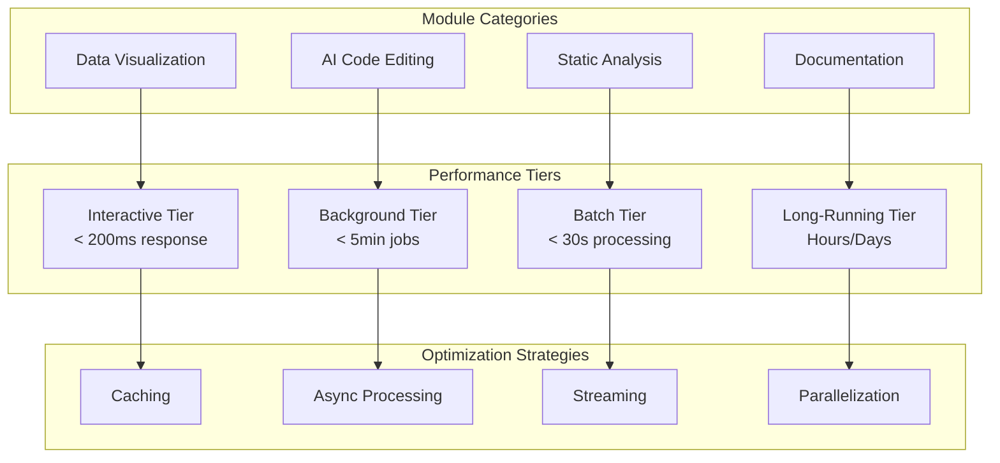

# Performance Overview

> **Navigation hub** — This page orients you to performance documentation. For detailed content, see the linked guides in the "See Also" section below.

This overview covers performance tiers and philosophy for Codomyrmex modules. Full benchmarking data and optimization strategies are in the companion documents.

## 🎯 Performance Overview

### **Performance Philosophy**
- **Efficiency by Design**: Optimal algorithms and data structures
- **Resource Awareness**: Memory and CPU conscious implementations
- **Scalability**: Performance scales with system resources
- **Real-World Focus**: Benchmarks reflect actual usage patterns

### **Performance Tiers**

## See Also

- **[Performance Benchmarks](performance-benchmarks.md)** — Benchmark results, regression data, and testing framework
- **[Performance Optimization & Monitoring](performance-optimization.md)** — Optimization techniques and real-time monitoring
