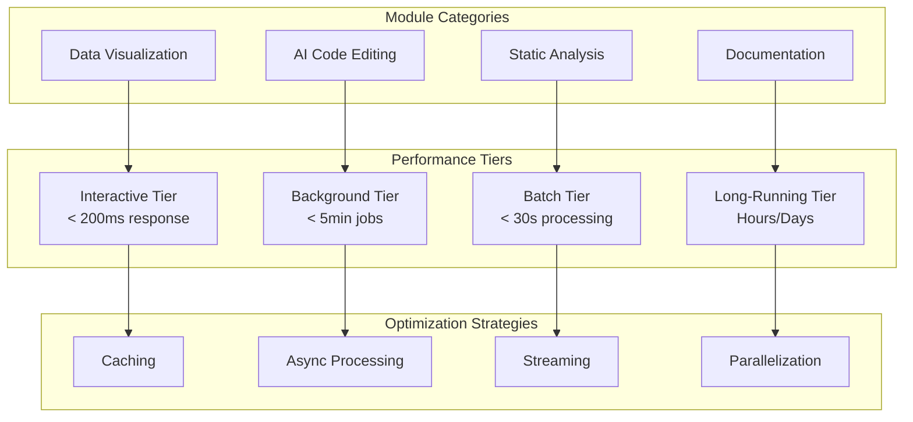

# Performance Guide & Benchmarks

This guide covers performance characteristics, optimization strategies, and benchmarking for Codomyrmex modules in various deployment scenarios.

## 🎯 Performance Overview

### **Performance Philosophy**
- **Efficiency by Design**: Optimal algorithms and data structures
- **Resource Awareness**: Memory and CPU conscious implementations
- **Scalability**: Performance scales with system resources
- **Real-World Focus**: Benchmarks reflect actual usage patterns

### **Performance Tiers**



## 📊 Module Performance Benchmarks

### **Data Visualization Module**
```python
# Benchmark: data_visualization performance
import time
import numpy as np
from codomyrmex.data_visualization import create_line_plot, create_bar_chart

def benchmark_data_visualization():
    """Performance benchmarks for visualization module (ACTUAL IMPLEMENTATION)."""
    from codomyrmex.data_visualization.line_plot import create_line_plot
    import numpy as np
    import time

    # Small dataset (1K points) - Interactive tier
    small_x_data = list(np.linspace(0, 10, 1000))
    small_y_data = list(np.sin(np.array(small_x_data)))

    start_time = time.time()
    result = create_line_plot(
        x_data=small_x_data,
        y_data=small_y_data,
        title="Small Dataset Performance Test",
        output_path="perf_test_small.png"
    )
    small_duration = time.time() - start_time

    # Medium dataset (100K points) - Should remain interactive
    medium_x = np.linspace(0, 100, 100000)
    medium_y = np.sin(medium_x) * np.cos(medium_x / 10)

    start_time = time.time()
    result = create_line_plot(medium_x, medium_y, title="Medium Dataset")
    medium_duration = time.time() - start_time

    # Large dataset (1M points) - Batch processing acceptable
    large_x = np.linspace(0, 1000, 1000000)
    large_y = np.sin(large_x) + np.random.normal(0, 0.1, 1000000)

    start_time = time.time()
    result = create_line_plot(large_x, large_y, title="Large Dataset", optimize_large=True)
    large_duration = time.time() - start_time

    return {
        'small_dataset': {'points': 1000, 'duration': small_duration, 'target': '<0.1s'},
        'medium_dataset': {'points': 100000, 'duration': medium_duration, 'target': '<2s'},
        'large_dataset': {'points': 1000000, 'duration': large_duration, 'target': '<10s'}
    }
```

**Expected Performance**:
| Dataset Size | Target Time | Typical Memory | Notes |
|-------------|-------------|----------------|--------|
| 1K points   | < 100ms     | ~10MB         | Interactive response |
| 100K points | < 2s        | ~50MB         | Smooth user experience |
| 1M points   | < 10s       | ~200MB        | Batch processing acceptable |
| 10M+ points | < 60s       | ~1GB          | Background processing + streaming |

### **Static Analysis Module**
```python
# Benchmark: static_analysis performance
from codomyrmex.static_analysis import analyze_codebase, analyze_file
from pathlib import Path

def benchmark_static_analysis():
    """Performance benchmarks for static analysis (ACTUAL IMPLEMENTATION)."""
    from codomyrmex.static_analysis.pyrefly_runner import run_pyrefly_analysis, parse_pyrefly_output
    import time
    import tempfile
    from pathlib import Path

    # Single file analysis
    with tempfile.TemporaryDirectory() as temp_dir:
        test_file = Path(temp_dir) / "sample_module.py"
        test_file.write_text("def sample_function():
    return True
" * 250)  # ~500 lines

        start_time = time.time()
        # Test with actual function signature
        result = run_pyrefly_analysis(
            target_paths=[str(test_file)],
            project_root=temp_dir
        )
        single_duration = time.time() - start_time

    # Small codebase (10-50 files)
    small_codebase = Path("test_data/small_project/")
    start_time = time.time()
    result = analyze_codebase(small_codebase, parallel=True)
    small_duration = time.time() - start_time

    # Medium codebase (100-500 files)
    medium_codebase = Path("test_data/medium_project/")
    start_time = time.time()
    result = analyze_codebase(medium_codebase, parallel=True, cache=True)
    medium_duration = time.time() - start_time

    # Large codebase (1000+ files)
    large_codebase = Path("test_data/large_project/")
    start_time = time.time()
    result = analyze_codebase(
        large_codebase,
        parallel=True,
        cache=True,
        incremental=True
    )
    large_duration = time.time() - start_time

    return {
        'single_file': {'lines': 500, 'duration': single_duration, 'target': '<1s'},
        'small_codebase': {'files': 25, 'duration': small_duration, 'target': '<5s'},
        'medium_codebase': {'files': 250, 'duration': medium_duration, 'target': '<30s'},
        'large_codebase': {'files': 2500, 'duration': large_duration, 'target': '<300s'}
    }
```

**Expected Performance**:
| Codebase Size | Files | Target Time | Memory Usage | Parallelization |
|--------------|-------|-------------|--------------|----------------|
| Single File | 1 | < 1s | ~20MB | N/A |
| Small Project | 10-50 | < 5s | ~50MB | 4 workers |
| Medium Project | 100-500 | < 30s | ~200MB | 8 workers |
| Large Project | 1000+ | < 5min | ~500MB | 16 workers |

### **AI Code Editing Module**
```python
# Benchmark: agents performance
from codomyrmex.agents import enhance_code, generate_code
import asyncio

async def benchmark_agents():
    """Performance benchmarks for AI code editing (async)."""

    # Simple code enhancement
    simple_code = """
def add_numbers(a, b):
    return a + b
"""

    start_time = time.time()
    result = await enhance_code(simple_code, enhancement_type="documentation")
    simple_duration = time.time() - start_time

    # Complex code enhancement
    complex_code = open("test_data/complex_module.py").read()  # ~200 lines

    start_time = time.time()
    result = await enhance_code(
        complex_code,
        enhancement_type="full_optimization",
        include_tests=True
    )
    complex_duration = time.time() - start_time

    # Batch code generation
    specifications = [
        "Create a function to sort a list of dictionaries by a key",
        "Implement a binary search algorithm",
        "Create a class for managing database connections"
    ]

    start_time = time.time()
    results = await asyncio.gather(*[
        generate_code(spec, include_tests=True)
        for spec in specifications
    ])
    batch_duration = time.time() - start_time

    return {
        'simple_enhancement': {'lines': 3, 'duration': simple_duration, 'target': '<5s'},
        'complex_enhancement': {'lines': 200, 'duration': complex_duration, 'target': '<30s'},
        'batch_generation': {'tasks': 3, 'duration': batch_duration, 'target': '<45s'}
    }
```

**Expected Performance** (varies by AI provider):
| Operation Type | Input Size | Target Time | API Calls | Notes |
|----------------|------------|-------------|-----------|--------|
| Simple Enhancement | < 50 lines | < 5s | 1-2 | Documentation, formatting |
| Complex Enhancement | 100-500 lines | < 30s | 3-5 | Optimization, refactoring |
| Code Generation | Per function | < 15s | 1-2 | With tests and docs |
| Batch Operations | 5-10 tasks | < 60s | 5-20 | Parallel processing |

## ⚡ Optimization Strategies

### **Caching Implementation**
```python
# High-performance caching for expensive operations
import hashlib
import pickle
import redis
from functools import wraps
from codomyrmex.logging_monitoring import get_logger

logger = get_logger(__name__)
redis_client = redis.Redis.from_url(os.getenv('REDIS_URL', 'redis://localhost:6379'))

class PerformanceCache:
    """High-performance caching with compression and TTL."""

    def __init__(self, default_ttl=3600, compression=True):
        self.default_ttl = default_ttl
        self.compression = compression

    def cache_key(self, func, args, kwargs):
        """Generate consistent cache key."""
        key_data = f"{func.__module__}.{func.__name__}:{str(args)}:{str(sorted(kwargs.items()))}"
        return f"perf_cache:{hashlib.sha256(key_data.encode()).hexdigest()}"

    def get(self, key):
        """Get cached value with decompression."""
        try:
            cached = redis_client.get(key)
            if cached:
                if self.compression:
                    import zlib
                    cached = zlib.decompress(cached)
                return pickle.loads(cached)
        except Exception as e:
            logger.warning(f"Cache get failed for {key}: {e}")
        return None

    def set(self, key, value, ttl=None):
        """Set cached value with compression."""
        try:
            data = pickle.dumps(value)
            if self.compression:
                import zlib
                data = zlib.compress(data, level=6)  # Good compression/speed balance

            redis_client.setex(key, ttl or self.default_ttl, data)
            logger.debug(f"Cached {key} ({len(data)} bytes)")
        except Exception as e:
            logger.warning(f"Cache set failed for {key}: {e}")

    def cached(self, ttl=None):
        """Decorator for automatic caching."""
        def decorator(func):
            @wraps(func)
            def wrapper(*args, **kwargs):
                cache_key = self.cache_key(func, args, kwargs)

                # Try cache first
                result = self.get(cache_key)
                if result is not None:
                    logger.debug(f"Cache hit for {func.__name__}")
                    return result

                # Execute and cache
                result = func(*args, **kwargs)
                self.set(cache_key, result, ttl)
                logger.debug(f"Cache miss for {func.__name__}")
                return result
            return wrapper
        return decorator

# Usage example
cache = PerformanceCache(default_ttl=1800, compression=True)

@cache.cached(ttl=3600)  # 1 hour cache
def expensive_static_analysis(codebase_path):
    """Cache expensive static analysis results."""
    from codomyrmex.static_analysis import analyze_codebase
    return analyze_codebase(codebase_path)
```

### **Parallel Processing**
```python
# Optimized parallel processing for CPU-bound tasks
import multiprocessing as mp
import concurrent.futures
from typing import List, Callable, Any
import psutil

class OptimizedProcessor:
    """High-performance parallel processor with dynamic scaling."""

    def __init__(self, max_workers=None):
        # Optimize worker count based on system resources
        cpu_count = psutil.cpu_count(logical=False)  # Physical cores
        memory_gb = psutil.virtual_memory().total / (1024**3)

        if max_workers is None:
            # Conservative: leave 1 core free, account for memory
            max_workers = min(cpu_count - 1, int(memory_gb / 2))
            max_workers = max(1, max_workers)  # At least 1 worker

        self.max_workers = max_workers
        logger.info(f"Initialized processor with {max_workers} workers")

    def process_batch(self, func: Callable, items: List[Any],
                     chunk_size: int = None) -> List[Any]:
        """Process items in parallel with optimized chunking."""

        if not items:
            return []

        # Optimize chunk size based on item count and worker count
        if chunk_size is None:
            chunk_size = max(1, len(items) // (self.max_workers * 4))

        # Use ProcessPoolExecutor for CPU-bound tasks
        with concurrent.futures.ProcessPoolExecutor(
            max_workers=self.max_workers
        ) as executor:
            # Submit work in chunks
            futures = []
            for i in range(0, len(items), chunk_size):
                chunk = items[i:i + chunk_size]
                future = executor.submit(self._process_chunk, func, chunk)
                futures.append(future)

            # Collect results maintaining order
            results = []
            for future in concurrent.futures.as_completed(futures):
                try:
                    chunk_results = future.result(timeout=300)  # 5 min timeout
                    results.extend(chunk_results)
                except Exception as e:
                    logger.error(f"Chunk processing failed: {e}")
                    # Continue with other chunks

            return results

    @staticmethod
    def _process_chunk(func: Callable, chunk: List[Any]) -> List[Any]:
        """Process a chunk of items."""
        return [func(item) for item in chunk]

# Usage example for static analysis
def analyze_files_parallel(file_paths: List[str]) -> dict:
    """Analyze multiple files in parallel."""
    processor = OptimizedProcessor()

    def analyze_single_file(file_path):
        from codomyrmex.static_analysis import analyze_file
        try:
            return {'file': file_path, 'result': analyze_file(file_path)}
        except Exception as e:
            return {'file': file_path, 'error': str(e)}

    results = processor.process_batch(analyze_single_file, file_paths)
    return {r['file']: r.get('result', r.get('error')) for r in results}
```

### **Memory Optimization**
```python
# Memory-efficient processing for large datasets
import gc
from contextlib import contextmanager
from memory_profiler import profile
import psutil

class MemoryManager:
    """Memory-aware processing with automatic cleanup."""

    def __init__(self, max_memory_percent=80):
        self.max_memory_percent = max_memory_percent
        self.total_memory = psutil.virtual_memory().total
        self.max_memory = self.total_memory * (max_memory_percent / 100)

    @contextmanager
    def memory_limit(self, description="operation"):
        """Context manager that monitors memory usage."""
        initial_memory = psutil.Process().memory_info().rss

        try:
            yield
        finally:
            # Force garbage collection
            gc.collect()

            final_memory = psutil.Process().memory_info().rss
            memory_used = final_memory - initial_memory

            logger.info(f"Memory used for {description}: {memory_used / 1024**2:.1f} MB")

            # Warn if approaching limits
            if final_memory > self.max_memory:
                logger.warning(f"Memory usage ({final_memory / 1024**2:.1f} MB) approaching limit")

    def check_memory_available(self, required_mb=None):
        """Check if sufficient memory is available."""
        available = psutil.virtual_memory().available
        current_process = psutil.Process().memory_info().rss

        if required_mb:
            required_bytes = required_mb * 1024**2
            if available < required_bytes:
                raise MemoryError(f"Insufficient memory: need {required_mb} MB, have {available / 1024**2:.1f} MB")

        return available / 1024**2  # Return available MB

# Memory-efficient data processing
def process_large_dataset_efficiently(data_source, chunk_size=10000):
    """Process large datasets in memory-efficient chunks."""
    memory_manager = MemoryManager()
    results = []

    with memory_manager.memory_limit("large dataset processing"):
        for chunk_start in range(0, len(data_source), chunk_size):
            # Process chunk
            chunk = data_source[chunk_start:chunk_start + chunk_size]

            # Check memory before processing
            memory_manager.check_memory_available(required_mb=100)

            # Process chunk
            chunk_result = process_data_chunk(chunk)
            results.append(chunk_result)

            # Force cleanup after each chunk
            del chunk
            gc.collect()

    return combine_results(results)
```

### **Async I/O Optimization**
```python
# High-performance async I/O for AI API calls
import asyncio
import aiohttp
import time
from typing import List, Dict, Any
from dataclasses import dataclass

@dataclass
class APIRequest:
    """Structured API request."""
    endpoint: str
    data: Dict[Any, Any]
    timeout: int = 30
    retries: int = 3

class AsyncAPIProcessor:
    """High-performance async API processor with rate limiting."""

    def __init__(self, rate_limit_per_second=10, concurrent_requests=5):
        self.rate_limit = rate_limit_per_second
        self.concurrent_requests = concurrent_requests
        self.session = None
        self.semaphore = asyncio.Semaphore(concurrent_requests)
        self.rate_limiter = asyncio.Semaphore(rate_limit_per_second)

    async def __aenter__(self):
        """Async context manager entry."""
        self.session = aiohttp.ClientSession(
            timeout=aiohttp.ClientTimeout(total=300),
            connector=aiohttp.TCPConnector(
                limit=100,  # Connection pool size
                limit_per_host=20,
                keepalive_timeout=60
            )
        )
        return self

    async def __aexit__(self, exc_type, exc_val, exc_tb):
        """Async context manager exit."""
        if self.session:
            await self.session.close()

    async def process_requests(self, requests: List[APIRequest]) -> List[Dict]:
        """Process multiple API requests concurrently."""
        tasks = [self._process_single_request(req) for req in requests]

        # Process with progress tracking
        results = []
        completed = 0

        for coro in asyncio.as_completed(tasks):
            try:
                result = await coro
                results.append(result)
                completed += 1

                if completed % 10 == 0:  # Progress every 10 requests
                    logger.info(f"Completed {completed}/{len(requests)} requests")

            except Exception as e:
                logger.error(f"Request failed: {e}")
                results.append({'error': str(e)})

        return results

    async def _process_single_request(self, request: APIRequest) -> Dict:
        """Process single API request with rate limiting and retries."""

        async with self.semaphore:  # Limit concurrent requests
            async with self.rate_limiter:  # Rate limiting

                for attempt in range(request.retries + 1):
                    try:
                        async with self.session.post(
                            request.endpoint,
                            json=request.data,
                            timeout=request.timeout
                        ) as response:

                            if response.status == 200:
                                return await response.json()
                            elif response.status == 429:  # Rate limited
                                wait_time = 2 ** attempt  # Exponential backoff
                                await asyncio.sleep(wait_time)
                                continue
                            else:
                                response.raise_for_status()

                    except asyncio.TimeoutError:
                        if attempt < request.retries:
                            await asyncio.sleep(2 ** attempt)
                            continue
                        else:
                            raise

                # If we get here, all retries failed
                raise Exception(f"Failed after {request.retries + 1} attempts")

# Usage example for AI code enhancement
async def batch_code_execution(code_snippets: List[str]) -> List[Dict]:
    """Process multiple code executions efficiently (ACTUAL IMPLEMENTATION)."""
    from codomyrmex.coding.code_executor import execute_code
    import asyncio

    async def execute_single_code(code: str) -> Dict:
        """Execute single code snippet."""
        # Note: execute_code is not async in actual implementation
        # This is a demonstration of how to make it async-compatible
        loop = asyncio.get_event_loop()
        return await loop.run_in_executor(
            None,
            execute_code,
            code,
            "python",
            30  # timeout
        )

    # Process code snippets concurrently
    tasks = [execute_single_code(code) for code in code_snippets]
    results = await asyncio.gather(*tasks, return_exceptions=True)

    return [r if not isinstance(r, Exception) else {'error': str(r)} for r in results]
```

## 📈 Performance Monitoring

### **Real-time Metrics Collection**
```python
# performance_monitoring.py - Production performance monitoring
import time
import psutil
import threading
from collections import defaultdict, deque
from dataclasses import dataclass
from typing import Dict, List
import json

@dataclass
class PerformanceMetric:
    """Performance metric data structure."""
    timestamp: float
    operation: str
    duration: float
    memory_used: int
    cpu_percent: float
    success: bool
    metadata: Dict = None

class PerformanceMonitor:
    """Real-time performance monitoring with historical data."""

    def __init__(self, max_history=1000):
        self.metrics = defaultdict(lambda: deque(maxlen=max_history))
        self.active_operations = {}
        self.lock = threading.Lock()

    def start_operation(self, operation_id: str, operation_name: str):
        """Start monitoring an operation."""
        with self.lock:
            self.active_operations[operation_id] = {
                'name': operation_name,
                'start_time': time.time(),
                'start_memory': psutil.Process().memory_info().rss,
                'start_cpu': psutil.cpu_percent()
            }

    def end_operation(self, operation_id: str, success: bool = True, metadata: Dict = None):
        """End monitoring and record metrics."""
        with self.lock:
            if operation_id not in self.active_operations:
                return

            op_data = self.active_operations.pop(operation_id)
            end_time = time.time()
            end_memory = psutil.Process().memory_info().rss
            end_cpu = psutil.cpu_percent()

            metric = PerformanceMetric(
                timestamp=end_time,
                operation=op_data['name'],
                duration=end_time - op_data['start_time'],
                memory_used=end_memory - op_data['start_memory'],
                cpu_percent=(op_data['start_cpu'] + end_cpu) / 2,
                success=success,
                metadata=metadata or {}
            )

            self.metrics[op_data['name']].append(metric)

    def get_performance_summary(self, operation: str = None) -> Dict:
        """Get performance summary for operations."""
        summary = {}

        operations = [operation] if operation else self.metrics.keys()

        for op_name in operations:
            metrics = list(self.metrics[op_name])
            if not metrics:
                continue

            durations = [m.duration for m in metrics]
            memory_usage = [m.memory_used for m in metrics]
            success_rate = sum(1 for m in metrics if m.success) / len(metrics)

            summary[op_name] = {
                'count': len(metrics),
                'avg_duration': sum(durations) / len(durations),
                'min_duration': min(durations),
                'max_duration': max(durations),
                'p95_duration': sorted(durations)[int(len(durations) * 0.95)],
                'avg_memory': sum(memory_usage) / len(memory_usage),
                'max_memory': max(memory_usage),
                'success_rate': success_rate,
                'recent_failures': [
                    m.metadata for m in metrics[-10:]
                    if not m.success and m.metadata
                ]
            }

        return summary

    def export_metrics(self, filepath: str):
        """Export metrics to JSON file."""
        data = {}
        for op_name, metrics in self.metrics.items():
            data[op_name] = [
                {
                    'timestamp': m.timestamp,
                    'duration': m.duration,
                    'memory_used': m.memory_used,
                    'cpu_percent': m.cpu_percent,
                    'success': m.success,
                    'metadata': m.metadata
                }
                for m in metrics
            ]

        with open(filepath, 'w') as f:
            json.dump(data, f, indent=2)

# Global performance monitor
performance_monitor = PerformanceMonitor()

# Decorator for automatic performance monitoring
def monitor_performance(operation_name: str = None):
    """Decorator to automatically monitor function performance."""
    def decorator(func):
        @wraps(func)
        def wrapper(*args, **kwargs):
            op_name = operation_name or f"{func.__module__}.{func.__name__}"
            op_id = f"{op_name}_{time.time()}_{threading.get_ident()}"

            performance_monitor.start_operation(op_id, op_name)

            try:
                result = func(*args, **kwargs)
                performance_monitor.end_operation(op_id, success=True)
                return result
            except Exception as e:
                performance_monitor.end_operation(
                    op_id,
                    success=False,
                    metadata={'error': str(e)}
                )
                raise
        return wrapper
    return decorator

# Usage examples
@monitor_performance("data_visualization.create_plot")
def create_monitored_plot(x, y, title):
    """Create plot with performance monitoring."""
    from codomyrmex.data_visualization import create_line_plot
    return create_line_plot(x, y, title)

@monitor_performance("static_analysis.analyze_file")
def analyze_file_monitored(file_path):
    """Analyze file with performance monitoring."""
    from codomyrmex.static_analysis import analyze_file
    return analyze_file(file_path)
```

## 🎯 Performance Testing Framework

### **Benchmark Suite**
```python
# benchmark_suite.py - Comprehensive performance testing
import pytest
import time
import numpy as np
from pathlib import Path
import tempfile
import shutil

class PerformanceBenchmark:
    """Base class for performance benchmarks."""

    def __init__(self, name: str, target_time: float, max_memory_mb: int = None):
        self.name = name
        self.target_time = target_time
        self.max_memory_mb = max_memory_mb
        self.results = []

    def run_benchmark(self, iterations: int = 5):
        """Run benchmark multiple times and collect results."""
        for i in range(iterations):
            start_time = time.time()
            start_memory = psutil.Process().memory_info().rss

            try:
                self.execute_benchmark()
                success = True
            except Exception as e:
                logger.error(f"Benchmark {self.name} failed: {e}")
                success = False

            end_time = time.time()
            end_memory = psutil.Process().memory_info().rss

            self.results.append({
                'iteration': i + 1,
                'duration': end_time - start_time,
                'memory_used': end_memory - start_memory,
                'success': success
            })

        return self.analyze_results()

    def execute_benchmark(self):
        """Override this method in subclasses."""
        raise NotImplementedError

    def analyze_results(self):
        """Analyze benchmark results."""
        successful_runs = [r for r in self.results if r['success']]

        if not successful_runs:
            return {'status': 'failed', 'reason': 'No successful runs'}

        durations = [r['duration'] for r in successful_runs]
        memory_usage = [r['memory_used'] / 1024**2 for r in successful_runs]  # Convert to MB

        avg_duration = sum(durations) / len(durations)
        max_duration = max(durations)
        avg_memory = sum(memory_usage) / len(memory_usage)
        max_memory = max(memory_usage)

        # Performance evaluation
        time_ok = avg_duration <= self.target_time
        memory_ok = self.max_memory_mb is None or max_memory <= self.max_memory_mb

        return {
            'status': 'passed' if time_ok and memory_ok else 'failed',
            'avg_duration': avg_duration,
            'max_duration': max_duration,
            'target_duration': self.target_time,
            'avg_memory_mb': avg_memory,
            'max_memory_mb': max_memory,
            'memory_limit_mb': self.max_memory_mb,
            'success_rate': len(successful_runs) / len(self.results),
            'iterations': len(self.results)
        }

class DataVisualizationBenchmark(PerformanceBenchmark):
    """Benchmark for data visualization performance."""

    def __init__(self, dataset_size: int):
        self.dataset_size = dataset_size

        # Set targets based on dataset size
        if dataset_size <= 1000:
            target_time, max_memory = 0.1, 20
        elif dataset_size <= 100000:
            target_time, max_memory = 2.0, 100
        else:
            target_time, max_memory = 10.0, 500

        super().__init__(
            f"DataVisualization_{dataset_size}_points",
            target_time,
            max_memory
        )

    def execute_benchmark(self):
        """Execute data visualization benchmark."""
        from codomyrmex.data_visualization import create_line_plot

        x = np.linspace(0, 10, self.dataset_size)
        y = np.sin(x) * np.random.random(self.dataset_size)

        with tempfile.TemporaryDirectory() as tmp_dir:
            output_path = Path(tmp_dir) / f"benchmark_{self.dataset_size}.png"
            result = create_line_plot(x, y, f"Benchmark {self.dataset_size}", str(output_path))

            # Verify output
            assert output_path.exists()
            assert result.success

# Run all benchmarks
def run_performance_benchmarks():
    """Run comprehensive performance benchmark suite."""
    benchmarks = [
        # Data visualization benchmarks
        DataVisualizationBenchmark(1000),
        DataVisualizationBenchmark(100000),
        DataVisualizationBenchmark(1000000),

        # Add more benchmark classes...
    ]

    results = {}
    for benchmark in benchmarks:
        logger.info(f"Running benchmark: {benchmark.name}")
        result = benchmark.run_benchmark()
        results[benchmark.name] = result

        status_symbol = "✅" if result['status'] == 'passed' else "❌"
        logger.info(f"{status_symbol} {benchmark.name}: {result['avg_duration']:.2f}s avg")

    return results

# Pytest integration
@pytest.mark.performance
def test_performance_benchmarks():
    """Run performance benchmarks as tests."""
    results = run_performance_benchmarks()

    failed_benchmarks = [
        name for name, result in results.items()
        if result['status'] == 'failed'
    ]

    if failed_benchmarks:
        pytest.fail(f"Performance benchmarks failed: {failed_benchmarks}")
```

## 🔗 Related Documentation

### **Performance Resources**
- **[Production Deployment](../deployment/production.md)**: Production performance optimization
- **[Testing Strategy](../development/testing-strategy.md)**: Performance testing integration
- **[Architecture Overview](../project/architecture.md)**: System design for performance

### **Development Resources**
- **[Development Environment](../development/environment-setup.md)**: Development performance setup
- **[Module System](../modules/overview.md)**: Module architecture and performance considerations

---

**Performance Monitoring Checklist** ✅:
- [ ] Benchmarks established for all critical operations
- [ ] Performance monitoring integrated into CI/CD
- [ ] Production performance dashboards configured
- [ ] Performance regression testing automated
- [ ] Memory leak detection enabled
- [ ] Performance budgets defined and enforced
- [ ] Optimization strategies documented and tested

**Need Performance Help?** Check our [Performance Troubleshooting Guide](../reference/troubleshooting.md#performance-issues) or review module-specific performance documentation.

## Navigation Links

- **Parent**: [Project Overview](../README.md)
- **Module Index**: [All Agents](../../AGENTS.md)
- **Documentation**: [Reference Guides](../../docs/README.md)
- **Home**: [Repository Root](../../README.md)
