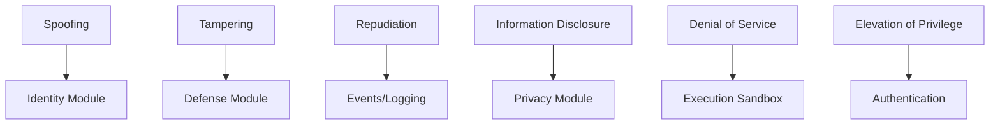

# Security Documentation

**Version**: v1.1.9 | **Status**: Active | **Last Updated**: March 2026

## Overview

Comprehensive security documentation covering the Codomyrmex platform's security posture, threat modeling, and defense mechanisms. The security framework spans digital, physical, cognitive, and AI safety domains.

## Security Posture (v1.1.9)

| Metric | Status |
|--------|--------|
| Ruff violations | **0** (119k triaged) |
| Bandit scan | CI integrated |
| CodeQL analysis | CI integrated |
| pip-audit | CI integrated |
| detect-secrets | Pre-commit hook |
| SECURITY.md | Published |

## Contents

| File | Description |
|------|-------------|
| [index.md](index.md) | Security documentation index |
| [security-theory.md](security-theory.md) | Foundational security theory |
| [digital-security.md](digital-security.md) | Digital security practices |
| [physical-security.md](physical-security.md) | Physical security considerations |
| [cognitive-security.md](cognitive-security.md) | Cognitive security & social engineering defense |
| [ai-safety.md](ai-safety.md) | AI safety principles and guardrails |
| [trust-and-governance.md](trust-and-governance.md) | Trust models and governance |
| [AGENTS.md](AGENTS.md) | Agent coordination for security |
| [SPEC.md](SPEC.md) | Security functional specification |
| [PAI.md](PAI.md) | PAI security integration |

## STRIDE Threat Model

## Security Measures

- **No `eval`/`exec` on user input** — all dynamic execution is sandboxed
- **Explicit subprocess calls** — no shell=True on untrusted input
- **Dependency auditing** — pip-audit in CI + dependabot
- **Secret detection** — detect-secrets in pre-commit, TruffleHog in CI
- **SBOM generation** — CycloneDX format

## Related Documentation

- [SECURITY.md](../../SECURITY.md) — Security policy and reporting
- [Defense Module](../modules/defense/) — Active defense implementation
- [Privacy Module](../modules/privacy/) — Privacy and mixnet routing
- [Identity Module](../modules/identity/) — Identity and verification
- [Security Reference](../reference/security.md) — Quick reference

## Navigation

- **Parent**: [docs/](../README.md)
- **Root**: [Project Root](../../README.md)
