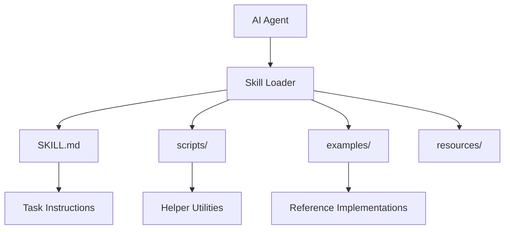

# Skills Documentation

**Version**: v1.1.6 | **Status**: Active | **Last Updated**: March 2026

## Overview

The Codomyrmex skill system provides structured instruction sets that extend AI agent capabilities for specialized tasks. Skills are organized as folders containing `SKILL.md` instruction files, optional scripts, examples, and resources.

## Skill Architecture



## Available Skills

| Skill | Description | Source |
| --- | --- | --- |
| Modern Python | uv, ruff, ty best practices | Trail of Bits |
| Property Testing | Hypothesis-based property tests | Trail of Bits |
| Security Audit | Security audit methodology | Trail of Bits |
| Systematic Debugging | Root cause investigation | Superpowers |
| TDD | Test-driven development | Superpowers |
| Coverage Push | Zero-mock coverage improvement | Internal |
| Desloppify | Code health scanner | Internal |
| GitNexus | Git repo analysis | Internal |
| qmd | Quick Markdown Search | External |

## Skill File Structure

```text
skills/
├── skill_name/
│   ├── SKILL.md          # Main instructions (required)
│   ├── scripts/          # Helper scripts
│   ├── examples/         # Reference implementations
│   └── resources/        # Additional files
```

## Contents

| File | Description |
| --- | --- |
| [AGENTS.md](AGENTS.md) | Agent coordination for skills |
| [SPEC.md](SPEC.md) | Skills functional specification |
| [PAI.md](PAI.md) | PAI integration for skills |

## Related Documentation

- [Agent Documentation](../agents/) — Agent rules and coordination
- [PAI Infrastructure](../pai/) — Personal AI bridge
- [Skills Source](../../skills/) — Skill implementations

## Navigation

- **Parent**: [docs/](../README.md)
- **Root**: [Project Root](../../README.md)
