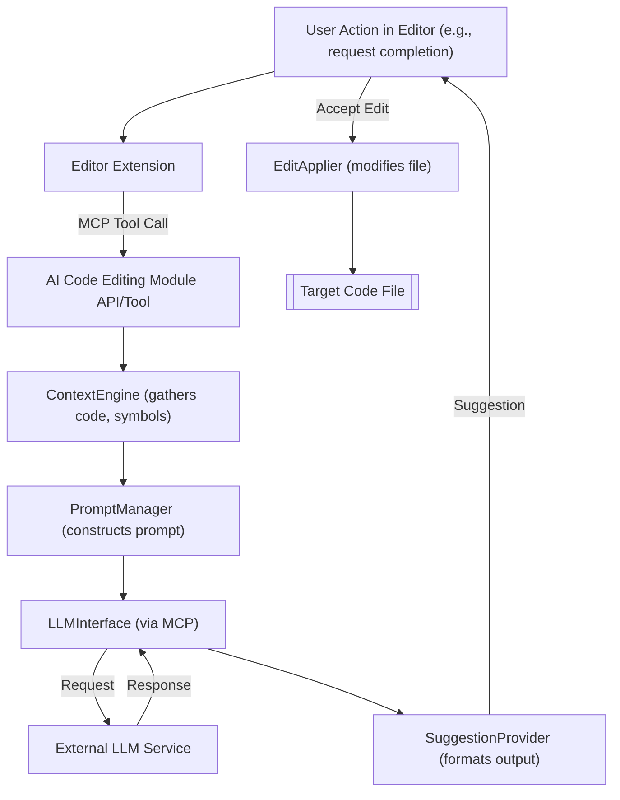

# Ai Code Editing - Technical Overview

This document provides a detailed technical overview of the Ai Code Editing module.

## 1. Introduction and Purpose

The AI Code Editing module is designed to seamlessly integrate advanced AI capabilities into the developer's coding environment. Its primary purpose is to assist developers by automating and enhancing tasks such as code generation, completion, refactoring, explanation, and bug detection. It aims to improve productivity and code quality by leveraging Large Language Models (LLMs) and other AI techniques through the Model Context Protocol (MCP) or direct API interactions.

Key responsibilities within the Codomyrmex ecosystem include:
- Providing tools and interfaces for AI-driven code manipulation.
- Managing context and prompts for effective LLM interaction in coding tasks.
- Offering a standardized way for different editor extensions or services to access AI coding assistance.

## 2. Architecture

(This section will evolve as the module is built. A conceptual architecture is outlined below.)

- **Key Components/Sub-modules**:
  - `PromptManager`: Responsible for selecting, formatting, and managing prompts tailored for various coding tasks (e.g., generate function, explain error, refactor class).
  - `ContextEngine`: Gathers and structures relevant context from the codebase. This includes current file content, related files, symbol definitions, and project dependencies. It might leverage `cased/kit` for some of this information.
  - `LLMInterface (via MCP)`: Communicates with LLMs using the Model Context Protocol. It sends the prepared prompt and context, and receives the AI-generated response.
  - `EditApplier`: Takes the AI-generated code or suggestions and applies them to the target file(s). This component must handle potential conflicts and ensure changes are applied correctly (e.g., using diffing and patching).
  - `SuggestionProvider`: Formats AI responses into actionable suggestions for the user (e.g., code completions, inline diffs for refactoring).
  - `APIEndpoints/ToolDefinitions`: Exposes the module's functionality through defined APIs (see `api_specification.md`) or MCP tools (see `mcp_tool_specification.md`).

- **Data Flow** (Conceptual for a code generation task):
  1. User triggers an AI action in their editor (e.g., "generate function to sort a list").
  2. Editor extension calls the AI Code Editing module (e.g., via an MCP tool).
  3. `ContextEngine` gathers relevant code from the current file and project.
  4. `PromptManager` constructs a detailed prompt using the user's request and the gathered context.
  5. `LLMInterface` sends the prompt and context to the configured LLM.
  6. LLM returns a code suggestion.
  7. `SuggestionProvider` presents the suggestion to the user.
  8. If accepted, `EditApplier` integrates the code into the file.

- **Core Algorithms/Logic**:
  - Context-aware prompt engineering.
  - Diff generation and application for code changes.
  - Parsing and understanding AI model outputs.

- **External Dependencies**:
  - Model Context Protocol module (for LLM communication).
  - `cased/kit` (potentially, for advanced codebase analysis and context gathering).
  - Underlying LLM services (OpenAI, Anthropic, etc.).

## 3. Design Decisions and Rationale

- **Choice of MCP for LLM Interaction**: Using the Model Context Protocol standardizes LLM communication, allowing flexibility in choosing LLM providers and promoting interoperability with other Codomyrmex modules.
- **Modular Design**: Separating concerns like context gathering, prompt management, and edit application allows for easier maintenance and extension.
- **Emphasis on User Control**: While AI can suggest and generate code, the design should prioritize user review and confirmation before applying changes to maintain code integrity.

## 4. Data Models

- **`EditOperation`**: Defines the parameters for a code modification, including target file, line numbers, code content, and type of operation (insert, replace, delete).
- **`CodeContextBundle`**: A structure containing all relevant information (code snippets, AST nodes, dependencies) passed to the LLM.

## 5. Configuration

- `DEFAULT_LLM_MODEL`: Specifies the default LLM to use for code editing tasks.
- `MAX_CONTEXT_TOKENS`: Limits the amount of context sent to the LLM to manage cost and performance.
- `USER_CONFIRMATION_REQUIRED`: Boolean (true/false) to control if edits are applied automatically or require user approval.

## 6. Scalability and Performance

- Performance will depend heavily on the responsiveness of the underlying LLM services.
- Context gathering can be optimized using caching and efficient codebase indexing (potentially via `cased/kit`).
- For large edit operations or whole-file generation, asynchronous processing might be necessary.

## 7. Security Aspects

- **API Key Management**: Secure storage and handling of API keys for LLM services are crucial. These should ideally be managed by the `environment_setup` module and accessed securely.
- **Prompt Injection**: Care must be taken to sanitize user inputs that form part of prompts to prevent malicious instructions from being sent to the LLM, which could then generate harmful code.
- **Review of Generated Code**: As AI can sometimes produce insecure or buggy code, users must be encouraged to review all AI-generated code before integration.

## 8. Future Development / Roadmap

- Integration with more sophisticated static analysis tools to validate AI suggestions.
- Fine-tuning custom models for specific coding styles or domains within the Codomyrmex project.
- Support for more complex refactoring operations (e.g., extract method, rename symbol across project).
- Interactive code generation sessions. 