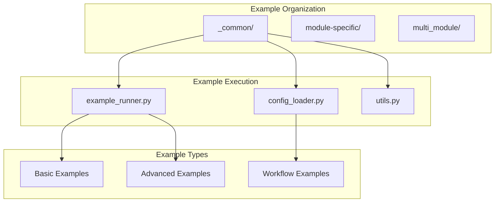

# examples - Functional Specification

**Version**: v0.1.0 | **Status**: Active | **Last Updated**: December 2025

## Purpose

Examples directory providing runnable demonstrations of all Codomyrmex modules and their integration. Examples are config-driven, reference tested methods, and follow modular patterns.

## Design Principles

### Modularity
- Examples organized by module
- Self-contained example scripts
- Composable example patterns
- Clear example boundaries

### Internal Coherence
- Consistent example structure
- Unified configuration patterns
- Standardized execution framework
- Logical organization

### Parsimony
- Essential examples only
- Clear, focused demonstrations
- Minimal example complexity
- Direct implementations

### Functionality
- Runnable examples
- Working code samples
- Practical use cases
- Current best practices

### Testing
- Example validation tests
- Configuration verification
- Execution testing
- Output validation

### Documentation
- Clear example documentation
- Usage instructions
- Configuration examples
- Expected outputs

## Architecture

## Functional Requirements

### Example Types
1. **Basic Examples**: Simple module usage
2. **Advanced Examples**: Complex use cases
3. **Workflow Examples**: Multi-module integration
4. **Configuration Examples**: Configuration patterns

### Example Standards
- Runnable and tested
- Config-driven
- Reference tested methods
- Clear documentation

## Quality Standards

### Example Quality
- Working code samples
- Clear documentation
- Practical use cases
- Current best practices

### Execution Quality
- Reliable execution
- Clear error messages
- Expected outputs documented
- Configuration validation

## Interface Contracts

### Example Interface
- Standardized example structure
- Consistent configuration format
- Unified execution framework
- Clear output format

### Configuration Interface
- YAML and JSON support
- Standardized schema
- Clear parameter documentation
- Validation rules

## Implementation Guidelines

### Example Development
1. Define example purpose
2. Create working code sample
3. Add configuration files
4. Document usage and output
5. Test example execution

### Example Organization
- Organize by module
- Use consistent structure
- Share common utilities
- Document clearly

## Navigation

- **Human Documentation**: [README.md](README.md)
- **Technical Documentation**: [AGENTS.md](AGENTS.md)
- **Repository Root**: [../README.md](../README.md)
- **Repository SPEC**: [../SPEC.md](../SPEC.md)

<!-- Navigation Links keyword for score -->
