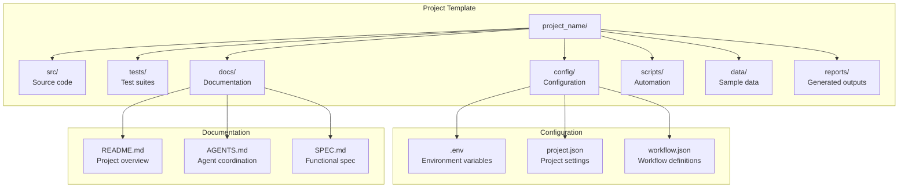
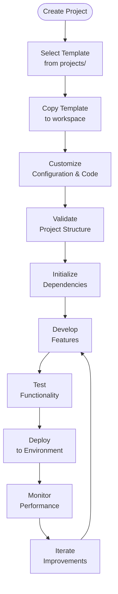

# projects

## Signposting
- **Parent**: [Repository Root](../README.md)
- **Children**:
    - [test_project](test_project/README.md)
- **Key Artifacts**:
    - [Agent Guide](AGENTS.md)
    - [Functional Spec](SPEC.md)

**Version**: v0.1.0 | **Status**: Active | **Last Updated**: December 2025

## Overview

This is the projects coordination document for all project workspaces, templates, and example implementations in the Codomyrmex repository. It defines the project scaffolding system that enables rapid development of new projects using Codomyrmex modules.

The projects directory serves as a workspace for project templates, example implementations, and development sandboxes that demonstrate Codomyrmex capabilities.

## Project Structure



## Project Lifecycle



## Directory Contents

### Project Templates
- `test_project/` – Example project demonstrating Codomyrmex module integration

### Project Structure
Each project follows a standardized structure:
- `src/` – Source code and module implementations
- `tests/` – Unit and integration tests
- `docs/` – Project-specific documentation
- `config/` – Configuration files and templates
- `scripts/` – Automation and utility scripts
- `data/` – Sample data and fixtures
- `reports/` – Generated reports and outputs

## Getting Started

### Creating a New Project

```bash
# Copy template project
cp -r projects/test_project my_new_project
cd my_new_project

# Customize configuration
cp config/project.json.example config/project.json
# Edit config/project.json with your settings

# Initialize dependencies
uv sync

# Run tests
uv run pytest

# Start development
uv run python src/main.py
```

### Using Project Templates

1. **Browse templates** in `projects/` directory
2. **Select appropriate template** for your use case
3. **Copy to your workspace**
4. **Customize** configuration and code
5. **Initialize** dependencies and environment
6. **Develop** your features

## Navigation
- **Technical Documentation**: [AGENTS.md](AGENTS.md)
- **Functional Specification**: [SPEC.md](SPEC.md)
- **Project Root**: [README](../README.md)
- **Project Orchestration**: [docs/project_orchestration/](../docs/project_orchestration/)
- **Module System**: [docs/modules/overview.md](../docs/modules/overview.md)

## Related Documentation

- **[Project Orchestration](../docs/project_orchestration/)** - Workflow and lifecycle management
- **[Module System](../docs/modules/overview.md)** - Available Codomyrmex modules
- **[Contributing Guide](../docs/project/contributing.md)** - Development standards
