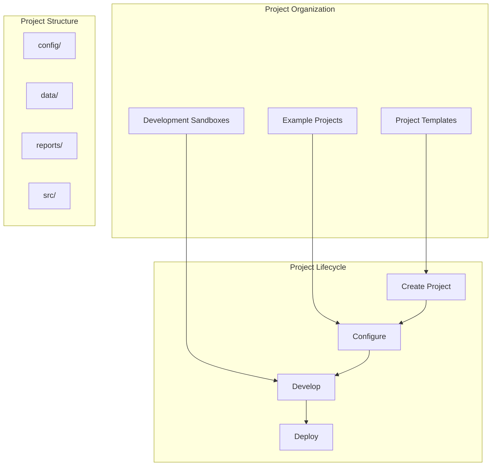

# projects - Functional Specification

**Version**: v0.1.7 | **Status**: Active | **Last Updated**: February 2026

## Purpose

Projects directory providing workspace for project templates, example implementations, and development sandboxes that demonstrate Codomyrmex capabilities and enable rapid project development.

## Design Principles

### Modularity

- Projects organized independently
- Self-contained project structures
- Composable project templates
- Clear project boundaries

### Internal Coherence

- Consistent project structure
- Unified template patterns
- Standardized organization
- Logical project layout

### Parsimony

- Essential project structure only
- Minimal required files
- Clear project organization
- Direct implementations

### Functionality

- Working project templates
- Practical examples
- Current best practices
- Functional demonstrations

### Testing

- Project template validation
- Example project verification
- Structure validation
- Integration testing

### Documentation

- Clear project documentation
- Template usage guides
- Example project descriptions
- Setup instructions

## Architecture

## Functional Requirements

### Project Types

1. **Templates**: Reusable project structures
2. **Examples**: Demonstration projects
3. **Sandboxes**: Development workspaces

### Project Standards

- Consistent structure
- Clear organization
- Complete documentation
- Working examples
- Zero-Mock constraint integration (always use real, functional modules)

## Quality Standards

### Project Quality

- Working project structure
- Clear documentation
- Practical examples
- Current best practices

### Template Quality

- Reusable templates
- Clear parameterization
- Complete documentation
- Validation rules

## Interface Contracts

### Project Interface

- Standardized project structure
- Consistent organization
- Clear configuration patterns
- Unified documentation

### Template Interface

- Reusable templates
- Parameterization support
- Clear documentation
- Example usage

## Implementation Guidelines

### Project Development

1. Define project purpose
2. Create project structure
3. Add configuration and data
4. Document setup and usage
5. Test project functionality

### Template Development

- Create reusable templates
- Document parameters
- Provide examples
- Validate templates

## Navigation

- **Human Documentation**: [README.md](README.md)
- **Technical Documentation**: [AGENTS.md](AGENTS.md)
- **Repository Root**: [../README.md](../README.md)
- **Repository SPEC**: [../SPEC.md](../SPEC.md)

<!-- Navigation Links keyword for score -->
