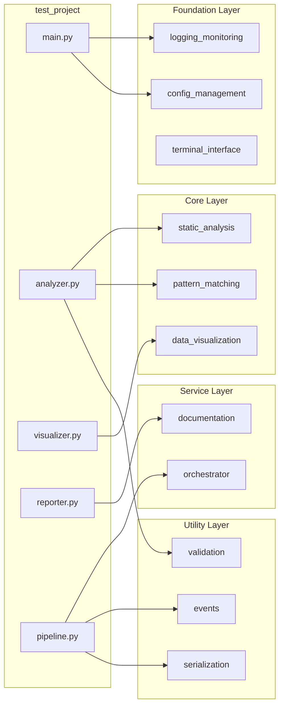

# Codomyrmex Agents — projects/test_project

**Version**: v1.0.0 | **Status**: Active | **Last Updated**: January 2026

## Signposting

- **Parent**: [projects/AGENTS.md](../AGENTS.md)
- **Self**: [test_project/AGENTS.md](AGENTS.md)
- **Children**:
  - [.codomyrmex/AGENTS.md](.codomyrmex/AGENTS.md)
  - [config/AGENTS.md](config/AGENTS.md)
  - [data/AGENTS.md](data/AGENTS.md)
  - [reports/AGENTS.md](reports/AGENTS.md)
  - [src/AGENTS.md](src/AGENTS.md)
- **Key Artifacts**:
  - [README.md](README.md)
  - [SPEC.md](SPEC.md)
  - [PAI.md](PAI.md)

## Purpose

Comprehensive reference implementation demonstrating maximal templated usage of all codomyrmex functionalities. This project serves as both a validation suite for the codomyrmex platform and a best-practices template for building new Codomyrmex-based applications.

## Active Components

### Source Modules (`src/`)

| Module | Purpose | Key Classes/Functions |
| :--- | :--- | :--- |
| `main.py` | Entry point | `run_analysis()`, `run_pipeline()` |
| `analyzer.py` | Static analysis | `ProjectAnalyzer`, `AnalysisResult` |
| `visualizer.py` | Data visualization | `DataVisualizer`, `ChartConfig` |
| `reporter.py` | Report generation | `ReportGenerator`, `ReportConfig` |
| `pipeline.py` | Workflow orchestration | `AnalysisPipeline`, `PipelineStep` |

### Configuration (`config/`)

| File | Purpose |
| :--- | :--- |
| `settings.yaml` | Core project settings |
| `modules.yaml` | Module enablement configuration |
| `workflows.yaml` | Workflow definitions |

### Data Layer (`data/`)

| Directory | Purpose |
| :--- | :--- |
| `input/` | Sample input data for analysis |
| `processed/` | Processed analysis outputs |

### Reports Layer (`reports/`)

| Directory | Purpose |
| :--- | :--- |
| `templates/` | Report templates |
| `output/` | Generated reports and visualizations |

## Operating Contracts

### Code Quality Standards

1. **Type Safety**: All functions use type hints
2. **Dataclasses**: Use `@dataclass` for data structures
3. **Logging**: Use `codomyrmex.logging_monitoring.get_logger()`
4. **Validation**: Validate inputs using `codomyrmex.validation`

### Integration Patterns

1. **Foundation First**: Initialize logging before other modules
2. **Config Loading**: Use `config_management` for all settings
3. **Event Emission**: Emit events from pipeline steps
4. **Error Handling**: Catch and log all exceptions properly

### Documentation Requirements

1. **Quadruple Play**: Every directory has README, AGENTS, SPEC, PAI
2. **Docstrings**: Every public function has docstrings
3. **Examples**: Include usage examples in documentation

## Codomyrmex Module Integration Map

## Agent Coordination

### When Modifying Code

1. **Check Dependencies**: Verify which codomyrmex modules are used
2. **Update Tests**: Add tests for new functionality
3. **Update Docs**: Sync README, AGENTS, SPEC for affected areas
4. **Validate Integration**: Run `run_demo.py` to verify

### When Adding Features

1. **Follow Patterns**: Use existing code structure as template
2. **Integrate Modules**: Use appropriate codomyrmex modules
3. **Add to Pipeline**: If applicable, add pipeline step
4. **Document**: Update all Quadruple Play files

### Common Agent Tasks

| Task | Steps |
| :--- | :--- |
| Add analysis metric | 1. Add to `AnalysisResult` 2. Calculate in `_analyze_file` 3. Update reporter |
| Add visualization | 1. Add method to `DataVisualizer` 2. Integrate with dashboard 3. Update tests |
| Add pipeline step | 1. Create step handler 2. Add with `add_step()` 3. Define dependencies |
| Add report format | 1. Add format method to `ReportGenerator` 2. Update config options |

## Navigation Links

### Project Context

- **📁 Parent Directory**: [projects/README.md](../README.md)
- **🏠 Project Root**: [../../README.md](../../README.md)

### Related Systems

- **Codomyrmex Source**: [../../src/codomyrmex/AGENTS.md](../../src/codomyrmex/AGENTS.md)
- **Global Config**: [../../config/AGENTS.md](../../config/AGENTS.md)
- **Scripts**: [../../scripts/AGENTS.md](../../scripts/AGENTS.md)

### Child Documentation

- **Configuration**: [.codomyrmex/AGENTS.md](.codomyrmex/AGENTS.md)
- **Config Files**: [config/AGENTS.md](config/AGENTS.md)
- **Data Layer**: [data/AGENTS.md](data/AGENTS.md)
- **Reports**: [reports/AGENTS.md](reports/AGENTS.md)
- **Source**: [src/AGENTS.md](src/AGENTS.md)

## Version History

- **v1.0.0** (January 2026) - Comprehensive reference implementation with full codomyrmex integration
- **v0.1.0** (October 2025) - Initial project structure
