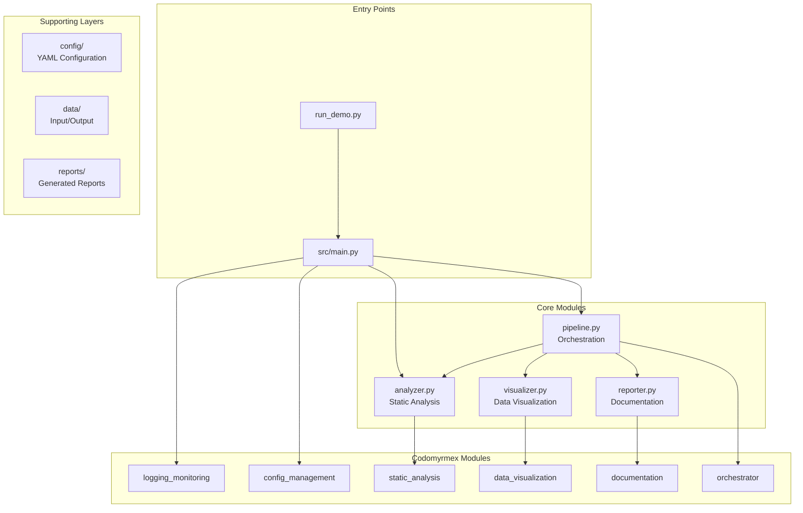

# test_project

**Version**: v1.0.0 | **Status**: Active | **Last Updated**: January 2026

## Overview

**test_project** is a comprehensive reference implementation demonstrating maximal usage of all codomyrmex functionalities. It serves as both a validation suite and a best-practices template for building Codomyrmex-based applications.

This project showcases integration with 11 codomyrmex modules across all architecture layers, demonstrating patterns for logging, configuration, static analysis, data visualization, documentation generation, workflow orchestration, and more.

## Quick Start

```bash
# Navigate to test_project
cd projects/test_project

# Run the demonstration
uv run python run_demo.py

# Run analysis on specific target
uv run python -c "from src.main import run_analysis; from pathlib import Path; run_analysis(Path('src'))"

# Execute full pipeline
uv run python -c "from src.main import run_pipeline; run_pipeline()"
```

## Architecture



## Project Structure

```
test_project/
├── .codomyrmex/           # Project configuration
│   ├── project.json       # Project metadata and settings
│   ├── AGENTS.md          # Configuration agents guide
│   └── README.md          # Configuration documentation
├── config/                # Configuration files
│   ├── settings.yaml      # Core project settings
│   ├── modules.yaml       # Module enablement
│   └── workflows.yaml     # Workflow definitions
├── data/                  # Data layer
│   ├── input/             # Sample input data
│   └── processed/         # Analysis outputs
├── reports/               # Reports layer
│   ├── templates/         # Report templates
│   └── output/            # Generated reports
├── src/                   # Source code
│   ├── __init__.py        # Public API
│   ├── main.py            # Entry point
│   ├── analyzer.py        # Code analysis
│   ├── visualizer.py      # Visualization
│   ├── reporter.py        # Report generation
│   └── pipeline.py        # Workflow orchestration
├── tests/                 # Test suite
├── run_demo.py            # Demonstration script
├── pyproject.toml         # Project configuration
├── README.md              # This file
├── AGENTS.md              # Agent coordination
├── SPEC.md                # Functional specification
└── PAI.md                 # Personal AI context
```

## Integrated Codomyrmex Modules

| Layer | Module | Integration Point |
| :--- | :--- | :--- |
| **Foundation** | `logging_monitoring` | `main.py` - Structured logging |
| **Foundation** | `config_management` | `main.py` - Configuration loading |
| **Foundation** | `terminal_interface` | CLI output formatting |
| **Core** | `static_analysis` | `analyzer.py` - Code quality |
| **Core** | `data_visualization` | `visualizer.py` - Charts/dashboards |
| **Core** | `pattern_matching` | `analyzer.py` - Pattern detection |
| **Service** | `documentation` | `reporter.py` - Report generation |
| **Service** | `orchestrator` | `pipeline.py` - Workflow DAG |
| **Utility** | `serialization` | Data persistence |
| **Utility** | `validation` | Input validation |
| **Utility** | `events` | Pipeline events |

## Features Demonstrated

### 1. Code Analysis Pipeline

- File discovery with pattern matching
- Metrics calculation (lines, functions, classes)
- Pattern detection (async, dataclasses, type hints)
- Issue identification

### 2. Data Visualization

- Interactive HTML dashboards
- Metrics grid visualizations
- File analysis tables
- Dark theme styling

### 3. Report Generation

- Multi-format output (HTML, JSON, Markdown)
- Professional styling with gradient headers
- Summary metrics cards
- Detailed file tables

### 4. Workflow Orchestration

- DAG-based pipeline execution
- Dependency management
- Step-by-step execution tracking
- Error handling and reporting

## Usage Examples

### Run Analysis on a Directory

```python
from pathlib import Path
from src.main import run_analysis

# Analyze Python files in a directory
results = run_analysis(Path("/path/to/project"))

print(f"Files analyzed: {results['summary']['total_files']}")
print(f"Total lines: {results['summary']['total_lines']}")
```

### Execute Full Pipeline

```python
from src.pipeline import AnalysisPipeline

pipeline = AnalysisPipeline()
result = pipeline.execute(Path("."))

print(f"Status: {result.status.value}")
print(f"Duration: {result.duration_seconds:.2f}s")
```

### Generate Custom Report

```python
from src.reporter import ReportGenerator, ReportConfig

generator = ReportGenerator(output_dir=Path("custom_reports"))
config = ReportConfig(title="Custom Analysis", format="markdown")

report_path = generator.generate(analysis_results, config)
```

## Testing

```bash
# Run all tests
uv run pytest tests/ -v

# Run with coverage
uv run pytest tests/ --cov=src --cov-report=html

# Run specific test file
uv run pytest tests/test_analyzer.py -v
```

## Navigation

| Document | Purpose |
| :--- | :--- |
| [AGENTS.md](AGENTS.md) | Agent coordination and operating contracts |
| [SPEC.md](SPEC.md) | Functional specification and requirements |
| [PAI.md](PAI.md) | Personal AI infrastructure context |
| [../README.md](../README.md) | Parent projects directory |
| [../../README.md](../../README.md) | Repository root |
