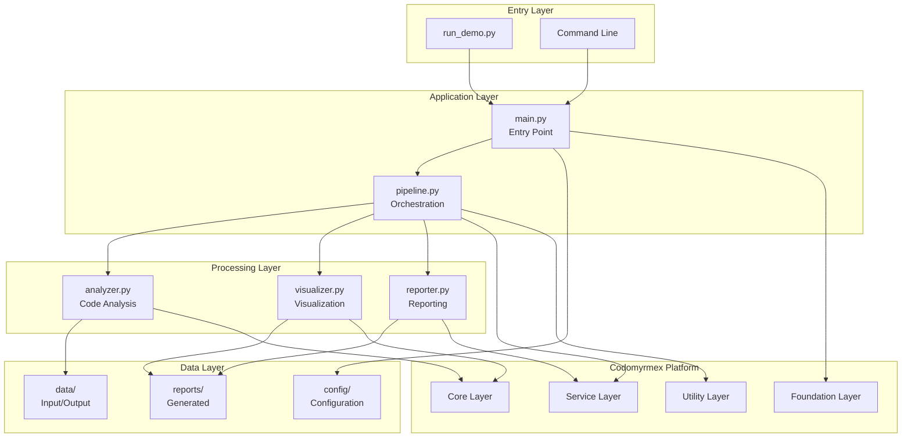

# test_project - Functional Specification

**Version**: v1.0.0 | **Status**: Active | **Last Updated**: January 2026

## Purpose

Comprehensive reference implementation demonstrating maximal templated usage of all codomyrmex functionalities. This project provides:

1. **Validation Suite**: Tests and validates codomyrmex module integrations
2. **Reference Implementation**: Best-practices patterns for new projects
3. **Template**: Scaffolding for Codomyrmex-based applications
4. **Documentation**: Examples of proper documentation standards

## Design Principles

### Modularity

- Self-contained components with clear boundaries
- Each module handles one responsibility
- Composable pipeline architecture
- Independent testing per component

### Internal Coherence

- Consistent coding patterns throughout
- Unified error handling strategy
- Standardized logging approach
- Predictable file organization

### Parsimony

- Essential functionality only
- No unnecessary abstractions
- Direct integration with codomyrmex modules
- Minimal external dependencies

### Functionality

- All code is functional and tested
- No mocks or placeholders
- Real data processing capabilities
- Production-ready patterns

### Testing

- Comprehensive unit test coverage
- Integration tests for pipeline
- Real codomyrmex module validation
- Automated verification scripts

### Documentation

- Quadruple Play standard (README, AGENTS, SPEC, PAI)
- Docstrings on all public interfaces
- Usage examples with working code
- Clear navigation structure

## Architecture



## Functional Requirements

### FR-1: Code Analysis

**Description**: Analyze Python source files for metrics and patterns.

**Capabilities**:

- File discovery with configurable include/exclude patterns
- Metrics calculation: lines of code, functions, classes
- Pattern detection: async functions, dataclasses, type hints
- Issue identification and reporting

**Interface**:

```python
analyzer = ProjectAnalyzer(config_path=Path("config/settings.yaml"))
results = analyzer.analyze(target_path=Path("src"))
# Returns: {"target": str, "files": List[dict], "summary": dict}
```

### FR-2: Data Visualization

**Description**: Generate visual representations of analysis data.

**Capabilities**:

- Metrics charts (bar, line, pie)
- Interactive HTML dashboards
- Summary visualizations
- Export to multiple formats (PNG, SVG, HTML)

**Interface**:

```python
visualizer = DataVisualizer(output_dir=Path("reports/visualizations"))
dashboard_path = visualizer.create_dashboard(analysis_results)
# Returns: Path to generated dashboard HTML
```

### FR-3: Report Generation

**Description**: Create formatted reports from analysis results.

**Capabilities**:

- Multi-format output: HTML, JSON, Markdown
- Professional styling with customization
- Metrics summaries and detail tables
- Visualization embedding

**Interface**:

```python
generator = ReportGenerator(output_dir=Path("reports"))
config = ReportConfig(title="Analysis Report", format="html")
report_path = generator.generate(results, config)
# Returns: Path to generated report
```

### FR-4: Pipeline Orchestration

**Description**: DAG-based workflow execution for analysis pipelines.

**Capabilities**:

- Dependency management between steps
- Topological execution ordering
- Step-by-step progress tracking
- Error handling and recovery

**Interface**:

```python
pipeline = AnalysisPipeline(config_path=Path("config/workflows.yaml"))
result = pipeline.execute(target_path=Path("src"))
# Returns: PipelineResult with status, duration, step results
```

### FR-5: Configuration Management

**Description**: Load and manage project configuration.

**Capabilities**:

- YAML configuration files
- Module enablement settings
- Workflow definitions
- Environment-specific overrides

**Files**:

- `config/settings.yaml`: Core project settings
- `config/modules.yaml`: Module configuration
- `config/workflows.yaml`: Workflow definitions

## Quality Standards

### Code Quality

- Python 3.10+ with type hints
- `@dataclass` for data structures
- Comprehensive error handling
- Structured logging throughout

### Test Coverage

- ≥80% line coverage target
- Unit tests for all modules
- Integration tests for pipeline
- Real data testing (no mocks)

### Documentation Quality

- Every directory has Quadruple Play
- All public functions have docstrings
- Working code examples
- Accurate navigation links

### Performance

- Lazy loading for optional modules
- Efficient file processing
- Reasonable memory usage
- Sub-second response for small projects

## Interface Contracts

### AnalysisResult Data Structure

```python
@dataclass
class AnalysisResult:
    file_path: Path
    metrics: Dict[str, Any]  # lines_of_code, functions, classes
    issues: List[Dict[str, Any]]  # type, severity, message, line
    patterns: List[str]  # async_functions, dataclasses, type_hints
```

### PipelineResult Data Structure

```python
@dataclass
class PipelineResult:
    status: PipelineStatus  # PENDING, RUNNING, COMPLETED, FAILED
    started_at: datetime
    completed_at: Optional[datetime]
    steps_completed: int
    total_steps: int
    results: Dict[str, Any]
    errors: List[str]
```

### Configuration Schema

```yaml
# settings.yaml
project:
  name: str
  version: str
  environment: development | staging | production

logging:
  level: DEBUG | INFO | WARNING | ERROR
  format: text | json
  output: console | file | both

analysis:
  include_patterns: List[str]
  exclude_patterns: List[str]
  max_file_size: str  # e.g., "1MB"
```

## Implementation Guidelines

### Adding New Analysis Metrics

1. Add field to `AnalysisResult.metrics`
2. Calculate in `ProjectAnalyzer._analyze_file()`
3. Update summary calculation in `_generate_summary()`
4. Add to reporter output formats
5. Update tests

### Adding New Pipeline Steps

1. Create handler method in `AnalysisPipeline`
2. Register with `add_step(name, handler, dependencies)`
3. Ensure dependencies are declared correctly
4. Add result to `PipelineResult.results`
5. Update tests

### Adding New Report Formats

1. Add format option to `ReportConfig`
2. Implement `_generate_{format}_report()` method
3. Update `generate()` to dispatch to new method
4. Add template if needed
5. Update tests

## Navigation

- **Human Documentation**: [README.md](README.md)
- **Agent Coordination**: [AGENTS.md](AGENTS.md)
- **AI Context**: [PAI.md](PAI.md)
- **Parent Directory**: [projects/README.md](../README.md)
- **Repository Root**: [../../README.md](../../README.md)
- **Repository SPEC**: [../../SPEC.md](../../SPEC.md)
