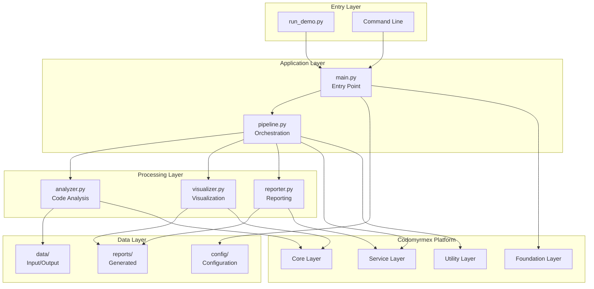

# test_project - Functional Specification

**Version**: v1.1.0 | **Status**: Active | **Last Updated**: March 2026

## Purpose

Comprehensive reference implementation demonstrating maximal templated usage of all codomyrmex functionalities. This project provides:

1. **Validation Suite**: Tests and validates codomyrmex module integrations
2. **Reference Implementation**: Best-practices patterns for new projects
3. **Template**: Scaffolding for Codomyrmex-based applications
4. **Documentation**: Examples of proper documentation standards

## Design Principles

### Modularity

- Self-contained components with clear boundaries
- Each module handles one responsibility
- Composable pipeline architecture
- Independent testing per component

### Internal Coherence

- Consistent coding patterns throughout
- Unified error handling strategy
- Standardized logging approach
- Predictable file organization

### Parsimony

- Essential functionality only
- No unnecessary abstractions
- Direct integration with codomyrmex modules
- Minimal external dependencies

### Functionality

- All code is functional and tested
- 100% Zero-Mock Policy strictly enforced
- Real data processing capabilities via functional `codomyrmex` methods
- Production-ready patterns

### Testing

- Comprehensive unit test coverage
- Integration tests for pipeline
- Authentic, real codomyrmex module execution and validation
- Automated verification scripts

### Documentation

- Quadruple Play standard (README, AGENTS, SPEC, PAI)
- Docstrings on all public interfaces
- Usage examples with working code
- Clear navigation structure

## Architecture


```mermaid
graph TB
    subgraph "Entry Layer"
        Demo[run_demo.py]
        CLI[Command Line]
    end

    subgraph "Application Layer"
        Main[main.py<br/>Entry Point]
        Pipeline[pipeline.py<br/>Orchestration]
    end

    subgraph "Processing Layer"
        Analyzer[analyzer.py<br/>Code Analysis]
        Visualizer[visualizer.py<br/>Visualization]
        Reporter[reporter.py<br/>Reporting]
    end

    subgraph "Data Layer"
        Config[config/<br/>Configuration]
        Data[data/<br/>Input/Output]
        Reports[reports/<br/>Generated]
    end

    subgraph "Codomyrmex Platform"
        Foundation[Foundation Layer]
        Core[Core Layer]
        Service[Service Layer]
        Utility[Utility Layer]
    end

    Demo --> Main
    CLI --> Main
    Main --> Pipeline
    Pipeline --> Analyzer
    Pipeline --> Visualizer
    Pipeline --> Reporter
    
    Analyzer --> Data
    Visualizer --> Reports
    Reporter --> Reports
    Main --> Config
    
    Main --> Foundation
    Analyzer --> Core
    Visualizer --> Core
    Reporter --> Service
    Pipeline --> Service
    Pipeline --> Utility
```

## Functional Requirements

### FR-1: Code Analysis

**Description**: Analyze Python source files for metrics and patterns.

**Capabilities**:

- File discovery with configurable include/exclude patterns
- Metrics calculation: lines of code, functions, classes
- Pattern detection: async functions, dataclasses, type hints
- Issue identification and reporting

**Interface**:

```python
analyzer = ProjectAnalyzer(config_path=Path("config/settings.yaml"))
results = analyzer.analyze(target_path=Path("src"))
# Returns: {"target": str, "files": List[dict], "summary": dict}
```

### FR-2: Data Visualization

**Description**: Generate visual representations of analysis data.

**Capabilities**:

- Metrics charts (bar, line, pie)
- Interactive HTML dashboards
- Summary visualizations
- Export to multiple formats (PNG, SVG, HTML)

**Interface**:

```python
visualizer = DataVisualizer(output_dir=Path("reports/visualizations"))
dashboard_path = visualizer.create_dashboard(analysis_results)
# Returns: Path to generated dashboard HTML
```

### FR-3: Report Generation

**Description**: Create formatted reports from analysis results.

**Capabilities**:

- Multi-format output: HTML, JSON, Markdown
- Professional styling with customization
- Metrics summaries and detail tables
- Visualization embedding

**Interface**:

```python
generator = ReportGenerator(output_dir=Path("reports"))
config = ReportConfig(title="Analysis Report", format="html")
report_path = generator.generate(results, config)
# Returns: Path to generated report
```

### FR-4: Pipeline Orchestration

**Description**: DAG-based workflow execution for analysis pipelines.

**Capabilities**:

- Dependency management between steps
- Topological execution ordering
- Step-by-step progress tracking
- Error handling and recovery

**Interface**:

```python
pipeline = AnalysisPipeline(config_path=Path("config/workflows.yaml"))
result = pipeline.execute(target_path=Path("src"))
# Returns: PipelineResult with status, duration, step results
```

### FR-5: Configuration Management

**Description**: Load and manage project configuration.

**Capabilities**:

- YAML configuration files
- Module enablement settings
- Workflow definitions
- Environment-specific overrides

**Files**:

- `config/settings.yaml`: Core project settings
- `config/modules.yaml`: Module configuration
- `config/workflows.yaml`: Workflow definitions

### FR-6: Agent Brain (agents + agentic_memory)

**Description**: Demonstrate agent registry and persistent typed memory.

**Capabilities**:

- List available agent providers (Claude, Codex, Gemini)
- Store content with MemoryType and MemoryImportance
- Recall memories by semantic query
- Summarize agent configuration

**Interface**:

```python
brain = AgentBrain()
mem = brain.remember("Python uses GIL", memory_type="knowledge", importance="high")
results = brain.recall("GIL", k=5)
# Returns: List[RetrievalResult]
```

### FR-7: Git Workflow (git_operations + git_analysis)

**Description**: Repository inspection and commit history analysis.

**Capabilities**:

- Detect git repository, get status, branch, diff
- List local branches
- Analyze commit history with GitHistoryAnalyzer
- Extract contributor stats and high-churn files

**Interface**:

```python
wf = GitWorkflow()
info = wf.inspect_repo("/path/to/repo")
history = wf.analyze_history("/path/to/repo", max_commits=20)
# Returns: {"commit_count": int, "contributors": list, "churn_files": list}
```

### FR-8: Knowledge Search (search + scrape + formal_verification)

**Description**: Full-text indexing, fuzzy matching, and constraint verification.

**Capabilities**:

- Build TF-IDF InMemoryIndex from document list
- Full-text search via quick_search
- Fuzzy matching via FuzzyMatcher
- Constraint solving via ConstraintSolver (Z3 optional)

**Interface**:

```python
ks = KnowledgeSearch()
results = ks.full_text_search("Python", docs)
matches = ks.fuzzy_match("pythn", candidates)
verified = ks.verify_constraints(["x > 0", "x < 10"])
```

### FR-9: Security Audit (security + crypto + maintenance + system_discovery)

**Description**: Security scanning, cryptographic hashing, and system health.

**Capabilities**:

- SHA-256/512 hashing and hash verification via crypto.graphy.hashing
- Vulnerability scanning and secret detection (when digital backend available)
- System module discovery via SystemDiscovery + CapabilityScanner
- Project structure and dependency analysis via maintenance

**Interface**:

```python
auditor = SecurityAudit()
result = auditor.hash_and_verify(b"data", algorithm="sha256")
health = auditor.system_health()
deps = auditor.project_deps("/path/to/project")
```

### FR-10: MCP Explorer (model_context_protocol + skills + plugin_system)

**Description**: Discover MCP tools, skills, and plugins across the platform.

**Capabilities**:

- MCPDiscovery tool enumeration and ToolCategory taxonomy
- SkillRegistry listing and runnable skill enumeration
- PluginRegistry scanning for loaded/enabled plugins
- Module capability summary

**Interface**:

```python
explorer = MCPExplorer()
tools = explorer.list_tools()    # {"categories": [...], "tool_count": int}
skills = explorer.discover_skills()
plugins = explorer.scan_plugins()
```

### FR-11: LLM Inference (llm + collaboration)

**Description**: LLM configuration and multi-agent swarm task coordination.

**Capabilities**:

- LLMConfig and LLMConfigPresets introspection
- OllamaManager model listing (graceful skip if Ollama absent)
- SwarmManager + TaskDecomposer task submission
- AgentPool and MessageBus status

**Interface**:

```python
inference = LLMInference()
models = inference.list_models()      # graceful if Ollama not running
task = inference.swarm_task("Analyze codebase")
pool = inference.agent_pool_status()
```

## Quality Standards

### Code Quality

- Python 3.10+ with type hints
- `@dataclass` for data structures
- Comprehensive error handling
- Structured logging throughout

### Test Coverage

- ≥80% line coverage target
- Unit tests for all modules
- Integration tests for pipeline
- Real data testing (no mocks)

### Documentation Quality

- Every directory has Quadruple Play
- All public functions have docstrings
- Working code examples
- Accurate navigation links

### Performance

- Lazy loading for optional modules
- Efficient file processing
- Reasonable memory usage
- Sub-second response for small projects

## Interface Contracts

### AnalysisResult Data Structure

```python
@dataclass
class AnalysisResult:
    file_path: Path
    metrics: Dict[str, Any]  # lines_of_code, functions, classes
    issues: List[Dict[str, Any]]  # type, severity, message, line
    patterns: List[str]  # async_functions, dataclasses, type_hints
```

### PipelineResult Data Structure

```python
@dataclass
class PipelineResult:
    status: PipelineStatus  # PENDING, RUNNING, COMPLETED, FAILED
    started_at: datetime
    completed_at: Optional[datetime]
    steps_completed: int
    total_steps: int
    results: Dict[str, Any]
    errors: List[str]
```

### Configuration Schema

```yaml
# settings.yaml
project:
  name: str
  version: str
  environment: development | staging | production

logging:
  level: DEBUG | INFO | WARNING | ERROR
  format: text | json
  output: console | file | both

analysis:
  include_patterns: List[str]
  exclude_patterns: List[str]
  max_file_size: str  # e.g., "1MB"
```

## Implementation Guidelines

### Adding New Analysis Metrics

1. Add field to `AnalysisResult.metrics`
2. Calculate in `ProjectAnalyzer._analyze_file()`
3. Update summary calculation in `_generate_summary()`
4. Add to reporter output formats
5. Update tests

### Adding New Pipeline Steps

1. Create handler method in `AnalysisPipeline`
2. Register with `add_step(name, handler, dependencies)`
3. Ensure dependencies are declared correctly
4. Add result to `PipelineResult.results`
5. Update tests

### Adding New Report Formats

1. Add format option to `ReportConfig`
2. Implement `_generate_{format}_report()` method
3. Update `generate()` to dispatch to new method
4. Add template if needed
5. Update tests

## Navigation

- **Human Documentation**: [README.md](README.md)
- **Agent Coordination**: [AGENTS.md](AGENTS.md)
- **AI Context**: [PAI.md](PAI.md)
- **Parent Directory**: [projects/README.md](../README.md)
- **Repository Root**: [../../README.md](../../README.md)
- **Repository SPEC**: [../../SPEC.md](../../SPEC.md)
