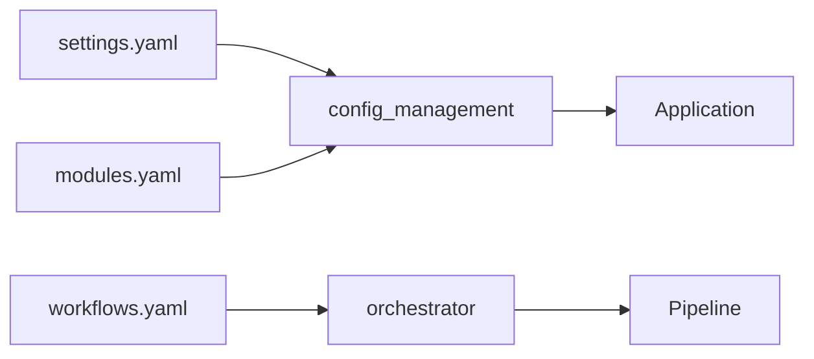

# config/ - Functional Specification

**Version**: v1.0.0 | **Status**: Active | **Last Updated**: January 2026

## Purpose

Configuration management layer for test_project. Provides YAML-based configuration files that control project behavior, module enablement, and workflow orchestration.

## Design Principles

### Modularity

- Separate configuration files by concern
- Independent module configurations
- Composable settings

### Internal Coherence

- Consistent YAML structure
- Unified naming conventions
- Predictable key hierarchies

### Parsimony

- Only essential configuration
- Clear default values
- No redundant settings

## Architecture



## Functional Requirements

### FR-1: Settings Configuration

**File**: `settings.yaml`

**Sections**:

- `project`: Name, version, environment
- `logging`: Level, format, output
- `analysis`: Patterns, limits
- `visualization`: Theme, formats
- `reporting`: Formats, styling
- `data`: Paths
- `pipeline`: Defaults

### FR-2: Module Configuration

**File**: `modules.yaml`

**Sections**:

- `enabled_modules`: By layer
- `module_overrides`: Per-module settings
- `dependencies`: Module graph

### FR-3: Workflow Configuration

**File**: `workflows.yaml`

**Sections**:

- `workflows`: Named workflow definitions
- `execution`: Runtime settings
- `hooks`: Event hooks

## Interface Contracts

### Settings Schema

```yaml
project:
  name: str           # Required
  version: str        # Semver format
  environment: enum   # development | staging | production

logging:
  level: enum         # DEBUG | INFO | WARNING | ERROR
  format: enum        # text | json
  output: enum        # console | file | both
```

### Workflow Step Schema

```yaml
steps:
  - name: str           # Unique step identifier
    module: str         # Codomyrmex module name
    description: str    # Human readable
    depends_on: [str]   # Previous step names
    config: dict        # Step-specific config
    timeout: int        # Seconds
```

## Navigation

- **Human Documentation**: [README.md](README.md)
- **Agent Coordination**: [AGENTS.md](AGENTS.md)
- **Parent Directory**: [../README.md](../README.md)
