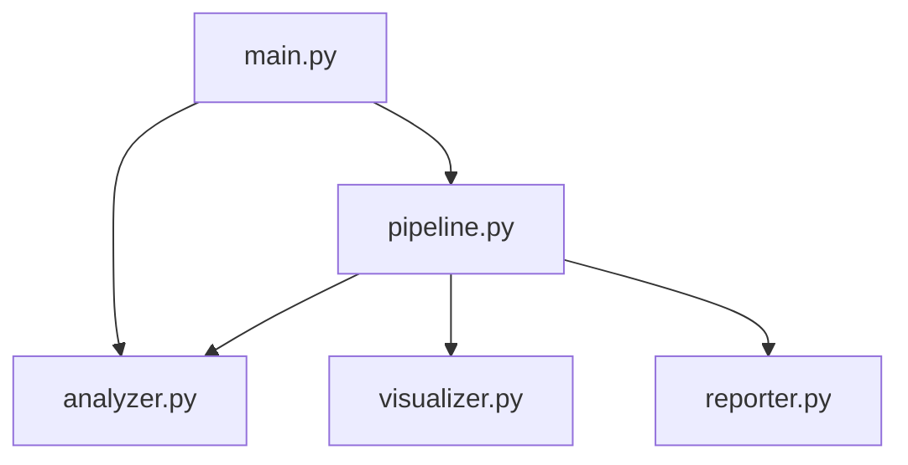

# src/

**Version**: v1.0.0 | **Status**: Active | **Last Updated**: January 2026

## Overview

Source code directory containing the core Python implementation for test_project. Demonstrates comprehensive integration with codomyrmex modules across all architecture layers.

## Modules

| Module | Purpose | Key Classes/Functions | Codomyrmex Integration |
| :--- | :--- | :--- | :--- |
| `__init__.py` | Package API | Exports all public interfaces | - |
| `main.py` | Entry point | `run_analysis()`, `run_pipeline()` | `logging_monitoring`, `config_management` |
| `analyzer.py` | Code analysis | `ProjectAnalyzer`, `AnalysisResult` | `static_analysis`, `pattern_matching`, `validation` |
| `visualizer.py` | Visualization | `DataVisualizer`, `ChartConfig` | `data_visualization` |
| `reporter.py` | Report generation | `ReportGenerator`, `ReportConfig` | `documentation` |
| `pipeline.py` | Orchestration | `AnalysisPipeline`, `PipelineResult` | `orchestrator`, `events` |

## Quick Start

```python
from pathlib import Path
from src.main import run_analysis, run_pipeline

# Simple analysis
results = run_analysis(Path("src"))
print(f"Files: {results['summary']['total_files']}")

# Full pipeline
pipeline_result = run_pipeline(Path("src"))
print(f"Status: {pipeline_result.status.value}")
```

## Architecture



## Navigation

- **Parent**: [../README.md](../README.md)
- **Sibling Directories**: [config/](../config/), [data/](../data/), [reports/](../reports/)
