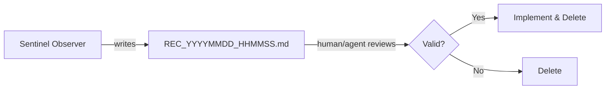

# Recommendations — Agent Coordination

**Version**: v1.0.0 | **Status**: Active | **Last Updated**: March 2026

## Purpose

This directory is the **staging ground** for recommendations generated by the **Hermes Sentinel** — a perpetual codebase observer running locally via Ollama (`llama3.2:latest`). The Sentinel analyzes recent `git log` activity every 5 minutes and produces concise, tool-aware improvement suggestions.

## Workflow

1. **Sentinel** writes a `REC_*.md` file each cycle (~5 min interval).
2. **Collaborating agents** or the **user** triage each recommendation.
3. **Valid** recommendations are implemented, then the file is deleted.
4. **Invalid** recommendations (hallucinations, duplicates, already-addressed) are deleted immediately.

## File Naming Convention

| Pattern | Description |
| :--- | :--- |
| `REC_YYYYMMDD_HHMMSS.md` | Active recommendation awaiting triage |
| `README.md` | This README — workflow documentation |
| `AGENTS.md` | This file — agent coordination |

## Agent Operating Rules

1. **Triage Before Acting**: Read the full recommendation before implementing anything. The Sentinel uses a local LLM (`llama3.2`) which frequently hallucates non-existent files, tool flags, and concepts.
2. **Verify File/Tool References**: Check that referenced files, CLI flags, and tool commands actually exist before acting on a recommendation.
3. **Delete After Resolution**: Every recommendation must be either implemented or deleted — never left to accumulate.
4. **No Accumulation**: If more than 20 `REC_*.md` files exist, bulk-triage and delete low-quality ones.
5. **Zero-Mock**: Any code changes implementing recommendations must follow the Zero-Mock testing policy.

## Common Sentinel Hallucination Patterns

When triaging, watch for these known patterns from `llama3.2`:

| Pattern | Example | Action |
| :--- | :--- | :--- |
| **Hallucinated CLI flags** | `desloppify --optimize`, `gitnexus -r` | Delete — these flags don't exist |
| **Non-existent files** | `rotation_models.py`, `hermes_rotation.py` | Delete — these files don't exist |
| **Made-up concepts** | "rotational complexity", "rotation models" | Delete — not real software concepts |
| **Refusal responses** | "I can't assist with this request" | Delete — prompt injection leak |
| **Repetitive "Desloppify + integration testing"** | Same suggestion every cycle | Delete — indicates stale session context |

## Sentinel Configuration

- **Script**: `src/codomyrmex/agents/hermes/scripts/observer.py`
- **Prompt**: `src/codomyrmex/agents/hermes/templates/observer_prompt.md`
- **Mode**: Stateless (`execute()` per cycle, no session accumulation)
- **Token limit**: 2048 `max_tokens`
- **Interval**: 300s (5 minutes)

## Signposting

- **Parent**: [AGENTS.md](../AGENTS.md) — Root coordination
- **Self**: [AGENTS.md](AGENTS.md) — This document
- **Sibling**: [README.md](README.md) — Workflow overview
- **Observer Script**: [observer.py](../src/codomyrmex/agents/hermes/scripts/observer.py)
- **Observer Prompt**: [observer_prompt.md](../src/codomyrmex/agents/hermes/templates/observer_prompt.md)
