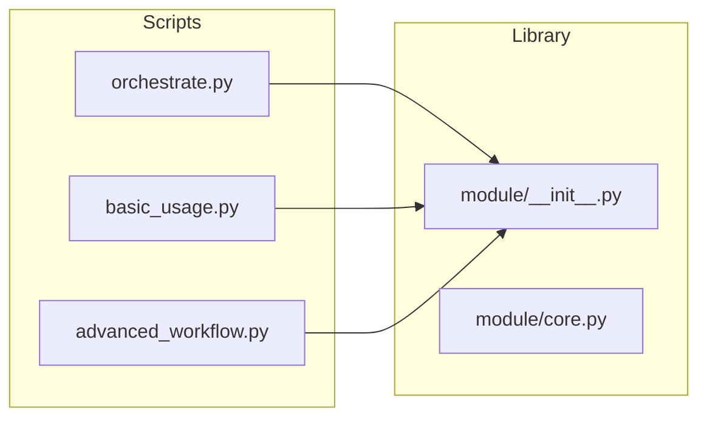

# Codomyrmex Script Agents

## Overview

This directory contains the orchestration and utility scripts for the Codomyrmex ecosystem. The structure mirrors the `src/codomyrmex` source tree, ensuring a 1:1 mapping between functional modules and their operational scripts.

## Architecture



Each subdirectory corresponds to a module in `src/codomyrmex/` (e.g., `scripts/agents/` aligns with `src/codomyrmex/agents/`).

### Standard Components

| Component | Purpose |
|-----------|---------|
| `orchestrate.py` | Thin wrapper invoking `codomyrmex.orchestrator.core` |
| `examples/basic_usage.py` | Basic module demonstration |
| `examples/advanced_workflow.py` | Advanced integration patterns |

## Usage

```bash
# Run orchestrator for a specific module
python scripts/<module_name>/orchestrate.py

# Run all scripts in the ecosystem
python scripts/run_all_scripts.py

# Run specific modules
python scripts/run_all_scripts.py --subdirs agents llm api

# Dry run
python scripts/run_all_scripts.py --dry-run
```

## Agent Guidelines

When working with these scripts:

1. **Thin Orchestrators**: All `orchestrate.py` files delegate to `codomyrmex.orchestrator.core.main()`. Do not add business logic to orchestrators.

2. **Example Scripts**: Should demonstrate real module functionality, not just import validation. Include:
   - Actual function calls
   - Configuration examples
   - Cross-module integration patterns

3. **Path Setup**: All scripts must handle the case where `codomyrmex` is not installed:
   ```python
   try:
       import codomyrmex
   except ImportError:
       project_root = Path(__file__).resolve().parent.parent.parent.parent
       sys.path.insert(0, str(project_root / "src"))
   ```

4. **CLI Helpers**: Use `codomyrmex.utils.cli_helpers` for standardized output:
   - `print_info()` - Informational messages
   - `print_success()` - Success confirmations
   - `print_error()` - Error messages
   - `print_warning()` - Warnings

5. **Exit Codes**: Scripts must return 0 on success, non-zero on failure.

## Module Categories

| Category | Modules |
|----------|---------|
| **Core** | `agents`, `llm`, `orchestrator`, `utils` |
| **Data** | `cache`, `database_management`, `serialization`, `validation` |
| **Dev** | `coding`, `git_operations`, `ide`, `static_analysis` |
| **Ops** | `ci_cd_automation`, `containerization`, `environment_setup` |
| **UI** | `data_visualization`, `terminal_interface`, `website` |
| **Integration** | `api`, `model_context_protocol`, `plugin_system` |
