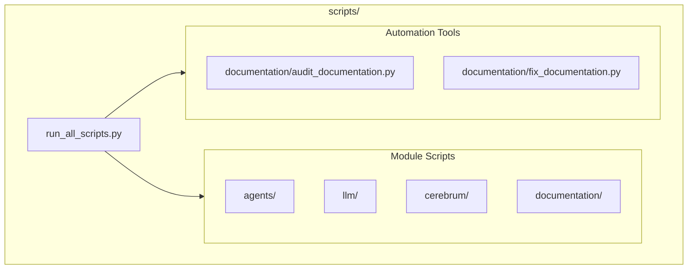

# Scripts

**Version**: v0.1.0 | **Status**: Active | **Last Updated**: January 2026

## Overview

The `scripts/` directory contains automation utilities, example scripts, and maintenance tools for the Codomyrmex platform. Each subdirectory mirrors a corresponding `src/codomyrmex/` module, providing runnable examples and orchestrator scripts.

## Architecture



## Key Tools

### Script Runner

```bash
# Run all module orchestrators
python scripts/run_all_scripts.py

# Run specific module
python scripts/agents/orchestrate.py
```

### Documentation Audit

```bash
# Check documentation coverage
PYTHONPATH=src python3 scripts/documentation/audit_documentation.py --target src/codomyrmex
```

### Documentation Fix

```bash
# Auto-generate missing documentation
PYTHONPATH=src python3 scripts/documentation/fix_documentation.py --target src/codomyrmex
```

## Directory Structure

Each module subdirectory typically contains:

```
scripts/<module>/
├── orchestrate.py      # Thin orchestrator (entry point)
├── examples/           # Working examples
│   ├── basic_usage.py
│   └── advanced_usage.py
├── AGENTS.md           # Agent instructions
├── README.md           # Module script docs
├── SPEC.md             # Script specifications
└── PAI.md              # AI context
```

## Key Directories

| Directory | Purpose |
|-----------|---------|
| `agents/` | AI agent framework examples |
| `llm/` | LLM integration examples |
| `documentation/` | Doc generation and audit tools |
| `cerebrum/` | Reasoning engine examples |
| `orchestrator/` | Workflow execution examples |

## Usage Pattern

All scripts inherit from `ScriptBase` for consistent behavior:

```python
from codomyrmex.utils import ScriptBase

class MyScript(ScriptBase):
    def run(self, args, config):
        self.log_info("Running...")
        return {"status": "success"}

if __name__ == "__main__":
    MyScript(name="my_script", description="Does something").execute()
```

## Navigation

- **Parent**: [../README.md](../README.md)
- **Source Modules**: [../src/codomyrmex/](../src/codomyrmex/)
- **Agent Guide**: [AGENTS.md](AGENTS.md)
- **Spec**: [SPEC.md](SPEC.md)
