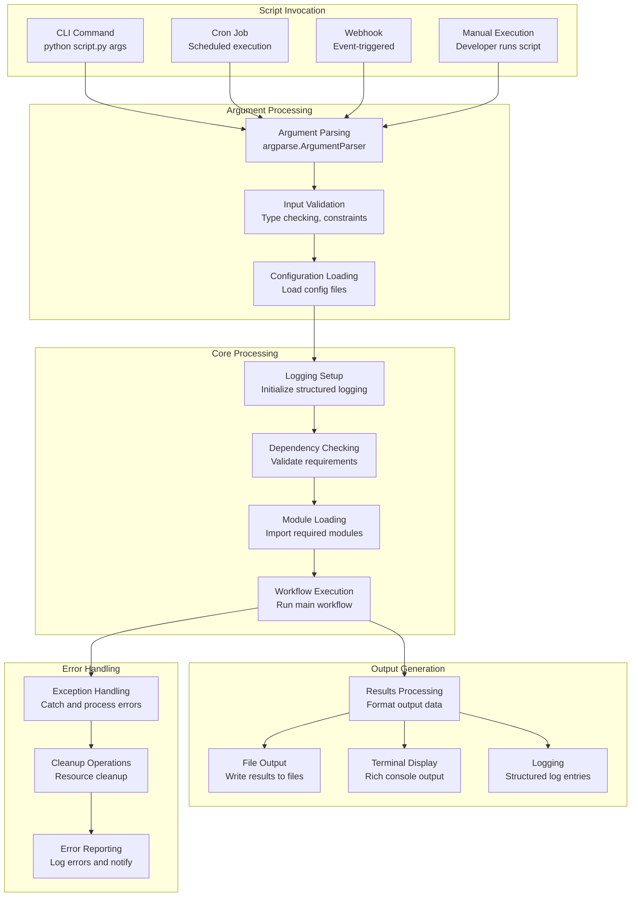
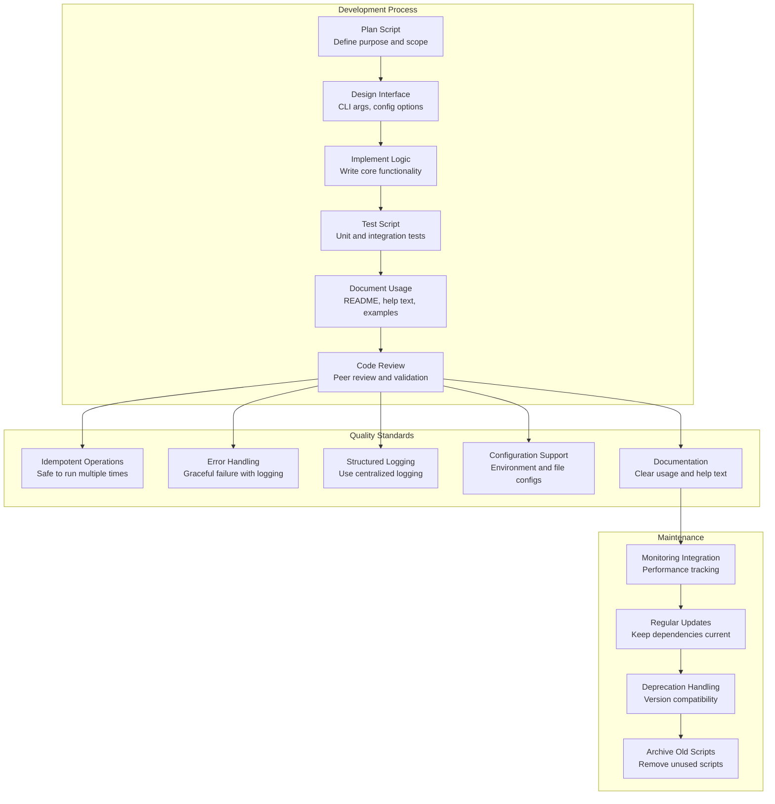
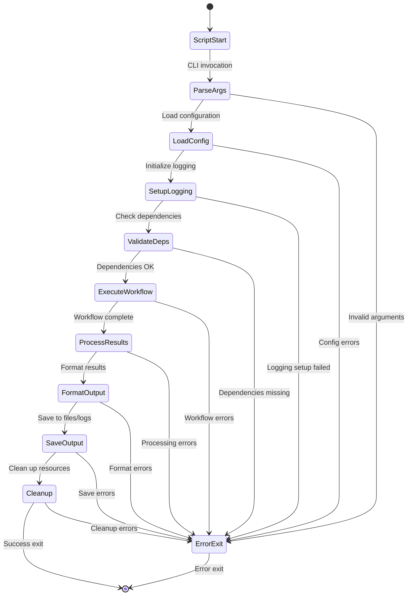

# scripts

## Signposting
- **Parent**: [Repository Root](../README.md)
- **Children**:
    - [agents](agents/README.md)
    - [ai_code_editing](ai_code_editing/README.md)
    - [api](api/README.md)
    - [build_synthesis](build_synthesis/README.md)
    - [cerebrum](cerebrum/README.md)
    - [ci_cd_automation](ci_cd_automation/README.md)
    - [code](code/README.md)
    - [config_management](config_management/README.md)
    - [containerization](containerization/README.md)
    - [data_visualization](data_visualization/README.md)
    - [database_management](database_management/README.md)
    - [development](development/README.md)
    - [docs](docs/README.md)
    - [documentation](documentation/README.md)
    - [documentation_module](documentation_module/README.md)
    - [documents](documents/README.md)
    - [environment_setup](environment_setup/README.md)
    - [events](events/README.md)
    - [examples](examples/README.md)
    - [fabric_integration](fabric_integration/README.md)
    - [fpf](fpf/README.md)
    - [git_operations](git_operations/README.md)
    - [language_models](language_models/README.md)
    - [logging_monitoring](logging_monitoring/README.md)
    - [maintenance](maintenance/README.md)
    - [model_context_protocol](model_context_protocol/README.md)
    - [modeling_3d](modeling_3d/README.md)
    - [module_template](module_template/README.md)
    - [pattern_matching](pattern_matching/README.md)
    - [performance](performance/README.md)
    - [physical_management](physical_management/README.md)
    - [plugin_system](plugin_system/README.md)
    - [project_orchestration](project_orchestration/README.md)
    - [security](security/README.md)
    - [static_analysis](static_analysis/README.md)
    - [system_discovery](system_discovery/README.md)
    - [template](template/README.md)
    - [terminal_interface](terminal_interface/README.md)
    - [testing](testing/README.md)
    - [tools](tools/README.md)
- **Key Artifacts**:
    - [Agent Guide](AGENTS.md)
    - [Functional Spec](SPEC.md)

**Version**: v0.1.0 | **Status**: Active | **Last Updated**: December 2025

## Overview

This is the scripts coordination document for all automation utilities in the Codomyrmex repository. It defines the maintenance and automation utilities that support project management, module orchestration, and development workflows.

The scripts directory contains executable utilities that automate common development tasks, module management, and system operations across the entire Codomyrmex platform.

## Script Architecture

```mermaid
graph TB
    subgraph "Script Categories"
        DEV[development/<br/>Development workflow<br/>Setup, testing, linting]
        DOCS[docs/<br/>Documentation maintenance<br/>API docs, audits]
        MAINT[maintenance/<br/>System maintenance<br/>Cleanup, organization]
        EXAMPLES[examples/<br/>Demonstrations<br/>Usage examples, tutorials]
        FABRIC[fabric_integration/<br/>AI framework integration<br/>Fabric AI workflows]
    end

    subgraph "Module Scripts"
        AI_SCRIPTS[ai_code_editing/<br/>AI code assistance<br/>Generation workflows]
        BUILD_SCRIPTS[build_synthesis/<br/>Build automation<br/>Multi-language builds]
        CI_SCRIPTS[ci_cd_automation/<br/>CI/CD pipelines<br/>Deployment automation]
        CODE_SCRIPTS[code/<br/>Code execution, review<br/>Sandbox, monitoring]
        CONFIG_SCRIPTS[config_management/<br/>Configuration management<br/>Validation, deployment]
        CONTAINER_SCRIPTS[containerization/<br/>Container management<br/>Docker, Kubernetes]
        DATA_SCRIPTS[data_visualization/<br/>Data visualization<br/>Plot generation]
        DB_SCRIPTS[database_management/<br/>Database operations<br/>Migrations, backups]
        DOC_SCRIPTS[documentation/<br/>Doc generation<br/>Website creation]
        API_SCRIPTS[api/<br/>API documentation<br/>OpenAPI specs]
        ENV_SCRIPTS[environment_setup/<br/>Environment setup<br/>Validation, configuration]
        FPF_SCRIPTS[fpf/<br/>FPF orchestration<br/>End-to-end FPF processing]
        CEREBRUM_SCRIPTS[cerebrum/<br/>CEREBRUM-FPF orchestration<br/>Comprehensive CEREBRUM analysis]
        GIT_SCRIPTS[git_operations/<br/>Git automation<br/>Workflow management]
        LANG_SCRIPTS[language_models/<br/>LLM management<br/>Model operations]
        LOG_SCRIPTS[logging_monitoring/<br/>Logging configuration<br/>Telemetry setup]
        MCP_SCRIPTS[model_context_protocol/<br/>MCP management<br/>Tool specifications]
        MODELING_SCRIPTS[modeling_3d/<br/>3D modeling<br/>Visualization workflows]
        MODULE_SCRIPTS[module_template/<br/>Module creation<br/>Scaffolding tools]
        PATTERN_SCRIPTS[pattern_matching/<br/>Pattern analysis<br/>Code analysis]
        PERF_SCRIPTS[performance/<br/>Performance monitoring<br/>Benchmarking]
        PHYS_SCRIPTS[physical_management/<br/>Hardware monitoring<br/>Resource management]
        PROJECT_SCRIPTS[project_orchestration/<br/>Workflow orchestration<br/>Task coordination]
        SECURITY_SCRIPTS[security/<br/>Security scanning<br/>Compliance checks]
        STATIC_SCRIPTS[static_analysis/<br/>Code analysis<br/>Quality metrics]
        SYSTEM_SCRIPTS[system_discovery/<br/>System exploration<br/>Module discovery]
        TERM_SCRIPTS[terminal_interface/<br/>Terminal UI<br/>Rich interfaces]
        DOC_MOD_SCRIPTS[documentation_module/<br/>Module documentation<br/>Automated docs]
    end

    subgraph "Core Utilities"
        ORCHESTRATOR[_orchestrator_utils.py<br/>Shared utilities<br/>Common functions]
    end

    ORCHESTRATOR --> DEV
    ORCHESTRATOR --> DOCS
    ORCHESTRATOR --> MAINT
    ORCHESTRATOR --> EXAMPLES
    ORCHESTRATOR --> FABRIC

    DEV --> AI_SCRIPTS
    DOCS --> BUILD_SCRIPTS
    MAINT --> CI_SCRIPTS
    EXAMPLES --> EXEC_SCRIPTS
    FABRIC --> REVIEW_SCRIPTS

    AI_SCRIPTS --> CONFIG_SCRIPTS
    BUILD_SCRIPTS --> CONTAINER_SCRIPTS
    CI_SCRIPTS --> DATA_SCRIPTS
    EXEC_SCRIPTS --> DB_SCRIPTS
    REVIEW_SCRIPTS --> DOC_SCRIPTS
```



## Script Execution Flow



## Script Development Standards



## Module Script Template

```mermaid
graph TD
    subgraph "Script Structure"
        SHEBANG[#!/usr/bin/env python3<br/>Shebang line]
        DOCSTRING[Module docstring<br/>Purpose and usage]
        IMPORTS[Imports<br/>Standard library and local modules]
        CONSTANTS[Constants<br/>Configuration constants]
        FUNCTIONS[Utility functions<br/>Helper functions]
        MAIN[main() function<br/>Core script logic]
        CLI_PARSER[CLI argument parser<br/>argparse setup]
        ENTRY_POINT[if __name__ == "__main__"<br/>Script entry point]
    end

    subgraph "Execution Flow"
        ARG_PARSING[Parse arguments<br/>Validate CLI inputs]
        CONFIG_SETUP[Setup configuration<br/>Load config files]
        LOGGING_INIT[Initialize logging<br/>Setup structured logging]
        DEP_VALIDATION[Validate dependencies<br/>Check requirements]
        CORE_EXECUTION[Execute core logic<br/>Run main workflow]
        OUTPUT_FORMAT[Format output<br/>Prepare results]
        CLEANUP[Cleanup resources<br/>Close connections, temp files]
    end

    SHEBANG --> DOCSTRING
    DOCSTRING --> IMPORTS
    IMPORTS --> CONSTANTS
    CONSTANTS --> FUNCTIONS
    FUNCTIONS --> MAIN
    MAIN --> CLI_PARSER
    CLI_PARSER --> ENTRY_POINT

    ENTRY_POINT --> ARG_PARSING
    ARG_PARSING --> CONFIG_SETUP
    CONFIG_SETUP --> LOGGING_INIT
    LOGGING_INIT --> DEP_VALIDATION
    DEP_VALIDATION --> CORE_EXECUTION
    CORE_EXECUTION --> OUTPUT_FORMAT
    OUTPUT_FORMAT --> CLEANUP
```

## Common Script Patterns



## Script Organization Policy

**All scripts are organized in subdirectories by category or module.** The root `scripts/` directory contains only:
- Core utilities (`_orchestrator_utils.py`) - Shared utilities for script orchestration

**Script Organization:**
- **`documentation/`** - All documentation maintenance, validation, generation, and link-fixing scripts
- **`testing/`** - All testing automation, verification, and test suite generation scripts
- **`development/`** - Development workflow scripts (setup, testing, linting, formatting)
- **`maintenance/`** - System maintenance, cleanup, and organization utilities
- **`examples/`** - Example scripts and demonstrations
- **`[module_name]/`** - Module-specific orchestration scripts (e.g., `ai_code_editing/`, `git_operations/`)

No standalone utility scripts remain in the root `scripts/` directory. This ensures clear categorization and easy discovery of scripts by purpose.

## Script Organization Summary

**Current State**: All scripts are properly organized in subdirectories. The root `scripts/` directory contains only `_orchestrator_utils.py`.

**Scripts moved/removed from root:**
- Documentation scripts → `documentation/` (e.g., `comprehensive_triple_check.py`, `fix_*.py`, `generate_*.py`)
- Testing scripts → `testing/` (e.g., `assess_module_documentation_tests.py`, `create_comprehensive_test_suites.py`)
- Audit scripts → `documentation/` (e.g., `audit_structure.py`, `check_links.py`)

**Result**: Clean organization with scripts categorized by purpose, making them easy to discover and maintain.

## Directory Contents

### Core Utilities
- `_orchestrator_utils.py` – Shared utilities for script orchestration and coordination (only file in root)

### Development Workflow Scripts
- `development/` – Development environment setup, testing, code quality tools

### Documentation Scripts
- `docs/` – Documentation maintenance utilities
- `documentation/` – Comprehensive documentation system scripts (includes all documentation maintenance, validation, generation, and link-fixing scripts)
- `documentation_module/` – Module-specific documentation automation
- `api/` – API documentation generation tools

### Maintenance Scripts
- `maintenance/` – System maintenance, cleanup, and organization utilities

### Testing Scripts
- `testing/` – Testing automation, verification, and test suite generation scripts

### Example and Demonstration Scripts
- `examples/` – Usage examples, tutorials, and demonstration scripts

### Module-Specific Automation Scripts

#### Foundation Layer Scripts
- `logging_monitoring/` – Logging system configuration and monitoring
- `environment_setup/` – Environment validation and setup automation
- `model_context_protocol/` – MCP tool specification management
- `terminal_interface/` – Terminal UI component scripts

#### Core Layer Scripts
- `ai_code_editing/` – AI-assisted code generation and editing workflows
- `static_analysis/` – Code quality analysis and linting automation
- `code_execution_sandbox/` – Safe code execution environment management
- `data_visualization/` – Data visualization and plotting automation
- `pattern_matching/` – Code pattern analysis and recognition
- `git_operations/` – Git workflow automation and management
- `code_review/` – Automated code review and quality assessment
- `security_audit/` – Security scanning and vulnerability assessment
- `ollama_integration/` – Local LLM integration and management
- `language_models/` – Language model management and operations
- `performance/` – Performance monitoring and benchmarking

#### Service Layer Scripts
- `build_synthesis/` – Multi-language build orchestration
- `ci_cd_automation/` – Continuous integration and deployment
- `containerization/` – Container lifecycle management
- `database_management/` – Database operations and maintenance
- `config_management/` – Configuration management and validation
- `project_orchestration/` – Workflow orchestration and task management

#### Specialized Layer Scripts
- `modeling_3d/` – 3D modeling and visualization workflows
- `physical_management/` – Hardware resource monitoring
- `system_discovery/` – Module discovery and system exploration
- `module_template/` – Module creation and scaffolding tools
- `fpf/` – FPF orchestration and end-to-end processing
- `cerebrum/` – CEREBRUM-FPF orchestration and comprehensive analysis

### Integration Scripts
- `fabric_integration/` – Integration with Fabric AI framework

## Script Function Signatures

### Orchestrator Utilities

```python
def setup_logging(level: str = "INFO", log_file: str = None) -> logging.Logger
def load_config(config_path: str, schema: dict = None) -> dict
def validate_dependencies(requirements: list[str]) -> dict[str, bool]
def execute_with_timeout(func: callable, timeout: int, *args, **kwargs) -> Any
def format_output(data: Any, format_type: str = "json") -> str
def cleanup_resources(resources: list) -> None
def handle_errors(func: callable) -> callable
```

### Development Scripts

```python
def setup_development_environment(force: bool = False) -> bool
def run_tests(test_path: str = ".", coverage: bool = True) -> dict
def lint_code(paths: list[str], fix: bool = False) -> list[dict]
def format_code(paths: list[str], check_only: bool = False) -> bool
def check_dependencies() -> dict[str, str]
def generate_requirements(output_file: str = "requirements.txt") -> None
```

### Documentation Scripts

```python
def generate_api_docs(source_path: str, output_path: str, format: str = "html") -> None
def audit_documentation_completeness() -> dict[str, bool]
def validate_links(docs_path: str) -> list[str]
def update_module_documentation(module_name: str) -> None
def generate_changelog(version: str, output_file: str) -> None
def check_documentation_freshness(max_age_days: int = 30) -> list[str]
```

### Maintenance Scripts

```python
def cleanup_temp_files(older_than_days: int = 7) -> int
def organize_project_structure() -> None
def validate_file_permissions() -> list[str]
def check_disk_usage() -> dict[str, int]
def archive_old_logs(archive_path: str, days_to_keep: int = 30) -> None
def update_file_headers() -> None
```

### Module-Specific Scripts

```python
# AI Code Editing
def generate_code_from_prompt(prompt: str, language: str, model: str = "gpt-4") -> str
def refactor_codebase(target_path: str, refactoring_rules: dict) -> dict
def analyze_code_quality(codebase_path: str) -> dict[str, Any]

# Build Synthesis
def build_project(config: dict, target_platforms: list[str]) -> dict
def resolve_build_dependencies(project_config: dict) -> dict
def validate_build_configuration(config_path: str) -> list[str]

# CI/CD Automation
def run_pipeline(pipeline_config: dict, environment: str) -> dict
def deploy_to_environment(app_name: str, env_config: dict) -> bool
def rollback_deployment(deployment_id: str) -> bool

# Container Management
def build_container(image_name: str, dockerfile_path: str, build_args: dict = None) -> str
def deploy_container_stack(stack_config: dict, environment: str) -> dict
def monitor_container_health(container_ids: list[str]) -> dict[str, dict]
```

## Navigation
- **Technical Documentation**: [AGENTS.md](AGENTS.md)
- **Functional Specification**: [SPEC.md](SPEC.md)
- **Project Root**: [README](../README.md)
- **Scripts Hub**: [Scripts](README.md)
- **Development Scripts**: [development/README.md](development/README.md)
- **Examples**: [examples/README.md](examples/README.md)

## Getting Started

To use this module in your project, import the necessary components:

```python
# Example usage
from codomyrmex.your_module import main_component

def example():
    result = main_component.process()
    print(f"Result: {result}")
```

## detailed_overview

This module is a critical part of the Codomyrmex ecosystem. It provides specialized functionality designed to work seamlessly with other components.
The architecture focuses on modularity, reliability, and performance.

## Contributing

We welcome contributions! Please ensure you:
1.  Follow the project coding standards.
2.  Add tests for new functionality.
3.  Update documentation as needed.

See the root `CONTRIBUTING.md` for more details.

<!-- Navigation Links keyword for score -->
