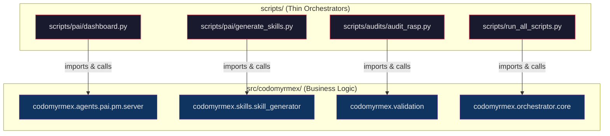

# Codomyrmex Scripts — Thin Orchestrators

**Version**: v1.1.0 | **Status**: Active | **Last Updated**: March 2026

> [!IMPORTANT]
> **`scripts/` is for thin orchestrators only.** All business logic, data models, and core functionality live in `src/codomyrmex/`. Scripts in this directory are entry-point wrappers that import from `src/codomyrmex/` modules and orchestrate their execution. No substantial logic should exist here.

## Architecture


```mermaid
graph TD
    subgraph "scripts/ (Thin Orchestrators)"
        S1["scripts/pai/dashboard.py"]
        S2["scripts/pai/generate_skills.py"]
        S3["scripts/audits/audit_rasp.py"]
        S4["scripts/run_all_scripts.py"]
    end

    subgraph "src/codomyrmex/ (Business Logic)"
        M1["codomyrmex.agents.pai.pm.server"]
        M2["codomyrmex.skills.skill_generator"]
        M3["codomyrmex.validation"]
        M4["codomyrmex.orchestrator.core"]
    end

    S1 -->|"imports & calls"| M1
    S2 -->|"imports & calls"| M2
    S3 -->|"imports & calls"| M3
    S4 -->|"imports & calls"| M4

    style S1 fill:#1a1a2e,stroke:#e94560,color:#e8e8e8
    style S2 fill:#1a1a2e,stroke:#e94560,color:#e8e8e8
    style S3 fill:#1a1a2e,stroke:#e94560,color:#e8e8e8
    style S4 fill:#1a1a2e,stroke:#e94560,color:#e8e8e8
    style M1 fill:#0f3460,stroke:#533483,color:#e8e8e8
    style M2 fill:#0f3460,stroke:#533483,color:#e8e8e8
    style M3 fill:#0f3460,stroke:#533483,color:#e8e8e8
    style M4 fill:#0f3460,stroke:#533483,color:#e8e8e8
```

## Thin Orchestrator Pattern

Every script follows the same pattern: **import from `src/codomyrmex/`, configure, invoke**. No business logic in the script itself.

```python
#!/usr/bin/env python3
"""Thin orchestrator for <module_name>."""

import sys
from pathlib import Path

# Ensure codomyrmex is importable
try:
    import codomyrmex  # noqa: F401
except ImportError:
    project_root = Path(__file__).resolve().parent.parent
    sys.path.insert(0, str(project_root / "src"))

from codomyrmex.<module>.core import main  # All logic lives in src/

if __name__ == "__main__":
    sys.exit(main())
```

## Directory Structure

| Directory | Scripts | Purpose |
|-----------|:-------:|---------|
| `agentic_memory/` | 1 | Agent memory storage and retrieval orchestrators |
| `agents/` | 31 | Agent subsystem demos and provider examples |
| `api/` | 2 | API orchestration examples |
| `audio/` | 1 | Audio processing orchestrators |
| `audits/` | 4 | Codebase audits: documentation, exports, imports, RASP |
| `auth/` | 2 | Authentication demo orchestrators |
| `cache/` | 3 | Cache management orchestrators |
| `ci_cd_automation/` | 3 | CI/CD pipeline management |
| `docs/` | 5 | Documentation tooling orchestrators |
| `email/` | 1 | AgentMail and Gmail integration demos |
| `git_operations/` | 3 | Git automation orchestrators |
| `llm/` | 3 | LLM provider examples (OpenRouter, Ollama) |
| `maintenance/` | 8 | Stub auditing, dependency checks, RASP fixers |
| `model_context_protocol/` | 7 | MCP server management and debugging |
| `pai/` | 6 | PAI integration: dashboard launch, skill updates, validation |
| `performance/` | 5 | Benchmarks and regression detection |
| `security/` | 3 | Vulnerability scanning, secret detection |
| `utils/` | 7 | Shared utility functions |
| `validation/` | 4 | Schema validation orchestrators |
| `website/` | 3 | Dashboard and website launch scripts |
| ... | | (100+ subdirectories mirror `src/codomyrmex/` modules) |

## Root Files

| File | Purpose |
|------|---------|
| `run_all_scripts.py` | Master orchestrator — discovers and runs scripts across all subdirectories |
| `config.yaml` | Shared script configuration |
| `generate_config_docs.py` | Generates documentation from config directory structures |
| `__init__.py` | Package marker (thin orchestrator module) |
| `PAI.md` | PAI integration documentation for scripts |
| `AGENTS.md` | Agent context for the scripts directory |
| `SPEC.md` | Specification for the thin orchestrator pattern |

## Usage

```bash
# Prerequisites
uv sync                          # Core dependencies
uv sync --extra <module>         # Module-specific optional deps

# Run individual orchestrators
uv run python scripts/pai/dashboard.py           # Launch both dashboards
uv run python scripts/pai/generate_skills.py     # Generate skill manifests
uv run python scripts/audits/audit_rasp.py       # Run RASP compliance audit
uv run python scripts/run_all_scripts.py         # Run all scripts

# Launch the dashboard
uv run python scripts/website/launch_dashboard.py
```

## Conventions

1. **Thin orchestrators only** — all business logic lives in `src/codomyrmex/`
2. Scripts import from `src/codomyrmex/` via `sys.path` manipulation or installed package
3. Each subdirectory has `README.md`, `AGENTS.md`, `SPEC.md`, and `PAI.md` (RASP pattern)
4. Config-driven scripts read from `config/<module>/config.yaml`
5. Placeholder demos raise `NotImplementedError` when the source module is not yet implemented
6. Scripts use `codomyrmex.utils.cli_helpers` for consistent CLI output formatting

## Navigation

- [AGENTS.md](AGENTS.md) | [SPEC.md](SPEC.md) | [PAI.md](PAI.md)
- [Project Root](../README.md) | [Source Code](../src/codomyrmex/)
