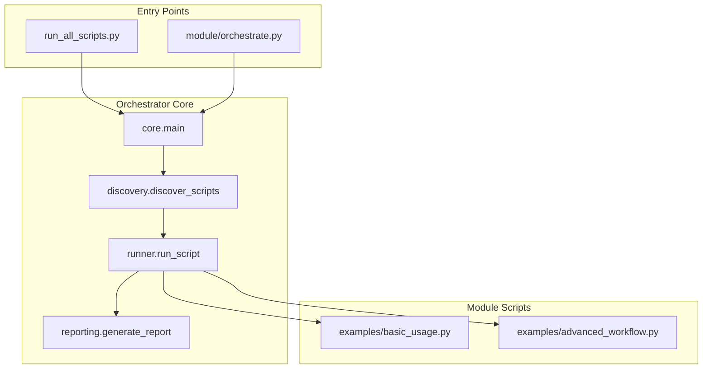

# Script Specification

## Architecture



## Directory Structure

The `scripts/` directory MUST mirror the structure of `src/codomyrmex/`.

```
scripts/
├── <module_name>/
│   ├── orchestrate.py  # Primary entry point (thin wrapper)
│   └── examples/
│       ├── basic_usage.py
│       └── advanced_workflow.py
├── run_all_scripts.py  # Master orchestrator
└── ...
```

## Thin Orchestrator Pattern

All `orchestrate.py` files follow a consistent pattern:

```python
#!/usr/bin/env python3
"""Orchestrator for <module_name>"""

import sys
from pathlib import Path

# Ensure codomyrmex is in path
try:
    import codomyrmex
except ImportError:
    project_root = Path(__file__).resolve().parent.parent.parent
    sys.path.insert(0, str(project_root / "src"))

from codomyrmex.orchestrator.core import main

if __name__ == "__main__":
    current_dir = Path(__file__).resolve().parent
    if not any(arg.startswith("--scripts-dir") for arg in sys.argv):
        sys.argv.append(f"--scripts-dir={current_dir}")
    sys.exit(main())
```

## Naming Conventions

- **Orchestrators**: MUST be named `orchestrate.py`
- **Examples**: Descriptive names (e.g., `basic_usage.py`, `integration_test.py`)
- **Directories**: MUST match the `src/codomyrmex` module name exactly

## Execution Flow

1. **Discovery**: `discover_scripts()` finds all `.py` files in target directory
2. **Environment**: Scripts set up `sys.path` to import `codomyrmex`
3. **Execution**: `run_script()` runs each script with timeout
4. **Reporting**: `generate_report()` creates summary JSON

## CLI Options

```bash
python run_all_scripts.py [options]

Options:
  --dry-run, -n        List scripts without executing
  --timeout, -t SEC    Timeout per script (default: 60)
  --subdirs, -s DIRS   Filter by subdirectory names
  --filter, -f PAT     Filter scripts by name pattern
  --output-dir, -o     Output directory for logs
  --verbose, -v        Show detailed output
  --max-depth N        Maximum search depth (default: 2)
  --generate-docs FILE Generate Markdown documentation
```
