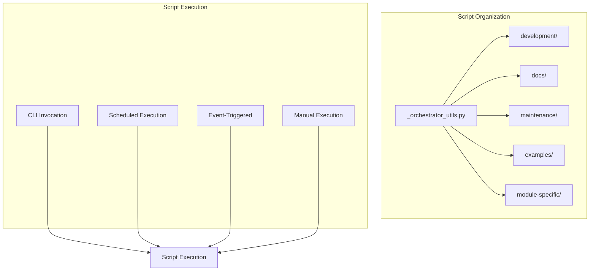

# scripts - Functional Specification

**Version**: v0.1.0 | **Status**: Active | **Last Updated**: December 2025

## Purpose

Automation utilities directory providing executable scripts for development workflows, module orchestration, and system maintenance across the Codomyrmex platform.

## Design Principles

### Modularity
- Scripts organized by module and purpose
- Shared utilities in `_orchestrator_utils.py` (only file in root `scripts/` directory)
- Independent script execution
- Clear script boundaries
- **Script Organization Policy**: All scripts are organized in subdirectories:
  - `documentation/` - Documentation maintenance and validation scripts
  - `src/codomyrmex/tests/` - Testing automation and verification scripts
  - `development/` - Development workflow scripts
  - `maintenance/` - System maintenance utilities
  - `[module_name]/` - Module-specific orchestration scripts
- No standalone utility scripts in root `scripts/` directory (only `_orchestrator_utils.py`)

### Internal Coherence
- Consistent script structure and patterns
- Unified error handling
- Standardized logging integration
- Common argument parsing

### Parsimony
- Essential functionality per script
- Minimal dependencies
- Direct implementations
- No unnecessary abstractions

### Functionality
- Idempotent operations where possible
- Clear success/failure indicators
- Informative error messages
- Practical utility focus

### Testing
- Scripts tested through integration tests
- Validation of script outputs
- Error handling verification
- Real execution testing

### Documentation
- Usage documentation in script headers
- README.md for each script directory
- Clear help text and examples
- Comprehensive navigation

## Architecture

## Functional Requirements

### Script Categories
1. **Development Scripts**: Environment setup, testing, linting, formatting (in `development/`)
2. **Documentation Scripts**: API docs generation, documentation audits, validation, link fixing (in `documentation/`)
3. **Testing Scripts**: Test automation, verification, test suite generation (in `src/codomyrmex/tests/`)
4. **Maintenance Scripts**: Cleanup, organization, system maintenance (in `maintenance/`)
5. **Module Scripts**: Module-specific automation and orchestration (in module-specific subdirectories)
6. **Example Scripts**: Demonstrations and tutorials (in `examples/`)

### Script Standards
- Idempotent operations where applicable
- Error handling with informative messages
- Logging integration
- Configuration file support
- Help text and usage documentation

## Quality Standards

### Code Quality
- Clear script structure
- Proper error handling
- Logging integration
- Configuration management
- Help text and documentation

### Execution Standards
- Safe to run multiple times (idempotent)
- Clear success/failure indicators
- Informative error messages
- Resource cleanup

## Interface Contracts

### Script Interface
- Command-line argument parsing
- Configuration file loading
- Environment variable support
- Standard output/error handling

### Utility Functions
- Shared utilities in `_orchestrator_utils.py`
- Consistent function signatures
- Standardized error handling
- Common formatting utilities

## Implementation Guidelines

### Script Development
1. Define script purpose and scope
2. Implement core functionality
3. Add error handling and logging
4. Document usage and help text
5. Test script execution

### Script Structure
- Shebang line
- Module docstring
- Imports
- Main function
- CLI argument parser
- Entry point

## Navigation

- **Human Documentation**: [README.md](README.md)
- **Technical Documentation**: [AGENTS.md](AGENTS.md)
- **Repository Root**: [../README.md](../README.md)
- **Repository SPEC**: [../SPEC.md](../SPEC.md)

<!-- Navigation Links keyword for score -->
