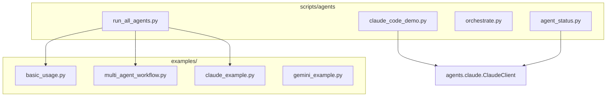

# Agent Scripts

**Version**: v0.2.0 | **Status**: Active | **Last Updated**: January 2026

## Overview

Agent utility scripts for testing, orchestrating, and demonstrating the Codomyrmex agent ecosystem. Includes comprehensive examples for Claude, Gemini, Codex, and multi-agent workflows.

## Quick Start

```bash
# Run all agent examples
uv run python scripts/agents/run_all_agents.py

# Check agent system status
uv run python scripts/agents/agent_status.py --verbose

# Run Claude Code demo
uv run python scripts/agents/claude_code_demo.py
```

## Scripts

| Script | Description |
|--------|-------------|
| `agent_status.py` | System status, health checks, API key validation |
| `run_all_agents.py` | Execute all example scripts with pass/fail summary |
| `orchestrate.py` | Module-scoped script orchestration |
| `test_gemini_dispatch.py` | Gemini client, CodeEditor, and Orchestrator tests |
| `claude_code_demo.py` | Claude Code methods demonstration |

## Examples Directory

| Script | Agent | Features Demonstrated |
|--------|-------|----------------------|
| `basic_usage.py` | Generic | Agent initialization, requests |
| `claude_example.py` | Claude | Basic API usage, graceful degradation |
| `gemini_example.py` | Gemini | Google AI integration |
| `codex_example.py` | Codex | OpenAI Codex integration |
| `droid_example.py` | Droid | Task coordination |
| `jules_example.py` | Jules | Git operations |
| `opencode_example.py` | OpenCode | Open-source models |
| `code_editor_example.py` | CodeEditor | Code generation/refactoring |
| `multi_agent_workflow.py` | Multiple | Orchestrated workflows |
| `advanced_workflow.py` | Multiple | Complex pipelines |
| `agent_diagnostics.py` | All | Capability diagnostics |
| `theory_example.py` | Theory | Code analysis |

## Architecture



## Navigation

- **Examples**: [examples/README.md](examples/README.md)
- **Parent**: [scripts](../README.md)
- **Agents Module**: [../../src/codomyrmex/agents/README.md](../../src/codomyrmex/agents/README.md)
- **Claude Module**: [../../src/codomyrmex/agents/claude/README.md](../../src/codomyrmex/agents/claude/README.md)
