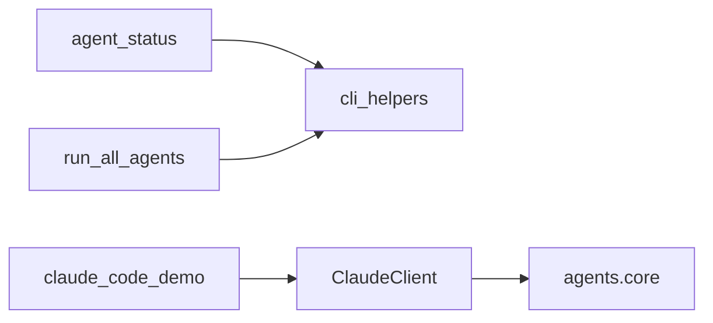

# Agent Scripts Specification

**Version**: v0.2.0 | **Status**: Active

## 1. Functional Requirements

The `scripts/agents` module must:

1. **Execute Agent Examples**: Run all agent examples in sequence with error handling
2. **Health Monitoring**: Check agent system health, API availability, configuration
3. **Claude Code Demo**: Demonstrate all Claude Code methods including file operations, code review, and project scanning
4. **Graceful Degradation**: Exit cleanly when API keys are unavailable

## 2. API Surface

### agent_status.py

```bash
python agent_status.py [--list] [--health] [--verbose]
```

### run_all_agents.py

```bash
python run_all_agents.py
# Returns: 0 = all passed, 1 = some failed
```

### claude_code_demo.py

```bash
python claude_code_demo.py
# Demonstrates: edit_file, create_file, review_code, scan_directory, 
#               generate_diff, run_command, explain_code, suggest_tests
```

## 3. Dependencies

- **Internal**: `codomyrmex.agents`, `codomyrmex.utils.cli_helpers`, `codomyrmex.logging_monitoring`
- **External**: Standard library (subprocess, pathlib, argparse)

## 4. Constraints

- **Timeout**: 120 seconds max per example script
- **Test Mode**: `CODOMYRMEX_TEST_MODE=1` skips API-intensive tests
- **Exit Codes**: 0 for success/graceful skip, 1 for unexpected errors

## 5. Script Dependencies



## 6. Navigation

- [README.md](README.md) | [AGENTS.md](AGENTS.md) | [PAI.md](PAI.md)
