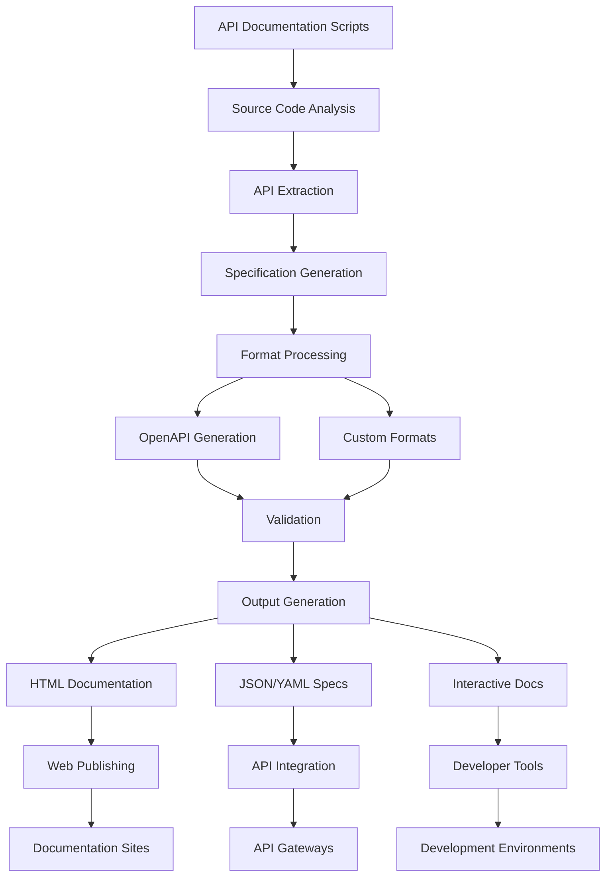

# scripts/api_documentation

**Version**: v0.1.0 | **Status**: Active | **Last Updated**: December 2025

## Overview

API documentation automation scripts providing command-line tools for generating, extracting, and validating API specifications within the Codomyrmex platform.

## API Documentation Workflow

The API documentation workflow provides comprehensive API specification generation, validation, and publishing capabilities for different consumption patterns.

## Directory Contents
- `orchestrate.py` – File

## Navigation
- **Project Root**: [README](../../../README.md)
- **Parent Directory**: [scripts](../README.md)
- **Scripts Hub**: [scripts](../../../scripts/README.md)
