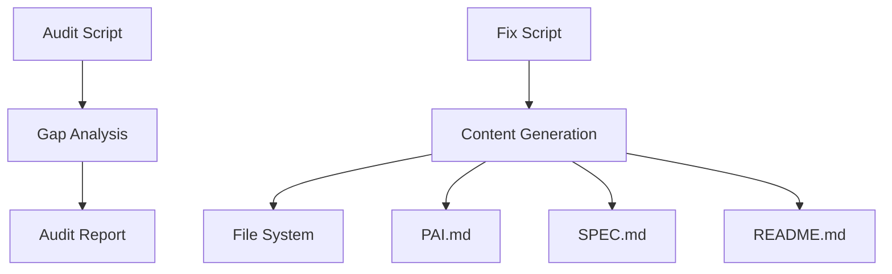

# Documentation Scripts

**Version**: v0.1.0 | **Status**: Active

## Overview

This directory contains automation tools for maintaining the quality, coverage, and consistency of documentation across the Codomyrmex repository.

## Tools

### 1. Documentation Audit (`audit_documentation.py`)

Scans the repository to identify missing or suboptimal documentation files (`README.md`, `AGENTS.md`, `SPEC.md`, `PAI.md`).

**Usage**:

```bash
PYTHONPATH=src python3 scripts/documentation/audit_documentation.py --target src/codomyrmex
```

**Features**:

- **Stub Detection**: Flags files smaller than 500 bytes.
- **Scoring**: Calculates compliance score per module.
- **Reporting**: Generates a markdown report (both console and file).

### 2. Documentation Fixer (`fix_documentation.py`)

Programmatically generates or upgrades documentation files to meet repository standards.

**Usage**:

```bash
PYTHONPATH=src python3 scripts/documentation/fix_documentation.py --target src/codomyrmex
```

**Features**:

- **Context Awareness**: Generates content based on module names.
- **Standard Compliance**: Creates `PAI.md` and `SPEC.md` if missing.
- **Stub Upgrade**: expands generic READMEs with architecture placeholders.
- **Dry Run**: `--dry-run` to preview changes.

## Architecture



## Navigation

- **Parent**: [scripts/README.md](../README.md)
- **Source**: [audit_documentation.py](audit_documentation.py)
