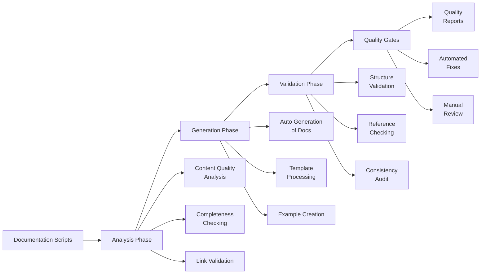

# scripts/documentation

## Signposting
- **Parent**: [Scripts](../README.md)
- **Children**:
    - None
- **Key Artifacts**:
    - [Agent Guide](AGENTS.md)
    - [Functional Spec](SPEC.md)

**Version**: v0.1.0 | **Status**: Active | **Last Updated**: December 2025

## Overview

Comprehensive documentation system for maintaining and generating Codomyrmex documentation. This directory contains all documentation-related scripts including maintenance, validation, generation, and link-fixing utilities.

**Organization**: All documentation scripts are centralized here. Previously scattered scripts from the root `scripts/` directory have been moved here for better organization and discoverability.

## Documentation Maintenance Workflow

The documentation maintenance workflow provides comprehensive tools for analyzing, generating, and validating Codomyrmex documentation quality and completeness.

## Directory Contents

### Documentation Generation
- `auto_generate_docs.py` – Automatic documentation generation
- `bootstrap_agents_readmes.py` – Bootstrap AGENTS.md and README.md files
- `create_example_tutorials.py` – Create example tutorials
- `create_missing_doc_files.py` – Create missing documentation files
- `generate_dashboard.py` – Generate documentation dashboard
- `generate_missing_readmes.py` – Generate missing README files
- `generate_missing_docs.py` – Generate missing documentation files
- `generate_spec_files.py` – Generate SPEC.md files
- `generate_doc_verification_report.py` – Generate documentation verification reports
- `doc_scaffolder.py` – Scaffold documentation files

### Documentation Validation
- `check_completeness.py` – Check documentation completeness
- `check_doc_links.py` – Check documentation links
- `check_docs_status.py` – Check documentation status
- `check_links.py` – Check markdown links
- `comprehensive_doc_check.py` – Comprehensive documentation check
- `comprehensive_triple_check.py` – Triple-check documentation files
- `validate_agents_structure.py` – Validate AGENTS.md structure
- `validate_code_examples.py` – Validate code examples in documentation
- `validate_links_comprehensive.py` – Comprehensive link validation
- `validate_module_docs.py` – Validate module documentation
- `validate_documentation_links.py` – Validate documentation links
- `verify_api_specs.py` – Verify API specifications

### Documentation Fixing
- `add_missing_navigation_links.py` – Add missing navigation links
- `add_missing_version_status.py` – Add missing version/status information
- `fix_agents_completeness.py` – Fix AGENTS.md completeness
- `fix_agents_files.py` – Fix AGENTS.md files
- `fix_all_module_src_links.py` – Fix all module src links
- `fix_all_tutorial_references.py` – Fix tutorial references
- `fix_broken_links.py` – Fix broken links
- `fix_common_doc_issues.py` – Fix common documentation issues
- `fix_contributing_refs.py` – Fix contributing references
- `fix_deep_nested_src_links.py` – Fix deep nested src links
- `fix_documentation_spec_links.py` – Fix documentation SPEC links
- `fix_documentation_src_links.py` – Fix documentation src links
- `fix_duplicate_navigation_labels.py` – Fix duplicate navigation labels
- `fix_examples_module_readmes.py` – Fix examples module READMEs
- `fix_missing_api_links.py` – Fix missing API links
- `fix_navigation_links.py` – Fix navigation links
- `fix_orchestrator_commands.py` – Fix orchestrator commands
- `fix_placeholders.py` – Fix placeholder content
- `fix_remaining_links.py` – Fix remaining broken links
- `fix_script_specs.py` – Fix script SPEC files
- `fix_scripts_subdirs.py` – Fix scripts subdirectory links
- `fix_security_digital_readme.py` – Fix security digital README
- `fix_security_digital_readme_nav.py` – Fix security digital README navigation
- `fix_spec_links.py` – Fix SPEC.md links
- `fix_template_paths.py` – Fix template paths
- `fix_tutorial_references.py` – Fix tutorial references
- `remove_missing_file_links.py` – Remove links to missing files
- `remove_nonexistent_spec_links.py` – Remove nonexistent SPEC links

### Documentation Analysis
- `analyze_content_quality.py` – Analyze content quality
- `comprehensive_audit.py` – Comprehensive documentation audit
- `comprehensive_placeholder_check.py` – Check for placeholder content
- `doc_auditor.py` – Documentation auditor
- `global_doc_auditor.py` – Global documentation auditor
- `identify_docs_needing_work.py` – Identify documentation needing work
- `module_docs_auditor.py` – Module documentation auditor
- `documentation_scan_report.py` – Documentation scan report
- `documentation_status_summary.py` – Documentation status summary

### Documentation Maintenance
- `clean_agents_files.py` – Clean AGENTS.md files
- `cleanup_operating_contracts.py` – Cleanup operating contracts
- `complete_placeholders.py` – Complete placeholder content
- `comprehensive_fix.py` – Comprehensive documentation fixes
- `enforce_quality_gate.py` – Enforce quality gates
- `monitor_health.py` – Monitor documentation health
- `smart_template_engine.py` – Smart template engine

### Configuration
- `module_audit_data.json` – Module audit data

## Navigation
- **Technical Documentation**: [AGENTS.md](AGENTS.md)
- **Functional Specification**: [SPEC.md](SPEC.md)
- **Project Root**: [README](../../README.md)
- **Parent Directory**: [scripts](../README.md)
- **Parent SPEC**: [../SPEC.md](../SPEC.md)
- **Repository Root**: [../../README.md](../../README.md)

<!-- Navigation Links keyword for score -->
