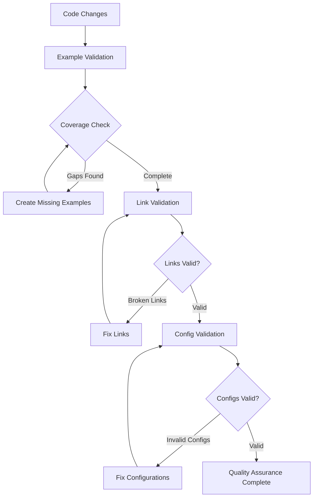

# Codomyrmex Agents — scripts/examples

**Version**: v0.1.0 | **Status**: Active | **Last Updated**: December 2025

## Purpose

Example scripts and validation utilities for the Codomyrmex platform. This directory contains demonstration scripts, configuration validation tools, and coverage checking utilities to ensure examples remain current and functional.

The scripts/examples directory serves as the validation and demonstration layer for the platform's example ecosystem.

## Module Overview

### Key Capabilities
- **Coverage Validation**: Automated checking that all modules have examples
- **Link Validation**: Verification of internal and external links in examples
- **Configuration Validation**: YAML/JSON config file validation
- **Example Organization**: Structured example categorization and management

### Key Features
- Multi-level example organization (basic, integration, configs)
- Automated validation and health checking
- Coverage reporting and gap analysis
- Configuration schema validation

## Function Signatures

### Coverage Validation Functions

```python
def main() -> None
```

Main entry point for example coverage checking.

Checks coverage of examples across all Codomyrmex modules:
- Scans src/codomyrmex/ for available modules
- Scans examples/ for existing demonstrations
- Reports coverage percentage and gaps
- Provides recommendations for missing examples

**Returns:** None - Prints coverage report to console

### Link Validation Functions

```python
def main() -> None
```

Main entry point for example link validation.

Validates links within example documentation:
- Checks internal markdown links
- Validates external URLs
- Reports broken or unreachable links
- Suggests corrections for link issues

**Returns:** None - Prints link validation report to console

### Configuration Validation Functions

```python
def main() -> None
```

Main entry point for configuration file validation.

Validates example configuration files:
- YAML syntax validation
- JSON schema compliance
- Required field presence
- Type checking for configuration values
- Cross-reference validation

**Returns:** None - Prints configuration validation report to console

## Data Structures

### CoverageReport
```python
@dataclass
class CoverageReport:
    total_modules: int
    covered_modules: int
    coverage_percentage: float
    missing_examples: list[str]
    orphaned_examples: list[str]
    recommendations: list[str]

    def print_report(self) -> None
    def save_report(self, path: str) -> None
```

Coverage analysis results for module examples.

### LinkValidationResult
```python
@dataclass
class LinkValidationResult:
    total_links: int
    valid_links: int
    broken_links: list[dict[str, str]]
    external_links: int
    validation_time: float

    def print_report(self) -> None
    def get_broken_links(self) -> list[str]
```

Results of link validation across examples.

### ConfigValidationResult
```python
@dataclass
class ConfigValidationResult:
    total_configs: int
    valid_configs: int
    invalid_configs: list[dict[str, Any]]
    schema_violations: list[dict[str, Any]]
    validation_errors: list[str]

    def print_report(self) -> None
    def has_errors(self) -> bool
```

Configuration file validation results.

## Example Organization

### Basic Examples (`basic/`)
Simple, focused demonstrations of individual features:
- **Data Visualization**: Chart creation and customization
- **Static Analysis**: Code quality checking and reporting
- **Advanced Visualization**: Complex multi-chart displays

### Integration Examples (`integration/`)
End-to-end workflow demonstrations:
- **AI-Driven Development**: Complete AI-assisted coding workflow
- **Ecosystem Orchestration**: Multi-module system coordination
- **Analysis Pipeline**: Automated code analysis and reporting
- **Performance Benchmarking**: System performance evaluation
- **Development Workflow**: Integrated development processes

### Configuration Templates (`configs/`)
Reusable configuration patterns:
- **AI Analysis Workflow**: Configuration for AI-powered analysis
- **Data Pipeline**: Stream processing and transformation setup

## Active Components

### Core Validation Scripts
- `check_example_coverage.py` – Coverage analysis and gap identification
- `check_example_links.py` – Link validation and health checking
- `validate_configs.py` – Configuration file validation and schema checking

### Example Categories
- `basic/` – Fundamental feature demonstrations
- `integration/` – Complex workflow integrations
- `configs/` – Configuration templates and patterns

### Documentation
- `README.md` – Examples directory overview and usage
- `AGENTS.md` – This coordination document

## Operating Contracts

### Universal Example Validation Protocols

All example validation within the Codomyrmex platform must:

1. **Comprehensive Coverage** - Validate all aspects of examples (coverage, links, configs)
2. **Automated Execution** - Run validation as part of CI/CD pipelines
3. **Clear Reporting** - Provide actionable reports with specific recommendations
4. **Incremental Validation** - Support partial validation for development workflows
5. **Performance Aware** - Complete validation within reasonable time limits

### Validation-Specific Guidelines

#### Coverage Validation
- Scan all module directories systematically
- Account for module aliases and naming variations
- Provide detailed gap analysis with priorities
- Support both summary and detailed reporting modes

#### Link Validation
- Handle both relative and absolute URLs
- Respect robots.txt and rate limiting for external links
- Cache validation results to improve performance
- Provide link health trends over time

#### Configuration Validation
- Support multiple configuration formats (YAML, JSON)
- Validate against module-specific schemas
- Check for deprecated configuration options
- Provide migration guidance for configuration changes

## Quality Assurance Workflow



## Integration Points

### CI/CD Integration
- **Automated Validation**: Run validation scripts in CI pipelines
- **Failure Prevention**: Block merges with validation failures
- **Quality Gates**: Include validation results in quality metrics
- **Notification**: Alert maintainers of validation issues

### Development Workflow
- **Pre-commit Hooks**: Run validation before commits
- **IDE Integration**: Provide validation feedback in development tools
- **Automated Fixes**: Suggest corrections for common validation issues
- **Documentation Updates**: Keep validation docs synchronized with code

## Performance Optimization

### Validation Caching
- Cache coverage analysis results
- Store link validation status with TTL
- Reuse configuration schema validations
- Parallel processing for large example sets

### Incremental Validation
- Validate only changed examples
- Skip validation for unchanged configurations
- Partial coverage analysis for development
- Progressive validation with early failure detection

## Troubleshooting

### Common Validation Issues

#### Missing Examples
```
Issue: Module lacks corresponding example
Solution: Create example in appropriate category directory
```

#### Broken Links
```
Issue: Internal or external links not accessible
Solution: Update URLs or fix relative paths
```

#### Invalid Configurations
```
Issue: YAML/JSON syntax or schema violations
Solution: Fix syntax errors or update to match schema
```

## Contributing

### Adding New Validation Checks
1. Create validation function with clear error reporting
2. Add result data structure for findings
3. Integrate into main validation workflow
4. Update documentation and examples

### Improving Validation Performance
1. Implement caching for expensive operations
2. Add parallel processing where applicable
3. Optimize data structures for large result sets
4. Add incremental validation support

## Navigation Links

### Validation Scripts
- **Coverage Checker**: [check_example_coverage.py](check_example_coverage.py) - Module coverage analysis
- **Link Validator**: [check_example_links.py](check_example_links.py) - Link health checking
- **Config Validator**: [validate_configs.py](validate_configs.py) - Configuration validation

### Example Categories
- **Basic Examples**: [basic/](basic/) - Fundamental demonstrations
- **Integration Examples**: [integration/](integration/) - Workflow integrations
- **Configuration Templates**: [configs/](configs/) - Setup templates

### Platform Navigation
- **Scripts Directory**: [../README.md](../README.md) - Script utilities overview
- **Examples Directory**: [../../examples/README.md](../../examples/README.md) - Main examples
- **Validation Results**: [../../@output/](../../@output/) - Generated reports

## Agent Coordination

### Validation Integration

When integrating with other validation systems:

1. **Result Aggregation** - Combine results from multiple validation sources
2. **Priority Handling** - Respect validation priorities and severities
3. **Dependency Awareness** - Account for inter-dependent validation checks
4. **Reporting Consistency** - Maintain consistent reporting formats

### Quality Gates

Before validation changes are accepted:

1. **Accuracy Verified** - Validation correctly identifies real issues
2. **Performance Tested** - Validation completes within time limits
3. **False Positives Minimized** - Low rate of incorrect validation failures
4. **User Experience** - Clear, actionable error messages and reports
5. **Integration Tested** - Works correctly with CI/CD and development workflows

## Version History

- **v0.1.0** (December 2025) - Initial example validation system with coverage checking, link validation, and configuration validation capabilities
