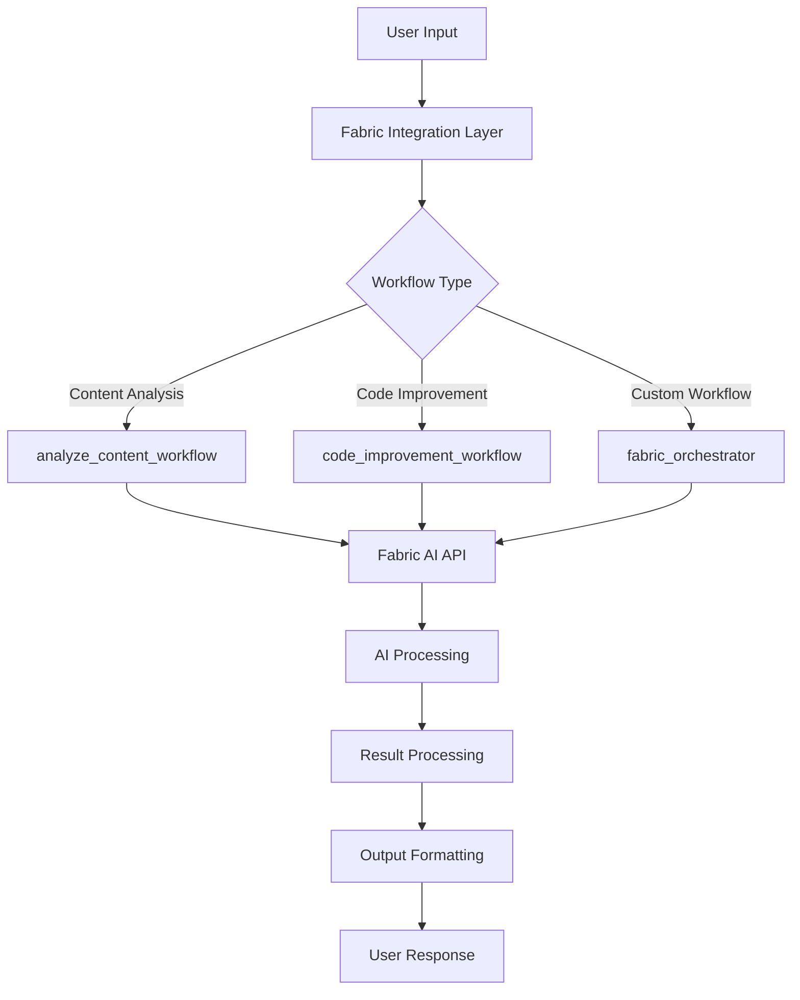

# Codomyrmex Agents — scripts/fabric_integration

## Signposting
- **Parent**: [Scripts](../AGENTS.md)
- **Self**: [Agents](AGENTS.md)
- **Children**:
    - None
- **Key Artifacts**:
    - [Functional Spec](SPEC.md)
    - [Human Readme](README.md)

**Version**: v0.1.0 | **Status**: Active | **Last Updated**: December 2025

## Purpose

Fabric AI integration utilities for the Codomyrmex platform. This directory contains scripts and workflows that integrate Fabric AI capabilities into the Codomyrmex ecosystem, providing AI-powered content analysis, code improvement, and workflow orchestration.

The scripts/fabric_integration directory serves as the AI integration layer, connecting Codomyrmex with external AI services through Fabric.

## Module Overview

### Key Capabilities
- **AI Workflow Orchestration**: Automated AI-powered task execution
- **Content Analysis**: AI-driven content processing and analysis
- **Code Improvement**: AI-assisted code enhancement and refactoring
- **Configuration Management**: Fabric AI environment setup and configuration
- **Demo Environments**: Pre-configured environments for AI demonstrations

### Key Features
- Integration with Fabric AI services
- Automated workflow execution
- Content analysis and summarization
- Code quality improvement suggestions
- Interactive setup and configuration
- Demo environment provisioning

## Function Signatures

### Environment Setup Functions

```python
def show_header() -> None
```

Display setup header information.

**Returns:** None - Prints header information to console

```python
def get_input_with_default(prompt: str, default_value: str = "", mask_input: bool = False) -> str
```

Get user input with default value support.

**Parameters:**
- `prompt` (str): Input prompt to display
- `default_value` (str): Default value if user presses enter. Defaults to ""
- `mask_input` (bool): Whether to mask input (for passwords). Defaults to False

**Returns:** `str` - User input or default value

```python
def create_fabric_env_interactively() -> dict[str, Any]
```

Interactive Fabric environment setup.

**Returns:** `dict[str, Any]` - Configuration dictionary with setup parameters

```python
def write_env_file(config: dict[str, Any]) -> bool
```

Write configuration to environment file.

**Parameters:**
- `config` (dict[str, Any]): Configuration dictionary to write

**Returns:** `bool` - True if successful, False otherwise

```python
def test_fabric_setup() -> bool
```

Test Fabric AI setup and connectivity.

**Returns:** `bool` - True if setup is working, False otherwise

```python
def run_example_fabric_call(config: dict[str, Any]) -> dict[str, Any]
```

Execute example Fabric AI call for testing.

**Parameters:**
- `config` (dict[str, Any]): Configuration dictionary

**Returns:** `dict[str, Any]` - API response from Fabric AI

```python
def main() -> None
```

Main entry point for Fabric environment setup.

**Returns:** None - Runs interactive setup process

### Demo Environment Functions

```python
def show_demo_info() -> None
```

Display demo environment information.

**Returns:** None - Prints demo information to console

```python
def check_existing_env() -> bool
```

Check if demo environment already exists.

**Returns:** `bool` - True if environment exists, False otherwise

```python
def show_usage_examples() -> None
```

Display usage examples for demo environment.

**Returns:** None - Prints usage examples to console

```python
def show_openrouter_benefits() -> None
```

Display OpenRouter integration benefits.

**Returns:** None - Prints benefits information to console

```python
def main() -> None
```

Main entry point for demo environment setup.

**Returns:** None - Runs demo environment setup process

### Workflow Orchestration Functions

```python
def handle_info(args: Any) -> None
```

Handle info command in orchestration.

**Parameters:**
- `args` (Any): Command line arguments

**Returns:** None - Processes info command

```python
def main() -> None
```

Main entry point for workflow orchestration.

**Returns:** None - Runs orchestration process

### Content Analysis Functions

```python
def analyze_content_workflow() -> None
```

Execute content analysis workflow using Fabric AI.

**Returns:** None - Runs content analysis workflow

### Code Improvement Functions

```python
def code_improvement_workflow() -> None
```

Execute code improvement workflow using Fabric AI.

**Returns:** None - Runs code improvement workflow

```python
def process_user_data(users: list[dict[str, Any]]) -> dict[str, Any]
```

Process user data for code improvement.

**Parameters:**
- `users` (list[dict[str, Any]]): List of user data dictionaries

**Returns:** `dict[str, Any]` - Processed user data results

### Configuration Management Functions

```python
def main() -> None
```

Main entry point for Fabric configuration management.

**Returns:** None - Runs configuration management process

### Fabric Orchestrator Functions

```python
def process_data(data: Any) -> dict[str, Any]
```

Process data through Fabric AI orchestrator.

**Parameters:**
- `data` (Any): Input data to process

**Returns:** `dict[str, Any]` - Processed data results

```python
def main() -> None
```

Main entry point for Fabric orchestrator.

**Returns:** None - Runs orchestration process

## Data Structures

### FabricConfig
```python
@dataclass
class FabricConfig:
    api_key: str
    base_url: str
    model: str
    timeout: int
    retry_attempts: int
    temperature: float
```

Configuration for Fabric AI integration.

### WorkflowResult
```python
@dataclass
class WorkflowResult:
    success: bool
    output: Any
    execution_time: float
    tokens_used: Optional[int]
    error_message: Optional[str]
```

Results from AI workflow execution.

### ContentAnalysis
```python
@dataclass
class ContentAnalysis:
    summary: str
    key_points: list[str]
    sentiment: str
    topics: list[str]
    readability_score: float
```

Results from content analysis workflow.

### CodeImprovement
```python
@dataclass
class CodeImprovement:
    original_code: str
    improved_code: str
    improvements: list[str]
    complexity_reduction: float
    suggestions: list[str]
```

Results from code improvement workflow.

## AI Workflow Architecture



## Active Components

### Core Integration Scripts
- `fabric_orchestrator.py` – Main Fabric AI orchestration engine
- `fabric_config_manager.py` – Configuration management for Fabric integration
- `orchestrate.py` – Command-line orchestration interface

### Workflow Scripts
- `content_analysis_workflow.py` – AI-powered content analysis workflows
- `code_improvement_workflow.py` – AI-assisted code improvement workflows

### Environment Setup
- `setup_fabric_env.py` – Interactive Fabric environment setup
- `demo_env_setup.py` – Demo environment provisioning
- `setup_demo.sh` – Shell script for demo setup

### Configuration and Templates
- `fabric_env_template` – Environment configuration template
- `QUICKSTART.md` – Quick start guide for Fabric integration

### Documentation
- `README.md` – Integration overview and usage


### Additional Files
- `SPEC.md` – Spec Md

## Operating Contracts

### Universal AI Integration Protocols

All Fabric AI integration within the Codomyrmex platform must:

1. **Secure API Handling** - Protect API keys and credentials
2. **Rate Limiting Awareness** - Respect API rate limits and quotas
3. **Error Resilience** - Handle API failures gracefully with retries
4. **Cost Tracking** - Monitor and track API usage costs
5. **Output Validation** - Validate AI responses for safety and relevance

### Integration-Specific Guidelines

#### Environment Setup
- Support multiple configuration methods (interactive, file-based, environment variables)
- Validate API connectivity during setup
- Provide clear error messages for configuration issues
- Support different Fabric AI deployment scenarios

#### Workflow Execution
- Implement proper error handling and recovery
- Provide progress indicators for long-running workflows
- Support both synchronous and asynchronous execution
- Include execution metrics and performance tracking

#### Content Analysis
- Handle various content types (text, code, structured data)
- Provide configurable analysis depth and focus areas
- Support multiple output formats and detail levels
- Include confidence scores and uncertainty indicators

#### Code Improvement
- Support multiple programming languages and frameworks
- Provide actionable improvement suggestions
- Include before/after code comparisons
- Support incremental improvement workflows

## Performance Optimization

### Caching Strategies
- Cache API responses for repeated requests
- Implement intelligent retry logic with exponential backoff
- Store configuration validation results
- Cache model availability checks

### Resource Management
- Monitor API usage and costs
- Implement request batching where possible
- Support streaming responses for large outputs
- Handle rate limiting gracefully

### Parallel Processing
- Execute independent workflows concurrently
- Batch multiple API calls efficiently
- Process large datasets in chunks
- Support distributed workflow execution

## Troubleshooting

### Common Integration Issues

#### API Authentication
```
Issue: Fabric API authentication failing
Solution: Verify API key format and permissions, check network connectivity
```

#### Rate Limiting
```
Issue: API rate limits exceeded
Solution: Implement exponential backoff, reduce request frequency, upgrade API tier
```

#### Configuration Errors
```
Issue: Environment setup failing
Solution: Validate configuration file format, check required fields, verify paths
```

#### Workflow Timeouts
```
Issue: Long-running workflows timing out
Solution: Increase timeout values, break large tasks into smaller chunks, use async processing
```

## Contributing

### Adding New AI Workflows
1. Create workflow function following established patterns
2. Add proper error handling and logging
3. Include input validation and output formatting
4. Add tests and documentation
5. Update configuration templates if needed

### Improving Integration
1. Optimize API usage and reduce costs
2. Add support for new AI models or services
3. Enhance error handling and recovery
4. Improve performance and scalability
5. Add monitoring and metrics collection

## Navigation Links
- **Human Documentation**: [README.md](README.md)
- **Functional Specification**: [SPEC.md](SPEC.md)

### Core Integration Scripts
- **Orchestrator**: [fabric_orchestrator.py](fabric_orchestrator.py) - Main AI orchestration engine
- **Configuration**: [fabric_config_manager.py](fabric_config_manager.py) - Configuration management
- **Setup**: [setup_fabric_env.py](setup_fabric_env.py) - Environment setup utility

### Workflow Scripts
- **Content Analysis**: [content_analysis_workflow.py](content_analysis_workflow.py) - AI content analysis
- **Code Improvement**: [code_improvement_workflow.py](code_improvement_workflow.py) - AI code enhancement

### Environment Setup
- **Demo Setup**: [demo_env_setup.py](demo_env_setup.py) - Demo environment provisioning
- **Quick Start**: [QUICKSTART.md](QUICKSTART.md) - Getting started guide

### Platform Navigation
- **Scripts Directory**: [../README.md](../README.md) - Scripts overview
- **Main Documentation**: [../../README.md](../../README.md) - Project documentation

## Agent Coordination

### AI Integration Coordination

When coordinating with other AI integration systems:

1. **Resource Sharing** - Share API connections and configurations
2. **Result Caching** - Coordinate caching across different AI services
3. **Cost Optimization** - Aggregate usage across different workflows
4. **Error Handling** - Consistent error handling across AI integrations

### Quality Gates

Before AI integration changes are accepted:

1. **API Compatibility** - Verify compatibility with current Fabric API versions
2. **Security Reviewed** - Ensure secure handling of API keys and data
3. **Performance Tested** - Validate performance impact and resource usage
4. **Error Handling** - Comprehensive error handling and recovery
5. **Documentation Updated** - Integration changes reflected in documentation

## Version History

- **v0.1.0** (December 2025) - Initial Fabric AI integration with content analysis, code improvement, and workflow orchestration capabilities