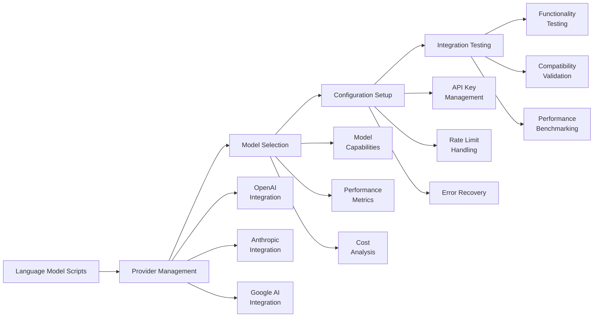

# scripts/language_models

**Version**: v0.1.0 | **Status**: Active | **Last Updated**: December 2025

## Overview

Automation and utility scripts for language model management and integration.

## Language Model Integration Flow

The language model integration flow provides comprehensive tools for managing, configuring, and validating language model integrations across different providers.

## Directory Contents
- `orchestrate.py` – File

## Navigation
- **Project Root**: [README](../../../README.md)
- **Parent Directory**: [scripts](../README.md)
- **Scripts Hub**: [scripts](../../../scripts/README.md)
